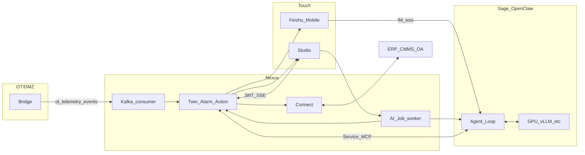

# 产品分层架构展开说明（补足简图）

> **版本**：v1.0 · 2026-05-11  
> **目的**：`PRODUCT-NAMING-AND-MODULES.md` §三 ASCII 图是**鸟瞰**——突出「谁在上、谁在下、Service Token 向北、GPU 向西」。本文**按产品线补全功能面**并**串联用户业务在时间上的调度**，避免读者误以为方块里只有图上的几个字。  
> **API 真源**：`DESIGN-FINAL-LOCK.md`。`PRODUCT-NAMING-AND-MODULES.md` §四 中的部分路径（含 `/v1/objects/*` 旧写法、工单 `submit/approve` 旧路径、`/v1/feishu/webhook` 等）与 LOCK 不一致时，以 **LOCK** 为准；本文 Nexus 一节只强调**能力域**，不写死过时 URL。

---

## 一、简图与各文档的读法

| 层次（简图）     | 鸟瞰图强调的                                  | 详细展开请看                                                                     |
| ---------------- | --------------------------------------------- | -------------------------------------------------------------------------------- |
| 用户接触层       | 三路入口（Studio / 飞书移动端 / MCP·OpenAPI） | 本文 §二 + `MODULE-DESIGN-STUDIO.md`                                             |
| Sage             | Skills 五条 + GPU 直达                        | 本文 §三 + §五 + `PRODUCT-NAMING` §五                                            |
| Nexus            | 六块引擎 + 存储一行                           | 本文 §四 + `PRODUCT-NAMING` §4.1、`DESIGN-FINAL-LOCK`                            |
| Bridge / Connect | 下挂 OT·IT                                    | 本文 §六 + `USER-ENVIRONMENT-DELIVERY-VALIDATION.md` §四 §五                     |
| 业务调度顺序     | （简图不显式画出）                            | 本文 §七 + `PETROLEUM-STATION-BUSINESS-FLOWS.md` + `NEXUS-BUSINESS-LOGIC.md` §三 |

Foundry **范式对齐**（Apps / AIP / Ontology / Pipeline / Foundation）：`INDUSTRIAL-FOUNDRY-ARCHITECTURE.md` §三。

---

## 二、用户接触层（User Touch Layer）—— 全能力与鉴权

简图三块可扩展为下表。**「飞书事件」≠ 所有飞书流量**：会话消息走 AgentRuntime（OpenClaw），卡片/OA 验签可走 Nexus **`POST /v1/feishu/events`** 等（LOCK §1.9）。

| 触点          | 产品命名                      | 主要能力（设计文档概要）                                                                                                                                                                                                                                                       | 典型鉴权                                                  |
| ------------- | ----------------------------- | ------------------------------------------------------------------------------------------------------------------------------------------------------------------------------------------------------------------------------------------------------------------------------ | --------------------------------------------------------- |
| **Studio**    | ClawTwin Studio               | 场站/设备工作台、**P&ID**、SSE 孪生大屏、告警/工单看板、**KB** 管理与检索、**KPI** 与报表入口、**班次交接** UI、Admin（用户/场站/本体/KB/系统）、**触发 AI Job** (`POST /v1/ai/jobs`)；Phase B：`Mission Control`/大屏（见 `PRODUCT-NAMING` §2.2 · `INDUSTRIAL-FOUNDRY` Apps） | **User JWT** + 场站 Marking                               |
| **Mobile**    | ClawTwin Mobile（非独立 App） | 飞书 **Bot IM**（经 OpenClaw）、**卡片**（告警/工单/晨报/审批）、表单回写；不写「第二套移动端」                                                                                                                                                                                | 飞书身份 + **`/v1/auth/feishu/*`** → ClawTwin JWT/Marking |
| **API / MCP** | AgentRuntime / 第三方         | **OpenClaw**：`/mcp` + Service Token。**HiAgent/Dify**：OpenAPI/`/v1/openapi`**（范式见 `USER-ENVIRONMENT-DELIVERY-VALIDATION` §三）**；Webhook 出站订阅（LOCK §`webhooks/subscriptions`**）；嵌入式 **Context API\*_（`GET /v1/ctx/_`）给 OA/ERP                              | **API Key / Service Token**（`DESIGN-FINAL-LOCK` §四）    |

**简图未画但属接触层/extension**：站内 **Grafana/Prometheus** 只读运维（`monitoring-token`）、**导出/报表路由**、`clawtwin doctor` 类运维脚本（对齐 `DESIGN-FINAL-LOCK` §七）。

---

## 三、ClawTwin Sage—— 远不止五个方块名

### 3.1 与图中五列 Skills 对应关系

| 架构图缩写                  | `PRODUCT-NAMING` §5.1 / 仓库 `industrial-*`                             |
| --------------------------- | ----------------------------------------------------------------------- |
| equipment-twin              | `equipment-twin` / `industrial-twin`                                    |
| knowledge-base              | `knowledge-base` / `industrial-kb`                                      |
| workorder-hitl              | `workorder-hitl` / `industrial-workorder`                               |
| analytics-query             | `analytics-query` / `industrial-analytics`                              |
| anomaly / pid / visual-insp | `anomaly-alert`、`pid-analysis`（Phase B）、`visual-inspect`（Phase B） |

另文档列出的 **`shift-handover`（班次）**、`incident-manager`（根因 Phase B）在简图中并入「运维增强」而未单独画竖条。

### 3.2 Sage 交付物（除代码外）

- **Prompt 模板库**：按设备类型/工单/分析的版本化文案（`PRODUCT-NAMING` §5.2）。
- **行业知识包**：L0/L1 与站级 L3 策略（ ingestion 管线在 Nexus，**语义解读**在 Skill）。
- **飞书交互模板**：卡片 JSON、晨报结构（推送由 Nexus `feishu_push` + 编排触发）。
- **模型运行时配置**：vLLM、bge-m3、MOIRAI 地址与熔断策略。

### 3.3 推理边界（必读）

- **LLM/VL 推理**：OpenClaw 循环 → **GPU（vLLM / Qwen2.5-VL）**，**不经 Nexus Chat**。
- **Nexus**：持久化、`/mcp` 工具、`/v1/*` 业务规则、**可调 bge embed（摄入）与 MOIRAI（定时评分）**，但不承担「与用户对话的模型接口」作为主路径（见 `DEVELOPMENT-CONTRACT` · `industrial-twin/SKILL.md`）。

---

## 四、ClawTwin Nexus—— 引擎矩阵（简图方块 → 实装映射）

简图六大框在实现上对应 **`PRODUCT-NAMING` §4.1「engines + routers + kafka + scheduler + connectors 」**。下表强调**业务能力**，不重复列举 LOCK 每一条路径。

| 简图方块                 | Nexus 能力与典型对外面                                                                      | 与异步层关系                                                   |
| ------------------------ | ------------------------------------------------------------------------------------------- | -------------------------------------------------------------- |
| **Ontology Engine**      | 设备类型/指标/关系/行动的 **SoT**；Admin CRUD                                               | 变更后经 API/MCP **立即**影响 Studio 表单与 Skill schema       |
| **Digital Twin Runtime** | 影子状态、读数入库、`**/v1/equipment*`**、SSE **场站综合流\*\*；decision-package 缓存       | **`ot.telemetry` / `ot.events`** consume → ingest → Redis/TSDB |
| **Knowledge Manager**    | 文档、`GET /v1/kb/search`、向量与摄入任务（bge、milvus/pgvector）                           | 摄入任务可走内部队列；L3 writer 工单完工回流                   |
| **Action Engine**        | 告警 FSM、工单 HITL、主行动规则                                                             | **`platform.workorder`**、告警 → **通知/KB side effect**       |
| **AI Job Dispatcher**    | Studio/自动触发的 **job 队列**，驱动 OpenClaw/Sage；`**/v1/ai/jobs*`\*_、`/v1/sse/ai-jobs_` | **`platform.ai-jobs`** Topic（LOCK §三）                       |
| **Connect Layer**        | `connectors/*`：**IT** OA/ERP/CMMS/HR、**扩展 OT** REST/CSV 等 **（与 Bridge 并存）**       | 定时/CDC 同步、写回 IMS、SoT 策略（Foundry §四.1.5）           |

**横向能力（简图单列 Security & Audit）**：JWT、casbin/`ABAC`、`AuditLog`、`Rate limiting`、`**/v1/admin/*`** 与 **AdminSage\*\* MCP 扩展。

**观测与编排**：`**scheduler/*`**（晨报、MOIRAI 探测、KPI rollup）、`**services/\*`**（飞书推送、embed/moirai 客户端）、Kafka **生产者**：`platform.alarms` 等。

**存储行**：简图写 Ditto——Phase A 文档多处以 **Redis 影子 + Postgres/Timescale** 为主实现；一切以当前仓 `DEVELOPMENT-CONTRACT`/实现为准。

---

## 五、Kafka 与时间轴：谁在「调度」业务

业务不是单线 RPC，而是 **事件 + HTTP + SSE + 人因** 组合。LOCK §三的 Topic 是跨产品对齐语言：

```
ot.telemetry / ot.events     ← Bridge 生产 · Nexus Pulse 消费（孪生底座）
platform.alarms               ← Pulse/规则 → SSE / 飞书推送
platform.workorder            ← 工单状态变更 → 通知 · KB · Connect 回填
platform.ai-jobs             ← Nexus 派发 → Worker → OpenClaw/Sage → 回写结果
```

**「调度」分工**：

- **秒级孪生**：Bridge → Kafka → Nexus（自动）。
- **告警与人因**：告警引擎 → **通知模板** → 人（飞书/Studio）→ **REST/HITL** → 状态机推进。
- **对话**：人 → OpenClaw（**不按** Nexu Webhook 吃 IM）。
- **卡片按钮**：飞书 → **`POST /v1/feishu/events`** → Nexus。
- **重型 AI**：Studio 按钮 → **`POST /v1/ai/jobs`** → Worker → Sage → MCP 回 Nexus。

---

## 六、Bridge 与 Connect 的边界（简图两行）

|                | **ClawTwin Bridge**                                                                                         | **ClawTwin Connect**                                                                                                                                                                      |
| -------------- | ----------------------------------------------------------------------------------------------------------- | ----------------------------------------------------------------------------------------------------------------------------------------------------------------------------------------- |
| **的首要职责** | **DMZ 内** OPC-UA **只采集、只发往 Kafka**，**不调 Nexus REST**（LOCK §四 `bridge-service-token` 说明意图） | **语义化对接企业系统**：ERP/CMMS/OA/Historian/HR；**双向**读写受 SoT/Marking 约束                                                                                                         |
| **在空间上**   | 贴近 OT/DMZ                                                                                                 | 常与 Nexus 同区或 IMS 专区                                                                                                                                                                |
| **与简图关系** | 简图 **`OPC-UA → Kafka`** 专指这一路                                                                        | **`ERP/CMMS/OA`**；`PRODUCT-NAMING` §2.4 也列 OPC-UA 为 Connect 能力时，理解为 **产品线能力归属**——**运行时主路径仍以 Bridge 专职采集**更符合网络分区与安全叙述（`USER-ENVIRONMENT` §六） |

---

## 七、用户业务场景的「过程式」视图（多张简图合在一起读）

以下为 **设计者意图上的阶段顺序**，与 `PETROLEUM-STATION-BUSINESS-FLOWS.md`、`NEXUS-BUSINESS-LOGIC.md` §三、`USER-ENVIRONMENT-DELIVERY-VALIDATION.md` §九 一致：

| 阶段              | 触发的典型业务         | 主导方（谁发第一步）        | 经过的产品                                                 |
| ----------------- | ---------------------- | --------------------------- | ---------------------------------------------------------- |
| T0 **态势**       | OT 进站、Twin 可视化   | OT + Bridge → Nexus（自动） | Bridge → Nexus → **Studio**(SSE/API)                       |
| T1 **发现**       | 阈值、MOIRAI、规则告警 | Nexus Pulse                 | Nexus → （飞书/Studio）notify                              |
| T2 **理解**       | 「严重吗」「历史案例」 | **人（飞书）** 或 Studio    | OpenClaw+Sage → **GPU** ↔ **Nexus MCP/REST**               |
| T3 **决策与记录** | 草稿工单、指派、审批   | 人或 Skill                  | Nexus **Action** ↔ **Mobile 卡片**，Connect ↔ **SAP/CMMS** |
| T4 **执行与关闭** | 现场证据、完工、关单   | 人（飞书表单/Studio）       | Nexus **HITL**；Connect **写回 IMS**                       |
| T5 **沉淀**       | L3 KB、晨报、审计      | Nexus 流水线 + Scheduler    | KB ingest；飞书晨报卡片                                    |



（Mermaid 仅表达**并行可能路径**；门禁与鉴权仍以 LOCK / 交付文档为准。）

---

## 八、延伸阅读（按问题导向）

| 想了解                     | 文档                                             |
| -------------------------- | ------------------------------------------------ |
| 油气场站「有哪些业务类目」 | `INDUSTRIAL-SCENARIOS-COMPLETE.md` §一 §二       |
| 管输站典型闭环叙事         | `USER-ENVIRONMENT-DELIVERY-VALIDATION.md` §九    |
| 业务 × 产品线分工表        | `PETROLEUM-STATION-BUSINESS-FLOWS.md`            |
| 技术级路径与 MCP 列表      | `DESIGN-FINAL-LOCK.md`、`BUSINESS-CALL-FLOWS.md` |
| Founder 范式五层映射       | `INDUSTRIAL-FOUNDRY-ARCHITECTURE.md` §三         |

---

_若需把本文压缩回「一张可讲演的产品架构大图」，建议在 Gamma 中用 §二〜§六七表为图层，Kafka 线为独立图例配色。_
