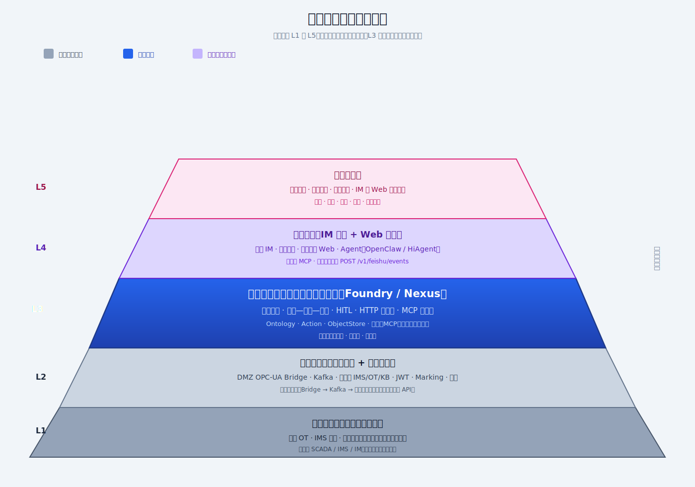

<!-- 导出：须 `--no-stdin`；嵌入 diagrams 下 SVG 须加 `--allow-local-files`
  cd contrib/industrial-oilgas-skills/presentations
  npx @marp-team/marp-cli@latest clawtwin-dual-framework-deck.md -o clawtwin-dual-framework-deck.pptx --allow-local-files --no-stdin
  npx @marp-team/marp-cli@latest clawtwin-dual-framework-deck.md -o clawtwin-dual-framework-deck.pdf --allow-local-files --no-stdin
-->

<!-- _paginate: false -->
<!-- _header: "" -->
<!-- _footer: "" -->

# 双框架总览

**用户项目建设框架**（五层 · 甲方可陈述） × **平台项目框架**（七包 · 研发可对齐）

ClawTwin 场站协同 · **\_\_** · **\_\_**

---

<!-- _header: "双框架 · 建设与平台" -->
<!-- _footer: "diagrams/ SVG · 建设与研发双视角" -->

## 本稿要交付的两张「框」

| 类型         | 文件                                             | 回答的问题                                      |
| :----------- | :----------------------------------------------- | :---------------------------------------------- |
| **用户建设** | `diagrams/00-project-construction-framework.svg` | 钱与范围落在 **哪一层**？业主有什么、本期建什么 |
| **平台研发** | `diagrams/04-platform-seven-layers.svg`          | 代码与职责 **分到哪一包**（Foundry §八）        |

**讲法**：先看 **L1→L5** 定建设与边界 → 再在 **蓝块 L3** 内展开 **七目录**。

---

## 用户项目建设框架（五层）

<!-- 全图自下而上：愈下愈宽承接现场；L3 为本期中枢 -->

---

## 建设框架：口述三句话

1. **L1–L2**：业主现场与 IMS + 管线（Bridge/Kafka/连接器），**不替代**现有 SCADA/IMS/IM。
2. **L3（蓝）**：本期 **Foundry / Nexus**——对象一体、告警—规程—工单、HTTP + MCP、`POST /v1/feishu/events` 与 MCP **分流**。
3. **L4–L5**：人在 IM/Web 侧的入口与要交付的业务结果（同源口径 · 可查可审）。

---

## 平台项目框架（仓库七层 · §八）

<!-- ontology → core → apps → … 与 DESIGN-FINAL-LOCK 契约一致 -->

---

## 五层建设与七包映射（对齐口播）

| 建设层      | 主要落在研发的包                                     |
| :---------- | :--------------------------------------------------- |
| L2 接入     | `connectors/` · `workers/` · `infra/`（部分）        |
| **L3 中枢** | **`ontology/` · `core/` · `apps/` · `aip/`**（核心） |
| L4 入口     | `apps/http` · `apps/feishu` · Agent 外挂 OpenClaw    |
| L5 价值     | 产品场景与验收口径（非单一目录）                     |

---

## （可选附录）运行时与通信——补全第二张图的外部盒子

---

## （可选附录）三条业务路径——防画错双流

---

## （可选附录）网络分区示意

---

## 小结与沿用物

- **对外建设陈述**：仅用 **00** 五层梯形 + L3 话术即可独立成页。
- **对内排期拆分**：按 **04** 七包发包与依赖评审。
- 权威文档：`DESIGN-FINAL-LOCK.md` · `INDUSTRIAL-FOUNDRY-ARCHITECTURE.md` §八 · `USER-ENVIRONMENT-DELIVERY-VALIDATION.md`。

---

## 讲者备注 · 切换语

「上一张是业主听得懂的**建设与分期**——蓝块是您买的软件中枢；这一张是给研发的**分包图**——蓝块里的人拆到这七个顶层目录去实现。」
