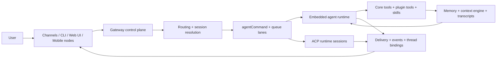

# OpenClaw Repo Audit and Contribution Plan

Audit date: 2026-03-17

Scope reviewed:

- root product docs and vision
- core docs under `docs/`
- source areas under `src/`
- extensions, apps, and workspace packaging structure
- root configuration and build surfaces

This document is intentionally contribution-oriented. The goal is not just to describe OpenClaw, but to identify where a strong open-source contributor can create leverage quickly.

## 1. System Overview

### What problem OpenClaw solves

OpenClaw is a self-hosted control plane for a personal AI assistant that lives on real communication surfaces. It is not only an agent runtime and it is not only a chat connector. It combines:

- inbound surfaces such as WhatsApp, Telegram, Discord, Slack, Signal, iMessage, IRC, and WebChat
- a long-lived Gateway that owns routing, session state, auth, pairing, delivery, and operator control
- an embedded native agent runtime plus optional external ACP harness sessions
- tools, skills, memory, and device-node capabilities behind one control plane

In short: OpenClaw is trying to make an AI assistant feel like infrastructure, not a demo.

### Who it is for

Primary persona:

- a developer or power user who wants an always-on, self-hosted assistant they can reach from any device or channel

Secondary personas:

- advanced operators running multiple isolated agents from one gateway
- plugin and channel authors extending the platform
- contributors working on agent orchestration, device integration, or developer tooling

### Why it exists vs alternatives

OpenClaw is meaningfully different from LangGraph, AutoGen, and harness-only tools:

- LangGraph and AutoGen optimize for composing agent workflows inside applications. OpenClaw optimizes for operating a persistent assistant across channels, devices, sessions, auth profiles, and long-lived infrastructure.
- MCP servers and tool libraries expose capabilities. OpenClaw owns the surrounding control plane: identity, routing, pairing, delivery, memory, sandboxing, and operator UX.
- Codex, Claude Code, Gemini CLI, and similar harnesses are runtimes. OpenClaw can host or route to them through ACP, but the product value is the always-on gateway and orchestration layer around them.

The key product distinction is this: OpenClaw is building the assistant operating environment, not just the agent loop.

## 2. Architecture

### High-level architecture summary

OpenClaw centers everything around a single Gateway process. That Gateway is the source of truth for:

- transport and channel connections
- session routing and persistence
- auth and pairing
- background work such as cron and heartbeats
- native agent execution and ACP session dispatch
- browser, UI, and node control surfaces

The architecture is best understood as five layers:

1. Ingress and control surfaces
2. Gateway control plane
3. Agent orchestration runtime
4. Extensibility and capability surfaces
5. Persistent state and memory

### Detailed system components

#### Runtime

Important modules:

- `src/entry.ts`
- `src/cli/run-main.ts`
- `src/gateway/server.impl.ts`
- `src/gateway/server-ws-runtime.ts`
- `src/gateway/server/ws-connection.ts`

Responsibilities:

- boot the CLI/runtime
- start the Gateway HTTP and WebSocket surfaces
- enforce auth, connection handshake, and role/scope policy
- attach request handlers, events, background services, and startup sidecars

The Gateway is the product core. Everything else plugs into it.

#### Orchestration layer

Important modules:

- `src/agents/agent-command.ts`
- `src/agents/pi-embedded-runner/run.ts`
- `src/agents/pi-embedded-subscribe.ts`
- `src/agents/subagent-registry.ts`
- `src/cron/*`
- `src/acp/*`

Responsibilities:

- resolve the effective agent, workspace, session, model, and auth profile
- serialize work through queue lanes
- run the embedded Pi-based native agent
- support delegated work through native subagents
- support external harness runtimes through ACP
- schedule background work through cron and heartbeat triggers

This is the part of the system where product behavior becomes execution behavior.

#### Tool and skills system

Important modules:

- `src/agents/tool-catalog.ts`
- `src/agents/skills.ts`
- `src/plugins/loader.ts`
- `src/plugins/runtime/index.ts`
- `src/plugins/tools.ts`
- `extensions/*`
- `skills/*`

Responsibilities:

- expose core tools to the agent
- load workspace, managed, and bundled skills
- discover plugin manifests and runtime modules
- register providers, channels, tools, hooks, commands, and services
- bind plugin capabilities into the active runtime

The plugin system is not a side feature. It is a first-class ownership and extensibility model.

#### Memory and state handling

Important modules:

- `src/context-engine/*`
- `src/memory/manager.ts`
- `src/memory/qmd-manager.ts`
- `src/sessions/*`
- `src/config/sessions.ts`

Responsibilities:

- persist session metadata in `sessions.json`
- persist transcripts as JSONL
- assemble context and compaction behavior
- provide vector and keyword memory search
- support multiple memory backends, including the QMD sidecar path

OpenClaw treats Markdown files plus transcript artifacts as the durable substrate. The memory system builds retrieval and compaction on top of that substrate.

#### Communication layer between agents

Important modules:

- `src/gateway/server-methods.ts`
- `src/gateway/protocol/*`
- `src/agents/subagent-registry.ts`
- `src/agents/tool-catalog.ts`
- `src/acp/control-plane/*`

Responsibilities:

- expose a typed WebSocket request/response/event protocol
- allow clients, nodes, and operators to communicate through the same Gateway
- let agents coordinate through session tools such as `sessions_list`, `sessions_history`, `sessions_send`, and `sessions_spawn`
- manage child-run lifecycle, announce flows, and ACP thread-bound sessions

The communication model is broader than chat transport. It also includes agent-to-agent coordination, node capabilities, and operator control.

### Mermaid architecture diagram

## 3. Execution Flow

### Step-by-step lifecycle of a request

1. A message enters through a channel adapter, CLI command, WebChat, or another Gateway client.
2. The Gateway authenticates the caller, applies pairing and allowlist rules, and resolves the request method.
3. Routing resolves `agentId`, `sessionKey`, channel/account binding, and delivery context.
4. `agentCommand` prepares session state, workspace context, skills snapshot, model selection, and auth profile resolution.
5. The run enters queue lanes so session history and tool execution stay serialized.
6. `runEmbeddedPiAgent` assembles model context using session history, bootstrap files, context engine logic, and memory surfaces.
7. The model emits assistant deltas and tool calls. `subscribeEmbeddedPiSession` translates runtime events into Gateway stream events.
8. Tools execute through core runtime surfaces and plugin runtime surfaces. Tool outputs may mutate transcripts, delivery behavior, or memory state.
9. Final payloads are normalized, deduped against message-tool sends, and delivered back to the originating surface.
10. If the run spawned subagents, ACP sessions, or cron follow-ups, those continue through the same control-plane model with different session and delivery semantics.

### Important execution invariants

- one Gateway process is the source of truth
- one session lane serializes native agent work for a session
- session state lives on the Gateway host, not on UI clients
- transport, routing, memory, and delivery are tightly coupled around the Gateway

## 4. Core Modules

| Area                                | Key modules                                                                                                  | Responsibility                                               |
| ----------------------------------- | ------------------------------------------------------------------------------------------------------------ | ------------------------------------------------------------ |
| Runtime bootstrap                   | `src/entry.ts`, `src/cli/run-main.ts`                                                                        | CLI startup, env normalization, runtime guards               |
| Gateway control plane               | `src/gateway/server.impl.ts`, `src/gateway/server-methods.ts`, `src/gateway/server/ws-connection.ts`         | request handling, auth, events, startup orchestration        |
| Agent execution                     | `src/agents/agent-command.ts`, `src/agents/pi-embedded-runner/run.ts`, `src/agents/pi-embedded-subscribe.ts` | session prep, model execution, tool streaming, reply shaping |
| Routing and channels                | `src/channels/*`, `src/routing/*`, `src/gateway/server-channels.ts`                                          | transport abstraction, conversation identity, delivery       |
| Plugins and capabilities            | `src/plugins/loader.ts`, `src/plugins/runtime/index.ts`, `src/plugins/tools.ts`, `extensions/*`              | provider, channel, tool, hook, and service extensibility     |
| Memory and context                  | `src/context-engine/*`, `src/memory/manager.ts`, `src/memory/qmd-manager.ts`, `src/sessions/*`               | compaction, retrieval, transcript persistence                |
| Parallel work and external runtimes | `src/agents/subagent-registry.ts`, `src/cron/*`, `src/acp/*`                                                 | delegated runs, background jobs, external harness sessions   |
| UI and apps                         | `ui/*`, `apps/*`                                                                                             | Control UI, mobile apps, desktop/device node experiences     |

### Complexity concentration

The repo is broad, but complexity is concentrated in a few hotspots:

- `src/agents`: about 199k TypeScript LOC
- `src/gateway`: about 90k TypeScript LOC
- `src/infra`: about 88k TypeScript LOC
- `src/auto-reply`: about 70k TypeScript LOC
- `src/plugins`: about 41k TypeScript LOC

Representative large files:

- `src/agents/pi-embedded-runner/run.ts`
- `src/memory/qmd-manager.ts`
- `src/gateway/server-methods/chat.ts`
- `src/agents/subagent-registry.ts`

This matters because most high-leverage changes cross these boundaries.

## 5. Product and Features

### Core product capabilities

- always-on multi-channel assistant
- self-hosted Gateway with operator control
- isolated multi-agent routing
- native tool-using agent runtime
- ACP support for external coding harnesses
- plugin-based providers, channels, and capabilities
- persistent sessions, memory, compaction, and transcript history
- device nodes, Canvas, voice, browser, and automation surfaces

### Existing features

- broad channel support, both built-in and plugin-backed
- Control UI plus CLI operator surface
- per-agent workspaces and auth isolation
- thread/session binding for advanced chat flows
- cron, heartbeat, and webhook-style automation
- plugin slots for memory and context-engine replacement
- multiple memory retrieval paths
- security defaults such as pairing, allowlists, sandboxing, and explicit auth

### Missing features implied by the architecture

These are not missing because the codebase is weak. They are missing because the platform has outgrown its current visibility and abstraction surfaces:

- first-class run trace and explainability surface
- unified execution-target abstraction across native agent, subagent, ACP, and cron paths
- operator-grade memory backend diagnostics
- contributor-facing capability ownership map
- evaluation and regression surfaces that cut across transport, orchestration, and delivery

### What makes OpenClaw unique

- It treats the assistant as infrastructure, not just a prompt loop.
- It owns real transport and identity boundaries across messaging channels.
- It combines native orchestration with external harness sessions through ACP.
- It merges workspace files, skills, plugins, memory, and device nodes into one operational model.
- It is unusually strong on self-hosted control-plane concerns for an agent project.

## 6. Top 5 Problems

### 1. Orchestration is powerful but fragmented

Problem:

- Native agent turns, subagents, ACP sessions, cron jobs, and thread-bound sessions all solve similar execution problems through separate flows and separate lifecycle code.

Why it matters:

- Contributors have to understand multiple orchestration dialects before changing cross-cutting behavior such as delivery, timeout handling, or session binding.

Impact:

- feature work gets duplicated
- bugs can be fixed in one execution path and missed in another
- design discussions become harder because the mental model is distributed across `src/agents`, `src/acp`, `src/cron`, and `src/gateway`

### 2. Run-level observability is not a first-class artifact

Problem:

- Understanding one bad run requires stitching together WebSocket events, Gateway logs, transcript JSONL, subagent state, memory behavior, and sometimes plugin logs.

Why it matters:

- For a system this dynamic, debugging speed is a product feature. Maintainers and contributors need one place to answer: what happened, why, and where did it diverge?

Impact:

- slower triage
- higher onboarding cost for new contributors
- difficult before/after validation for behavior changes

### 3. Memory is feature-rich but operationally opaque

Problem:

- The memory stack supports multiple backends, embedding providers, watchers, scopes, session exports, and fallback behavior, but there is limited operator-facing visibility into backend health and retrieval state.

Why it matters:

- Memory bugs are expensive because they often look like model problems, not system problems.

Impact:

- user reports are harder to reproduce
- maintainers spend time on configuration archaeology
- contributors avoid touching memory because the failure modes are hard to inspect

### 4. The plugin system is strong architecturally but hard to reason about locally

Problem:

- Discovery, validation, activation, runtime loading, capability ownership, and registry consumption are all well-designed, but distributed enough that new contributors need a long ramp to understand who owns what.

Why it matters:

- OpenClaw depends on plugins as an architectural boundary. If contributors cannot understand that boundary quickly, optional capability work stays concentrated in a small set of maintainers.

Impact:

- slower plugin contributions
- higher chance of ownership violations or duplicate capabilities
- harder debugging around why a plugin is loaded, skipped, blocked, or inactive

### 5. Architectural knowledge is distributed across a very large surface area

Problem:

- The repository already has extensive docs and tests, but the architecture story for contributors is spread across many concept pages, implementation files, and subsystem-specific guides.

Why it matters:

- OpenClaw is not a small library. Contribution quality depends on helping new contributors find the shortest path to the right subsystem mental model.

Impact:

- good contributors may stay at the docs-only or tiny-fix level
- architectural PRs require too much implicit maintainer context
- review cost stays high even for well-intentioned contributors

## 7. Opportunities

### Quick wins

- add a contributor-facing architecture map and subsystem ownership guide
- expose active memory backend status, sync state, and fallback reason through CLI or Gateway
- add stable run IDs that are visible across logs, transcript metadata, and stream events
- document where native agent, subagent, ACP, and cron semantics differ

### Strategic improvements

- introduce a first-class run trace model
- normalize execution-target semantics across orchestration paths
- create a capability graph for plugins and channel/provider ownership
- add end-to-end evaluation fixtures that cover routing, tool execution, and delivery together

### Missing primitives

- a structured run timeline record
- a normalized execution-target descriptor
- a unified diagnostics contract for memory backends
- a contributor-facing subsystem ownership map

### Gaps vs best practices

#### ReAct and tool-calling best practices

OpenClaw is already strong on real tool orchestration, but weaker on transparent, operator-visible reasoning about a run after the fact. A run trace would close that gap.

#### MCP and capability isolation

OpenClaw intentionally keeps first-class MCP out of core and routes through `mcporter`. That is a sensible decoupling choice, but it increases the importance of strong capability introspection elsewhere in the platform.

#### LangGraph and workflow systems

OpenClaw is stronger on deployment and transport reality, weaker on explicit graph visualization and execution explainability. That is not a flaw in direction, but it does create an opportunity for better orchestration visibility.

## 8. Contribution Plan

### Contribution 1: Agent Run Trace and Explainability Surface

Status:

- highest upside
- discussion-worthy before implementation

Problem it solves:

- There is no single artifact that explains why a run behaved the way it did.

Proposed solution:

- introduce a structured run trace that captures request intake, session resolution, model selection, tool events, memory usage, retries/failover, and final delivery decisions

Technical approach:

- define a trace schema and trace writer
- emit trace checkpoints from `agentCommand`, `runEmbeddedPiAgent`, `subscribeEmbeddedPiSession`, and Gateway request handling
- persist traces as lightweight JSONL or sidecar artifacts keyed by run ID
- add a simple inspection surface, likely CLI-first

Likely modules impacted:

- `src/agents/agent-command.ts`
- `src/agents/pi-embedded-runner/run.ts`
- `src/agents/pi-embedded-subscribe.ts`
- `src/gateway/server-methods/agent.ts`
- `src/gateway/server-methods.ts`
- `src/logging/*`

Expected outcome:

- maintainers and contributors can debug runs much faster
- future evals and regressions can target trace invariants
- PRs can include stronger before/after evidence

Why this is valuable to OpenClaw:

- It improves both contributor experience and operator trust without changing the user-facing product model.

### Contribution 2: Memory Diagnostics and Backend Health

Status:

- best first contribution
- mergeable without a repo-wide redesign

Problem it solves:

- Memory behavior is powerful but hard to inspect when it is stale, empty, scoped out, or silently falling back.

Proposed solution:

- add a unified diagnostics surface for memory backend status, indexed sources, last sync, active provider, fallback reason, and scope-denial visibility

Technical approach:

- extract a stable status contract from the current memory managers
- expose backend-specific health in a backend-agnostic shape
- surface it through CLI and, if practical, a Gateway endpoint
- document troubleshooting flows using the new status output

Likely modules impacted:

- `src/memory/manager.ts`
- `src/memory/qmd-manager.ts`
- `src/memory/search-manager.ts`
- `src/commands/*` for CLI status output
- `src/gateway/server-methods/*` if a Gateway endpoint is added

Expected outcome:

- fewer "memory feels broken" bug reports with low signal
- faster diagnosis of provider, index, path, or scope issues
- better contributor confidence in touching the memory subsystem

Why this is valuable to OpenClaw:

- Memory is a high-value subsystem with real operator pain. Better diagnostics are visible, useful, and likely to be appreciated quickly.

### Contribution 3: Unified Execution Target Contracts

Status:

- strong architectural proposal
- likely best as a discussion followed by scoped extraction PRs

Problem it solves:

- Native agent runs, subagents, ACP sessions, and cron jobs all express overlapping concepts such as session mode, delivery mode, timeout, thread binding, and sandbox expectations through different shapes.

Proposed solution:

- introduce a shared execution-target contract and validation layer that orchestration surfaces can reuse

Technical approach:

- define shared types for runtime kind, session behavior, delivery behavior, thread binding, and timeout/sandbox policy
- migrate `sessions_spawn`, ACP spawn flows, and cron isolated jobs toward the shared contract
- keep the first PR small by extracting shared types and validation helpers before touching behavior

Likely modules impacted:

- `src/agents/subagent-*`
- `src/acp/*`
- `src/cron/*`
- `src/gateway/server-methods/*`
- `docs/tools/subagents.md`
- `docs/tools/acp-agents.md`
- `docs/automation/cron-jobs.md`

Expected outcome:

- less semantic drift across orchestration features
- easier future work on delivery, threads, and runtime selection
- a clearer story for users choosing between native subagents and ACP sessions

Why this is valuable to OpenClaw:

- It reduces architectural drag in one of the most differentiated parts of the product.

## Recommended First Move

If the goal is to both contribute meaningfully and get noticed, I would start with:

1. `Memory diagnostics and backend health` if the priority is a realistic first merge.
2. `Agent run trace and explainability surface` if the priority is maximum upside and technical signal.

## What would make this stand out in a PR

- open with the problem and why current debugging or operation is painful
- include a small before/after architecture diagram
- show one realistic operator workflow improved by the change
- keep the first PR focused on one subsystem
- add tests that prove the new contract or diagnostics surface, not just happy-path output
