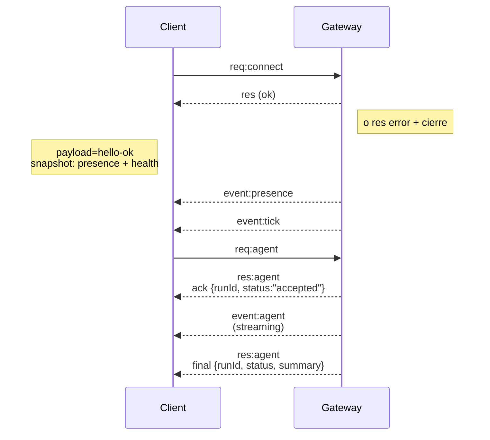

# Arquitectura del gateway

Última actualización: 2026-01-22

## Visión general

- Un único **Gateway** de larga duración posee todas las superficies de mensajería (WhatsApp vía
  Baileys, Telegram vía grammY, Slack, Discord, Signal, iMessage, WebChat).
- Los clientes del plano de control (aplicación macOS, CLI, interfaz web, automatizaciones) se conectan al
  Gateway a través de **WebSocket** en el host de enlace configurado (predeterminado
  `127.0.0.1:18789`).
- Los **Nodos** (macOS/iOS/Android/sin interfaz) también se conectan a través de **WebSocket**, pero
  declaran `role: node` con capacidades/comandos explícitos.
- Un Gateway por host; es el único lugar que abre una sesión de WhatsApp.
- El **canvas host** es servido por el servidor HTTP del Gateway bajo:
  - `/__openclaw__/canvas/` (HTML/CSS/JS editable por el agente)
  - `/__openclaw__/a2ui/` (host A2UI)
    Utiliza el mismo puerto que el Gateway (predeterminado `18789`).

## Componentes y flujos

### Gateway (daemon)

- Mantiene conexiones de proveedores.
- Expone una API WS tipada (solicitudes, respuestas, eventos del servidor).
- Valida frames entrantes contra JSON Schema.
- Emite eventos como `agent`, `chat`, `presence`, `health`, `heartbeat`, `cron`.

### Clientes (aplicación mac / CLI / admin web)

- Una conexión WS por cliente.
- Envían solicitudes (`health`, `status`, `send`, `agent`, `system-presence`).
- Se suscriben a eventos (`tick`, `agent`, `presence`, `shutdown`).

### Nodos (macOS / iOS / Android / sin interfaz)

- Se conectan al **mismo servidor WS** con `role: node`.
- Proporcionan una identidad de dispositivo en `connect`; el emparejamiento está **basado en dispositivos** (rol `node`) y
  la aprobación vive en el almacén de emparejamiento de dispositivos.
- Exponen comandos como `canvas.*`, `camera.*`, `screen.record`, `location.get`.

Detalles del protocolo:

- [Protocolo del Gateway](/es-ES/gateway/protocol)

### WebChat

- Interfaz estática que usa la API WS del Gateway para historial de chat y envíos.
- En configuraciones remotas, se conecta a través del mismo túnel SSH/Tailscale que otros
  clientes.

## Ciclo de vida de conexión (cliente único)



## Protocolo de cable (resumen)

- Transporte: WebSocket, frames de texto con payloads JSON.
- El primer frame **debe** ser `connect`.
- Después del handshake:
  - Solicitudes: `{type:"req", id, method, params}` → `{type:"res", id, ok, payload|error}`
  - Eventos: `{type:"event", event, payload, seq?, stateVersion?}`
- Si `OPENCLAW_GATEWAY_TOKEN` (o `--token`) está configurado, `connect.params.auth.token`
  debe coincidir o el socket se cierra.
- Las claves de idempotencia son requeridas para métodos con efectos secundarios (`send`, `agent`) para
  reintentar de forma segura; el servidor mantiene un caché de deduplicación de corta duración.
- Los nodos deben incluir `role: "node"` más caps/comandos/permisos en `connect`.

## Emparejamiento + confianza local

- Todos los clientes WS (operadores + nodos) incluyen una **identidad de dispositivo** en `connect`.
- Las nuevas IDs de dispositivo requieren aprobación de emparejamiento; el Gateway emite un **token de dispositivo**
  para conexiones subsecuentes.
- Las conexiones **locales** (bucle local o la propia dirección tailnet del host del gateway) pueden ser
  auto-aprobadas para mantener una UX fluida en el mismo host.
- Las conexiones **no locales** deben firmar el nonce `connect.challenge` y requieren
  aprobación explícita.
- La autenticación del Gateway (`gateway.auth.*`) aún se aplica a **todas** las conexiones, locales o
  remotas.

Detalles: [Protocolo del Gateway](/es-ES/gateway/protocol), [Emparejamiento](/es-ES/channels/pairing),
[Seguridad](/es-ES/gateway/security).

## Tipado de protocolo y codegen

- Los esquemas TypeBox definen el protocolo.
- JSON Schema se genera a partir de esos esquemas.
- Los modelos Swift se generan a partir del JSON Schema.

## Acceso remoto

- Preferido: Tailscale o VPN.
- Alternativa: túnel SSH

  ```bash
  ssh -N -L 18789:127.0.0.1:18789 user@host
  ```

- El mismo handshake + token de autenticación se aplican sobre el túnel.
- TLS + pinning opcional pueden habilitarse para WS en configuraciones remotas.

## Snapshot de operaciones

- Inicio: `openclaw gateway` (primer plano, registros a stdout).
- Salud: `health` sobre WS (también incluido en `hello-ok`).
- Supervisión: launchd/systemd para auto-reinicio.

## Invariantes

- Exactamente un Gateway controla una única sesión Baileys por host.
- El handshake es obligatorio; cualquier frame no-JSON o no-connect como primer frame es un cierre forzado.
- Los eventos no se repiten; los clientes deben refrescar en gaps.
