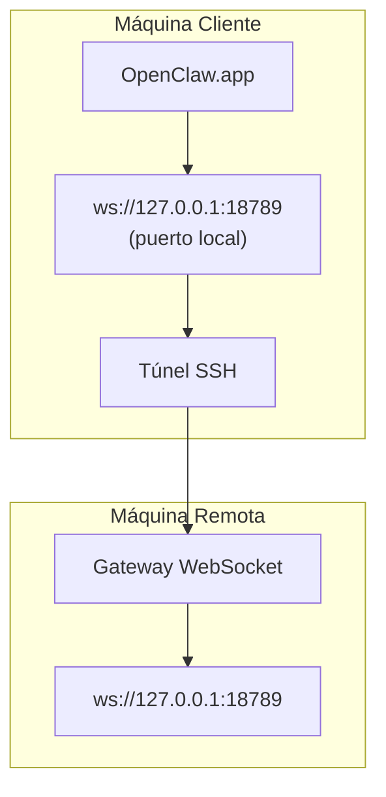

# Ejecutar OpenClaw.app con un Gateway Remoto

OpenClaw.app usa túneles SSH para conectarse a un gateway remoto. Esta guía te muestra cómo configurarlo.

## Descripción general



## Configuración Rápida

### Paso 1: Agregar Config SSH

Edita `~/.ssh/config` y agrega:

```ssh
Host remote-gateway
    HostName <REMOTE_IP>          # ej., 172.27.187.184
    User <REMOTE_USER>            # ej., jefferson
    LocalForward 18789 127.0.0.1:18789
    IdentityFile ~/.ssh/id_rsa
```

Reemplaza `<REMOTE_IP>` y `<REMOTE_USER>` con tus valores.

### Paso 2: Copiar Clave SSH

Copia tu clave pública a la máquina remota (ingresa la contraseña una vez):

```bash
ssh-copy-id -i ~/.ssh/id_rsa <REMOTE_USER>@<REMOTE_IP>
```

### Paso 3: Establecer Token del Gateway

```bash
launchctl setenv OPENCLAW_GATEWAY_TOKEN "<tu-token>"
```

### Paso 4: Iniciar Túnel SSH

```bash
ssh -N remote-gateway &
```

### Paso 5: Reiniciar OpenClaw.app

```bash
# Cierra OpenClaw.app (⌘Q), luego vuelve a abrir:
open /path/to/OpenClaw.app
```

La app ahora se conectará al gateway remoto a través del túnel SSH.

---

## Auto-Iniciar Túnel al Iniciar Sesión

Para que el túnel SSH se inicie automáticamente cuando inicies sesión, crea un Launch Agent.

### Crear el archivo PLIST

Guarda esto como `~/Library/LaunchAgents/bot.molt.ssh-tunnel.plist`:

```xml
<?xml version="1.0" encoding="UTF-8"?>
<!DOCTYPE plist PUBLIC "-//Apple//DTD PLIST 1.0//EN" "http://www.apple.com/DTDs/PropertyList-1.0.dtd">
<plist version="1.0">
<dict>
    <key>Label</key>
    <string>bot.molt.ssh-tunnel</string>
    <key>ProgramArguments</key>
    <array>
        <string>/usr/bin/ssh</string>
        <string>-N</string>
        <string>remote-gateway</string>
    </array>
    <key>KeepAlive</key>
    <true/>
    <key>RunAtLoad</key>
    <true/>
</dict>
</plist>
```

### Cargar el Launch Agent

```bash
launchctl bootstrap gui/$UID ~/Library/LaunchAgents/bot.molt.ssh-tunnel.plist
```

El túnel ahora:

- Se iniciará automáticamente cuando inicies sesión
- Se reiniciará si falla
- Seguirá ejecutándose en segundo plano

Nota heredada: elimina cualquier LaunchAgent `com.openclaw.ssh-tunnel` sobrante si está presente.

---

## Solución de problemas

**Verificar si el túnel está en ejecución:**

```bash
ps aux | grep "ssh -N remote-gateway" | grep -v grep
lsof -i :18789
```

**Reiniciar el túnel:**

```bash
launchctl kickstart -k gui/$UID/bot.molt.ssh-tunnel
```

**Detener el túnel:**

```bash
launchctl bootout gui/$UID/bot.molt.ssh-tunnel
```

---

## Cómo Funciona

| Componente                           | Qué Hace                                                    |
| ------------------------------------ | ----------------------------------------------------------- |
| `LocalForward 18789 127.0.0.1:18789` | Reenvía el puerto local 18789 al puerto remoto 18789        |
| `ssh -N`                             | SSH sin ejecutar comandos remotos (solo reenvío de puertos) |
| `KeepAlive`                          | Reinicia automáticamente el túnel si falla                  |
| `RunAtLoad`                          | Inicia el túnel cuando el agente se carga                   |

OpenClaw.app se conecta a `ws://127.0.0.1:18789` en tu máquina cliente. El túnel SSH reenvía esa conexión al puerto 18789 en la máquina remota donde se ejecuta el Gateway.
