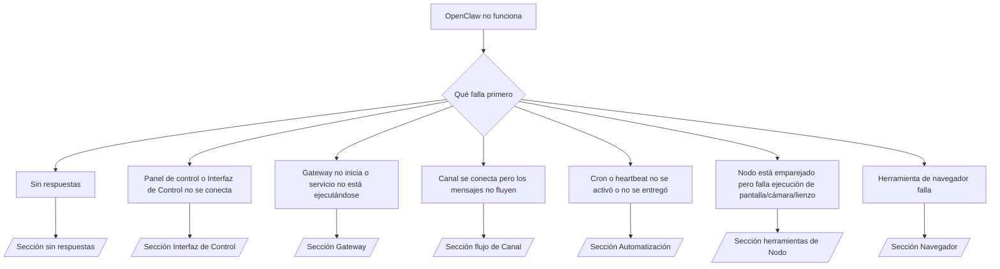

# Solución de problemas

Si solo tienes 2 minutos, usa esta página como puerta de entrada de triaje.

## Primeros 60 segundos

Ejecuta esta escalera exactamente en orden:

```bash
openclaw status
openclaw status --all
openclaw gateway probe
openclaw gateway status
openclaw doctor
openclaw channels status --probe
openclaw logs --follow
```

Salida correcta en una línea:

- `openclaw status` → muestra canales configurados y sin errores de autenticación obvios.
- `openclaw status --all` → el informe completo está presente y se puede compartir.
- `openclaw gateway probe` → el Gateway objetivo esperado es accesible.
- `openclaw gateway status` → `Runtime: running` y `RPC probe: ok`.
- `openclaw doctor` → sin errores de configuración/servicio que bloqueen.
- `openclaw channels status --probe` → los canales reportan `connected` o `ready`.
- `openclaw logs --follow` → actividad constante, sin errores fatales repetitivos.

## Árbol de decisiones



<AccordionGroup>
  <Accordion title="Sin respuestas">
    ```bash
    openclaw status
    openclaw gateway status
    openclaw channels status --probe
    openclaw pairing list <channel>
    openclaw logs --follow
    ```

    La salida correcta se ve así:

    - `Runtime: running`
    - `RPC probe: ok`
    - Tu canal muestra connected/ready en `channels status --probe`
    - El remitente aparece aprobado (o la política de mensajes directos es open/allowlist)

    Firmas comunes en registros:

    - `drop guild message (mention required` → el bloqueo de menciones bloqueó el mensaje en Discord.
    - `pairing request` → el remitente no está aprobado y espera aprobación de emparejamiento de mensajes directos.
    - `blocked` / `allowlist` en registros de canal → remitente, sala o grupo está filtrado.

    Páginas detalladas:

    - [/es-ES/gateway/troubleshooting#no-replies](/es-ES/gateway/troubleshooting#no-replies)
    - [/es-ES/channels/troubleshooting](/es-ES/channels/troubleshooting)
    - [/es-ES/channels/pairing](/es-ES/channels/pairing)

  </Accordion>

  <Accordion title="Panel de control o Interfaz de Control no se conecta">
    ```bash
    openclaw status
    openclaw gateway status
    openclaw logs --follow
    openclaw doctor
    openclaw channels status --probe
    ```

    La salida correcta se ve así:

    - `Dashboard: http://...` se muestra en `openclaw gateway status`
    - `RPC probe: ok`
    - Sin bucle de autenticación en registros

    Firmas comunes en registros:

    - `device identity required` → el contexto HTTP/no seguro no puede completar la autenticación del dispositivo.
    - `unauthorized` / bucle de reconexión → token/contraseña incorrecta o discrepancia en modo de autenticación.
    - `gateway connect failed:` → la UI está apuntando a la URL/puerto incorrecta o Gateway inalcanzable.

    Páginas detalladas:

    - [/es-ES/gateway/troubleshooting#dashboard-control-ui-connectivity](/es-ES/gateway/troubleshooting#dashboard-control-ui-connectivity)
    - [/es-ES/web/control-ui](/es-ES/web/control-ui)
    - [/es-ES/gateway/authentication](/es-ES/gateway/authentication)

  </Accordion>

  <Accordion title="Gateway no inicia o servicio instalado pero no ejecutándose">
    ```bash
    openclaw status
    openclaw gateway status
    openclaw logs --follow
    openclaw doctor
    openclaw channels status --probe
    ```

    La salida correcta se ve así:

    - `Service: ... (loaded)`
    - `Runtime: running`
    - `RPC probe: ok`

    Firmas comunes en registros:

    - `Gateway start blocked: set gateway.mode=local` → el modo gateway no está configurado/remoto.
    - `refusing to bind gateway ... without auth` → enlace no loopback sin token/contraseña.
    - `another gateway instance is already listening` o `EADDRINUSE` → puerto ya ocupado.

    Páginas detalladas:

    - [/es-ES/gateway/troubleshooting#gateway-service-not-running](/es-ES/gateway/troubleshooting#gateway-service-not-running)
    - [/es-ES/gateway/background-process](/es-ES/gateway/background-process)
    - [/es-ES/gateway/configuration](/es-ES/gateway/configuration)

  </Accordion>

  <Accordion title="Canal se conecta pero los mensajes no fluyen">
    ```bash
    openclaw status
    openclaw gateway status
    openclaw logs --follow
    openclaw doctor
    openclaw channels status --probe
    ```

    La salida correcta se ve así:

    - El transporte del canal está conectado.
    - Las verificaciones de emparejamiento/allowlist pasan.
    - Las menciones se detectan donde se requieren.

    Firmas comunes en registros:

    - `mention required` → el bloqueo de menciones de grupo bloqueó el procesamiento.
    - `pairing` / `pending` → el remitente de mensajes directos aún no está aprobado.
    - `not_in_channel`, `missing_scope`, `Forbidden`, `401/403` → problema de token de permiso del canal.

    Páginas detalladas:

    - [/es-ES/gateway/troubleshooting#channel-connected-messages-not-flowing](/es-ES/gateway/troubleshooting#channel-connected-messages-not-flowing)
    - [/es-ES/channels/troubleshooting](/es-ES/channels/troubleshooting)

  </Accordion>

  <Accordion title="Cron o heartbeat no se activó o no se entregó">
    ```bash
    openclaw status
    openclaw gateway status
    openclaw cron status
    openclaw cron list
    openclaw cron runs --id <jobId> --limit 20
    openclaw logs --follow
    ```

    La salida correcta se ve así:

    - `cron.status` muestra habilitado con una próxima activación.
    - `cron runs` muestra entradas recientes `ok`.
    - Heartbeat está habilitado y no está fuera de horas activas.

    Firmas comunes en registros:

    - `cron: scheduler disabled; jobs will not run automatically` → cron está deshabilitado.
    - `heartbeat skipped` con `reason=quiet-hours` → fuera de horas activas configuradas.
    - `requests-in-flight` → carril principal ocupado; activación de heartbeat fue diferida.
    - `unknown accountId` → la cuenta objetivo de entrega de heartbeat no existe.

    Páginas detalladas:

    - [/es-ES/gateway/troubleshooting#cron-and-heartbeat-delivery](/es-ES/gateway/troubleshooting#cron-and-heartbeat-delivery)
    - [/es-ES/automation/troubleshooting](/es-ES/automation/troubleshooting)
    - [/es-ES/gateway/heartbeat](/es-ES/gateway/heartbeat)

  </Accordion>

  <Accordion title="Nodo está emparejado pero falla herramienta de cámara/lienzo/pantalla/exec">
    ```bash
    openclaw status
    openclaw gateway status
    openclaw nodes status
    openclaw nodes describe --node <idOrNameOrIp>
    openclaw logs --follow
    ```

    La salida correcta se ve así:

    - El nodo está listado como conectado y emparejado para rol `node`.
    - Existe la capacidad para el comando que estás invocando.
    - El estado de permiso está otorgado para la herramienta.

    Firmas comunes en registros:

    - `NODE_BACKGROUND_UNAVAILABLE` → trae la aplicación del nodo al primer plano.
    - `*_PERMISSION_REQUIRED` → permiso del sistema operativo fue denegado/falta.
    - `SYSTEM_RUN_DENIED: approval required` → aprobación de exec está pendiente.
    - `SYSTEM_RUN_DENIED: allowlist miss` → comando no está en allowlist de exec.

    Páginas detalladas:

    - [/es-ES/gateway/troubleshooting#node-paired-tool-fails](/es-ES/gateway/troubleshooting#node-paired-tool-fails)
    - [/es-ES/nodes/troubleshooting](/es-ES/nodes/troubleshooting)
    - [/es-ES/tools/exec-approvals](/es-ES/tools/exec-approvals)

  </Accordion>

  <Accordion title="Herramienta de navegador falla">
    ```bash
    openclaw status
    openclaw gateway status
    openclaw browser status
    openclaw logs --follow
    openclaw doctor
    ```

    La salida correcta se ve así:

    - El estado del navegador muestra `running: true` y un navegador/perfil elegido.
    - El perfil `openclaw` se inicia o el relé `chrome` tiene una pestaña adjunta.

    Firmas comunes en registros:

    - `Failed to start Chrome CDP on port` → falló el lanzamiento del navegador local.
    - `browser.executablePath not found` → la ruta binaria configurada es incorrecta.
    - `Chrome extension relay is running, but no tab is connected` → extensión no adjunta.
    - `Browser attachOnly is enabled ... not reachable` → el perfil de solo adjuntar no tiene objetivo CDP activo.

    Páginas detalladas:

    - [/es-ES/gateway/troubleshooting#browser-tool-fails](/es-ES/gateway/troubleshooting#browser-tool-fails)
    - [/es-ES/tools/browser-linux-troubleshooting](/es-ES/tools/browser-linux-troubleshooting)
    - [/es-ES/tools/chrome-extension](/es-ES/tools/chrome-extension)

  </Accordion>
</AccordionGroup>
