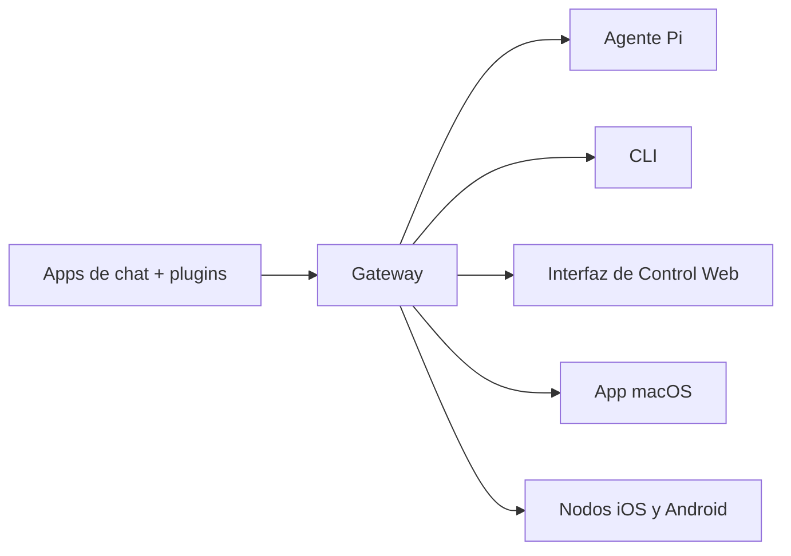

# OpenClaw 🦞

<p align="center">
    
    
</p>

> _"¡EXFOLIAR! ¡EXFOLIAR!"_ — Una langosta espacial, probablemente

<p align="center">
  <strong>Gateway multi-SO para agentes de IA en WhatsApp, Telegram, Discord, iMessage y más.</strong><br />
  Envía un mensaje, recibe una respuesta del agente desde tu bolsillo. Los plugins añaden Mattermost y más.
</p>

<Columns>
  <Card title="Comenzar" href="/start/getting-started" icon="rocket">
    Instala OpenClaw y levanta el Gateway en minutos.
  </Card>
  <Card title="Ejecutar el Asistente" href="/start/wizard" icon="sparkles">
    Configuración guiada con `openclaw onboard` y flujos de emparejamiento.
  </Card>
  <Card title="Abrir la Interfaz de Control" href="/web/control-ui" icon="layout-dashboard">
    Lanza el panel de control en el navegador para chat, configuración y sesiones.
  </Card>
</Columns>

## ¿Qué es OpenClaw?

OpenClaw es un **gateway auto-hospedado** que conecta tus aplicaciones de chat favoritas — WhatsApp, Telegram, Discord, iMessage y más — con agentes de IA para programación como Pi. Ejecutas un único proceso Gateway en tu propia máquina (o un servidor), y se convierte en el puente entre tus aplicaciones de mensajería y un asistente de IA siempre disponible.

**¿Para quién es?** Desarrolladores y usuarios avanzados que desean un asistente de IA personal al que puedan enviar mensajes desde cualquier lugar — sin renunciar al control de sus datos ni depender de un servicio alojado.

**¿Qué lo hace diferente?**

- **Auto-hospedado**: se ejecuta en tu hardware, tus reglas
- **Multi-canal**: un Gateway sirve a WhatsApp, Telegram, Discord y más simultáneamente
- **Nativo para agentes**: construido para agentes de programación con uso de herramientas, sesiones, memoria y enrutamiento multi-agente
- **Código abierto**: licencia MIT, impulsado por la comunidad

**¿Qué necesitas?** Node 22+, una clave API (se recomienda Anthropic) y 5 minutos.

## Cómo funciona



El Gateway es la fuente única de verdad para sesiones, enrutamiento y conexiones de canales.

## Capacidades clave

<Columns>
  <Card title="Gateway multi-canal" icon="network">
    WhatsApp, Telegram, Discord e iMessage con un único proceso Gateway.
  </Card>
  <Card title="Canales de plugins" icon="plug">
    Añade Mattermost y más con paquetes de extensión.
  </Card>
  <Card title="Enrutamiento multi-agente" icon="route">
    Sesiones aisladas por agente, espacio de trabajo o remitente.
  </Card>
  <Card title="Soporte multimedia" icon="image">
    Envía y recibe imágenes, audio y documentos.
  </Card>
  <Card title="Interfaz de Control Web" icon="monitor">
    Panel de control en navegador para chat, configuración, sesiones y nodos.
  </Card>
  <Card title="Nodos móviles" icon="smartphone">
    Empareja nodos iOS y Android con soporte de Canvas.
  </Card>
</Columns>

## Inicio rápido

<Steps>
  <Step title="Instalar OpenClaw">
    ```bash
    npm install -g openclaw@latest
    ```
  </Step>
  <Step title="Incorporar e instalar el servicio">
    ```bash
    openclaw onboard --install-daemon
    ```
  </Step>
  <Step title="Emparejar WhatsApp e iniciar el Gateway">
    ```bash
    openclaw channels login
    openclaw gateway --port 18789
    ```
  </Step>
</Steps>

¿Necesitas la instalación completa y configuración de desarrollo? Ver [Inicio rápido](/start/quickstart).

## Panel de control

Abre la Interfaz de Control en el navegador después de que el Gateway se inicie.

- Por defecto local: [http://127.0.0.1:18789/](http://127.0.0.1:18789/)
- Acceso remoto: [Superficies web](/web) y [Tailscale](/gateway/tailscale)

<p align="center">
  
</p>

## Configuración (opcional)

La configuración se encuentra en `~/.openclaw/openclaw.json`.

- Si **no haces nada**, OpenClaw usa el binario Pi incluido en modo RPC con sesiones por remitente.
- Si deseas bloquearlo, comienza con `channels.whatsapp.allowFrom` y (para grupos) reglas de mención.

Ejemplo:

```json5
{
  channels: {
    whatsapp: {
      allowFrom: ["+15555550123"],
      groups: { "*": { requireMention: true } },
    },
  },
  messages: { groupChat: { mentionPatterns: ["@openclaw"] } },
}
```

## Comienza aquí

<Columns>
  <Card title="Centros de documentación" href="/start/hubs" icon="book-open">
    Toda la documentación y guías, organizadas por caso de uso.
  </Card>
  <Card title="Configuración" href="/gateway/configuration" icon="settings">
    Configuración principal del Gateway, tokens y configuración de proveedores.
  </Card>
  <Card title="Acceso remoto" href="/gateway/remote" icon="globe">
    Patrones de acceso SSH y tailnet.
  </Card>
  <Card title="Canales" href="/channels/telegram" icon="message-square">
    Configuración específica de canal para WhatsApp, Telegram, Discord y más.
  </Card>
  <Card title="Nodos" href="/nodes" icon="smartphone">
    Nodos iOS y Android con emparejamiento y Canvas.
  </Card>
  <Card title="Ayuda" href="/help" icon="life-buoy">
    Soluciones comunes y punto de entrada para solución de problemas.
  </Card>
</Columns>

## Aprende más

<Columns>
  <Card title="Lista completa de características" href="/concepts/features" icon="list">
    Capacidades completas de canal, enrutamiento y multimedia.
  </Card>
  <Card title="Enrutamiento multi-agente" href="/concepts/multi-agent" icon="route">
    Aislamiento de espacio de trabajo y sesiones por agente.
  </Card>
  <Card title="Seguridad" href="/gateway/security" icon="shield">
    Tokens, listas de permitidos y controles de seguridad.
  </Card>
  <Card title="Solución de problemas" href="/gateway/troubleshooting" icon="wrench">
    Diagnósticos del Gateway y errores comunes.
  </Card>
  <Card title="Acerca de y créditos" href="/reference/credits" icon="info">
    Orígenes del proyecto, contribuidores y licencia.
  </Card>
</Columns>
