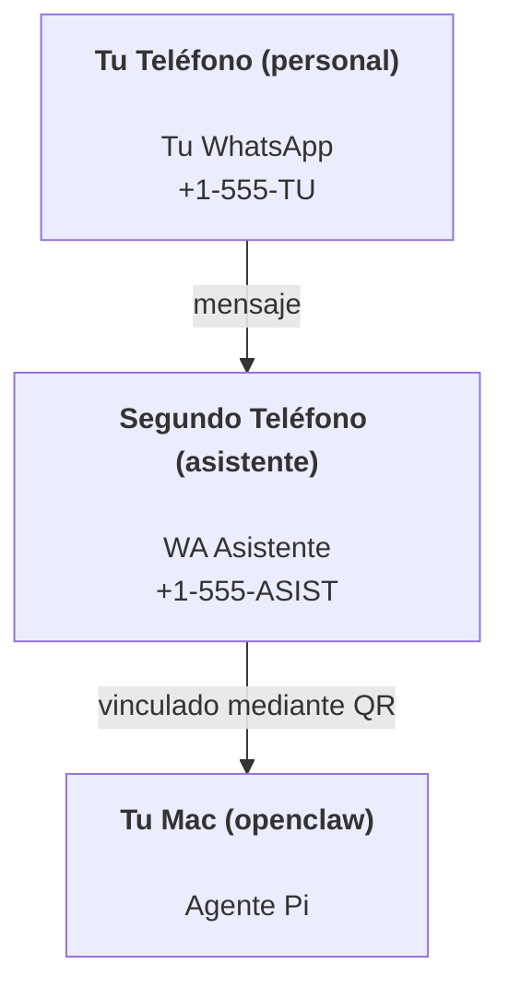

# Construyendo un asistente personal con OpenClaw

OpenClaw es un gateway de WhatsApp + Telegram + Discord + iMessage para agentes **Pi**. Los plugins añaden Mattermost. Esta guía es la configuración de "asistente personal": un número dedicado de WhatsApp que se comporta como tu agente siempre activo.

## ⚠️ Seguridad primero

Estás poniendo un agente en posición de:

- ejecutar comandos en tu máquina (dependiendo de tu configuración de herramientas Pi)
- leer/escribir archivos en tu workspace
- enviar mensajes de vuelta mediante WhatsApp/Telegram/Discord/Mattermost (plugin)

Comienza conservador:

- Siempre establece `channels.whatsapp.allowFrom` (nunca ejecutes abierto-al-mundo en tu Mac personal).
- Usa un número dedicado de WhatsApp para el asistente.
- Los heartbeats ahora son predeterminados cada 30 minutos. Deshabilita hasta que confíes en la configuración estableciendo `agents.defaults.heartbeat.every: "0m"`.

## Requisitos previos

- OpenClaw instalado y configurado — consulta [Comenzando](/es-ES/start/getting-started) si aún no lo has hecho
- Un segundo número de teléfono (SIM/eSIM/prepago) para el asistente

## La configuración de dos teléfonos (recomendada)

Quieres esto:



Si vinculas tu WhatsApp personal a OpenClaw, cada mensaje para ti se convierte en "entrada del agente". Eso rara vez es lo que quieres.

## Inicio rápido de 5 minutos

1. Empareja WhatsApp Web (muestra QR; escanea con el teléfono del asistente):

```bash
openclaw channels login
```

2. Inicia el Gateway (déjalo ejecutándose):

```bash
openclaw gateway --port 18789
```

3. Pon una configuración mínima en `~/.openclaw/openclaw.json`:

```json5
{
  channels: { whatsapp: { allowFrom: ["+15555550123"] } },
}
```

Ahora envía mensaje al número del asistente desde tu teléfono en la lista de permitidos.

Cuando el onboarding termina, auto-abrimos el dashboard e imprimimos un enlace limpio (sin token). Si solicita autenticación, pega el token de `gateway.auth.token` en la configuración de la UI de Control. Para reabrir más tarde: `openclaw dashboard`.

## Dale al agente un workspace (AGENTS)

OpenClaw lee instrucciones operativas y "memoria" de su directorio de workspace.

Por defecto, OpenClaw usa `~/.openclaw/workspace` como workspace del agente, y lo creará (más los archivos iniciales `AGENTS.md`, `SOUL.md`, `TOOLS.md`, `IDENTITY.md`, `USER.md`, `HEARTBEAT.md`) automáticamente en la configuración/primera ejecución del agente. `BOOTSTRAP.md` solo se crea cuando el workspace es nuevo (no debería volver después de eliminarlo). `MEMORY.md` es opcional (no se crea automáticamente); cuando está presente, se carga para sesiones normales. Las sesiones de subagentes solo inyectan `AGENTS.md` y `TOOLS.md`.

Consejo: trata esta carpeta como la "memoria" de OpenClaw y hazla un repositorio git (idealmente privado) para que tus archivos `AGENTS.md` + memoria tengan respaldo. Si git está instalado, los workspaces nuevos se inicializan automáticamente.

```bash
openclaw setup
```

Diseño completo del workspace + guía de respaldo: [Workspace del agente](/es-ES/concepts/agent-workspace)
Flujo de memoria: [Memoria](/es-ES/concepts/memory)

Opcional: elige un workspace diferente con `agents.defaults.workspace` (admite `~`).

```json5
{
  agent: {
    workspace: "~/.openclaw/workspace",
  },
}
```

Si ya envías tus propios archivos de workspace desde un repositorio, puedes deshabilitar completamente la creación de archivos de bootstrap:

```json5
{
  agent: {
    skipBootstrap: true,
  },
}
```

## La configuración que lo convierte en "un asistente"

OpenClaw tiene una buena configuración de asistente por defecto, pero usualmente querrás ajustar:

- persona/instrucciones en `SOUL.md`
- predeterminados de pensamiento (si lo deseas)
- heartbeats (una vez que confíes en él)

Ejemplo:

```json5
{
  logging: { level: "info" },
  agent: {
    model: "anthropic/claude-opus-4-6",
    workspace: "~/.openclaw/workspace",
    thinkingDefault: "high",
    timeoutSeconds: 1800,
    // Comienza con 0; habilita más tarde.
    heartbeat: { every: "0m" },
  },
  channels: {
    whatsapp: {
      allowFrom: ["+15555550123"],
      groups: {
        "*": { requireMention: true },
      },
    },
  },
  routing: {
    groupChat: {
      mentionPatterns: ["@openclaw", "openclaw"],
    },
  },
  session: {
    scope: "per-sender",
    resetTriggers: ["/new", "/reset"],
    reset: {
      mode: "daily",
      atHour: 4,
      idleMinutes: 10080,
    },
  },
}
```

## Sesiones y memoria

- Archivos de sesión: `~/.openclaw/agents/<agentId>/sessions/{{SessionId}}.jsonl`
- Metadatos de sesión (uso de tokens, última ruta, etc): `~/.openclaw/agents/<agentId>/sessions/sessions.json` (heredado: `~/.openclaw/sessions/sessions.json`)
- `/new` o `/reset` inicia una sesión nueva para ese chat (configurable mediante `resetTriggers`). Si se envía solo, el agente responde con un breve saludo para confirmar el restablecimiento.
- `/compact [instrucciones]` compacta el contexto de la sesión e informa el presupuesto de contexto restante.

## Heartbeats (modo proactivo)

Por defecto, OpenClaw ejecuta un heartbeat cada 30 minutos con la solicitud:
`Lee HEARTBEAT.md si existe (contexto de workspace). Síguelo estrictamente. No infiera ni repitas tareas antiguas de chats anteriores. Si nada necesita atención, responde HEARTBEAT_OK.`
Establece `agents.defaults.heartbeat.every: "0m"` para deshabilitar.

- Si `HEARTBEAT.md` existe pero está efectivamente vacío (solo líneas en blanco y encabezados markdown como `# Encabezado`), OpenClaw omite la ejecución del heartbeat para ahorrar llamadas API.
- Si falta el archivo, el heartbeat aún se ejecuta y el modelo decide qué hacer.
- Si el agente responde con `HEARTBEAT_OK` (opcionalmente con relleno corto; ver `agents.defaults.heartbeat.ackMaxChars`), OpenClaw suprime la entrega saliente para ese heartbeat.
- Los heartbeats ejecutan turnos completos del agente — intervalos más cortos consumen más tokens.

```json5
{
  agent: {
    heartbeat: { every: "30m" },
  },
}
```

## Medios de entrada y salida

Los archivos adjuntos entrantes (imágenes/audio/documentos) se pueden mostrar a tu comando mediante plantillas:

- `{{MediaPath}}` (ruta de archivo temporal local)
- `{{MediaUrl}}` (pseudo-URL)
- `{{Transcript}}` (si la transcripción de audio está habilitada)

Archivos adjuntos salientes del agente: incluye `MEDIA:<ruta-o-url>` en su propia línea (sin espacios). Ejemplo:

```
Aquí está la captura de pantalla.
MEDIA:https://example.com/screenshot.png
```

OpenClaw los extrae y los envía como medios junto con el texto.

## Lista de verificación de operaciones

```bash
openclaw status          # estado local (credenciales, sesiones, eventos en cola)
openclaw status --all    # diagnóstico completo (solo lectura, pegable)
openclaw status --deep   # agrega sondas de salud del gateway (Telegram + Discord)
openclaw health --json   # instantánea de salud del gateway (WS)
```

Los logs están en `/tmp/openclaw/` (predeterminado: `openclaw-YYYY-MM-DD.log`).

## Próximos pasos

- WebChat: [WebChat](/es-ES/web/webchat)
- Operaciones del Gateway: [Manual del Gateway](/es-ES/gateway)
- Cron + despertares: [Trabajos cron](/es-ES/automation/cron-jobs)
- Compañero de barra de menú de macOS: [Aplicación macOS de OpenClaw](/es-ES/platforms/macos)
- Aplicación de nodo iOS: [Aplicación iOS](/es-ES/platforms/ios)
- Aplicación de nodo Android: [Aplicación Android](/es-ES/platforms/android)
- Estado de Windows: [Windows (WSL2)](/es-ES/platforms/windows)
- Estado de Linux: [Aplicación Linux](/es-ES/platforms/linux)
- Seguridad: [Seguridad](/es-ES/gateway/security)
