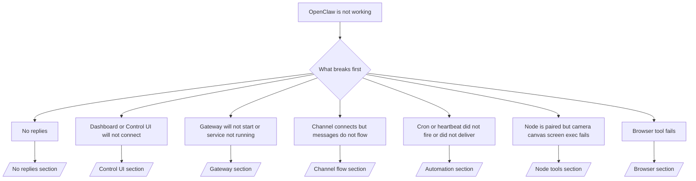

# Solución de problemas

Si solo tiene 2 minutos, use esta página como una puerta de entrada de triaje.

## Primeros 60 segundos

Ejecute esta escalera exacta en orden:

```bash
openclaw status
openclaw status --all
openclaw gateway probe
openclaw gateway status
openclaw doctor
openclaw channels status --probe
openclaw logs --follow
```

Buen resultado en una sola línea:

- `openclaw status` → muestra los canales configurados y no hay errores de autenticación evidentes.
- `openclaw status --all` → el informe completo está presente y es compartible.
- `openclaw gateway probe` → el objetivo esperado del Gateway es alcanzable.
- `openclaw gateway status` → `Runtime: running` y `RPC probe: ok`.
- `openclaw doctor` → no hay errores de configuración/servicio que bloqueen.
- `openclaw channels status --probe` → los canales informan `connected` o `ready`.
- `openclaw logs --follow` → actividad estable, sin errores fatales repetidos.

## Árbol de decisiones



<AccordionGroup>
  <Accordion title="No replies">
    ```bash
    openclaw status
    openclaw gateway status
    openclaw channels status --probe
    openclaw pairing list <channel>
    openclaw logs --follow
    ```

    ```
    Un buen resultado se ve así:
    
    - `Runtime: running`
    - `RPC probe: ok`
    - Su canal muestra conectado/listo en `channels status --probe`
    - El remitente aparece aprobado (o la política de mensajes directos está abierta/lista de permitidos)
    
    Firmas comunes en los registros:
    
    - `drop guild message (mention required` → el control por menciones bloqueó el mensaje en Discord.
    - `pairing request` → el remitente no está aprobado y está esperando la aprobación de emparejamiento de mensajes directos.
    - `blocked` / `allowlist` en los registros del canal → el remitente, la sala o el grupo están filtrados.
    
    Páginas en profundidad:
    
    - [/gateway/troubleshooting#no-replies](/gateway/troubleshooting#no-replies)
    - [/channels/troubleshooting](/channels/troubleshooting)
    - [/channels/pairing](/channels/pairing)
    ```

  </Accordion>

  <Accordion title="Dashboard or Control UI will not connect">
    ```bash
    openclaw status
    openclaw gateway status
    openclaw logs --follow
    openclaw doctor
    openclaw channels status --probe
    ```

    ```
    Un buen resultado se ve así:
    
    - `Dashboard: http://...` se muestra en `openclaw gateway status`
    - `RPC probe: ok`
    - No hay bucle de autenticación en los registros
    
    Firmas comunes en los registros:
    
    - `device identity required` → el contexto HTTP/no seguro no puede completar la autenticación del dispositivo.
    - `unauthorized` / bucle de reconexión → token/contraseña incorrectos o discrepancia del modo de autenticación.
    - `gateway connect failed:` → la UI apunta a una URL/puerto incorrectos o a un Gateway inalcanzable.
    
    Páginas en profundidad:
    
    - [/gateway/troubleshooting#dashboard-control-ui-connectivity](/gateway/troubleshooting#dashboard-control-ui-connectivity)
    - [/web/control-ui](/web/control-ui)
    - [/gateway/authentication](/gateway/authentication)
    ```

  </Accordion>

  <Accordion title="Gateway will not start or service installed but not running">
    ```bash
    openclaw status
    openclaw gateway status
    openclaw logs --follow
    openclaw doctor
    openclaw channels status --probe
    ```

    ```
    Un buen resultado se ve así:
    
    - `Service: ... (loaded)`
    - `Runtime: running`
    - `RPC probe: ok`
    
    Firmas comunes en los registros:
    
    - `Gateway start blocked: set gateway.mode=local` → el modo del Gateway no está configurado/remoto.
    - `refusing to bind gateway ... without auth` → enlace no loopback sin token/contraseña.
    - `another gateway instance is already listening` o `EADDRINUSE` → el puerto ya está en uso.
    
    Páginas en profundidad:
    
    - [/gateway/troubleshooting#gateway-service-not-running](/gateway/troubleshooting#gateway-service-not-running)
    - [/gateway/background-process](/gateway/background-process)
    - [/gateway/configuration](/gateway/configuration)
    ```

  </Accordion>

  <Accordion title="Channel connects but messages do not flow">
    ```bash
    openclaw status
    openclaw gateway status
    openclaw logs --follow
    openclaw doctor
    openclaw channels status --probe
    ```

    ```
    Un buen resultado se ve así:
    
    - El transporte del canal está conectado.
    - Las comprobaciones de emparejamiento/lista de permitidos pasan.
    - Las menciones se detectan cuando es necesario.
    
    Firmas comunes en los registros:
    
    - `mention required` → el control por menciones de grupo bloqueó el procesamiento.
    - `pairing` / `pending` → el remitente de mensajes directos aún no está aprobado.
    - `not_in_channel`, `missing_scope`, `Forbidden`, `401/403` → problema del token de permisos del canal.
    
    Páginas en profundidad:
    
    - [/gateway/troubleshooting#channel-connected-messages-not-flowing](/gateway/troubleshooting#channel-connected-messages-not-flowing)
    - [/channels/troubleshooting](/channels/troubleshooting)
    ```

  </Accordion>

  <Accordion title="Cron or heartbeat did not fire or did not deliver">
    ```bash
    openclaw status
    openclaw gateway status
    openclaw cron status
    openclaw cron list
    openclaw cron runs --id <jobId> --limit 20
    openclaw logs --follow
    ```

    ```
    Un buen resultado se ve así:
    
    - `cron.status` muestra habilitado con un próximo despertar.
    - `cron runs` muestra entradas recientes de `ok`.
    - El latido está habilitado y no está fuera del horario activo.
    
    Firmas comunes en los registros:
    
    - `cron: scheduler disabled; jobs will not run automatically` → el cron está deshabilitado.
    - `heartbeat skipped` con `reason=quiet-hours` → fuera del horario activo configurado.
    - `requests-in-flight` → carril principal ocupado; el despertar del latido se pospuso.
    - `unknown accountId` → la cuenta de destino de entrega del latido no existe.
    
    Páginas en profundidad:
    
    - [/gateway/troubleshooting#cron-and-heartbeat-delivery](/gateway/troubleshooting#cron-and-heartbeat-delivery)
    - [/automation/troubleshooting](/automation/troubleshooting)
    - [/gateway/heartbeat](/gateway/heartbeat)
    ```

  </Accordion>

  <Accordion title="Node is paired but tool fails camera canvas screen exec">
    ```bash
    openclaw status
    openclaw gateway status
    openclaw nodes status
    openclaw nodes describe --node <idOrNameOrIp>
    openclaw logs --follow
    ```

    ```
    Un buen resultado se ve así:
    
    - El nodo aparece como conectado y emparejado para el rol `node`.
    - Existe la capacidad para el comando que está invocando.
    - El estado de permisos está concedido para la herramienta.
    
    Firmas comunes en los registros:
    
    - `NODE_BACKGROUND_UNAVAILABLE` → lleve la app del nodo al primer plano.
    - `*_PERMISSION_REQUIRED` → el permiso del sistema operativo fue denegado/falta.
    - `SYSTEM_RUN_DENIED: approval required` → la aprobación de exec está pendiente.
    - `SYSTEM_RUN_DENIED: allowlist miss` → el comando no está en la lista de permitidos de exec.
    
    Páginas en profundidad:
    
    - [/gateway/troubleshooting#node-paired-tool-fails](/gateway/troubleshooting#node-paired-tool-fails)
    - [/nodes/troubleshooting](/nodes/troubleshooting)
    - [/tools/exec-approvals](/tools/exec-approvals)
    ```

  </Accordion>

  <Accordion title="Browser tool fails">
    ```bash
    openclaw status
    openclaw gateway status
    openclaw browser status
    openclaw logs --follow
    openclaw doctor
    ```

    ```
    Un buen resultado se ve así:
    
    - El estado del navegador muestra `running: true` y un navegador/perfil elegido.
    - El perfil `openclaw` se inicia o el relé `chrome` tiene una pestaña adjunta.
    
    Firmas comunes en los registros:
    
    - `Failed to start Chrome CDP on port` → falló el inicio del navegador local.
    - `browser.executablePath not found` → la ruta del binario configurado es incorrecta.
    - `Chrome extension relay is running, but no tab is connected` → la extensión no está adjunta.
    - `Browser attachOnly is enabled ... not reachable` → el perfil solo de adjuntar no tiene un objetivo CDP activo.
    
    Páginas en profundidad:
    
    - [/gateway/troubleshooting#browser-tool-fails](/gateway/troubleshooting#browser-tool-fails)
    - [/tools/browser-linux-troubleshooting](/tools/browser-linux-troubleshooting)
    - [/tools/chrome-extension](/tools/chrome-extension)
    ```

  </Accordion>
</AccordionGroup>
