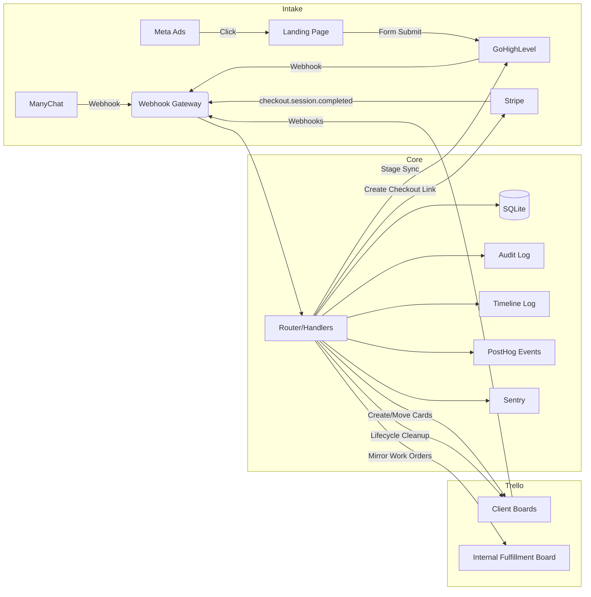

# End-to-End System Diagram

## Purpose

Implementation-faithful diagram of the end-to-end system including:

- Trello (client boards + internal board)
- GHL intake + pipeline
- ManyChat intake
- Stripe OfferIntent -> checkout link
- Webhook gateway + router
- DB truth + audit
- PostHog event schema
- Sentry runbooks
- Safe-mode/dry-run behavior

## Architecture Diagram



## Client Board Flow

```
Inbox / Awaiting Details
  -> In Progress
  -> Needs Review / Feedback
  -> Approved / Ready for Delivery
  -> Published / Delivered
```

## Internal Fulfillment Board Flow

```
Inbox
  -> Assigned
  -> In Progress
  -> Review
  -> Completed
  -> Archived
```

## Webhook Endpoints

| Endpoint | Source | Purpose |
|----------|--------|---------|
| `POST /webhooks/trello` | Trello | Card create/move, board close |
| `POST /webhooks/ghl` | GoHighLevel | Stage changes |
| `POST /webhooks/ghl_intake` | GoHighLevel | Intake form -> work order |
| `POST /webhooks/manychat` | ManyChat | Offer intent capture |
| `POST /webhooks/manychat_intake` | ManyChat | Intake answers -> work order |
| `POST /webhooks/stripe` | Stripe | Payment -> fulfillment |

## Data Flow: New Client Request

```
1. Client creates card in "Inbox / Awaiting Details" on client board
2. Trello webhook fires -> POST /webhooks/trello
3. System detects createCard in request list
4. Idempotency check (intake_requests / work_orders table)
5. classify_request_type() -> route() -> (role, priority)
6. create_work_order() -> internal card on fulfillment board Inbox
7. Attachments: link to client board + client card
8. Comment on client card: "Work order created"
9. apply_aspect_ratio_labels() -> AR labels on client card
10. Timeline event: request_received
11. Auto-assign (V2): pick assignee -> label on internal card
```

## Data Flow: Stripe Payment -> Board Provisioning

```
1. Stripe checkout.session.completed -> POST /webhooks/stripe
2. Payment recorded in payments table
3. GHL contact stage -> WON
4. create_fulfillment_job():
   a. Create Trello board with canonical lists
   b. Create starter cards + Reference cards
   c. Create Trello webhook
   d. Auto-assign designer (round-robin)
   e. Persist fulfillment_jobs + contact_board_map
   f. Sync board IDs to GHL custom fields
```

## Safety Model

| Flag | Default | Effect |
|------|---------|--------|
| `DRY_RUN` | `true` | Log all writes, skip external API calls |
| `READ_ONLY` | `false` | Block all writes, allow reads |
| `KILL_SWITCH` | `false` | Block ALL external operations |

## DB Tables (Truth)

| Table | Purpose |
|-------|---------|
| `fulfillment_jobs` | Board provisioning records |
| `contact_board_map` | GHL contact -> Trello board fast index |
| `intake_requests` | Intake request tracking |
| `work_orders` | Canonical work order state |
| `team_capacity` | Assignment capacity tracking |
| `assignments` | Assignment history |
| `team_members` | Team member registry |
| `lifecycle_timeline` | Timeline event log |
| `audit_log` | All mutations recorded |
| `idempotency_store` | Duplicate webhook rejection |
| `trello_webhooks` | Webhook registry per board |
| `payments` | Stripe payment records |
| `offer_intents` | ManyChat offer intent capture |

## Related Docs

| Doc | Purpose |
|-----|---------|
| `ARCHITECTURE.md` | Two-plane design, components |
| `TRELLO_WORK_ORDER_MIRROR.md` | Intake mirror spec |
| `TRELLO_LIST_CANONICAL_SCHEMA.md` | Canonical list names |
| `ASPECT_RATIO_LABELING.md` | AR detection spec |
| `CLIENT_BOARD_TEMPLATE.md` | Board provisioning template |
| `INTERNAL_FULFILLMENT_BOARD_TEMPLATE.md` | Internal board structure |
| `STAGE_SYNC_GHL_TRELLO.md` | GHL/Trello sync spec |
| `INTERNAL_ASSIGNMENT_ENGINE.md` | Assignment engine spec |
| `WORK_ORDER_SCHEMA.md` | Work order canonical schema |
| `CLIENT_LIFECYCLE_STATE_MACHINE.md` | Lifecycle transitions |
