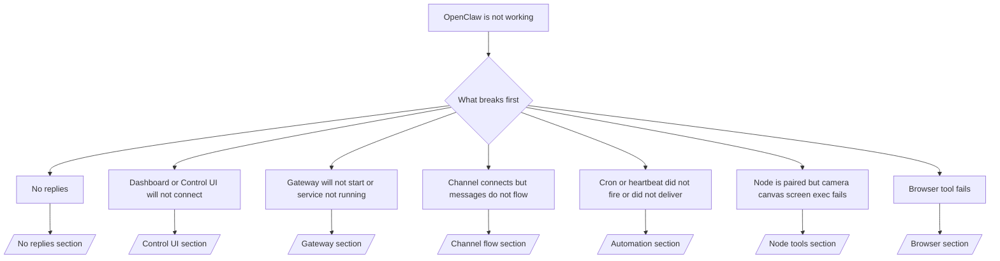

# Pag-troubleshoot

Kung 2 minuto lang ang meron ka, gamitin ang pahinang ito bilang triage front door.

## Unang 60 segundo

Patakbuhin ang eksaktong hagdang ito ayon sa pagkakasunod:

```bash
openclaw status
openclaw status --all
openclaw gateway probe
openclaw gateway status
openclaw doctor
openclaw channels status --probe
openclaw logs --follow
```

Magandang output sa isang linya:

- `openclaw status` → ipinapakita ang mga naka-configure na channel at walang halatang auth errors.
- `openclaw status --all` → kumpleto ang ulat at puwedeng i-share.
- `openclaw gateway probe` → naaabot ang inaasahang gateway target.
- `openclaw gateway status` → `Runtime: running` at `RPC probe: ok`.
- `openclaw doctor` → walang humahadlang na config/service errors.
- `openclaw channels status --probe` → nag-uulat ang mga channel ng `connected` o `ready`.
- `openclaw logs --follow` → tuloy-tuloy na aktibidad, walang paulit-ulit na fatal errors.

## Decision tree



<AccordionGroup>
  <Accordion title="No replies">
    ```bash
    openclaw status
    openclaw gateway status
    openclaw channels status --probe
    openclaw pairing list <channel>
    openclaw logs --follow
    ```

    ```
    Ganito ang hitsura ng magandang output:
    
    - `Runtime: running`
    - `RPC probe: ok`
    - Ipinapakita ng iyong channel na connected/ready sa `channels status --probe`
    - Mukhang aprubado ang sender (o bukas/allowlist ang DM policy)
    
    Karaniwang mga log signature:
    
    - `drop guild message (mention required` → hinarangan ng mention gating ang mensahe sa Discord.
    - `pairing request` → hindi aprubado ang sender at naghihintay ng approval sa DM pairing.
    - `blocked` / `allowlist` sa channel logs → naka-filter ang sender, room, o group.
    
    Mga malalalim na pahina:
    
    - [/gateway/troubleshooting#no-replies](/gateway/troubleshooting#no-replies)
    - [/channels/troubleshooting](/channels/troubleshooting)
    - [/channels/pairing](/channels/pairing)
    ```

  </Accordion>

  <Accordion title="Dashboard or Control UI will not connect">
    ```bash
    openclaw status
    openclaw gateway status
    openclaw logs --follow
    openclaw doctor
    openclaw channels status --probe
    ```

    ```
    Ganito ang hitsura ng magandang output:
    
    - Ipinapakita ang `Dashboard: http://...` sa `openclaw gateway status`
    - `RPC probe: ok`
    - Walang auth loop sa logs
    
    Karaniwang mga log signature:
    
    - `device identity required` → hindi makumpleto ng HTTP/non-secure context ang device auth.
    - `unauthorized` / reconnect loop → maling token/password o hindi tugma ang auth mode.
    - `gateway connect failed:` → tinatarget ng UI ang maling URL/port o hindi naaabot ang gateway.
    
    Mga malalalim na pahina:
    
    - [/gateway/troubleshooting#dashboard-control-ui-connectivity](/gateway/troubleshooting#dashboard-control-ui-connectivity)
    - [/web/control-ui](/web/control-ui)
    - [/gateway/authentication](/gateway/authentication)
    ```

  </Accordion>

  <Accordion title="Gateway will not start or service installed but not running">
    ```bash
    openclaw status
    openclaw gateway status
    openclaw logs --follow
    openclaw doctor
    openclaw channels status --probe
    ```

    ```
    Ganito ang hitsura ng magandang output:
    
    - `Service: ... (loaded)`
    - `Runtime: running`
    - `RPC probe: ok`
    
    Karaniwang mga log signature:
    
    - `Gateway start blocked: set gateway.mode=local` → hindi nakatakda/remote ang gateway mode.
    - `refusing to bind gateway ... without auth` → non-loopback bind na walang token/password.
    - `another gateway instance is already listening` o `EADDRINUSE` → ginagamit na ang port.
    
    Mga malalalim na pahina:
    
    - [/gateway/troubleshooting#gateway-service-not-running](/gateway/troubleshooting#gateway-service-not-running)
    - [/gateway/background-process](/gateway/background-process)
    - [/gateway/configuration](/gateway/configuration)
    ```

  </Accordion>

  <Accordion title="Channel connects but messages do not flow">
    ```bash
    openclaw status
    openclaw gateway status
    openclaw logs --follow
    openclaw doctor
    openclaw channels status --probe
    ```

    ```
    Ganito ang hitsura ng magandang output:
    
    - Connected ang channel transport.
    - Pumapasa ang pairing/allowlist checks.
    - Natutukoy ang mga mention kung kinakailangan.
    
    Karaniwang mga log signature:
    
    - `mention required` → hinarangan ng group mention gating ang pagproseso.
    - `pairing` / `pending` → hindi pa aprubado ang DM sender.
    - `not_in_channel`, `missing_scope`, `Forbidden`, `401/403` → isyu sa channel permission token.
    
    Mga malalalim na pahina:
    
    - [/gateway/troubleshooting#channel-connected-messages-not-flowing](/gateway/troubleshooting#channel-connected-messages-not-flowing)
    - [/channels/troubleshooting](/channels/troubleshooting)
    ```

  </Accordion>

  <Accordion title="Cron or heartbeat did not fire or did not deliver">
    ```bash
    openclaw status
    openclaw gateway status
    openclaw cron status
    openclaw cron list
    openclaw cron runs --id <jobId> --limit 20
    openclaw logs --follow
    ```

    ```
    Ganito ang hitsura ng magandang output:
    
    - Ipinapakita ng `cron.status` na enabled at may susunod na wake.
    - Ipinapakita ng `cron runs` ang mga kamakailang entry ng `ok`.
    - Enabled ang heartbeat at hindi lampas sa active hours.
    
    Karaniwang mga log signature:
    
    - `cron: scheduler disabled; jobs will not run automatically` → naka-disable ang cron.
    - `heartbeat skipped` na may `reason=quiet-hours` → nasa labas ng naka-configure na active hours.
    - `requests-in-flight` → abala ang main lane; na-defer ang heartbeat wake.
    - `unknown accountId` → hindi umiiral ang target account ng heartbeat delivery.
    
    Mga malalalim na pahina:
    
    - [/gateway/troubleshooting#cron-and-heartbeat-delivery](/gateway/troubleshooting#cron-and-heartbeat-delivery)
    - [/automation/troubleshooting](/automation/troubleshooting)
    - [/gateway/heartbeat](/gateway/heartbeat)
    ```

  </Accordion>

  <Accordion title="Node is paired but tool fails camera canvas screen exec">
    ```bash
    openclaw status
    openclaw gateway status
    openclaw nodes status
    openclaw nodes describe --node <idOrNameOrIp>
    openclaw logs --follow
    ```

    ```
    Ganito ang hitsura ng magandang output:
    
    - Nakalista ang node bilang connected at paired para sa role na `node`.
    - May umiiral na capability para sa command na tinatawag mo.
    - Naibigay ang permission state para sa tool.
    
    Karaniwang mga log signature:
    
    - `NODE_BACKGROUND_UNAVAILABLE` → dalhin ang node app sa foreground.
    - `*_PERMISSION_REQUIRED` → tinanggihan/kulang ang OS permission.
    - `SYSTEM_RUN_DENIED: approval required` → nakabinbin ang exec approval.
    - `SYSTEM_RUN_DENIED: allowlist miss` → wala sa exec allowlist ang command.
    
    Mga malalalim na pahina:
    
    - [/gateway/troubleshooting#node-paired-tool-fails](/gateway/troubleshooting#node-paired-tool-fails)
    - [/nodes/troubleshooting](/nodes/troubleshooting)
    - [/tools/exec-approvals](/tools/exec-approvals)
    ```

  </Accordion>

  <Accordion title="Browser tool fails">
    ```bash
    openclaw status
    openclaw gateway status
    openclaw browser status
    openclaw logs --follow
    openclaw doctor
    ```

    ```
    Ganito ang hitsura ng magandang output:
    
    - Ipinapakita ng browser status ang `running: true` at ang napiling browser/profile.
    - Nagsisimula ang profile na `openclaw` o may nakakabit na tab ang `chrome` relay.
    
    Karaniwang mga log signature:
    
    - `Failed to start Chrome CDP on port` → pumalya ang local browser launch.
    - `browser.executablePath not found` → mali ang naka-configure na binary path.
    - `Chrome extension relay is running, but no tab is connected` → hindi nakakabit ang extension.
    - `Browser attachOnly is enabled ... not reachable` → walang live CDP target ang attach-only profile.
    
    Mga malalalim na pahina:
    
    - [/gateway/troubleshooting#browser-tool-fails](/gateway/troubleshooting#browser-tool-fails)
    - [/tools/browser-linux-troubleshooting](/tools/browser-linux-troubleshooting)
    - [/tools/chrome-extension](/tools/chrome-extension)
    ```

  </Accordion>
</AccordionGroup>
