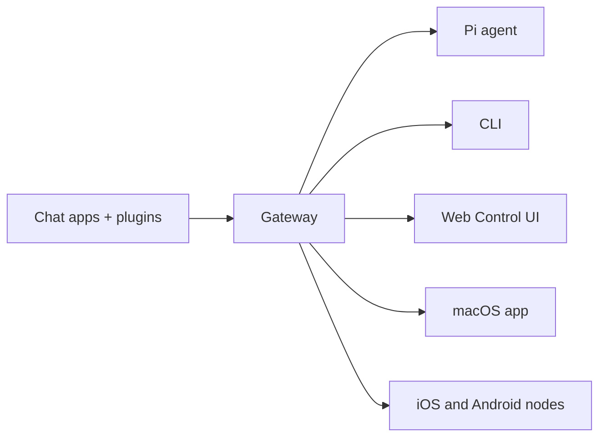

# OpenClaw 🦞

<p align="center">
    
    
</p>

> _"EXFOLIATE! <strong>Anumang OS gateway para sa mga AI agent sa WhatsApp, Telegram, Discord, iMessage, at higit pa.</strong>

<p align="center"><br />
  Magpadala ng mensahe, makakuha ng tugon ng agent mula sa iyong bulsa.Nagdaragdag ang mga plugin ng Mattermost at iba pa. Kailangan mo ba ang kumpletong install at dev setup?
</p>

<Columns>
  <Card title="Get Started" href="/start/getting-started" icon="rocket">
    I-install ang OpenClaw at patakbuhin ang Gateway sa loob ng ilang minuto.
  </Card>
  <Card title="Run the Wizard" href="/start/wizard" icon="sparkles">
    Guided na setup gamit ang `openclaw onboard` at mga pairing flow.
  </Card>
  <Card title="Open the Control UI" href="/web/control-ui" icon="layout-dashboard">
    Ilunsad ang browser dashboard para sa chat, config, at mga session.
  </Card>
</Columns>

## Ano ang OpenClaw?

OpenClaw is a **self-hosted gateway** that connects your favorite chat apps — WhatsApp, Telegram, Discord, iMessage, and more — to AI coding agents like Pi. You run a single Gateway process on your own machine (or a server), and it becomes the bridge between your messaging apps and an always-available AI assistant.

**Para kanino ito?** Mga developer at power user na gustong magkaroon ng personal na AI assistant na maaari nilang i-message mula kahit saan — nang hindi isinusuko ang kontrol sa kanilang data o umaasa sa isang hosted service.

**Ano ang nagpapakaiba rito?**

- **Self-hosted**: tumatakbo sa sarili mong hardware, sarili mong mga patakaran
- **Multi-channel**: iisang Gateway ang nagseserbisyo sa WhatsApp, Telegram, Discord, at iba pa nang sabay-sabay
- **Agent-native**: binuo para sa mga coding agent na may tool use, mga session, memory, at multi-agent routing
- **Open source**: MIT licensed, pinapatakbo ng komunidad

**Ano ang kailangan mo?** Node 22+, isang API key (inirerekomenda ang Anthropic), at 5 minuto.

## Paano ito gumagana



Ang Gateway ang iisang source of truth para sa mga session, routing, at mga koneksyon ng channel.

## Mga pangunahing kakayahan

<Columns>
  <Card title="Multi-channel gateway" icon="network">
    WhatsApp, Telegram, Discord, at iMessage gamit ang iisang proseso ng Gateway.
  </Card>
  <Card title="Plugin channels" icon="plug">
    Magdagdag ng Mattermost at iba pa gamit ang mga extension package.
  </Card>
  <Card title="Multi-agent routing" icon="route">
    Hiwalay na mga session kada agent, workspace, o sender.
  </Card>
  <Card title="Media support" icon="image">
    Magpadala at tumanggap ng mga larawan, audio, at dokumento.
  </Card>
  <Card title="Web Control UI" icon="monitor">
    Browser dashboard para sa chat, config, mga session, at node.
  </Card>
  <Card title="Mobile nodes" icon="smartphone">
    I-pair ang mga iOS at Android node na may Canvas support.
  </Card>
</Columns>

## Mabilis na pagsisimula

<Steps>
  <Step title="Install OpenClaw">
    ```bash
    npm install -g openclaw@latest
    ```
  </Step>
  <Step title="Onboard and install the service">
    ```bash
    openclaw onboard --install-daemon
    ```
  </Step>
  <Step title="Pair WhatsApp and start the Gateway">
    ```bash
    openclaw channels login
    openclaw gateway --port 18789
    ```
  </Step>
</Steps>

Dapat **port 22 lamang** (SSH) ang bukas. See [Quick start](/start/quickstart).

## Dashboard

Buksan ang browser Control UI pagkatapos magsimula ang Gateway.

- Local default: [http://127.0.0.1:18789/](http://127.0.0.1:18789/)
- Remote access: [Web surfaces](/web) at [Tailscale](/gateway/tailscale)

<p align="center">
  
</p>

## Configuration (opsyonal)

Ang config ay matatagpuan sa `~/.openclaw/openclaw.json`.

- Kung **wala kang gagawin**, gagamit ang OpenClaw ng bundled na Pi binary sa RPC mode na may per-sender na mga session.
- Kung gusto mo itong higpitan, magsimula sa `channels.whatsapp.allowFrom` at (para sa mga group) mga patakaran sa pagbanggit.

Halimbawa:

```json5
{
  channels: {
    whatsapp: {
      allowFrom: ["+15555550123"],
      groups: { "*": { requireMention: true } },
    },
  },
  messages: { groupChat: { mentionPatterns: ["@openclaw"] } },
}
```

## Dito magsimula

<Columns>
  <Card title="Docs hubs" href="/start/hubs" icon="book-open">
    Lahat ng docs at gabay, inayos ayon sa use case.
  </Card>
  <Card title="Configuration" href="/gateway/configuration" icon="settings">
    Mga pangunahing setting ng Gateway, mga token, at provider config.
  </Card>
  <Card title="Remote access" href="/gateway/remote" icon="globe">
    Mga pattern ng SSH at tailnet access.
  </Card>
  <Card title="Channels" href="/channels/telegram" icon="message-square">
    Channel-specific na setup para sa WhatsApp, Telegram, Discord, at iba pa.
  </Card>
  <Card title="Nodes" href="/nodes" icon="smartphone">
    Mga iOS at Android node na may pairing at Canvas.
  </Card>
  <Card title="Help" href="/help" icon="life-buoy">
    Mga karaniwang ayos at entry point para sa pag-troubleshoot.
  </Card>
</Columns>

## Alamin pa

<Columns>
  <Card title="Full feature list" href="/concepts/features" icon="list">
    Kumpletong kakayahan sa channel, routing, at media.
  </Card>
  <Card title="Multi-agent routing" href="/concepts/multi-agent" icon="route">
    Workspace isolation at per-agent na mga session.
  </Card>
  <Card title="Security" href="/gateway/security" icon="shield">
    Mga token, allowlist, at mga kontrol sa kaligtasan.
  </Card>
  <Card title="Troubleshooting" href="/gateway/troubleshooting" icon="wrench">
    Mga diagnostic ng Gateway at karaniwang error.
  </Card>
  <Card title="About and credits" href="/reference/credits" icon="info">
    Pinagmulan ng proyekto, mga contributor, at lisensya.
  </Card>
</Columns>
