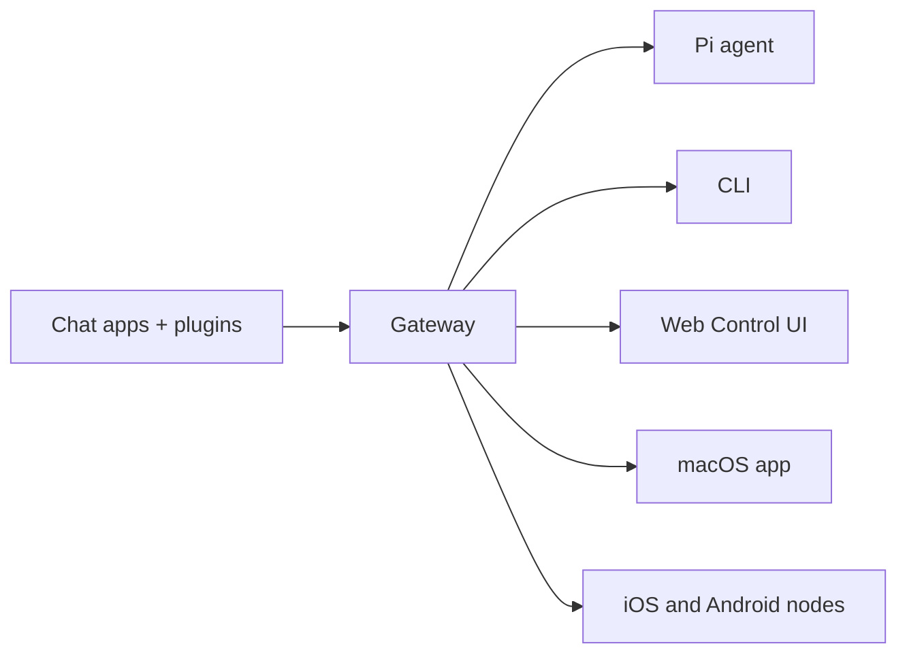

# OpenClaw 🦞

<p align="center">
    
    
</p>

> _« EXFOLIATE ! EXFOLIATE ! »_ — Un homard de l’espace, probablement

<p align="center"><strong>Passerelle pour agents IA sur n’importe quel OS, à travers WhatsApp, Telegram, Discord, iMessage, et plus encore.</strong><br />
  Envoyez un message, obtenez une réponse d’agent depuis votre poche. Des plugins ajoutent Mattermost et plus encore.
</p>

<Columns>
  <Card title="Get Started" href="/start/getting-started" icon="rocket">
    Installez OpenClaw et démarrez la Gateway (passerelle) en quelques minutes.
  </Card>
  <Card title="Run the Wizard" href="/start/wizard" icon="sparkles">
    Configuration guidée avec `openclaw onboard` et des flux d’appairage.
  </Card>
  <Card title="Open the Control UI" href="/web/control-ui" icon="layout-dashboard">
    Lancez le tableau de bord du navigateur pour le chat, la configuration et les sessions.
  </Card>
</Columns>

## Qu’est-ce qu’OpenClaw ?

OpenClaw est une **passerelle auto-hébergée** qui connecte vos applications de messagerie préférées — WhatsApp, Telegram, Discord, iMessage, et plus encore — à des agents IA de programmation comme Pi. Vous exécutez un unique processus Gateway (passerelle) sur votre machine (ou un serveur), et il devient le pont entre vos applications de messagerie et un assistant IA toujours disponible.

**À qui s’adresse-t-il ?** Aux développeurs et utilisateurs avancés qui veulent un assistant IA personnel, accessible par message depuis n’importe où — sans renoncer au contrôle de leurs données ni dépendre d’un service hébergé.

**Qu’est-ce qui le rend différent ?**

- **Auto-hébergé** : fonctionne sur votre matériel, selon vos règles
- **Multicanal** : une seule Gateway (passerelle) dessert WhatsApp, Telegram, Discord, et plus encore simultanément
- **Natif pour les agents** : conçu pour des agents de programmation avec usage d’outils, sessions, mémoire et routage multi‑agents
- **Open source** : sous licence MIT, piloté par la communauté

**De quoi avez-vous besoin ?** Node 22+, une clé API (Anthropic recommandé) et 5 minutes.

## Comment ça marche



La Gateway (passerelle) est la source de vérité unique pour les sessions, le routage et les connexions aux canaux.

## Capacités clés

<Columns>
  <Card title="Multi-channel gateway" icon="network">
    WhatsApp, Telegram, Discord et iMessage avec un seul processus Gateway (passerelle).
  </Card>
  <Card title="Plugin channels" icon="plug">
    Ajoutez Mattermost et plus encore avec des paquets d’extension.
  </Card>
  <Card title="Multi-agent routing" icon="route">
    Sessions isolées par agent, espace de travail ou expéditeur.
  </Card>
  <Card title="Media support" icon="image">
    Envoyez et recevez des images, de l’audio et des documents.
  </Card>
  <Card title="Web Control UI" icon="monitor">
    Tableau de bord navigateur pour le chat, la configuration, les sessions et les nœuds.
  </Card>
  <Card title="Mobile nodes" icon="smartphone">
    Appairez des nœuds iOS et Android avec prise en charge de Canvas.
  </Card>
</Columns>

## Démarrage rapide

<Steps>
  <Step title="Install OpenClaw">
    ```bash
    npm install -g openclaw@latest
    ```
  </Step>
  <Step title="Onboard and install the service">
    ```bash
    openclaw onboard --install-daemon
    ```
  </Step>
  <Step title="Pair WhatsApp and start the Gateway">
    ```bash
    openclaw channels login
    openclaw gateway --port 18789
    ```
  </Step>
</Steps>

Besoin de l’installation complète et de la configuration de développement ? Voir le [Démarrage rapide](/start/quickstart).

## Tableau de bord

Ouvrez l’interface de contrôle dans le navigateur après le démarrage de la Gateway (passerelle).

- Par défaut en local : http://127.0.0.1:18789/
- Accès à distance : [Surfaces Web](/web) et [Tailscale](/gateway/tailscale)

<p align="center">
  
</p>

## Configuration (optionnelle)

La configuration se trouve à `~/.openclaw/openclaw.json`.

- Si vous **ne faites rien**, OpenClaw utilise le binaire Pi fourni en mode RPC avec des sessions par expéditeur.
- Si vous souhaitez le verrouiller, commencez par `channels.whatsapp.allowFrom` et (pour les groupes) les règles de mention.

Exemple :

```json5
{
  channels: {
    whatsapp: {
      allowFrom: ["+15555550123"],
      groups: { "*": { requireMention: true } },
    },
  },
  messages: { groupChat: { mentionPatterns: ["@openclaw"] } },
}
```

## Commencez ici

<Columns>
  <Card title="Docs hubs" href="/start/hubs" icon="book-open">
    Toute la documentation et les guides, organisés par cas d’usage.
  </Card>
  <Card title="Configuration" href="/gateway/configuration" icon="settings">
    Paramètres de base de la Gateway (passerelle), jetons et configuration du fournisseur.
  </Card>
  <Card title="Remote access" href="/gateway/remote" icon="globe">
    Modèles d’accès SSH et tailnet.
  </Card>
  <Card title="Channels" href="/channels/telegram" icon="message-square">
    Configuration spécifique aux canaux pour WhatsApp, Telegram, Discord, et plus encore.
  </Card>
  <Card title="Nodes" href="/nodes" icon="smartphone">
    Nœuds iOS et Android avec appairage et Canvas.
  </Card>
  <Card title="Help" href="/help" icon="life-buoy">
    Correctifs courants et point d’entrée du dépannage.
  </Card>
</Columns>

## En savoir plus

<Columns>
  <Card title="Full feature list" href="/concepts/features" icon="list">
    Capacités complètes des canaux, du routage et des médias.
  </Card>
  <Card title="Multi-agent routing" href="/concepts/multi-agent" icon="route">
    Isolation des espaces de travail et sessions par agent.
  </Card>
  <Card title="Security" href="/gateway/security" icon="shield">
    Jetons, listes d’autorisation et contrôles de sécurité.
  </Card>
  <Card title="Troubleshooting" href="/gateway/troubleshooting" icon="wrench">
    Diagnostics de la Gateway (passerelle) et erreurs courantes.
  </Card>
  <Card title="About and credits" href="/reference/credits" icon="info">
    Origines du projet, contributeurs et licence.
  </Card>
</Columns>
