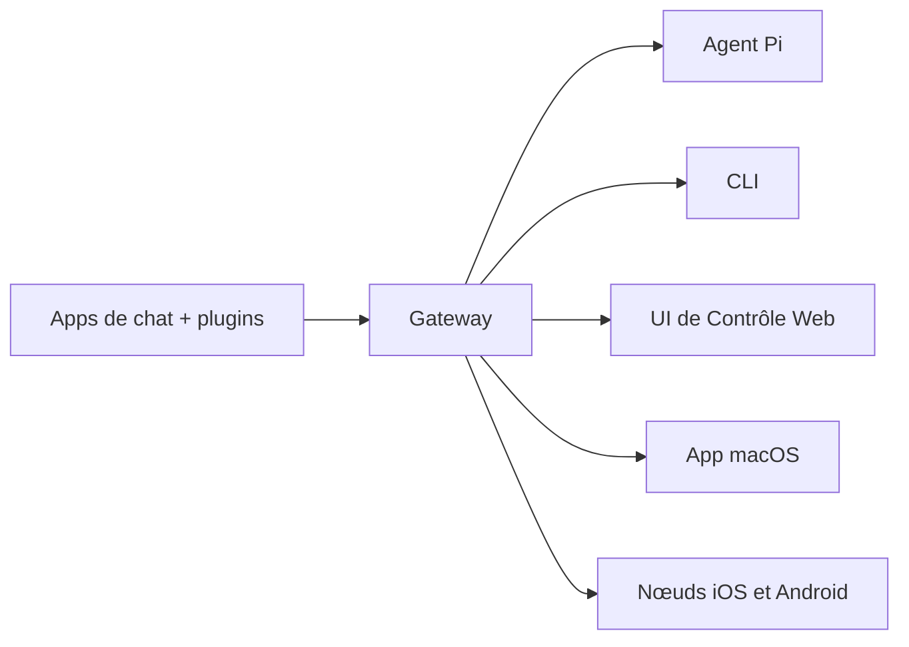

# OpenClaw 🦞

<p align="center">
    
    
</p>

> _"EXFOLIEZ ! EXFOLIEZ !"_ — Un homard de l'espace, probablement

<p align="center">
  <strong>Gateway tout OS pour agents IA sur WhatsApp, Telegram, Discord, iMessage, et plus.</strong><br />
  Envoyez un message, recevez une réponse d'agent depuis votre poche. Les plugins ajoutent Mattermost et plus encore.
</p>

<Columns>
  <Card title="Commencer" href="/start/getting-started" icon="rocket">
    Installez OpenClaw et lancez la Gateway en quelques minutes.
  </Card>
  <Card title="Lancer l'assistant" href="/start/wizard" icon="sparkles">
    Installation guidée avec `openclaw onboard` et flux d'appairage.
  </Card>
  <Card title="Ouvrir l'UI de Contrôle" href="/web/control-ui" icon="layout-dashboard">
    Lancez le tableau de bord navigateur pour chat, config et sessions.
  </Card>
</Columns>

## Qu'est-ce qu'OpenClaw ?

OpenClaw est une **gateway auto-hébergée** qui connecte vos apps de chat préférées — WhatsApp, Telegram, Discord, iMessage, et plus — à des agents de codage IA comme Pi. Vous faites tourner un processus Gateway unique sur votre propre machine (ou un serveur), et il devient le pont entre vos applications de messagerie et un assistant IA toujours disponible.

**Pour qui ?** Les développeurs et utilisateurs avancés qui veulent un assistant IA personnel qu'ils peuvent contacter de partout — sans renoncer au contrôle de leurs données ou dépendre d'un service hébergé.

**Qu'est-ce qui le rend différent ?**

- **Auto-hébergé** : tourne sur votre matériel, selon vos règles
- **Multi-canaux** : une seule Gateway sert WhatsApp, Telegram, Discord, et plus simultanément
- **Natif Agent** : construit pour les agents de codage avec utilisation d'outils, sessions, mémoire, et routage multi-agents
- **Open source** : licence MIT, piloté par la communauté

**De quoi avez-vous besoin ?** Node 22+, une clé API (Anthropic recommandé), et 5 minutes.

## Comment ça marche



La Gateway est la source unique de vérité pour les sessions, le routage et les connexions aux canaux.

## Capacités clés

<Columns>
  <Card title="Gateway multi-canaux" icon="network">
    WhatsApp, Telegram, Discord, et iMessage avec un processus Gateway unique.
  </Card>
  <Card title="Canaux via plugins" icon="plug">
    Ajoutez Mattermost et plus avec des paquets d'extension.
  </Card>
  <Card title="Routage multi-agents" icon="route">
    Sessions isolées par agent, espace de travail ou expéditeur.
  </Card>
  <Card title="Support média" icon="image">
    Envoyez et recevez images, audio et documents.
  </Card>
  <Card title="UI de Contrôle Web" icon="monitor">
    Tableau de bord navigateur pour chat, config, sessions et nœuds.
  </Card>
  <Card title="Nœuds mobiles" icon="smartphone">
    Appairez des nœuds iOS et Android avec support Canvas.
  </Card>
</Columns>

## Démarrage rapide

<Steps>
  <Step title="Installer OpenClaw">
    ```bash
    npm install -g openclaw@latest
    ```
  </Step>
  <Step title="Onboarder et installer le service">
    ```bash
    openclaw onboard --install-daemon
    ```
  </Step>
  <Step title="Appairer WhatsApp et démarrer la Gateway">
    ```bash
    openclaw channels login
    openclaw gateway --port 18789
    ```
  </Step>
</Steps>

Besoin de l'installation complète et du setup dev ? Voir [Démarrage rapide](/start/quickstart).

## Tableau de bord

Ouvrez l'UI de Contrôle navigateur après le démarrage de la Gateway.

- Local par défaut : [http://127.0.0.1:18789/](http://127.0.0.1:18789/)
- Accès distant : [Surfaces Web](/web) et [Tailscale](/gateway/tailscale)

<p align="center">
  
</p>

## Configuration (optionnel)

La config vit dans `~/.openclaw/openclaw.json`.

- Si vous ne faites **rien**, OpenClaw utilise le binaire Pi inclus en mode RPC avec sessions par expéditeur.
- Si vous voulez verrouiller, commencez avec `channels.whatsapp.allowFrom` et (pour les groupes) les règles de mention.

Exemple :

```json5
{
  channels: {
    whatsapp: {
      allowFrom: ["+15555550123"],
      groups: { "*": { requireMention: true } },
    },
  },
  messages: { groupChat: { mentionPatterns: ["@openclaw"] } },
}
```

## Commencez ici

<Columns>
  <Card title="Hubs de documentation" href="/start/hubs" icon="book-open">
    Toutes les docs et guides, organisés par cas d'usage.
  </Card>
  <Card title="Configuration" href="/gateway/configuration" icon="settings">
    Paramètres Gateway de base, tokens et config provider.
  </Card>
  <Card title="Accès distant" href="/gateway/remote" icon="globe">
    Modèles d'accès SSH et tailnet.
  </Card>
  <Card title="Canaux" href="/channels/telegram" icon="message-square">
    Setup spécifique par canal pour WhatsApp, Telegram, Discord, et plus.
  </Card>
  <Card title="Nœuds" href="/nodes" icon="smartphone">
    Nœuds iOS et Android avec appairage et Canvas.
  </Card>
  <Card title="Aide" href="/help" icon="life-buoy">
    Correctifs courants et point d'entrée dépannage.
  </Card>
</Columns>

## En savoir plus

<Columns>
  <Card title="Liste complète des fonctionnalités" href="/concepts/features" icon="list">
    Capacités complètes de canal, routage et média.
  </Card>
  <Card title="Routage multi-agents" href="/concepts/multi-agent" icon="route">
    Isolation d'espace de travail et sessions par agent.
  </Card>
  <Card title="Sécurité" href="/gateway/security" icon="shield">
    Tokens, listes blanches et contrôles de sécurité.
  </Card>
  <Card title="Dépannage" href="/gateway/troubleshooting" icon="wrench">
    Diagnostics Gateway et erreurs courantes.
  </Card>
  <Card title="À propos et crédits" href="/reference/credits" icon="info">
    Origines du projet, contributeurs et licence.
  </Card>
</Columns>
