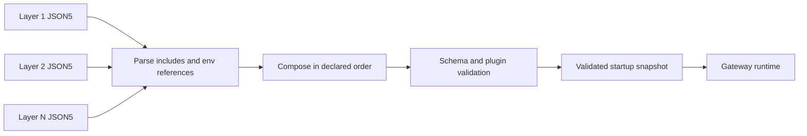
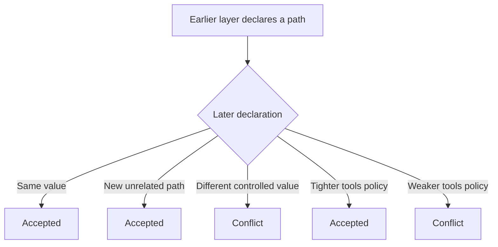

Configuration layers are an opt-in Gateway startup feature. Pass
`--config-layer <id=path>` more than once to compose ordinary OpenClaw config
files in the declared order.

Without `--config-layer`, OpenClaw uses its normal single-config behavior. No
layer parsing, composition, write restrictions, or other managed behavior is
active.

## How composition works



Layer IDs are generic labels. OpenClaw does not assign special meaning to names
such as `global`, `tenant`, or `operator`.

The composer applies these rules recursively:

- The first layer to declare a config path controls that path.
- A later layer may repeat the same value.
- A later layer may not replace a controlled value.
- Empty objects claim their path rather than disappearing.
- `tools.allow` may become more restrictive in a later layer.
- `tools.deny` may become more restrictive by denying additional tools.
- Tool wildcards and groups use OpenClaw's runtime policy semantics. Ambiguous
  wildcard-to-wildcard allowlist replacements fail closed.



Conflicts stop startup and identify the later layer, config path, controlling
layer, and reason.

## Native config handling

Each layer remains an ordinary OpenClaw JSON5 document:

- `$include` is resolved relative to that layer file.
- `OPENCLAW_INCLUDE_ROOTS` authorizes the same additional include roots as the
  normal config reader.
- `${ENV_NAME}` references use the normal environment substitution behavior.
- The composed document passes the normal OpenClaw schema, defaults, plugin
  metadata, and plugin validation pipeline.

The root `meta` and `env` keys are not accepted in layered V1 because they
participate in bootstrap behavior that happens before composition. Supply
process environment through the launcher instead.

## Lobster example

A Lobster-hosted Scout can keep three independent inputs without baking values
into one generated `openclaw.json`.

### 1. Scout global config

```json5
// /run/lobster/openclaw/scout-global.json5
{
  gateway: {
    mode: "local",
  },
  tools: {
    allow: ["group:fs", "web_*"],
    deny: ["exec"],
  },
}
```

This file contains the Scout-wide baseline shared by every tenant instance.

### 2. Tenant network config

```json5
// /run/lobster/openclaw/tenant-network.json5
{
  gateway: {
    customBindHost: "10.42.17.8",
    trustedProxies: ["10.42.0.0/16"],
    controlUi: {
      allowedOrigins: ["https://scout.contoso.example"],
    },
  },
}
```

This file contains tenant-specific URLs and private-network boundaries. Lobster
can regenerate it from tenant and VPN state without rewriting global or local
operator choices.

### 3. Operator-local config

```json5
// /var/lib/lobster/openclaw/operator-local.json5
{
  agents: {
    defaults: {
      workspace: "/var/lib/lobster/workspace",
      model: {
        primary: "openai/gpt-5.4",
      },
    },
  },
  tools: {
    allow: ["read", "web_search"],
    deny: ["exec", "write"],
  },
}
```

The operator file adds local choices and tightens the earlier tool policy. It
cannot replace tenant network values or weaken the Scout baseline.

Start the Gateway with the files in the intended order:

```bash
openclaw gateway run \
  --config-layer scout-global=/run/lobster/openclaw/scout-global.json5 \
  --config-layer tenant-network=/run/lobster/openclaw/tenant-network.json5 \
  --config-layer operator-local=/var/lib/lobster/openclaw/operator-local.json5
```

The same options can appear before `run`:

```bash
openclaw gateway \
  --config-layer scout-global=/run/lobster/openclaw/scout-global.json5 \
  --config-layer tenant-network=/run/lobster/openclaw/tenant-network.json5 \
  --config-layer operator-local=/var/lib/lobster/openclaw/operator-local.json5 \
  run
```

## V1 lifecycle and write boundary

Layered V1 is deliberately startup-based and read-only:

- `config.get` reports the composed source and effective runtime config.
- Config persistence is blocked across Gateway RPCs and plugin/runtime config
  writers while layered mode is active.
- `config.set`, `config.patch`, `config.apply`, and `config.openFile` reject the
  request rather than editing an unrelated canonical config file.
- Canonical config file watching and last-known-good promotion are disabled.
- Changing a layer file requires a full process restart. An in-process Gateway
  restart reuses the already validated startup snapshot.
- `--dev` cannot be combined with `--config-layer` because dev bootstrap creates
  or resets mutable canonical config state.

Live layer reload, writes, generations, provenance/status APIs, and management
controllers are not part of V1. The launcher owns source creation, permissions,
rollout, and process restart.
