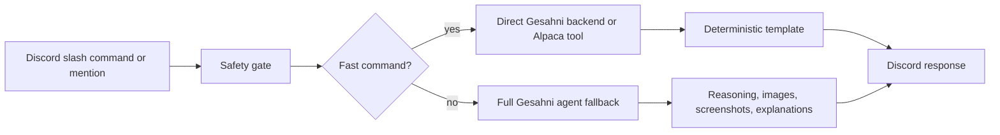

# Gesahni Discord V1 Plan

Date: 2026-04-26
Updated: 2026-04-27

## Goal

Build a practical Discord stock/options assistant for the STREEET server.

V1 should feel fast for simple market commands and still support slower reasoning for analysis, screenshots, and conversational questions.

## Non-goals for V1

- No Bot Lab first implementation.
- No public status/model feature.
- No generic OpenClaw operational commands in public Discord.
- No shell/code/browser/computer tools exposed to Discord users.
- No full-agent path for quote, earnings, news, option chain, or contract lookup when the request is command-shaped.
- No public watchlist writes.
- No scheduled briefings until manual briefing commands work.
- No trading recommendations or buy/sell orders.

## Product architecture

Use two lanes.



### Fast command path

Use direct tools/templates. Do not call a model. Do not start a full Gesahni agent session.

Fast commands:

- `/quote SYMBOL`
- `/earnings SYMBOL`
- `/news SYMBOL`
- `/option_chain SYMBOL`
- `/contract SYMBOL STRIKE_TYPE EXPIRY`
- `/premarket`
- `/midday`
- `/postmarket`

### Agent fallback path

Use the full Gesahni agent only for messages/images that need reasoning.

Examples:

- `@gesahni what is Apple looking like?`
- `@gesahni analyze this TSLA 250C play`
- `@gesahni explain IV crush`
- `@gesahni read this screenshot`
- `@gesahni what do you see in this chart?`

Agent fallback rules:

- Use tools for live market data.
- Do not invent option chain data.
- Distinguish screenshot facts from fetched market facts.
- Do not disclose model, provider, runtime, or internal configuration.
- Do not give buy/sell orders.
- Do not run code, shell, browser, or computer actions.

## Response quality standard

Tier 0 can be mechanical because it is a fast deterministic quote path.

Tier 1 and Tier 2 must not sound like form letters. If an LLM is used, the answer should interpret the facts, not just repeat them.

Core rule:

```text
Do not stop at extraction. Answer "so what?"
```

Every non-trivial Tier 1 or Tier 2 response should include at least two of:

- A calculation.
- The plain-English meaning of the numbers.
- The main risk.
- What has to happen next.
- What data is missing.
- Why the setup matters.

For option-contract screenshots or option-play asks, the assistant should calculate when inputs are available:

- Spot vs strike.
- In-the-money, at-the-money, or out-of-the-money.
- Intrinsic value.
- Breakeven.
- Distance from spot to breakeven.
- Approximate percent move needed.
- Liquidity quality from bid/ask, volume, and open interest.
- Time/IV risk from theta and implied volatility.

Bad response pattern:

```text
I see AAPL 280C 05/01. Bid is $2.21, ask is $2.34, delta is 0.275.
```

Good response pattern:

```text
This AAPL 280C 05/01 is out of the money with AAPL around $270.90 in the screenshot. If someone pays near the $2.34 ask, breakeven is about $282.34, so Apple needs roughly an $11.44 move, about 4.2%, before expiry just to clear breakeven.

The liquidity looks active because volume and open interest are both high, but theta is heavy. If AAPL keeps rejecting around 273 instead of breaking and holding quickly, the contract can bleed even if the direction is eventually right. Educational only.
```

Tier 2 structured context should include:

```json
{
  "discord_user_id": "...",
  "guild_id": "...",
  "channel_id": "...",
  "route": "tier2_openclaw",
  "intent": "options_play_analysis",
  "escalation_reason": "options_play_analysis",
  "symbols": ["AAPL"],
  "detected_contract": {
    "symbol": "AAPL",
    "strike": 280,
    "type": "C",
    "expiry": "2026-05-01"
  },
  "screenshot_mode": "option_contract_screenshot"
}
```

## Phase 1 safety gate

Before enabling native slash commands broadly, verify public Discord does not expose internal OpenClaw commands.

Check runtime state:

```bash
openclaw --version
openclaw gateway status
openclaw channels status --probe
```

Blocked or owner-only commands:

- `/model`
- `/status`
- `/tools`
- `/exec`
- `/config`
- `/debug`
- `/plugins`
- `/reasoning`
- `/verbose`

Allowed product commands only:

- `/quote`
- `/earnings`
- `/news`
- `/option_chain`
- `/contract`
- `/analyze_play`
- `/premarket`
- `/midday`
- `/postmarket`

If OpenClaw cannot isolate product commands from internal commands, stop the OpenClaw-native command path and use the thin Discord adapter fallback.

## Phase 2 proof: `/quote` only

Implement `/quote SYMBOL` first. Nothing else ships until `/quote` proves the architecture.

Target behavior:

```text
/quote AAPL
-> Discord receives interaction
-> immediate ack/defer
-> direct quote tool
-> deterministic template
-> no model call
-> no full Gesahni agent session
-> response under 4 sec warm
```

Required timing logs:

- `discord_interaction_received_at`
- `ack_sent_at`
- `route_selected_at`
- `tool_start_at`
- `tool_done_at`
- `response_sent_at`
- `model_called=false`
- `agent_session_started=false`

Response shape:

```text
AAPL - $___
Today: ___%
Volume: ___
Source: Alpaca
Educational only.
```

Tests must prove:

- `/quote AAPL` routes to the fast path.
- No model call occurs.
- No full agent session starts.
- Quote tool is called.
- Public model/status disclosure is blocked.
- Public watchlist writes still redirect to DM.

## Phase 3 decision gate: OpenClaw-native or thin adapter

Stay OpenClaw-native only if:

- `/quote` works.
- No model call occurs.
- Warm response is under 4 sec.
- Generic internal commands are hidden or owner-only.
- Native command output renders correctly.
- Channel allowlist works.
- Logs clearly prove the path.

Switch to thin Discord adapter if:

- OpenClaw exposes internal commands publicly.
- Native slash output is broken.
- Command routing still starts full agent sessions.
- Permissions are hard to lock down.
- Latency stays high for simple commands.

Thin adapter shape:

```mermaid
flowchart LR
  A[Discord interaction server] --> B[/quote /earnings /option_chain]
  B --> C[Gesahni backend / Alpaca]
  C --> D[Template response]
  A --> E[Mentions/screenshots]
  E --> F[OpenClaw/Gesahni full agent fallback]
```

The thin adapter is the fallback, not the first move.

## Phase 4 add fast commands one at a time

Only after `/quote` passes.

### 4.1 `/earnings`

```text
/earnings AAPL
```

Response:

```text
AAPL earnings
Next report: ___
Expected EPS: ___
Key watch: ___
```

### 4.2 `/news`

```text
/news NVDA
```

Response:

```text
Recent NVDA news:
1. ...
2. ...
3. ...
Main thing to watch: ...
```

### 4.3 `/option_chain`

Alpaca option chain data is V1 scope when available through the configured plan/API.

```text
/option_chain TSLA
```

Response:

```text
TSLA nearest expiry
250C bid/ask ___ / ___ | vol ___ | OI ___ | delta ___
255C bid/ask ___ / ___ | vol ___ | OI ___ | delta ___
245P bid/ask ___ / ___ | vol ___ | OI ___ | delta ___
```

### 4.4 `/contract`

```text
/contract TSLA 250C 2026-05-17
```

Response:

```text
TSLA 250C exp 2026-05-17
Bid/ask: ___ / ___
Breakeven: strike + premium
Delta: ___
Theta: ___
Risk: premium can decay if TSLA stalls.
Educational only.
```

## Phase 5 agent fallback

After fast commands work, wire mentions and images to the full Gesahni agent.

Use full agent for:

- Market interpretation.
- Options play analysis.
- Explanations.
- Screenshot/chart reading.
- Ambiguous user questions.

## Phase 6 DM private workspace

Add after public commands are stable.

DM commands:

- `watchlist`
- `add AAPL`
- `remove TSLA`
- `save TSLA 250C 5/17 at 3.20`
- `show saved plays`

Confirmation rule:

```text
state-changing write -> preview -> confirm -> execute
```

Scope pending writes by:

```text
agent_id + discord_user_id + discord_channel_id
```

Do not scope pending writes by a random session ID.

## Phase 7 market briefings

Manual first:

- `/premarket`
- `/midday`
- `/postmarket`

Only after manual commands are reliable should scheduled posts be added.

OpenClaw cron can be useful later for recurring jobs and delivery to chat channels, but not before manual commands are reliable.

Channels:

- `#general` - broad questions.
- `#options-desk` - option chains, contracts, plays.
- `#market-briefs` - premarket, midday, postmarket.
- `#earnings-news` - earnings and catalysts.

Bot Lab stays parked.

## Phase 8 screenshots

Screenshot/chart reading is V1, but it uses the slower reasoning path.

Test cases:

- Chart screenshot.
- Options chain screenshot.
- Trade ticket screenshot.
- Low-quality/cropped screenshot.

Expected behavior:

- Say what is visible.
- Say what is unreadable.
- Do not guess hidden prices or strikes.
- Fetch live data only if needed and label it separately.

## Immediate execution scope

Start with Phase 0, Phase 1, and Phase 2 only:

```text
clean doc -> safety gate -> /quote fast-path proof
```

If `/quote` passes, scale one command at a time. If it fails, stop fighting OpenClaw-native commands and build the thin Discord adapter.

## Implementation status - 2026-04-27

Current decision: thin Discord adapter is active for public product slash commands.

Implemented product command surface:

- `/quote`
- `/earnings`
- `/news`
- `/option_chain`
- `/contract`
- `/premarket`
- `/midday`
- `/postmarket`

Current runtime notes:

- Public Discord command safety check passes with product commands only.
- Forbidden internal commands are not registered publicly.
- Fast commands use deterministic templates and set `model_called=false` and `agent_session_started=false` in adapter timing logs.
- `/quote`, `/earnings`, and market briefings use existing Gesahni bridge read endpoints.
- `/option_chain` and `/contract` use the existing Gesahni options chain snapshot endpoint and fail closed when the options provider is unavailable.
- `/news` is registered but currently fails closed with an unavailable message until a real news bridge endpoint or Alpaca news credentials are wired into the adapter.
- Computer Use could type raw `/quote` into Discord but could not select the Discord slash-command interaction token; no adapter interaction log was produced from that UI attempt. Do not treat that as a live slash-command latency measurement.

Operational gap:

- The adapter is currently launched with `nohup` inside the gateway container. Before relying on this in production, make it durable through docker-compose, systemd, or an OpenClaw-managed process.
