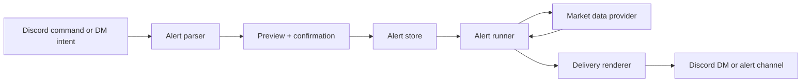

# Gesahni Discord V2 Alerts Plan

Date: 2026-05-06

## Goal

Build Gesahni into a useful Discord stock-room assistant for the STREEET server.

V2 should make alerts first-class. The bot should support shared group alerts in a dedicated Discord channel, private user alerts in DM, fast command-shaped market lookups, option-contract analysis, screenshot understanding, and chart/image replies.

The most important product rule is:

```text
Fast facts should be deterministic. Reasoning should be reserved for interpretation.
```

## Current basis

V1 already defines the right split:

- Fast command path for quote, contract, chain, earnings, and briefing-style lookups.
- Full Gesahni agent fallback for conversational reasoning, screenshots, and nuanced explanation.
- Public Discord must not expose internal OpenClaw runtime commands or private user state.

V2 extends that shape with alert ownership, scheduled/background checks, dedicated alert-channel delivery, chart media, and stronger Discord UX.

## Locked decisions for first implementation

- Alert channel name: `#stock-alerts`.
- Group alert creation: anyone who can access the approved stock-room channel can create group alerts for now.
- Future permission path: keep a config switch so group alert creation can later become admin-only or role-gated without rewriting the command flow.
- Alert creation UX: every alert uses preview-confirm before it is saved, including slash commands and natural-language requests.
- Market-hours policy: regular market hours only for V2. Extended-hours alerts are deferred.
- Alert check cadence: check active alerts every 30 seconds during regular market hours.
- Alert spam control: triggered alerts must use cooldown and state-change dedupe so a price bouncing around a threshold does not flood the channel.
- Private alerts: DM-only for list, edit, delete, and delivery unless the user explicitly creates a group alert.
- Chart output: generate charts from market data first. Do not use AI-generated decorative images for financial charts.
- Input style: support both slash commands and natural language.

## Product surfaces

### 1. Shared alert channel

Create a dedicated Discord channel named `#stock-alerts`.

This channel is for group-visible alerts only. It should be readable by the trusted stock-room audience and writable by Gesahni. Humans may create shared alerts from a command in an approved public channel or directly inside the alert channel.

For V2, group alert creation is intentionally open to anyone in the approved stock-room audience because the server is small and the goal is to make the feature useful quickly. The implementation should still keep the authorization boundary explicit so the same flow can later be changed to owner-only, admin-only, or role-gated.

Examples:

```text
/alert group AAPL above 210
/alert group MU 647.5C 2026-05-08 above 31.00
/alert group SPY move 1.5% today
/alert group TSLA volume spike
alert pr when AAPL gets over 210
watch MU 647.5C 5/8 above 31 for the group
```

All alert creation should return a preview and require confirmation before saving.

Delivery examples:

```text
MU 647.5C 05/08 hit 31.20.
Entry reference: 19.50.
Move since reference: +60.0%.
Underlying: 678.10.
Source: Alpaca. Checked 10:42 AM ET.
```

```text
AAPL crossed 210.00.
Last: 210.18. Today: +1.4%.
Alert set by pcmod77. Source: Alpaca. Checked 11:06 AM ET.
```

### 2. Private DM alerts

Private alerts are created, listed, edited, and deleted in DM only.

Public channels may start the flow, but private state must not be listed publicly.

Public example:

```text
pcmod77: @gesahni remind me if MU breaks 680
gesahni: I can set that as a private alert. DM me "confirm MU above 680" and I will save it.
```

DM example:

```text
pcmod77: alert me if MU breaks 680
gesahni: Preview: MU above 680.00, deliver here, active during regular market hours. Reply "confirm" to save.
```

Private alert delivery should go to the user's DM unless the user explicitly chooses a shared delivery channel.

### 3. Fast command surface

These commands should be deterministic and should not start a full agent session:

- `/quote SYMBOL`
- `/contract SYMBOL STRIKE_TYPE EXPIRY`
- `/chart SYMBOL`
- `/chain SYMBOL EXPIRY`
- `/alert group ...`
- `/alert me ...`
- `/alerts group`
- `/alerts me`
- `/alert delete ALERT_ID`
- `/status`

Implementation note: the first plugin slice uses `/stockstatus` instead of `/status` because `/status` is already a broad OpenClaw command.

Slash commands and natural-language commands should share the same parser and preview-confirm path. Slash commands are for speed and discoverability. Natural language is for stock-room usage where people will say things like "alert pr when AAPL breaks 210" or "watch MU over 680".

The command parser should accept common stock-room shorthand:

- `MU 647.5C 5/8`
- `MU 647.50 call exp 5/8`
- `1 MU 647.5C 5/8 @ 19.50`
- `AAPL over 210`
- `SPY under 520`
- `alert pr when AAPL gets over 210`
- `watch MU if it breaks 680`
- `set group alert for TSLA under 250`

### 4. Reasoning fallback

Use the full Gesahni agent for:

- "What do you think of this?"
- "Is this contract cooked?"
- "What did I leave on the table?"
- "Explain this screenshot."
- "Why is this moving?"
- "Should I watch this into close?"

The agent must fetch live market data when the answer depends on current price, chain, IV, volume, or news. It must not invent live data.

### 5. Chart and image replies

Start with data-driven chart images, not decorative image generation.

Supported V2 chart images:

- Intraday price chart.
- Option contract value chart when historical data is available.
- Option payoff and breakeven chart.
- Watchlist heatmap for shared group watchlists.
- Alert trigger context chart showing where price is relative to the trigger.

AI image generation can be enabled later for nicer visual summaries, but financial charts must be generated from data first.

## Alert model

Each alert should have an explicit owner, scope, condition, delivery target, and provenance.

```json
{
  "id": "alrt_...",
  "scope": "group",
  "owner": {
    "channel": "discord",
    "discordUserId": "1309247958029701190"
  },
  "audience": {
    "kind": "discord_channel",
    "guildId": "1498005947078152274",
    "channelId": "1500000000000000000"
  },
  "instrument": {
    "kind": "option_contract",
    "symbol": "MU",
    "expiry": "2026-05-08",
    "strike": 647.5,
    "right": "call"
  },
  "condition": {
    "metric": "mark",
    "operator": ">=",
    "value": 31.0
  },
  "reference": {
    "basis": "entry_price",
    "value": 19.5,
    "contracts": 1
  },
  "delivery": {
    "channel": "discord",
    "target": "channel:1500000000000000000"
  },
  "schedule": {
    "marketHours": "regular",
    "pollSeconds": 30,
    "cooldownSeconds": 300,
    "dedupe": "state_change"
  },
  "status": "active",
  "createdAt": "2026-05-06T00:00:00Z",
  "createdFrom": {
    "guildId": "1498005947078152274",
    "channelId": "1498120236770267187",
    "messageId": "..."
  }
}
```

### Scope rules

| Scope     | Created from                                       | Listed from                       | Delivered to         | State visibility         |
| --------- | -------------------------------------------------- | --------------------------------- | -------------------- | ------------------------ |
| `group`   | trusted public channel, alert channel, or owner DM | public alert channel and owner DM | shared alert channel | visible to trusted group |
| `private` | DM or public-to-DM confirmation                    | DM only                           | user DM              | visible only to owner    |
| `admin`   | owner DM only                                      | owner DM only                     | configured target    | owner only               |

### Confirmation rules

Every new alert must go through preview-confirm before it becomes active.

The preview must include:

- Scope: group or private.
- Instrument: ticker or option contract.
- Condition: metric, operator, and trigger value.
- Delivery target: `#stock-alerts` or the user's DM.
- Market-hours policy: regular market hours.
- Cooldown behavior.
- Source limitations if option data is estimated or provider-backed data is unavailable.

The saved alert should preserve the original request text and the parsed normalized form so bad parses can be debugged later.

Initial implementation status: preview-confirm, active alert storage, alert delete, regular-hours polling, cooldown/state-change dedupe, `#stock-alerts` Discord text delivery, `/quote`, `/contract`, `/chart`, `/alert`, `/alerts`, and `/stockstatus` are implemented. `/chart` writes a data-driven SVG chart artifact from market bars and returns it as media. `/contract` also handles quantity/entry/sold references, underlying context, intrinsic value, estimated time value, breakeven, current value, and intrinsic-only fallback labels. Gesahni registers screenshot-analysis prompt guidance, and Discord already passes replied-image media into agent context. `alerts.groupCreation` keeps the future owner-gated path available. Edit flows, option-specific chart images, chain lookups, and deeper structured screenshot extraction remain follow-up work.

### Required alert types

V2 should support:

- Equity price crosses above or below a level.
- Equity percent move from previous close or from a saved reference.
- Option contract mark/bid/ask crosses above or below a level.
- Option contract percent gain/loss from a saved reference.
- Underlying reaches option breakeven.
- Time-based reminders before market close or expiration.

V2 should defer:

- Complex multi-leg option alerts.
- Broker-account position sync.
- Auto-trading.
- Predictive "buy/sell now" decisions.

## Scheduler design

Use a lightweight deterministic alert checker, not a full model job, for high-frequency checks.

OpenClaw cron is useful for scheduled and recurring agent work, but market alerts need a lower-latency polling loop or dedicated alert runner:

- Cron: good for daily briefings, expiration reminders, premarket/postmarket summaries.
- Alert runner: better for price/contract threshold checks every 30 seconds during regular market hours.

Recommended design:



The alert runner should:

- Batch symbols and contracts to reduce provider calls.
- Deduplicate triggered alerts.
- Check active alerts every 30 seconds during regular market hours.
- Skip normal threshold checks outside regular market hours.
- Back off on provider errors.
- Record last checked time, last value, and last trigger time.
- Track previous trigger state so threshold bounce does not spam messages.
- Enforce a default 5-minute cooldown after a trigger.
- Mark one-shot alerts as fired or recurring alerts as still active.

### Cooldown and repeat behavior

V2 should be smart enough to avoid noisy back-and-forth alerts.

Default behavior:

- A crossing alert fires when the value first crosses the threshold.
- The alert does not fire again while it remains on the triggered side.
- If the value resets back across the threshold, the alert can become eligible again.
- Even after reset, a 5-minute cooldown prevents immediate repeated posts.
- One-shot alerts can mark themselves fired after the first delivery.
- Recurring alerts stay active but must respect state-change dedupe and cooldown.

## Market data requirements

The alert system needs provider-health awareness.

For every provider-backed result, responses should include:

- Data source.
- Timestamp.
- Whether value is live, delayed, estimated, or unavailable.
- Fallback behavior when quote, chain, or contract lookup fails.

If contract quote data is unavailable, Gesahni may compute intrinsic value from the underlying price and strike, but the response must label that as an estimate.

## Contracts and options workflow

Option-contract support is core to V2.

The parser should normalize:

- `MU 647.5C 5/8`
- `MU 647.50 call expiring 5/8`
- `1 MU $647.50 call expiring 5/8 for $19.50`
- `sold 1 MU 647.5C 5/8 for 19.50`

For contract answers, Gesahni should calculate when data is present:

- Current underlying price.
- Strike distance.
- Intrinsic value.
- Estimated time value.
- Breakeven.
- Contract mark or bid/ask.
- Entry value times 100.
- Current value times 100.
- Gain/loss versus reference.
- Missed upside if the user already closed.

Public responses should be concise and useful. DM responses can be richer and can offer to save the contract as a private alert or watched play.

## Screenshot and replied-image behavior

V2 should treat images as first-class inputs.

Supported image cases:

- User uploads a screenshot directly.
- User replies to another user's image and asks Gesahni what it thinks.
- User posts a Robinhood/options screenshot with minimal text.
- User posts a chart screenshot and asks for a read.

The reply should distinguish:

- What was read from the image.
- What was fetched from live market data.
- What is inferred.
- What is missing.

For option screenshots, the assistant should prefer a structured extraction:

```json
{
  "symbol": "MU",
  "expiry": "2026-05-08",
  "strike": 647.5,
  "right": "call",
  "quantity": 1,
  "entryPrice": 19.5,
  "visibleMark": 31.2,
  "visiblePnl": null
}
```

## Discord UX rules

### Reactions

Use lightweight reactions for state:

- Processing: `👀` or configured `ackReaction`.
- Alert saved: `✅`.
- Private-only redirect: `🔒`.
- Provider/data issue: `⚠️`.
- Chart attached: `📈`.

Do not overuse emojis inside financial answers. Reactions are better than cluttering every response.

Agent replies should have a little stock-room personality without losing trust. Gesahni should sound relaxed, sharp, and lightly fun; lead with the read, keep the math visible, and use reactions for state instead of filling every message with emoji. Public channels still keep private watch-list details out of the room.

### Threads

Use threads for deep analysis:

- Public command answer stays short.
- Deep analysis can offer or create a thread.
- Alert triggers should not create a new thread by default.

### Response length

Public channel:

- Short.
- No private state.
- One useful next step.

DM:

- More personal.
- Can list private alerts/watchlist.
- Can preview-confirm writes.

Alert channel:

- Compact.
- Data-first.
- No long reasoning unless explicitly requested.

## Privacy and permission rules

### Public channels

Allowed:

- Discuss a ticker or contract.
- Create group alerts from approved stock-room channels.
- Start a private alert flow that moves to DM.
- Show shared group alerts.

Blocked:

- Listing private alerts.
- Listing private watchlists.
- Showing private positions.
- Mutating private user state without DM confirmation.

### DMs

Allowed:

- List private alerts.
- Create private alerts after preview-confirm.
- Delete private alerts.
- Save plays/watchlist items after preview-confirm.
- Show richer personalized context.

Blocked:

- Unauthorized users outside the configured access group.
- Silent writes without confirmation.
- Sharing another user's private alerts.

## Command examples

### Group alert

```text
/alert group AAPL above 210
```

Response:

```text
Group alert preview: AAPL above 210.00.
Scope: group.
Delivery: #stock-alerts.
Hours: regular market hours.
Cooldown: 5 minutes after trigger.
Reply confirm to save.
```

### Natural-language group alert

```text
alert pr when AAPL gets over 210
```

Response:

```text
I read that as a group alert:
AAPL above 210.00.
Delivery: #stock-alerts.
Hours: regular market hours.
Reply confirm to save.
```

### Private alert from public channel

```text
@gesahni alert me if MU hits 680
```

Response:

```text
I can save that privately. DM me and I will show the alert preview before saving it.
```

### Option contract alert

```text
/alert group MU 647.5C 2026-05-08 above 31.00
```

Response:

```text
Group alert preview: MU 647.5C 05/08 mark above 31.00.
Reference: no entry price attached.
Delivery: #stock-alerts.
Hours: regular market hours.
Cooldown: 5 minutes after trigger.
Reply confirm to save.
```

### Trade recap plus alert offer

```text
I sold 1 MU 647.5C 5/8 for 19.50. If I still held it what would it be?
```

Response shape:

```text
Assuming that was sold-to-close, you collected about $1,950.

MU is around ___ now. The 647.5C has about ___ intrinsic value, so the contract is at least about $___ before time value. If the live mark is ___, one contract is worth about $___.

That means the extra upside versus 19.50 is about $___.

Want me to watch this contract into close or alert if MU hits the next level?
```

## Implementation phases

### Phase 1: Product command fence

Goal: expose only Gesahni market commands, not generic OpenClaw runtime commands.

Deliverables:

- Decide OpenClaw-native command path versus thin Discord adapter.
- Product command registry for Gesahni commands.
- Public Discord command allowlist.
- Tests that internal commands are blocked or owner-only.

Proof:

- `/quote AAPL` works in Discord.
- `/model`, `/tools`, `/config`, `/debug`, `/plugins`, and `/exec` are unavailable or owner-only in public Discord.

### Phase 2: Fast quote and contract commands

Goal: prove deterministic market lookups under the latency target.

Deliverables:

- `/quote SYMBOL`.
- `/contract SYMBOL STRIKE_TYPE EXPIRY`.
- Parser for common option shorthand.
- Timing logs.
- Provider-health result labels.

Proof:

- No model call for command-shaped quote/contract lookups.
- No full agent session for fast commands.
- Warm response under 4 seconds.

### Phase 3: Alert storage and DM confirmation

Goal: create private and group alerts safely.

Deliverables:

- Alert schema.
- Alert store.
- Preview-confirm flow.
- `group` and `private` scopes.
- DM-only private list/delete.
- Shared `#stock-alerts` group delivery target.
- Natural-language alert parsing.

Proof:

- Public channel cannot list private alerts.
- DM can list private alerts for the authorized owner.
- Group alert can be previewed and confirmed by anyone in the approved stock-room audience.

### Phase 4: Alert runner and Discord delivery

Goal: alerts fire reliably into the right target.

Deliverables:

- Alert polling runner.
- Provider batching.
- Trigger dedupe.
- 30-second regular-hours polling.
- 5-minute default cooldown.
- State-change trigger logic.
- Alert channel delivery.
- DM delivery.
- Failure/backoff state.

Proof:

- Simulated quote crossing fires one alert.
- Repeated checks do not spam duplicate alerts.
- Provider failure sends no fake alert and records degraded state.

### Phase 5: Chart media

Goal: attach useful visual charts to answers and alerts.

Deliverables:

- Data-driven PNG chart renderer.
- Intraday price chart.
- Option payoff/breakeven chart.
- Chart attachment delivery to Discord.

Proof:

- `/chart AAPL` or equivalent produces a non-empty image attachment.
- Option breakeven chart uses the parsed contract and premium.
- Chart source/timestamp is included in caption.

### Phase 6: Screenshot analysis

Goal: make "what do you think of this screenshot?" useful.

Deliverables:

- Structured screenshot extraction prompt/path.
- Referenced-message image support.
- Contract extraction from screenshot.
- Live data merge.

Proof:

- Direct screenshot works.
- Reply-to-image screenshot works.
- Response separates screenshot facts from live fetched facts.

### Phase 7: Polish and evaluation

Goal: keep quality from regressing.

Deliverables:

- Scenario tests for public channel, DM, alert channel, screenshots, and provider failure.
- Response-shape snapshots for important stock-room flows.
- Operator dashboard or status command showing provider health and last alert checks.

Proof:

- Canned Discord scenarios pass.
- Latency logs show fast commands remain fast.
- Alert runner state is inspectable.

## Test matrix

| Area               | Test                                                     |
| ------------------ | -------------------------------------------------------- |
| Fast commands      | `/quote AAPL` does not call model                        |
| Command fence      | Public `/config` and `/tools` are blocked                |
| Private alerts     | Public channel cannot list private alerts                |
| Group alerts       | Approved stock-room user can preview-confirm group alert |
| Unauthorized users | Unauthorized DM gets access denied                       |
| Alert runner       | Threshold crossing fires once and respects cooldown      |
| Provider errors    | Failed quote does not fake result                        |
| Contracts          | `MU 647.5C 5/8` parses correctly                         |
| Natural language   | `alert pr when AAPL gets over 210` previews correctly    |
| Screenshots        | Direct image and reply-to-image both reach vision path   |
| Charts             | Chart renderer produces valid PNG attachment             |
| Discord delivery   | Alert channel and DM targets route correctly             |

## Open decisions

1. Exact numeric Discord channel id for `#stock-alerts`.
2. Whether shared group alerts can be deleted by creator only, owner only, or any trusted group member.
3. Whether recurring alerts default to recurring or one-shot for each alert type.
4. Whether option-contract checks should stay at 30 seconds too, or use a slower cadence later if provider limits require it.

## Recommended defaults

- Group alerts are visible in `#stock-alerts`.
- Private alerts are DM-only.
- Anyone in the approved stock-room audience can create group alerts for now.
- Only the creator or owner can delete an alert.
- Regular-hours checks only.
- Poll every 30 seconds during regular market hours.
- Use a 5-minute default cooldown after each trigger.
- Require preview-confirm before saving every alert.
- Use data-driven chart rendering before AI image generation.
- Use emojis as reactions, not as heavy in-message decoration.

## Parking lot

- Broker position sync.
- Multi-leg option strategy alerts.
- Public leaderboard or social stats.
- Auto-generated daily briefings.
- Voice alerts.
- Auto-trading or order placement.
- Public model/provider/status disclosure.
