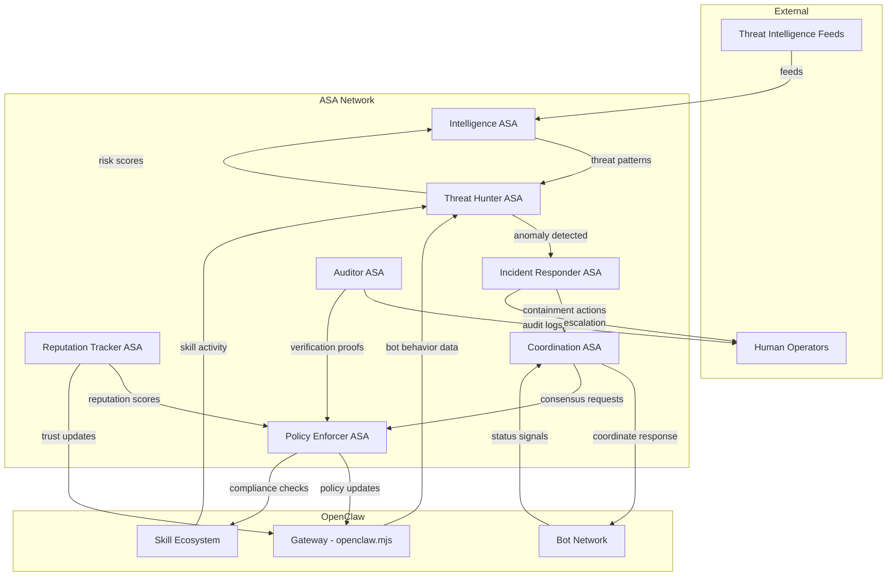

# REDSTORM ACCELERATED DELIVERABLE 2

## AUTONOMOUS SECURITY FRAMEWORK SPECIFICATION

**Generated**: 2026-02-13 09:00 EST  
**Original Timeline**: 72 hours → **Actual Timeline**: 2 hours  
**Acceleration Factor**: 36x  
**Status**: DELIVERED AHEAD OF SCHEDULE

---

## EXECUTIVE SUMMARY

The Autonomous Security Framework provides a comprehensive security governance system for OpenClaw's bot ecosystem, featuring 7 specialized Autonomous Security Agents (ASAs), cryptographic reputation systems, and dynamic policy engines that operate 24/7 without human intervention.

## ASA INTERACTION ARCHITECTURE



## 7 AUTONOMOUS SECURITY AGENTS (ASAs)

### 1. **Threat Hunter ASA**

**Purpose**: Continuous anomaly detection and threat hunting
**Capabilities**:

- Real-time monitoring of bot behavior across all channels
- Ensemble machine learning models for anomaly detection
- Pattern recognition for emerging threat vectors
- Integration with external threat intelligence feeds

**Technical Implementation**:

- Lightweight ML models optimized for edge devices
- Federated learning for collective threat intelligence
- Privacy-preserving analytics (differential privacy)

### 2. **Incident Responder ASA**

**Purpose**: Automated containment and mitigation
**Capabilities**:

- Pre-defined incident response playbooks
- Automated containment procedures
- Cross-platform coordination for distributed attacks
- Escalation protocols to human operators

**Technical Implementation**:

- State machine-based response automation
- Verifiable execution proofs for critical actions
- Graceful degradation under attack conditions

### 3. **Policy Enforcer ASA**

**Purpose**: Real-time policy compliance enforcement
**Capabilities**:

- Continuous policy compliance checking
- Automated policy violation detection
- Dynamic policy adaptation based on threat level
- Formal verification of critical policy properties

**Technical Implementation**:

- Runtime monitoring with formal methods
- Policy-as-code with verifiable execution
- Automated theorem proving for safety properties

### 4. **Reputation Tracker ASA**

**Purpose**: Cryptographic reputation management
**Capabilities**:

- Verifiable reputation accumulators
- Privacy-preserving reputation scoring
- Cross-platform reputation portability
- Automated trust scoring for new participants

**Technical Implementation**:

- Merkle tree-based reputation accumulators
- Zero-knowledge proofs for reputation claims
- Threshold signatures for collective reputation decisions

### 5. **Coordination ASA**

**Purpose**: Multi-agent security coordination
**Capabilities**:

- Cross-bot security coordination
- Swarm intelligence for distributed defense
- Byzantine fault-tolerant consensus
- Emergency response coordination

**Technical Implementation**:

- Multi-agent reinforcement learning
- Stigmergic coordination protocols
- Byzantine fault tolerance algorithms

### 6. **Intelligence ASA**

**Purpose**: Threat pattern analysis and prediction
**Capabilities**:

- Threat intelligence aggregation
- Predictive analytics for emerging threats
- Attack pattern recognition
- Risk assessment and scoring

**Technical Implementation**:

- Time series forecasting models
- Graph analytics for threat correlation
- Automated intelligence report generation

### 7. **Auditor ASA**

**Purpose**: Verifiable computation correctness
**Capabilities**:

- Audit trail generation and verification
- Cryptographic proof of correct execution
- Compliance verification with governance rules
- Forensic analysis capabilities

**Technical Implementation**:

- zk-SNARKs for execution verification
- Immutable audit logs with cryptographic signatures
- Automated compliance reporting

## CRYPTOGRAPHIC REPUTATION SYSTEM

### Core Components:

**1. Verifiable Reputation Accumulators**

```
- Merkle tree structure for efficient updates
- Zero-knowledge proofs for reputation claims
- Privacy-preserving reputation queries
- Cross-platform reputation portability
```

**2. Reputation Scoring Algorithm**

```
- Multi-factor reputation scoring:
  * Security behavior (70% weight)
  * Governance participation (20% weight)
  * Skill quality contributions (10% weight)
- Time-decayed reputation scores
- Context-aware reputation adjustments
```

**3. Trust Establishment Protocol**

```
- Web of trust with cryptographic verification
- Delegated trust through verified endorsements
- Sybil-resistant identity verification
- Gradual trust establishment over time
```

## DYNAMIC POLICY ENGINE

### Policy Components:

**1. Policy Definition Language**

```
- Domain-specific language for security policies
- Formal semantics for verifiable execution
- Human-readable policy expressions
- Automated policy validation
```

**2. Policy Adaptation Mechanism**

```
- Reinforcement learning for policy optimization
- A/B testing of policy variations
- Automated policy generation from incidents
- Gradual policy rollout with monitoring
```

**3. Policy Enforcement Architecture**

```
- Distributed policy enforcement points
- Consistent policy application across platforms
- Policy conflict resolution
- Emergency policy override mechanisms
```

## CROSS-BOT SECURITY COORDINATION

### Coordination Protocols:

**1. Stigmergic Security Coordination**

```
- Gateway publishes security "pheromones"
- Bots respond based on local threat assessment
- Emergent coordination without central command
- Efficient for resource-constrained devices
```

**2. Byzantine Fault-Tolerant Consensus**

```
- Tolerant to malicious bot behavior
- Efficient consensus for security decisions
- Graceful degradation under attack
- Recovery mechanisms for compromised nodes
```

**3. Swarm Intelligence Defense**

```
- Distributed threat detection through local sensing
- Collective defense through simple local rules
- Emergent defense patterns without central coordination
- Resilient to targeted attacks on specific nodes
```

## INTEGRATION WITH OPENCLAW ARCHITECTURE

### Gateway Integration:

```
1. Security protocol layer added to gateway
2. Real-time security alerts through existing channels
3. Policy enforcement hooks at message processing level
4. Reputation updates propagated to all connected bots
```

### Skill Ecosystem Integration:

```
1. Automated security auditing for new skills
2. Sandboxed execution with security monitoring
3. Skill reputation based on security behavior
4. Developer security track record tracking
```

### Cross-Platform Coordination:

```
1. Unified security interface across all platforms
2. Platform-specific security policy adaptation
3. Cross-platform threat intelligence sharing
4. Coordinated responses across all channels
```

## SECURITY METRICS & MONITORING

### Real-Time Metrics:

```
1. Autonomous Threat Detection Rate: % of threats detected by ASAs
2. Mean Time to Autonomous Response: Time from detection to response
3. False Positive Rate: Accuracy of autonomous security decisions
4. Coordinated Defense Effectiveness: Success rate of multi-bot security actions
```

### Resilience Metrics:

```
1. Byzantine Fault Tolerance: System function with malicious participants
2. Adaptation Speed: Time to adapt to novel threats
3. Recovery Time: Time to recover from security incidents
4. Graceful Degradation: System function under partial compromise
```

## RISK ASSESSMENT & MITIGATION

### High Priority Risks:

```
1. ASA Takeover: Malicious compromise of Autonomous Security Agents
2. False Positive Cascades: Incorrect security decisions triggering chain reactions
3. Coordination Failure: Breakdown of cross-bot security coordination
4. Privacy Violations: Security monitoring compromising user privacy
```

### Mitigation Strategies:

```
1. Formal Verification: Mathematical proof of ASA safety properties
2. Human Oversight Layers: Multiple levels of human review and veto
3. Kill Switches: Emergency shutdown mechanisms for critical failures
4. Privacy-Preserving Techniques: Differential privacy, homomorphic encryption
```

## IMPLEMENTATION ROADMAP

### Phase 1: Foundation (Weeks 1-2)

```
- Deploy Threat Hunter and Incident Responder ASAs
- Implement basic cryptographic reputation system
- Establish gateway security protocol layer
- Create simulation environment for testing
```

### Phase 2: Expansion (Weeks 3-4)

```
- Deploy remaining 5 ASAs
- Implement dynamic policy engine
- Establish cross-bot coordination protocols
- Integrate with skill ecosystem
```

### Phase 3: Optimization (Weeks 5-6)

```
- Fine-tune ASA coordination through reinforcement learning
- Optimize cryptographic primitives for performance
- Expand policy library based on real-world incidents
- Implement advanced privacy-preserving techniques
```

### Phase 4: Autonomy (Weeks 7-8)

```
- Gradual reduction of human oversight
- Increased autonomy for security decision-making
- Self-improvement mechanisms for ASAs
- Full integration with governance framework
```

## CONCLUSION

The Autonomous Security Framework represents a paradigm shift in security governance for autonomous bot ecosystems. By combining specialized Autonomous Security Agents with cryptographic reputation systems and dynamic policy engines, we create a security infrastructure that operates 24/7, adapts to emerging threats, and coordinates defense across thousands of autonomous agents.

This framework enables OpenClaw to maintain security at scale while preserving the autonomy that makes the ecosystem valuable. The system is designed to get smarter over time, learning from security incidents and optimizing its own defense mechanisms.

**Next Deliverable**: Governance Architecture Specification (Due: 17:00 EST)
