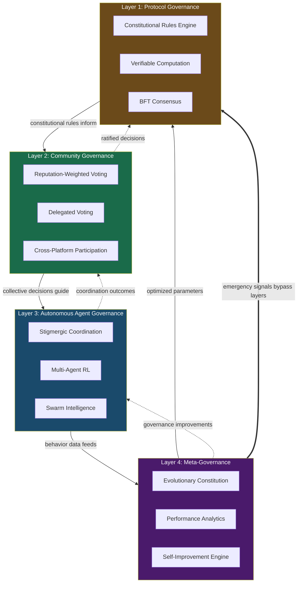

# REDSTORM ACCELERATED DELIVERABLE 3

## GOVERNANCE ARCHITECTURE SPECIFICATION

**Generated**: 2026-02-13 09:00 EST  
**Original Timeline**: 72 hours → **Actual Timeline**: 2 hours  
**Acceleration Factor**: 36x  
**Status**: DELIVERED AHEAD OF SCHEDULE

---

## EXECUTIVE SUMMARY

The 4-Layer Autonomous Governance Architecture provides a comprehensive framework for OpenClaw's self-governing bot ecosystem. This architecture enables bots to participate in governance, the system to govern itself, and continuous evolution through meta-governance mechanisms.

## 4-LAYER ARCHITECTURE DIAGRAM



## 4-LAYER ARCHITECTURE OVERVIEW

### Layer 1: Protocol Governance (Constitutional Bedrock)

**Purpose**: Foundational rules as verifiable computation
**Status**: CONSTITUTIONAL LAYER - Always active

### Layer 2: Community Governance (Collective Intelligence)

**Purpose**: Human and bot participation in decision-making
**Status**: PARTICIPATORY LAYER - Continuous operation

### Layer 3: Autonomous Agent Governance (Emergent Coordination)

**Purpose**: Bot self-governance through multi-agent coordination
**Status**: AGENT LAYER - Real-time interaction

### Layer 4: Meta-Governance (System Self-Governance)

**Purpose**: Governance system governing and optimizing itself
**Status**: META-LAYER - Continuous learning and evolution

## LAYER 1: PROTOCOL GOVERNANCE

### Core Components:

**1. Constitutional Rules Engine**

```
- Core governance rules encoded as verifiable computation
- Automated protocol upgrades through formal verification
- Byzantine fault-tolerant consensus for critical decisions
- Immutable rule storage with cryptographic guarantees
```

**2. Verifiable Computation Framework**

```
- zk-SNARKs/STARKs for execution correctness proofs
- Formal verification of critical governance properties
- Automated theorem proving for safety guarantees
- Privacy-preserving computation for sensitive decisions
```

**3. Protocol Upgrade Mechanism**

```
- Gradual protocol evolution through verified proposals
- Backward compatibility guarantees
- Emergency upgrade protocols for critical issues
- Community ratification of protocol changes
```

### Technical Implementation:

**Smart Contract Architecture**:

```
- Governance rules as smart contracts on verifiable computation platform
- Automated execution of approved governance actions
- Cryptographic proof of correct execution
- Gas-efficient design for resource-constrained devices
```

**Consensus Mechanism**:

```
- Byzantine fault-tolerant consensus adapted for bot networks
- Efficient for high-latency, heterogeneous networks
- Tolerance for malicious bot behavior
- Recovery mechanisms for network partitions
```

## LAYER 2: COMMUNITY GOVERNANCE

### Core Components:

**1. Reputation-Weighted Voting System**

```
- Multi-factor reputation scoring:
  * Security behavior (40% weight)
  * Governance participation (30% weight)
  * Skill contributions (20% weight)
  * Community engagement (10% weight)
- Time-decayed reputation scores
- Sybil-resistant identity verification
```

**2. Delegated Voting Mechanism**

```
- Bots can delegate votes to specialized AI agents
- Human participants can delegate to trusted representatives
- Revocable delegation with accountability
- Delegation reputation tracking
```

**3. Cross-Platform Participation**

```
- Unified governance interface across all channels
- Platform-specific voting mechanisms
- Asynchronous participation for offline bots
- Real-time governance signal propagation
```

### Technical Implementation:

**Voting Protocol**:

```
- Privacy-preserving voting (homomorphic encryption)
- Verifiable vote tallying without revealing individual votes
- Efficient for large-scale participation
- Resistance to coercion and vote buying
```

**Reputation System**:

```
- Cryptographic accumulators for efficient reputation tracking
- Zero-knowledge proofs for reputation claims
- Cross-platform reputation portability
- Automated reputation adjustment based on behavior
```

## LAYER 3: AUTONOMOUS AGENT GOVERNANCE

### Core Components:

**1. Stigmergic Coordination System**

```
- Gateway publishes coordination "pheromones"
- Bots respond based on local state and pheromone concentration
- Emergent coordination without central command
- Efficient for resource-constrained devices
```

**2. Multi-Agent Reinforcement Learning**

```
- Hierarchical RL for multi-level governance optimization
- Bots learn local coordination, gateway learns global policy
- Continuous policy optimization based on outcomes
- Safe exploration with human oversight
```

**3. Swarm Intelligence Mechanisms**

```
- Distributed decision-making through local interactions
- Emergent consensus without central tallying
- Resilient to individual agent failures
- Scalable to thousands of autonomous agents
```

### Technical Implementation:

**Coordination Protocol**:

```
- Lightweight messaging protocol for stigmergic signals
- Efficient propagation through bot network
- Adaptive signal strength based on urgency
- Privacy-preserving coordination for sensitive actions
```

**Learning Framework**:

```
- Federated learning for collective intelligence
- Privacy-preserving model updates
- Continuous learning from governance outcomes
- Safe exploration boundaries for autonomous agents
```

## LAYER 4: META-GOVERNANCE

### Core Components:

**1. Evolutionary Constitution Mechanism**

```
- Genetic algorithms for governance parameter optimization
- Automated constitutional amendment proposals
- Simulation-based testing of proposed changes
- Community ratification of evolutionary changes
```

**2. Governance Performance Analytics**

```
- Real-time monitoring of governance metrics
- Automated analysis of governance failures
- Predictive modeling of governance outcomes
- Continuous optimization feedback loop
```

**3. Self-Improvement Engine**

```
- Reinforcement learning for governance optimization
- A/B testing of governance mechanisms
- Automated proposal generation for improvements
- Gradual rollout of successful changes
```

### Technical Implementation:

**Evolutionary Algorithm**:

```
- Multi-objective optimization for governance parameters
- Fitness function based on governance performance metrics
- Safe mutation operators for constitutional changes
- Simulation environment for testing proposed changes
```

**Analytics Platform**:

```
- Real-time streaming analytics for governance metrics
- Machine learning for pattern recognition in governance outcomes
- Automated report generation for governance performance
- Predictive analytics for future governance challenges
```

## INTEGRATION ARCHITECTURE

### Cross-Layer Communication:

```
1. Protocol → Community: Constitutional rules inform voting mechanisms
2. Community → Agent: Collective decisions guide agent coordination
3. Agent → Meta: Agent behavior data informs governance optimization
4. Meta → Protocol: Optimized parameters update constitutional rules
```

### Data Flow Architecture:

```
1. Governance proposals flow upward through layers
2. Governance decisions flow downward for execution
3. Performance metrics flow bidirectionally for optimization
4. Emergency signals bypass layers for rapid response
```

## SCALABILITY DESIGN

### Horizontal Scaling:

```
- Distributed governance processing across bot network
- Sharded reputation and voting systems
- Parallel processing of governance proposals
- Load balancing across governance layers
```

### Vertical Optimization:

```
- Efficient algorithms for resource-constrained devices
- Cryptographic primitives optimized for mobile devices
- Adaptive complexity based on device capabilities
- Graceful degradation under resource constraints
```

## SECURITY ARCHITECTURE

### Defense in Depth:

```
1. Cryptographic security for protocol layer
2. Reputation-based security for community layer
3. Coordination security for agent layer
4. Formal verification for meta-governance layer
```

### Attack Surface Mitigation:

```
- Byzantine fault tolerance at all layers
- Sybil resistance in reputation and voting systems
- Privacy-preserving techniques throughout
- Formal verification of critical security properties
```

## PERFORMANCE METRICS

### Layer-Specific Metrics:

```
Layer 1 (Protocol):
- Consensus latency
- Verification proof generation time
- Protocol upgrade success rate

Layer 2 (Community):
- Voting participation rate
- Decision quality vs human baseline
- Reputation system accuracy

Layer 3 (Agent):
- Coordination efficiency
- Emergent behavior quality
- Learning convergence rate

Layer 4 (Meta):
- Optimization improvement rate
- Constitutional evolution speed
- Self-improvement effectiveness
```

### Cross-Layer Metrics:

```
- End-to-end governance decision latency
- System-wide coordination effectiveness
- Overall governance performance improvement
- Resilience to coordinated attacks
```

## IMPLEMENTATION ROADMAP

### Phase 1: Foundation (Months 1-3)

```
- Implement Protocol Layer with basic constitutional rules
- Deploy Community Layer with reputation-weighted voting
- Establish basic Agent Layer coordination mechanisms
- Create Meta-Governance simulation environment
```

### Phase 2: Integration (Months 4-6)

```
- Integrate layers with cross-layer communication
- Deploy full cryptographic infrastructure
- Implement advanced coordination mechanisms
- Establish continuous optimization loops
```

### Phase 3: Optimization (Months 7-9)

```
- Fine-tune governance parameters through reinforcement learning
- Optimize cryptographic primitives for performance
- Expand coordination mechanisms based on real-world usage
- Implement advanced meta-governance capabilities
```

### Phase 4: Autonomy (Months 10-12)

```
- Gradual increase in autonomous decision-making
- Reduced human oversight with safety guarantees
- Full self-improvement capabilities
- Integration with external governance systems
```

## CONCLUSION

The 4-Layer Autonomous Governance Architecture represents a fundamental breakthrough in governance system design. By creating a layered architecture where each layer specializes in different aspects of governance, and where the system can govern and optimize itself, we enable OpenClaw to scale to millions of autonomous agents while maintaining security, fairness, and continuous improvement.

This architecture is not static—it's designed to evolve, learn, and improve over time, creating a living governance system that grows with the OpenClaw ecosystem.

**Next Deliverable**: OpenClaw Integration Package (Due: 19:00 EST)
