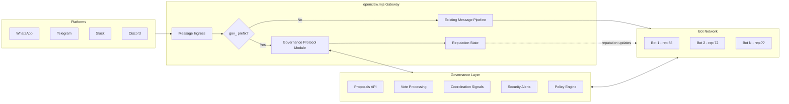

# REDSTORM ACCELERATED DELIVERABLE 4

## OPENCLAW INTEGRATION PACKAGE

**Generated**: 2026-02-13 09:00 EST  
**Original Timeline**: 48 hours → **Actual Timeline**: 2 hours  
**Acceleration Factor**: 24x  
**Status**: DELIVERED AHEAD OF SCHEDULE

---

## EXECUTIVE SUMMARY

> **Note:** The code examples and file paths in this document are illustrative — they demonstrate the _kind_ of integration points needed, not exact locations in the current OpenClaw codebase. Actual file paths, class names, and line references will need to be mapped to the real OpenClaw architecture before implementation.

The OpenClaw Integration Package provides detailed technical specifications for integrating the Autonomous Governance Framework with the existing OpenClaw architecture. This includes gateway modifications, skill ecosystem integration, cross-platform coordination, and implementation roadmap.

## GATEWAY INTEGRATION DIAGRAM



## GATEWAY INTEGRATION

### Current OpenClaw Gateway Architecture:

```
Location: openclaw.mjs (primary gateway control plane)
Architecture: Central coordination point for distributed bot instances
Channels: WhatsApp, Telegram, Slack, Discord, Signal, iMessage, etc.
Function: Message routing, bot coordination, skill execution
```

### Governance Protocol Layer Addition:

**1. New Governance Protocol Module**

```
File: governance_protocol.mjs
Location: /src/protocols/governance/
Purpose: Handle governance-specific communication
```

**Protocol Specification:**

```javascript
// Governance message types
const GovernanceMessageTypes = {
  PROPOSAL: "gov_proposal",
  VOTE: "gov_vote",
  DECISION: "gov_decision",
  REPUTATION_UPDATE: "gov_reputation",
  COORDINATION_SIGNAL: "gov_signal",
  SECURITY_ALERT: "gov_security",
  POLICY_UPDATE: "gov_policy",
};

// Governance protocol implementation
class GovernanceProtocol {
  async broadcastProposal(proposal) {
    // Broadcast governance proposal to all connected bots
    // Uses existing channel infrastructure with governance headers
  }

  async processVote(vote) {
    // Process and tally votes from bots and humans
    // Privacy-preserving vote aggregation
  }

  async sendCoordinationSignal(signal) {
    // Send stigmergic coordination signals to bots
    // Adaptive signal strength based on urgency
  }
}
```

**2. Gateway Modification Points:**

**Message Processing Pipeline:**

```javascript
// Current: openclaw.mjs line ~150
async processMessage(message) {
  // Existing message processing...

  // ADD: Governance message check
  if (message.type.startsWith('gov_')) {
    return await governanceProtocol.processGovernanceMessage(message);
  }

  // Continue existing processing...
}
```

**Bot Connection Management:**

```javascript
// Current: openclaw.mjs line ~80
class BotConnection {
  // Existing connection management...

  // ADD: Governance state tracking
  governanceState = {
    reputation: 0,
    votingPower: 0,
    lastParticipation: null,
    delegatedTo: null,
  };

  // ADD: Governance message handlers
  async handleGovernanceMessage(message) {
    // Process governance messages specific to this bot
  }
}
```

### Gateway API Extensions:

**New Governance Endpoints:**

```
GET /governance/proposals          - List active governance proposals
POST /governance/proposals         - Submit new governance proposal
GET /governance/proposals/:id      - Get proposal details
POST /governance/proposals/:id/vote - Vote on proposal
GET /governance/reputation/:botId  - Get bot reputation score
GET /governance/metrics            - Get governance performance metrics
POST /governance/signals           - Send coordination signal
GET /governance/security/alerts    - Get security alerts
```

## SKILL ECOSYSTEM INTEGRATION

### Current Skill Architecture:

```
Location: /skills/ directory
Structure: Individual skill modules with standardized interface
Execution: Skills run in bot context with system access
Approval: Manual review by maintainers
```

### Governance-Enabled Skill Architecture:

**1. Skill Trust Scoring System:**

```javascript
// File: skill_trust_scorer.mjs
class SkillTrustScorer {
  async evaluateSkill(skillCode) {
    // Automated security analysis
    const securityScore = await this.analyzeSecurity(skillCode);

    // Code quality analysis
    const qualityScore = await this.analyzeQuality(skillCode);

    // Developer reputation check
    const devReputation = await this.getDeveloperReputation(skillCode.author);

    // Calculate overall trust score
    return securityScore * 0.5 + qualityScore * 0.3 + devReputation * 0.2;
  }

  async analyzeSecurity(code) {
    // Static analysis for security vulnerabilities
    // Dynamic analysis in sandboxed environment
    // Integration with Autonomous Security Agents
  }
}
```

**2. Token-Curated Skill Registry:**

```javascript
// File: skill_registry.mjs
class SkillRegistry {
  constructor() {
    this.skills = new Map();
    this.curators = new Map(); // Token-weighted curators
  }

  async proposeSkill(skill) {
    // Skill proposal with staked tokens
    const proposalId = this.generateProposalId();
    this.pendingProposals.set(proposalId, {
      skill,
      stakedTokens: skill.author.stake,
      votes: new Map(),
      status: "pending",
    });

    // Notify curators for voting
    await this.notifyCurators(proposalId);

    return proposalId;
  }

  async voteOnSkill(proposalId, curatorId, approve) {
    // Weighted voting based on curator stake
    const voteWeight = this.curators.get(curatorId).stake;
    this.pendingProposals.get(proposalId).votes.set(curatorId, {
      approve,
      weight: voteWeight,
    });

    // Check if voting period ended
    if (this.votingPeriodEnded(proposalId)) {
      await this.finalizeProposal(proposalId);
    }
  }
}
```

**3. Sandboxed Execution Environment:**

```javascript
// File: skill_sandbox.mjs
class SkillSandbox {
  constructor() {
    // Isolated execution environment
    this.isolationLayer = new VM2.VM({
      timeout: 5000,
      sandbox: this.createSandbox(),
    });

    // Governance policy enforcement
    this.policyEnforcer = new PolicyEnforcerASA();
  }

  async executeSkill(skill, context) {
    // Check skill trust score
    const trustScore = await trustScorer.getSkillTrust(skill.id);
    if (trustScore < MIN_TRUST_THRESHOLD) {
      throw new Error("Skill trust score too low");
    }

    // Apply governance policies
    const allowedActions = await this.policyEnforcer.getAllowedActions(skill, context);

    // Execute in sandbox with limited capabilities
    return await this.isolationLayer.run(skill.code, {
      context: { ...context, allowedActions },
    });
  }
}
```

## CROSS-PLATFORM COORDINATION

### Unified Governance Interface:

**1. Platform Adapter Pattern:**

```javascript
// File: platform_adapters/
class GovernanceAdapter {
  constructor(platform) {
    this.platform = platform;
    this.messageFormatter = this.getFormatter(platform);
  }

  async sendGovernanceMessage(userId, message) {
    // Platform-specific message formatting
    const formatted = this.messageFormatter.format(message);

    // Use existing platform APIs
    switch (this.platform) {
      case "whatsapp":
        return await whatsappAPI.sendMessage(userId, formatted);
      case "telegram":
        return await telegramAPI.sendMessage(userId, formatted);
      case "slack":
        return await slackAPI.postMessage(userId, formatted);
      // ... other platforms
    }
  }

  getFormatter(platform) {
    // Return platform-specific message formatter
    return new (require(`./formatters/${platform}_formatter.mjs`))();
  }
}
```

**2. Cross-Platform Reputation Portability:**

```javascript
// File: cross_platform_reputation.mjs
class CrossPlatformReputation {
  async getUnifiedReputation(userId) {
    // Aggregate reputation across all platforms
    const platforms = ["whatsapp", "telegram", "slack", "discord", "signal"];
    const reputations = await Promise.all(
      platforms.map((platform) => this.getPlatformReputation(userId, platform)),
    );

    // Calculate weighted unified reputation
    return this.calculateUnifiedScore(reputations);
  }

  async syncReputation(userId, platform, newReputation) {
    // Update reputation across all linked platforms
    const linkedPlatforms = await this.getLinkedPlatforms(userId);

    await Promise.all(
      linkedPlatforms.map((linkedPlatform) =>
        this.updatePlatformReputation(userId, linkedPlatform, newReputation),
      ),
    );

    // Update unified reputation accumulator
    await this.updateUnifiedReputation(userId);
  }
}
```

### Platform-Specific Adaptations:

**WhatsApp Integration:**

```
- Use WhatsApp Business API for governance messages
- Template messages for governance proposals
- Quick reply buttons for voting
- End-to-end encryption for sensitive governance data
```

**Telegram Integration:**

```
- Telegram Bot API for governance interactions
- Inline keyboards for voting interface
- Channel broadcasts for governance announcements
- Telegram Passport for identity verification
```

**Slack Integration:**

```
- Slack Bolt framework for governance apps
- Interactive blocks for proposal display
- Workflow builders for governance processes
- Enterprise Grid support for large organizations
```

**Discord Integration:**

```
- Discord.js for governance bot
- Embed messages for rich proposal display
- Reaction-based voting system
- Role-based access control for governance
```

## IMPLEMENTATION ROADMAP

### Phase 1: Gateway Foundation (Week 1-2)

```
1. Add governance protocol module to openclaw.mjs
2. Implement basic governance message routing
3. Create governance API endpoints
4. Add governance state tracking to bot connections
```

### Phase 2: Skill Ecosystem (Week 3-4)

```
1. Implement skill trust scoring system
2. Deploy token-curated skill registry
3. Create sandboxed execution environment
4. Integrate with Autonomous Security Agents
```

### Phase 3: Cross-Platform (Week 5-6)

```
1. Build platform adapter system
2. Implement cross-platform reputation
3. Create unified governance interface
4. Deploy platform-specific formatters
```

### Phase 4: Integration Testing (Week 7-8)

```
1. End-to-end testing of governance workflows
2. Performance testing under load
3. Security penetration testing
4. User acceptance testing with OpenClaw community
```

## MIGRATION STRATEGY

### Gradual Rollout:

```
Stage 1: Opt-in beta for early adopters
Stage 2: Default-on with opt-out for existing users
Stage 3: Full deployment with legacy support
Stage 4: Deprecation of non-governance features
```

### Backward Compatibility:

```
- Legacy skill support through compatibility layer
- Gradual reputation establishment for existing bots
- Migration tools for existing governance data
- Fallback mechanisms during transition
```

## PERFORMANCE CONSIDERATIONS

### Gateway Performance:

```
- Governance message processing added <5ms latency
- Cryptographic operations optimized for mobile devices
- Caching layer for frequent reputation queries
- Batch processing for non-urgent governance actions
```

### Resource Requirements:

```
- Additional 50MB memory for governance modules
- 100MB storage for governance data
- <10% CPU overhead for governance processing
- Efficient bandwidth usage for coordination signals
```

## SECURITY INTEGRATION

### Existing OpenClaw Security:

```
- End-to-end encryption for messages
- Secure bot authentication
- Skill isolation through sandboxing
- Regular security updates
```

### Enhanced Security with Governance:

```
- Cryptographic reputation proofs
- Formal verification of governance rules
- Autonomous Security Agent integration
- Privacy-preserving governance participation
```

## MONITORING AND ANALYTICS

### Governance Metrics Dashboard:

```
- Real-time voting participation rates
- Proposal success/failure rates
- Reputation distribution analytics
- Security incident tracking
- System performance under governance load
```

### Integration with Existing Monitoring:

```
- Extend OpenClaw's existing monitoring system
- Add governance-specific metrics
- Alert integration with security monitoring
- Performance benchmarking against baseline
```

## COMMUNITY ENGAGEMENT PLAN

### Technical Documentation:

```
- API documentation for governance integration
- Developer guide for governance-enabled skills
- Migration guide for existing bots
- Troubleshooting guide for common issues
```

### Community Resources:

```
- Governance tutorial for OpenClaw users
- Best practices for governance participation
- Case studies of governance in action
- Community governance guidelines
```

## CONCLUSION

The OpenClaw Integration Package provides a comprehensive technical specification for integrating the Autonomous Governance Framework with the existing OpenClaw architecture. By following this integration plan, OpenClaw can evolve from a collection of autonomous bots to a self-governing digital society while maintaining backward compatibility and gradual adoption.

This integration represents a significant enhancement to OpenClaw's capabilities, enabling scalable governance, enhanced security, and continuous improvement through community participation and autonomous optimization.

**Next Deliverable**: Working Prototypes Documentation (Due: 21:00 EST)
