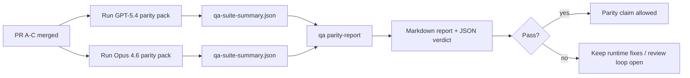

# GPT-5.4 / Codex Parity Maintainer Notes

This note explains how to review the GPT-5.4 / Codex parity program without losing the original six-contract architecture. The program ships as ten runtime/test merge units (PRs A, B, C, D, E, F, H, J, K, L) plus a separate documentation catch-up (PR M #64837 — this page). Wave 1 — the four initial PRs A, B, C, D — established the runtime contract, parity harness, and first-wave scenario pack and is now merged. Wave 2 — the six follow-up PRs E, F, H, J, K, L — doubles the parity pack, auto-activates strict-agentic on GPT-5, tightens tool-call enforcement, covers the baseline provider for offline runs, and self-describes each run in its summary artifact. PR F was closed as superseded after its three fixes were resolved upstream independently, so wave 2 lands as five code PRs plus PR M.

## Program status

Sections below describe each PR's scope, including wave-2 PRs that have not yet merged. This doc is merged as PR M after the wave-2 code PRs. Until then, "Owns" blocks for wave-2 PRs describe the intended end state of each slice.

## Merge units

### PR A: strict-agentic execution

Owns:

- `executionContract`
- GPT-5-first same-turn follow-through
- `update_plan` as non-terminal progress tracking
- explicit blocked states instead of plan-only silent stops

Does not own:

- auth/runtime failure classification
- permission truthfulness
- replay/continuation redesign
- parity benchmarking

### PR B: runtime truthfulness

Owns:

- Codex OAuth scope correctness
- typed provider/runtime failure classification
- truthful `/elevated full` availability and blocked reasons

Does not own:

- tool schema normalization
- replay/liveness state
- benchmark gating

### PR C: execution correctness

Owns:

- provider-owned OpenAI/Codex tool compatibility
- parameter-free strict schema handling
- replay-invalid surfacing
- paused, blocked, and abandoned long-task state visibility

Does not own:

- self-elected continuation
- generic Codex dialect behavior outside provider hooks
- benchmark gating

### PR D: first-wave parity harness

Owns:

- first-wave GPT-5.4 vs Opus 4.6 scenario pack (five scenarios)
- parity documentation baseline
- parity report and release-gate mechanics

Does not own:

- second-wave scenarios
- dual-provider mock routing
- runtime behavior changes outside QA-lab

### PR E: second-wave parity pack

Owns:

- five additional parity scenarios (`subagent-handoff`, `subagent-fanout-synthesis`, `memory-recall`, `thread-memory-isolation`, `config-restart-capability-flip`)
- parity report header parametrization so non-default model pairs render accurate labels
- parity gate failure when any required scenario fails on either candidate or baseline, so “both models fail” no longer leaks through the relative metric comparison

Does not own:

- dual-provider mock routing (PR K)
- self-describing run metadata (PR L)
- tool-call assertions (PR J)

### PR F: post-parity main stabilization (closed as superseded)

Owned three inherited red-CI fixes against `target-resolver.test.ts`, `memory-wiki/index.test.ts`, and `config.pruning-defaults.test.ts`. All three failures were resolved upstream through independent commits while the parity loop was in progress, and the PR was closed as superseded after verification. No review action needed.

### PR H: strict-agentic auto-activation for GPT-5 + blocked-exit liveness

Owns:

- auto-activation of the strict-agentic contract for unconfigured GPT-5-family `openai` and `openai-codex` runs
- explicit `"blocked"` liveness state at the strict-agentic blocked exit
- regression coverage pinning both behaviors

Does not own:

- the `executionContract` mechanism itself (that's PR A)
- non-GPT-5 provider defaults

### PR J: parity scenario tool-call enforcement

Owns:

- tool-call assertions on the `source-docs-discovery-report` and `subagent-handoff` parity scenarios
- `/debug/requests` seam consumption from scenario YAML flows
- matching on scenario-unique prompt substrings to keep assertions scoped to their own scenario

Does not own:

- the `/debug/requests` store itself (part of the mock server)
- tool schemas or tool execution

### PR K: Anthropic `/v1/messages` mock route

Owns:

- the `/v1/messages` route on the qa-lab mock server
- Anthropic messages → shared `ResponsesInputItem[]` conversion
- empty-model and streaming-request edge cases (empty string defaults to `claude-opus-4-6`; `stream: true` returns a 400 so the failure mode is visible)

Does not own:

- real Anthropic API compatibility beyond what the scenario dispatcher reads
- live Anthropic credential wiring

### PR L: qa-suite-summary.json run metadata

Owns:

- the `run` block in `qa-suite-summary.json` (`primaryProvider`, `primaryModel`, `providerMode`, `scenarioIds`)
- reuse of the canonical `QaProviderMode` union in `writeQaSuiteArtifacts` instead of a re-declared string-literal union

Does not own:

- parity report consumption of the run block (that's PR D's report helper)
- scenario catalog filtering

### PR M: documentation catch-up

Owns:

- the 10-PR rewrite of `docs/help/gpt54-codex-agentic-parity.md` and `docs/help/gpt54-codex-agentic-parity-maintainers.md`
- three new mermaid diagrams (dual-provider mock, parity run orchestration, tool-call assertion seam)
- the end-to-end parity runbook section
- the goal-to-evidence matrix update covering all 10 PRs
- the program-status disclaimer that marks wave-2 sections as forward-looking until each wave-2 PR merges

Does not own:

- any runtime, test, or scenario registry change (documentation-only PR)
- the `QA_AGENTIC_PARITY_SCENARIOS` registry expansion (PR E owns that)
- the CLI flag reference (PR M describes `--model` / `--alt-model` as they exist on `main`; PR M does not change the CLI surface)
- any architecture change to the mock server, parity report, or strict-agentic contract

## Mapping back to the original six contracts

| Original contract                        | Merge units                             |
| ---------------------------------------- | --------------------------------------- |
| Provider transport/auth correctness      | PR B                                    |
| Tool contract/schema compatibility       | PR C                                    |
| Same-turn execution                      | PR A + PR H                             |
| Permission truthfulness                  | PR B                                    |
| Replay/continuation/liveness correctness | PR C + PR H                             |
| Benchmark/release gate                   | PR D + PR E + PR J + PR K + PR L + PR M |

## Review order

1. PR A
2. PR B
3. PR C
4. PR D
5. PR H (runtime follow-up, parallelizable with D)
6. PR E (parity pack expansion, depends on D)
7. PR K (Anthropic mock route, parallelizable with E/J)
8. PR J (tool-call enforcement, depends on E)
9. PR L (run metadata, parallelizable with J)
10. PR M (documentation catch-up, depends on E/H/J/K/L)

PR D is the proof layer. It should not be the reason runtime-correctness PRs are delayed. PRs E/H/J/K/L are independent refinements that can land in any order as long as their individual dependency callouts are respected. PR M is documentation-only and can land in parallel with the last code PR.

## What to look for

### PR A

- GPT-5 runs act or fail closed instead of stopping at commentary
- `update_plan` no longer looks like progress by itself
- behavior stays GPT-5-first and embedded-Pi scoped

### PR B

- auth/proxy/runtime failures stop collapsing into generic “model failed” handling
- `/elevated full` is only described as available when it is actually available
- blocked reasons are visible to both the model and the user-facing runtime

### PR C

- strict OpenAI/Codex tool registration behaves predictably
- parameter-free tools do not fail strict schema checks
- replay and compaction outcomes preserve truthful liveness state

### PR D

- the first-wave scenario pack is understandable and reproducible
- the pack includes a mutating replay-safety lane, not only read-only flows
- reports are readable by humans and automation
- parity claims are evidence-backed, not anecdotal

Expected artifacts from PR D:

- `qa-suite-report.md` / `qa-suite-summary.json` for each model run
- `qa-agentic-parity-report.md` with aggregate and scenario-level comparison
- `qa-agentic-parity-summary.json` with a machine-readable verdict

### PR E

- the parity pack is now ten scenarios, not five
- the parity report Markdown header reflects the candidate and baseline labels instead of a hardcoded legacy string
- a required scenario that fails on either side fails the gate, even if both sides fail the same scenario (this closes the relative-metric loophole)
- the five new scenarios exercise delegation, fanout synthesis, memory recall, thread-memory isolation, and a capability flip across config restart

### PR H

- unconfigured GPT-5-family `openai` / `openai-codex` runs auto-activate strict-agentic without per-agent configuration
- the strict-agentic blocked exit emits an explicit `"blocked"` liveness state on the final turn
- `executionContract: "default"` still opts out, and explicit `executionContract: "strict-agentic"` is always honored
- the regression test title matches the asserted liveness state

### PR J

- the `source-docs-discovery-report` scenario gates on a real `read` tool call via `/debug/requests`, not just the prose shape of the reply
- the `subagent-handoff` scenario gates on a real `sessions_spawn` call before accepting the three labeled sections
- both assertions use a scenario-unique prompt substring so neighboring scenarios (for example `subagent-fanout-synthesis`) cannot accidentally satisfy them

### PR K

- the `/v1/messages` mock route routes through the same scenario dispatcher as `/v1/responses` so one scenario plan drives both providers
- streaming requests return a 400 with an Anthropic-shaped error body, not a silent non-streaming fallback
- empty-string `model` is treated the same as absent and defaults to `claude-opus-4-6`
- `/debug/requests` snapshots record the same `plannedToolName` / `allInputText` / `toolOutput` fields that the OpenAI route exposes, so a single parity run can diff assertions across both lanes

### PR L

- each `qa-suite-summary.json` carries a `run` block with `primaryProvider`, `primaryModel`, `providerMode`, and `scenarioIds`
- `writeQaSuiteArtifacts` reuses the canonical `QaProviderMode` union instead of a re-declared string-literal union
- parity consumers can verify the provider, model, and mode of each input summary without relying on filenames

### PR M

- the parity docs cover all ten PRs, not just the first four
- the three new mermaid diagrams are present (dual-provider mock, parity run orchestration, tool-call assertion seam)
- the end-to-end parity runbook is reproducible offline
- the goal-to-evidence matrix matches the ten-PR program

## Release gate

Do not claim GPT-5.4 parity or superiority over Opus 4.6 until:

- PR A, PR B, PR C, and PR H are merged (runtime contract enforced by default for GPT-5)
- PR D and PR E run the ten-scenario parity pack cleanly on both providers
- PR J tool-call assertions pass on the tool-mediated scenarios
- PR K offline dual-provider mock is exercised in CI
- PR L run metadata is present in both summary artifacts
- runtime-truthfulness regression suites remain green
- the parity report shows no fake-success cases and no regression in stop behavior

The parity harness is not the only evidence source. Keep this split explicit in review:

- PR D owns the scenario-based GPT-5.4 vs Opus 4.6 comparison
- PR B deterministic suites still own auth/proxy/DNS and full-access truthfulness evidence

## Goal-to-evidence map

| Completion gate item                     | Primary owners            | Review artifact                                                                                                       |
| ---------------------------------------- | ------------------------- | --------------------------------------------------------------------------------------------------------------------- |
| No plan-only stalls                      | PR A + PR H               | strict-agentic runtime tests, `approval-turn-tool-followthrough`, PR H auto-activation regression                     |
| No fake progress or fake tool completion | PR A + PR D + PR J        | parity fake-success count, scenario-level report details, `/debug/requests` tool-call assertions                      |
| No false `/elevated full` guidance       | PR B                      | deterministic runtime-truthfulness suites                                                                             |
| Replay/liveness failures remain explicit | PR C + PR H               | lifecycle/replay suites plus PR H strict-agentic blocked-exit liveness regression                                     |
| GPT-5.4 matches or beats Opus 4.6        | PR D + PR E + PR K + PR L | `qa-agentic-parity-report.md`, `qa-agentic-parity-summary.json`, full ten-scenario coverage on both providers offline |

## Reviewer shorthand: before vs after

| User-visible problem before                                 | Review signal after                                                                               |
| ----------------------------------------------------------- | ------------------------------------------------------------------------------------------------- |
| GPT-5.4 stopped after planning                              | PR A + PR H: GPT-5 runs auto-activate act-or-block instead of commentary-only completion          |
| Tool use felt brittle with strict OpenAI/Codex schemas      | PR C keeps tool registration and parameter-free invocation predictable                            |
| `/elevated full` hints were sometimes misleading            | PR B ties guidance to actual runtime capability and blocked reasons                               |
| Long tasks could disappear into replay/compaction ambiguity | PR C + PR H emit explicit paused, blocked, abandoned, and replay-invalid state                    |
| Parity claims were anecdotal                                | PR D + PR E produce a ten-scenario report plus JSON verdict with the same coverage on both models |
| Parity scenarios could pass with prose alone                | PR J adds `/debug/requests` tool-call assertions on the tool-mediated scenarios                   |
| Baseline parity needed live Anthropic credentials           | PR K adds an Anthropic `/v1/messages` route on the qa-lab mock so the gate runs offline           |
| Parity consumers had to trust file paths for provenance     | PR L records `run.primaryProvider` / `run.primaryModel` / `run.providerMode` in each summary      |
