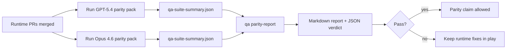

# GPT-5.4 / Codex parity maintainer notes

This is the review-oriented companion to [`gpt54-codex-agentic-parity.md`](/help/gpt54-codex-agentic-parity). The goal here is to make the program legible as merge units without losing the underlying six-contract architecture, so someone picking up a PR knows what it's supposed to own and what it deliberately doesn't.

The program ends up as ten runtime/test merge units plus a separate documentation pass (PR M, this note). Wave 1 — PRs A, B, C, D — is merged and landed the runtime contract, the parity harness, and the first-wave scenario pack. Wave 2 — PRs E, F, H, J, K, L — is the refinement round: it doubles the parity pack, makes strict-agentic the real default for GPT-5, adds tool-call enforcement, brings the mock server up to dual-provider coverage, and teaches each summary artifact to describe itself. PR F was closed after each of its three fixes landed on `main` through unrelated commits during the review window, so wave 2 effectively merges as five code PRs plus this docs pass.

Sections below describe each PR's scope including the wave-2 ones that haven't merged yet. "Owns" blocks for wave-2 PRs describe their intended end state, not what's on `main` today.

## Merge units

### PR A — strict-agentic execution

Owns:

- `executionContract`
- GPT-5-first same-turn follow-through
- `update_plan` as non-terminal progress tracking
- explicit blocked states instead of plan-only silent stops

Does not own: auth/runtime failure classification, permission truthfulness, replay/continuation redesign, parity benchmarking.

### PR B — runtime truthfulness

Owns:

- Codex OAuth scope correctness
- typed provider/runtime failure classification
- truthful `/elevated full` availability and blocked reasons

Does not own: tool schema normalization, replay/liveness state, benchmark gating.

### PR C — execution correctness

Owns:

- provider-owned OpenAI/Codex tool compatibility
- parameter-free strict schema handling
- replay-invalid surfacing
- paused, blocked, and abandoned long-task state visibility

Does not own: self-elected continuation, generic Codex dialect behavior outside provider hooks, benchmark gating.

### PR D — first-wave parity harness

Owns:

- first-wave GPT-5.4 vs Opus 4.6 scenario pack (five scenarios)
- parity documentation baseline
- parity report and release-gate mechanics

Does not own: second-wave scenarios, dual-provider mock routing, runtime behavior changes outside QA-lab.

### PR E — second-wave parity pack

Owns:

- five additional parity scenarios (`subagent-handoff`, `subagent-fanout-synthesis`, `memory-recall`, `thread-memory-isolation`, `config-restart-capability-flip`)
- parity report header parametrization so non-default model pairs render accurate labels
- parity gate failure when a required scenario fails on either candidate or baseline, so "both models fail" no longer slips through the relative metric comparison

Does not own: dual-provider mock routing (PR K), self-describing run metadata (PR L), tool-call assertions (PR J).

### PR F — post-parity main stabilization (closed as superseded)

Had three inherited red-CI fixes against `target-resolver.test.ts`, `memory-wiki/index.test.ts`, and `config.pruning-defaults.test.ts`. All three got resolved upstream through unrelated commits during the review window, so the PR was closed after verification and no review action is needed.

### PR H — strict-agentic auto-activation + blocked-exit liveness

Owns:

- auto-activation of the strict-agentic contract for unconfigured GPT-5-family `openai` and `openai-codex` runs
- explicit `"blocked"` liveness state at the strict-agentic blocked exit
- regression coverage pinning both behaviors

Does not own: the `executionContract` mechanism itself (PR A), non-GPT-5 provider defaults.

### PR J — parity scenario tool-call enforcement

Owns:

- tool-call assertions on `source-docs-discovery-report` and `subagent-handoff`
- `/debug/requests` seam consumption from scenario YAML flows
- matching on scenario-unique prompt substrings so neighboring scenarios can't accidentally satisfy each other's assertions

Does not own: the `/debug/requests` store itself (part of the mock server), tool schemas or tool execution.

### PR K — Anthropic `/v1/messages` mock route

Owns:

- the `/v1/messages` route on the qa-lab mock server
- Anthropic messages → shared `ResponsesInputItem[]` conversion
- the empty-model and streaming-request edge cases (empty-string defaults to `claude-opus-4-6`; `stream: true` returns a 400 so the failure mode is visible)

Does not own: real Anthropic API compatibility beyond what the scenario dispatcher reads, live Anthropic credential wiring.

### PR L — `qa-suite-summary.json` run metadata

Owns:

- the `run` block in `qa-suite-summary.json` (`primaryProvider`, `primaryModel`, `providerMode`, `scenarioIds`)
- reuse of the canonical `QaProviderMode` union in `writeQaSuiteArtifacts` instead of a re-declared string-literal union

Does not own: parity report consumption of the run block (PR D's report helper), scenario catalog filtering.

### PR M — parity documentation catch-up

Owns:

- the 10-PR rewrite of `docs/help/gpt54-codex-agentic-parity.md` and `docs/help/gpt54-codex-agentic-parity-maintainers.md`
- three new mermaid diagrams (dual-provider mock, parity run orchestration, tool-call assertion seam)
- the end-to-end parity runbook section
- the goal-to-evidence matrix update covering all 10 PRs
- the program-status disclaimer that marks wave-2 sections as forward-looking until each wave-2 PR merges

Does not own: any runtime, test, or scenario registry change (docs-only), the `QA_AGENTIC_PARITY_SCENARIOS` registry expansion (PR E owns that), the CLI flag reference itself (PR M describes `--model` / `--alt-model` as they exist on `main` but doesn't change the CLI surface), the mock server, the parity report, or the strict-agentic contract.

## Mapping back to the original six contracts

| Original contract                        | Merge units                             |
| ---------------------------------------- | --------------------------------------- |
| Provider transport/auth correctness      | PR B                                    |
| Tool contract/schema compatibility       | PR C                                    |
| Same-turn execution                      | PR A + PR H                             |
| Permission truthfulness                  | PR B                                    |
| Replay/continuation/liveness correctness | PR C + PR H                             |
| Benchmark/release gate                   | PR D + PR E + PR J + PR K + PR L + PR M |

## Review order

Wave 1 landed in A → B → C → D order. For wave 2, the dependencies are:

1. PR H is a runtime follow-up, independent of the parity harness work — review it any time.
2. PR E depends on PR D being merged (it extends the parity pack registry).
3. PR K is independent of E/H/J/L.
4. PR J depends on PR E because it asserts against scenarios the second-wave pack registers.
5. PR L is independent of J.
6. PR M is docs-only and should land last so its references point to merged content.

PRs H, K, and L can be reviewed in parallel. PR E should land before PR J. PR M should be the tail.

## What to look for

### PR A

- GPT-5 runs act or fail closed instead of stopping at commentary
- `update_plan` no longer looks like progress by itself
- behavior stays GPT-5-first and embedded-Pi scoped

### PR B

- auth/proxy/runtime failures don't collapse into a generic "model failed" handler
- `/elevated full` is only described as available when it actually is
- blocked reasons are visible to both the model and the user-facing runtime

### PR C

- strict OpenAI/Codex tool registration behaves predictably
- parameter-free tools don't fail strict schema checks
- replay and compaction outcomes keep truthful liveness state

### PR D

- the first-wave scenario pack is understandable and reproducible
- the pack includes a mutating replay-safety lane, not only read-only flows
- reports are readable by humans and automation
- parity claims are evidence-backed, not anecdotal

Expected artifacts: `qa-suite-report.md` / `qa-suite-summary.json` for each model run, `qa-agentic-parity-report.md` with aggregate and scenario-level comparison, `qa-agentic-parity-summary.json` with a machine-readable verdict.

### PR E

- the parity pack is ten scenarios, not five
- the parity report Markdown header reflects the candidate and baseline labels, not a hardcoded legacy string
- a required scenario that fails on either side fails the gate, even when both sides fail the same scenario — this closes the relative-metric loophole
- the five new scenarios exercise delegation, fanout synthesis, memory recall, thread-memory isolation, and a capability flip across config restart

### PR H

- unconfigured GPT-5-family `openai` / `openai-codex` runs auto-activate strict-agentic without per-agent configuration
- the strict-agentic blocked exit emits an explicit `"blocked"` liveness state on the final turn
- `executionContract: "default"` still opts out, and explicit `executionContract: "strict-agentic"` is always honored
- the regression test title matches the asserted liveness state

### PR J

- `source-docs-discovery-report` gates on a real `read` tool call via `/debug/requests`, not just the prose shape of the reply
- `subagent-handoff` gates on a real `sessions_spawn` call before accepting the three labeled sections
- both assertions match on a scenario-unique prompt substring so neighboring scenarios (for example `subagent-fanout-synthesis`, which also contains "delegate" and produces its own `sessions_spawn` request) can't accidentally satisfy them

### PR K

- `/v1/messages` routes through the same scenario dispatcher as `/v1/responses` so one scenario plan drives both providers
- streaming requests return a 400 with an Anthropic-shaped error body, not a silent non-streaming fallback
- empty-string `model` is treated the same as absent and defaults to `claude-opus-4-6`
- `/debug/requests` snapshots record the same `plannedToolName` / `allInputText` / `toolOutput` fields on the Anthropic route that the OpenAI route already exposes, so a single parity run can diff assertions across both lanes

### PR L

- each `qa-suite-summary.json` carries a `run` block with `primaryProvider`, `primaryModel`, `providerMode`, and `scenarioIds`
- `writeQaSuiteArtifacts` reuses the canonical `QaProviderMode` union instead of a re-declared string-literal union
- parity consumers can verify the provider, model, and mode of each input summary without relying on filenames

### PR M

- the parity docs cover all ten PRs, not just the first four
- the three new mermaid diagrams are present (dual-provider mock, parity run orchestration, tool-call assertion seam)
- the end-to-end parity runbook clearly separates the mock structural gate from the live-frontier proof run
- the goal-to-evidence matrix matches the ten-PR program

## Release gate

Don't claim GPT-5.4 parity or superiority over Opus 4.6 until:

- PRs A, B, C, and H are merged (runtime contract enforced by default for GPT-5)
- PRs D and E run the ten-scenario parity pack cleanly on both providers
- PR J's tool-call assertions pass on the tool-mediated scenarios
- PR K's offline dual-provider mock is exercised in CI
- PR L's run metadata is present in both summary artifacts
- runtime-truthfulness regression suites stay green
- the parity report shows no fake-success cases and no regression in stop behavior

The parity harness isn't the only evidence source. Keep the split explicit in review: PRs D and E own the scenario-based GPT-5.4 vs Opus 4.6 comparison, and PR B's deterministic suites still own auth, proxy, DNS, and `/elevated full` truthfulness.

## Mock gate vs live proof

- The workflow in `.github/workflows/parity-gate.yml` is the **mock structural gate**. It should run `openclaw qa suite --provider-mode mock-openai ...` for both lanes and verify harness structure, scenario registration, artifact generation, and fail-fast semantics without touching real credentials.
- The final product claim still requires a **live-frontier proof run**. That run should use `--provider-mode live-frontier` for both GPT-5.4 and Opus 4.6, then feed the resulting summaries into `openclaw qa parity-report`.
- Reviewers should reject any wording that treats the mock structural gate as the final parity proof by itself.

## Goal-to-evidence map

| Completion gate criterion                | Primary owners            | Review artifact                                                                                                   |
| ---------------------------------------- | ------------------------- | ----------------------------------------------------------------------------------------------------------------- |
| No plan-only stalls                      | PR A + PR H               | strict-agentic runtime tests, `approval-turn-tool-followthrough`, PR H auto-activation regression                 |
| No fake progress or fake tool completion | PR A + PR D + PR J        | parity fake-success count, scenario-level report details, `/debug/requests` tool-call assertions                  |
| No false `/elevated full` guidance       | PR B                      | deterministic runtime-truthfulness suites                                                                         |
| Replay/liveness failures remain explicit | PR C + PR H               | lifecycle/replay suites plus PR H strict-agentic blocked-exit liveness regression                                 |
| GPT-5.4 matches or beats Opus 4.6        | PR D + PR E + PR K + PR L | `qa-agentic-parity-report.md`, `qa-agentic-parity-summary.json`, ten-scenario coverage on both providers, offline |

## Reviewer shorthand

| User-visible problem before                                 | Review signal after                                                                               |
| ----------------------------------------------------------- | ------------------------------------------------------------------------------------------------- |
| GPT-5.4 stopped after planning                              | PR A + PR H: GPT-5 runs auto-activate act-or-block instead of commentary-only completion          |
| Tool use felt brittle with strict OpenAI/Codex schemas      | PR C keeps tool registration and parameter-free invocation predictable                            |
| `/elevated full` hints were sometimes misleading            | PR B ties guidance to actual runtime capability and blocked reasons                               |
| Long tasks could disappear into replay/compaction ambiguity | PR C + PR H emit explicit paused, blocked, abandoned, and replay-invalid state                    |
| Parity claims were anecdotal                                | PR D + PR E produce a ten-scenario report plus JSON verdict with the same coverage on both models |
| Parity scenarios could pass with prose alone                | PR J adds `/debug/requests` tool-call assertions on the tool-mediated scenarios                   |
| Baseline parity needed live Anthropic credentials           | PR K adds an Anthropic `/v1/messages` route on the qa-lab mock so the gate runs offline           |
| Parity consumers had to trust file paths for provenance     | PR L records `run.primaryProvider` / `run.primaryModel` / `run.providerMode` in each summary      |
