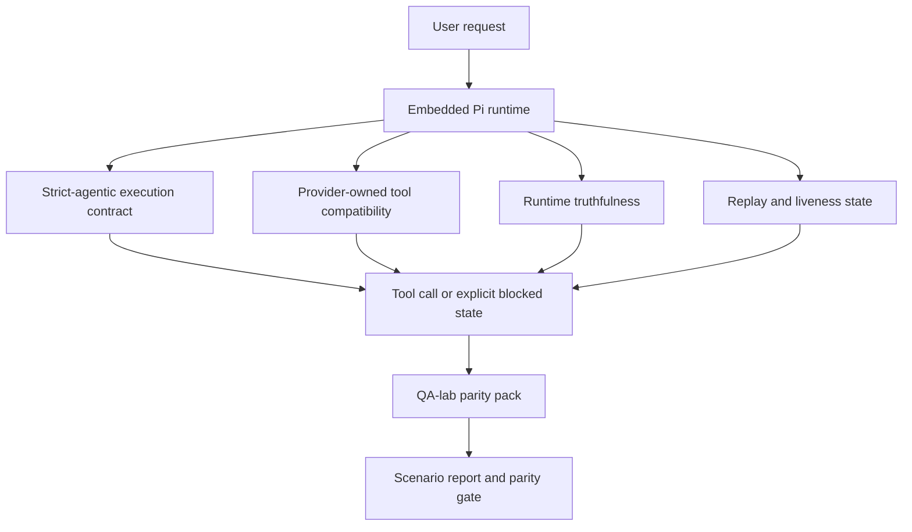
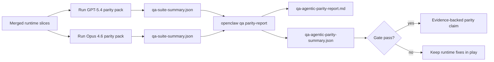
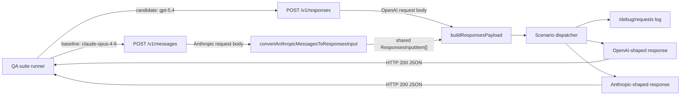
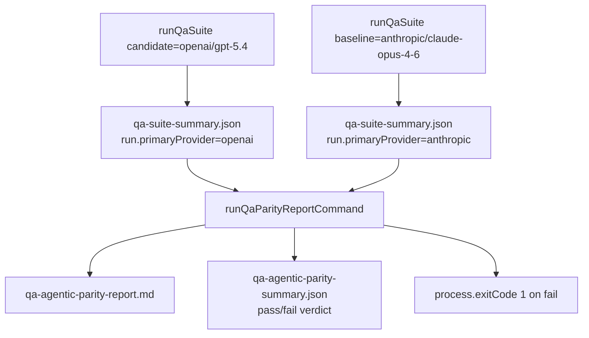
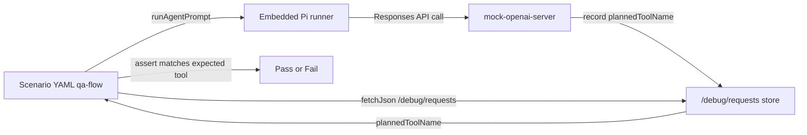

# GPT-5.4 / Codex agentic parity in OpenClaw

OpenClaw already worked well with tool-using frontier models, but GPT-5.4 and Codex-style models kept running into a handful of practical gaps that showed up in real sessions:

- they would stop after planning instead of doing the work
- strict OpenAI/Codex tool schemas got rejected in confusing ways
- `/elevated full` guidance was sometimes wrong
- long-running tasks could lose state during replay or compaction
- parity claims against Claude Opus 4.6 were anecdotal rather than something you could rerun

The fixes landed in two waves, mostly because of the repo's 10-PR active cap. The first wave (PRs A through D) put the runtime contract in place and shipped the first parity harness. The second wave (E, H, J, K, L, plus this documentation pass as PR M) extends the harness from five to ten scenarios, tightens the runtime contract so it's on by default for GPT-5, adds tool-call enforcement to the gate, brings the mock server up to parity so the baseline lane can run offline, and teaches each summary artifact to describe itself. PR F started life as a stabilization slice but was closed after all three of its fixes landed upstream through unrelated commits during the review window.

## Where things stand

| PR                                                     | Status              |
| ------------------------------------------------------ | ------------------- |
| #64241 strict-agentic execution (PR A)                 | merged              |
| #64439 runtime truthfulness (PR B)                     | merged              |
| #64300 execution correctness (PR C)                    | merged              |
| #64441 first-wave parity harness (PR D)                | merged              |
| #64675 post-parity main stabilization (PR F)           | closed (superseded) |
| #64679 strict-agentic auto-activation (PR H)           | open                |
| #64662 second-wave parity scenarios (PR E)             | open                |
| #64685 Anthropic `/v1/messages` mock route (PR K)      | open                |
| #64681 parity scenario tool-call enforcement (PR J)    | open                |
| #64789 `qa-suite-summary.json` run metadata (PR L)     | open                |
| #64837 parity documentation catch-up (PR M, this page) | open                |

A few sections below describe behavior that's still "after PR X" — I've kept those framings where the shape of the program is easier to see if you read the end state, and flagged them inline so nobody tries to run commands that rely on unmerged code.

## The runtime contract

PR A introduced a `strict-agentic` execution contract for embedded Pi GPT-5 runs. When it's active, OpenClaw stops accepting a plan-only turn as "good enough": if the model describes what it's going to do and then stops without actually touching a tool, the runtime retries with an act-now steer and then fails closed with an explicit blocked state instead of quietly returning the plan text as a completed turn. It's the single biggest fix on the "GPT-5.4 stalled after planning" complaint.

PR B made OpenClaw honest about two separate things: why a provider or runtime call actually failed, and whether `/elevated full` was actually available on the current runtime. That gives GPT-5.4 (and the user) real signals for missing scopes, auth refresh failures, 403 HTML auth errors, proxy issues, DNS or timeout failures, and blocked full-access modes. The model stops hallucinating the wrong remediation or asking for a permission mode the runtime can't grant.

PR C covered two kinds of correctness. On the tool side, it cut the friction that strict OpenAI/Codex tool registration used to hit — parameter-free tools, strict object-root expectations, schema normalization. On the liveness side, it made paused, blocked, and abandoned states visible in the runtime meta instead of collapsing them into a generic failure text that looked the same as success.

PR H (still open) is the piece that takes the strict-agentic contract from opt-in to the real default. An unconfigured GPT-5-family `openai` or `openai-codex` run now activates the contract automatically, and the strict-agentic blocked exit sets an explicit `"blocked"` liveness state on the final turn. Setting `executionContract: "default"` still opts out, and an explicit `strict-agentic` setting is honored on any provider. The intent here is that users shouldn't have to know about the contract for the runtime to enforce it — the fixed-by-default path is the one that closes criterion 1 of the release gate for real.

## The parity harness

PR D shipped the first-wave parity pack: five QA-lab scenarios that exercise GPT-5.4 and Opus 4.6 against the same workloads so "which one is better at agentic work" stops being a vibe check. Running the suite twice and feeding both summaries into `openclaw qa parity-report` produces a Markdown report and a machine-readable pass/fail verdict. PR D is the proof layer — it doesn't change runtime behavior by itself.

PR E (open) doubles the pack from five to ten. The new scenarios cover delegation, fanout synthesis, memory recall across a context switch, thread-memory isolation, and a live capability flip across a config restart. PR E also parametrizes the parity report's Markdown header so non-default model pairs render with the labels you actually passed, and closes a parity-gate loophole where a required scenario that failed on both candidate and baseline would still come out as `pass: true` because the downstream metric comparisons were purely relative.

PR K (open) adds an Anthropic `/v1/messages` route to the qa-lab mock server so the baseline lane can run offline through the same scenario dispatcher the OpenAI `/v1/responses` route already uses. Without it, running the baseline lane requires real Anthropic credentials — which is fine for production but blocks reproducible CI and local parity runs. The route rejects streaming requests with an explicit Anthropic-shaped 400 (since the runner only runs non-streaming in mock mode), and treats an empty-string `body.model` the same as absent, defaulting to `claude-opus-4-6`.

PR L (open) is the self-description layer. Each `qa-suite-summary.json` now carries a `run` block with `primaryProvider`, `primaryModel`, `providerMode`, and `scenarioIds`, so the parity report can verify the provider and model behind each input instead of trusting the caller-supplied labels. The writer-side parameter type was also switched to the canonical `QaProviderMode` union, which prevents the kind of type drift that keeps creeping back in when two places both declare the same literal union.

## Tool-call enforcement

Some parity scenarios used to gate on the textual shape of the agent's prose reply. That's necessary but not sufficient — a model can produce a plausible protocol report without ever reading the files or delegating to a subagent. PR J (open) wires `/debug/requests` into the scenario YAML flows so `source-docs-discovery-report` (must actually invoke `read`) and `subagent-handoff` (must actually invoke `sessions_spawn`) fail when the required tool call isn't recorded before the prose reply. The assertions match on scenario-unique prompt substrings so neighboring scenarios like `subagent-fanout-synthesis`, which also produces its own `sessions_spawn` call, can't accidentally satisfy them.

## Why this matters for users

Before this work, GPT-5.4 on OpenClaw could feel less agentic than Opus in real coding sessions because the runtime tolerated a few behaviors that are especially bad for GPT-5-style models: commentary-only turns, schema friction on tools, vague permission feedback, and silent replay or compaction breakage. None of those are things you can prompt-engineer around cleanly.

The goal here isn't to make GPT-5.4 imitate Opus. It's to give GPT-5.4 a runtime contract that actually rewards real progress, cleans up the tool and permission semantics so the model can reason about them, and turns failure modes into explicit machine- and human-readable states. The experience moves from "the model had a good plan but stopped" to "the model either acted, or OpenClaw surfaced the exact reason it couldn't".

| Symptom before                                                | After the program                                                            |
| ------------------------------------------------------------- | ---------------------------------------------------------------------------- |
| GPT-5.4 stopped after a reasonable plan without taking action | PR A + PR H: act-or-block by default on unconfigured GPT-5 runs              |
| Strict tool schemas rejected parameter-free or Codex tools    | PR C: provider-owned tool registration stays predictable                     |
| `/elevated full` guidance was vague or wrong                  | PR B: guidance ties to actual runtime capability                             |
| Replay or compaction failures looked like silent task loss    | PR C + PR H: explicit paused, blocked, abandoned, replay-invalid state       |
| "GPT-5.4 feels worse than Opus" was anecdotal                 | PR D + PR E: same ten scenarios on both models, JSON verdict, pass/fail gate |
| Parity scenarios could pass with prose alone                  | PR J: `/debug/requests` assertions on the tool-mediated lanes                |
| Baseline parity needed live Anthropic credentials             | PR K: Anthropic mock route on the qa-lab server                              |
| Parity report had to trust caller-supplied labels             | PR L: self-describing `run` block on every summary artifact                  |

## Architecture



## Release flow



## Dual-provider mock architecture

After PR K lands, the qa-lab mock server exposes both an OpenAI `/v1/responses` route and an Anthropic `/v1/messages` route. Both feed into the same scenario dispatcher, so each parity scenario has one response plan and both providers exercise it. Today only `/v1/responses` exists on `main`.



## Parity run orchestration

The release gate consumes two `qa-suite-summary.json` artifacts — one per provider — and produces the Markdown report plus the pass/fail verdict. After PR L lands, each summary file also carries its own `run` block so the parity consumer can verify the inputs without relying on filenames.



## Tool-call assertion seam

After PR J lands, the scenarios that depend on a real tool call read the mock server's `/debug/requests` log and fail if the expected tool wasn't actually invoked before the prose reply. Before PR J, these scenarios only check the prose shape.



## Scenario pack

The pack is `QA_AGENTIC_PARITY_SCENARIOS` in `extensions/qa-lab/src/agentic-parity.ts`. PR D registers the first five; PR E adds the other five. The scenario markdown files themselves already live under `qa/scenarios/` and can run standalone — PR E is just the pack registration and gate wiring.

**Wave 1 (live on `main`):**

- `approval-turn-tool-followthrough` — the model shouldn't stop at "I'll do that" after a short approval. It should take the first concrete action in the same turn.
- `model-switch-tool-continuity` — tool-using work should stay coherent across a model or runtime switch instead of resetting into commentary.
- `source-docs-discovery-report` — the model should read source and docs, synthesize findings, and continue the task agentically rather than producing a thin summary and stopping. After PR J, this scenario also requires a real `read` tool call to land before the prose reply is accepted.
- `image-understanding-attachment` — mixed-mode tasks with attachments should stay actionable and not collapse into vague narration.
- `compaction-retry-mutating-tool` — a task with a real mutating write should keep replay-unsafety explicit instead of quietly looking replay-safe if the run compacts, retries, or loses reply state.

**Wave 2 (registered in the pack after PR E lands):**

- `subagent-handoff` — a bounded delegation should actually spawn a subagent via `sessions_spawn` and fold the result back into the main flow. After PR J, this scenario also requires the `sessions_spawn` call to land before the prose reply.
- `subagent-fanout-synthesis` — a fanout across multiple subagents should synthesize results honestly and label which sub-result contributed where.
- `memory-recall` — the model should pull a prior detail back after an intervening context switch instead of implicitly asking the user to restate it.
- `thread-memory-isolation` — memory recorded against one thread shouldn't leak into an unrelated thread.
- `config-restart-capability-flip` — a live capability change should survive a config restart and be visible to the next run without a stale feature flag cached in the agent's state.

## Scenario matrix

| Scenario                           | What it tests                           | Good GPT-5.4 behavior                                                          | Failure signal                                                                 |
| ---------------------------------- | --------------------------------------- | ------------------------------------------------------------------------------ | ------------------------------------------------------------------------------ |
| `approval-turn-tool-followthrough` | Short approval turns after a plan       | Starts the first concrete tool action immediately instead of restating intent  | plan-only follow-up, no tool activity, or blocked turn without a real blocker  |
| `model-switch-tool-continuity`     | Runtime/model switching under tool use  | Preserves task context and continues acting coherently                         | resets into commentary, loses tool context, or stops after switch              |
| `source-docs-discovery-report`     | Source reading + synthesis + tool call  | Reads source via a real `read` tool call and produces a useful report          | thin summary, no `read` tool call recorded, or incomplete-turn stop            |
| `image-understanding-attachment`   | Attachment-driven agentic work          | Interprets the attachment, connects it to tools, and continues the task        | vague narration, attachment ignored, or no concrete next action                |
| `compaction-retry-mutating-tool`   | Mutating work under compaction pressure | Performs a real write and keeps replay-unsafety explicit after the side effect | mutating write happens but replay safety is implied, missing, or contradictory |
| `subagent-handoff`                 | Bounded delegation to a subagent        | Spawns a real subagent via `sessions_spawn` and folds the result back          | prose report claims delegation but no `sessions_spawn` call recorded           |
| `subagent-fanout-synthesis`        | Multi-subagent fanout synthesis         | Spawns multiple subagents and attributes each sub-result honestly              | merges results without attribution or fabricates fanout evidence               |
| `memory-recall`                    | Recall after a context switch           | Pulls the prior detail back without asking the user to restate it              | implicitly restates the context by asking the user for the same detail         |
| `thread-memory-isolation`          | Cross-thread memory isolation           | Keeps memory scoped to the right thread and does not leak                      | a detail from thread A surfaces in thread B                                    |
| `config-restart-capability-flip`   | Live capability change across restart   | Next run sees the new capability instead of the cached feature flag            | stale capability survives the restart and leaks into the next run              |

## Running the harness end-to-end

There are two distinct parity runs:

- the **mock structural gate**, which is CI-safe and proves the harness wiring, scenario registration, artifact generation, and pass/fail semantics
- the **live-frontier proof run**, which is the release-evidence lane for the real GPT-5.4 vs Opus 4.6 claim

Treat them differently. The mock gate is necessary, but it is not the final product claim by itself.

### Mock structural gate

Use this lane in CI and in reproducible local smoke runs:

```bash
pnpm openclaw qa suite \
  --provider-mode mock-openai \
  --model openai/gpt-5.4 \
  --alt-model openai/gpt-5.4-alt \
  --parity-pack agentic \
  --output-dir .artifacts/qa-e2e/gpt54

pnpm openclaw qa suite \
  --provider-mode mock-openai \
  --model anthropic/claude-opus-4-6 \
  --alt-model anthropic/claude-sonnet-4-6 \
  --parity-pack agentic \
  --output-dir .artifacts/qa-e2e/opus46

pnpm openclaw qa parity-report \
  --repo-root . \
  --candidate-summary .artifacts/qa-e2e/gpt54/qa-suite-summary.json \
  --baseline-summary .artifacts/qa-e2e/opus46/qa-suite-summary.json \
  --output-dir .artifacts/qa-e2e/parity
```

This is what the parity-gate workflow should run. It keeps the job fenced away from real provider credentials and proves the harness structure is sound.
The explicit `--alt-model` values matter: they keep `model-switch-tool-continuity`
inside the intended provider lane instead of silently falling back to the CLI
default alternate model.

### Live-frontier proof run

Use this lane only when you want the release-evidence comparison against real frontier providers:

```bash
pnpm openclaw qa suite \
  --provider-mode live-frontier \
  --model openai/gpt-5.4 \
  --alt-model openai/gpt-5.4-mini \
  --parity-pack agentic \
  --output-dir .artifacts/qa-e2e/gpt54-live

pnpm openclaw qa suite \
  --provider-mode live-frontier \
  --model anthropic/claude-opus-4-6 \
  --alt-model anthropic/claude-sonnet-4-6 \
  --parity-pack agentic \
  --output-dir .artifacts/qa-e2e/opus46-live

pnpm openclaw qa parity-report \
  --repo-root . \
  --candidate-summary .artifacts/qa-e2e/gpt54-live/qa-suite-summary.json \
  --baseline-summary .artifacts/qa-e2e/opus46-live/qa-suite-summary.json \
  --output-dir .artifacts/qa-e2e/parity-live
```

`openclaw qa parity-report` writes the Markdown report and a JSON verdict, and exits nonzero on a gate failure so CI can block the release. After PR L lands, `qa-suite-summary.json` carries the `run` block that the parity report uses to label each input; until then, the report still works but trusts the caller's `--candidate-label` / `--baseline-label`.

## Release gate

GPT-5.4 can only be called at parity or better when the merged runtime passes the ten-scenario parity pack and the runtime-truthfulness regressions at the same time. The gate compares completion rate, unintended-stop rate, valid-tool-call rate, and fake-success count across candidate and baseline. After PR E, it also requires every required parity scenario to pass on _both_ sides (not just match each other) and honors the `/debug/requests` tool-call assertions from PR J on the tool-mediated scenarios.

Evidence lives in two layers on purpose. The parity harness (PRs D + E) proves same-scenario GPT-5.4 vs Opus 4.6 behavior. The deterministic runtime-truthfulness suites from PR B still own auth, proxy, DNS, and `/elevated full` truthfulness outside the harness, because those failure modes are better tested by contract than by scenario.

## Goal-to-evidence matrix

| Completion gate criterion                                | Owning PRs                | Evidence                                                                                                         | Pass signal                                                                                                             |
| -------------------------------------------------------- | ------------------------- | ---------------------------------------------------------------------------------------------------------------- | ----------------------------------------------------------------------------------------------------------------------- |
| GPT-5.4 no longer stalls after planning                  | PR A + PR H               | strict-agentic runtime suites, `approval-turn-tool-followthrough`, PR H auto-activation regression               | unconfigured GPT-5 runs auto-activate strict-agentic and approval turns either act or surface an explicit blocked state |
| GPT-5.4 no longer fakes progress or fake tool completion | PR A + PR D + PR J        | parity report scenario outcomes, fake-success count, `/debug/requests` tool-call assertions                      | no suspicious pass results; a real `read` or `sessions_spawn` call is recorded before prose is accepted                 |
| No false `/elevated full` guidance                       | PR B                      | deterministic truthfulness suites                                                                                | blocked reasons and full-access hints stay runtime-accurate                                                             |
| Replay/liveness failures stay explicit                   | PR C + PR H               | lifecycle/replay suites, strict-agentic blocked-exit liveness regression                                         | mutating work keeps replay-unsafety explicit; the strict-agentic blocked exit emits `"blocked"`                         |
| GPT-5.4 matches or beats Opus 4.6 on the agreed metrics  | PR D + PR E + PR K + PR L | `qa-agentic-parity-report.md`, `qa-agentic-parity-summary.json`, self-describing `run` block, dual-provider mock | full ten-scenario coverage on both providers with no regression on the agreed metrics, verifiable offline               |

## Reading the parity verdict

`qa-agentic-parity-summary.json` is the final machine-readable decision for the ten-scenario parity pack. `pass` means GPT-5.4 covered the same scenarios as Opus 4.6 and didn't regress on the agreed aggregate metrics. `fail` means at least one hard gate tripped — weaker completion, worse unintended stops, weaker valid tool use, any fake-success case, mismatched scenario coverage, or a required scenario that failed on either side.

"Shared/base CI issue" isn't a parity result. If CI noise outside the harness blocks a run, the verdict should wait for a clean merged-runtime execution instead of being inferred from branch-era logs. Auth, proxy, DNS, and `/elevated full` truthfulness still come from PR B's deterministic suites, so the final release claim needs both a passing parity verdict and green truthfulness coverage.

## Strict-agentic defaults and overrides

Once PR H lands, the strict-agentic contract is the automatic default for GPT-5-family `openai` and `openai-codex` runs. Operators don't need to set `executionContract: "strict-agentic"` to get act-now enforcement — an unconfigured GPT-5 run picks it up automatically and emits a `"blocked"` liveness state at the strict-agentic blocked exit.

Three configurations to know about:

- **Auto-activated** (default for GPT-5 on `openai` / `openai-codex`). No configuration required. Use this for the common case where you want the runtime to guarantee act-or-block on GPT-5 flows, and especially when running GPT-5.4 through the parity pack.
- **Explicit opt-out** (`executionContract: "default"`). Keeps the pre-PR-H looser behavior. This is the escape hatch for prompt-engineering workflows that deliberately test plan-only turns or third-party skills that expect the older semantics.
- **Explicit opt-in for other providers** (`executionContract: "strict-agentic"`). Runs the contract on Anthropic or any other provider. The auto-activation rule only fires for GPT-5-family OpenAI and OpenAI-Codex runs, so if you want strict-agentic somewhere else you still have to turn it on.
