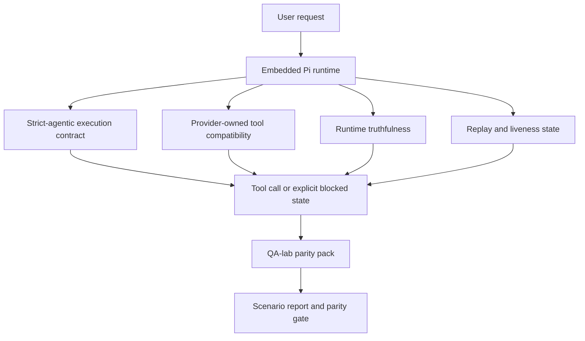
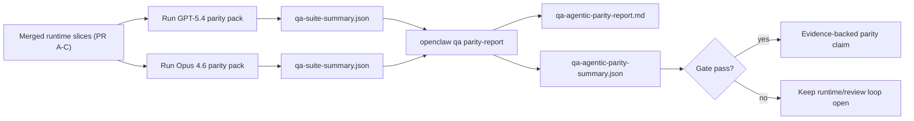

# GPT-5.4 / Codex Agentic Parity in OpenClaw

OpenClaw already worked well with tool-using frontier models, but GPT-5.4 and Codex-style models were still underperforming in a few practical ways:

- they could stop after planning instead of doing the work
- they could use strict OpenAI/Codex tool schemas incorrectly
- they could ask for `/elevated full` even when full access was impossible
- they could lose long-running task state during replay or compaction
- parity claims against Claude Opus 4.6 were based on anecdotes instead of repeatable scenarios

This parity program fixes those gaps in five reviewable slices: three merged runtime contracts, a proof-harness base, and a second-wave proof expansion.

## What changed

### PR A: strict-agentic execution

This slice adds an opt-in `strict-agentic` execution contract for embedded Pi GPT-5 runs.

When enabled, OpenClaw stops accepting plan-only turns as “good enough” completion. If the model only says what it intends to do and does not actually use tools or make progress, OpenClaw retries with an act-now steer and then fails closed with an explicit blocked state instead of silently ending the task.

This improves the GPT-5.4 experience most on:

- short “ok do it” follow-ups
- code tasks where the first step is obvious
- flows where `update_plan` should be progress tracking rather than filler text

### PR B: runtime truthfulness

This slice makes OpenClaw tell the truth about two things:

- why the provider/runtime call failed
- whether `/elevated full` is actually available

That means GPT-5.4 gets better runtime signals for missing scope, auth refresh failures, HTML 403 auth failures, proxy issues, DNS or timeout failures, and blocked full-access modes. The model is less likely to hallucinate the wrong remediation or keep asking for a permission mode the runtime cannot provide.

### PR C: execution correctness

This slice improves two kinds of correctness:

- provider-owned OpenAI/Codex tool-schema compatibility
- replay and long-task liveness surfacing

The tool-compat work reduces schema friction for strict OpenAI/Codex tool registration, especially around parameter-free tools and strict object-root expectations. The replay/liveness work makes long-running tasks more observable, so paused, blocked, and abandoned states are visible instead of disappearing into generic failure text.

### PR D: parity harness

This slice adds the first-wave QA-lab parity pack so GPT-5.4 and Opus 4.6 can be exercised through the same scenarios and compared using shared evidence.

The parity pack is the proof layer. It does not change runtime behavior by itself.

### PR E: second-wave parity expansion

This slice keeps the work proof-only and expands the parity pack with more agentic continuity lanes:

- subagent delegation and synthesis
- memory recall and thread isolation
- restart-triggered capability recovery in the same session

PR E does not add new runtime behavior. It makes the parity claim stronger by widening the proof surface and turning the final closeout into a merged-main ten-scenario comparison instead of a smaller first-wave sample.

After you have two `qa-suite-summary.json` artifacts, generate the release-gate comparison with:

```bash
pnpm openclaw qa parity-report \
  --repo-root . \
  --candidate-summary .artifacts/qa-e2e/gpt54/qa-suite-summary.json \
  --baseline-summary .artifacts/qa-e2e/opus46/qa-suite-summary.json \
  --output-dir .artifacts/qa-e2e/parity
```

That command writes:

- a human-readable Markdown report
- a machine-readable JSON verdict
- an explicit `pass` / `fail` gate result

## Why this improves GPT-5.4 in practice

Before this work, GPT-5.4 on OpenClaw could feel less agentic than Opus in real coding sessions because the runtime tolerated behaviors that are especially harmful for GPT-5-style models:

- commentary-only turns
- schema friction around tools
- vague permission feedback
- silent replay or compaction breakage

The goal is not to make GPT-5.4 imitate Opus. The goal is to give GPT-5.4 a runtime contract that rewards real progress, supplies cleaner tool and permission semantics, and turns failure modes into explicit machine- and human-readable states.

That changes the user experience from:

- “the model had a good plan but stopped”

to:

- “the model either acted, or OpenClaw surfaced the exact reason it could not”

## Before vs after for GPT-5.4 users

| Before this program                                                                            | After PR A-E                                                                                     |
| ---------------------------------------------------------------------------------------------- | ------------------------------------------------------------------------------------------------ |
| GPT-5.4 could stop after a reasonable plan without taking the next tool step                   | PR A turns “plan only” into “act now or surface a blocked state”                                 |
| Strict tool schemas could reject parameter-free or OpenAI/Codex-shaped tools in confusing ways | PR C makes provider-owned tool registration and invocation more predictable                      |
| `/elevated full` guidance could be vague or wrong in blocked runtimes                          | PR B gives GPT-5.4 and the user truthful runtime and permission hints                            |
| Replay or compaction failures could feel like the task silently disappeared                    | PR C surfaces paused, blocked, abandoned, and replay-invalid outcomes explicitly                 |
| “GPT-5.4 feels worse than Opus” was mostly anecdotal                                           | PR D and PR E turn that into the same scenario pack, the same metrics, and a hard pass/fail gate |

## Architecture



## Release flow



## Scenario pack

The parity pack now covers ten scenarios in two waves.

### `approval-turn-tool-followthrough`

Checks that the model does not stop at “I’ll do that” after a short approval. It should take the first concrete action in the same turn.

### `model-switch-tool-continuity`

Checks that tool-using work remains coherent across model/runtime switching boundaries instead of resetting into commentary or losing execution context.

### `source-docs-discovery-report`

Checks that the model can read source and docs, synthesize findings, and continue the task agentically rather than producing a thin summary and stopping early.

### `image-understanding-attachment`

Checks that mixed-mode tasks involving attachments remain actionable and do not collapse into vague narration.

### `compaction-retry-mutating-tool`

Checks that a task with a real mutating write keeps replay-unsafety explicit instead of quietly looking replay-safe if the run compacts, retries, or loses reply state under pressure.

### `subagent-handoff`

Checks that the agent can delegate one bounded task to a subagent and fold the child result back into the parent reply instead of stalling or leaving the user with a “waiting” placeholder.

### `subagent-fanout-synthesis`

Checks that the agent can launch two bounded subagent tasks, wait for both, and synthesize both results into a single coherent parent answer.

### `memory-recall`

Checks that the agent can remember a seeded fact, switch context, and later recall the same fact accurately instead of hallucinating or losing the state.

### `thread-memory-isolation`

Checks that a memory-backed answer requested inside a thread stays inside that thread and does not leak into the root channel.

### `config-restart-capability-flip`

Checks that a restart-triggering config change restores a capability and that the same live session actually uses the restored tool after wake-up instead of losing continuity.

## Scenario matrix

| Scenario                           | What it tests                           | Good GPT-5.4 behavior                                                          | Failure signal                                                                 |
| ---------------------------------- | --------------------------------------- | ------------------------------------------------------------------------------ | ------------------------------------------------------------------------------ |
| `approval-turn-tool-followthrough` | Short approval turns after a plan       | Starts the first concrete tool action immediately instead of restating intent  | plan-only follow-up, no tool activity, or blocked turn without a real blocker  |
| `model-switch-tool-continuity`     | Runtime/model switching under tool use  | Preserves task context and continues acting coherently                         | resets into commentary, loses tool context, or stops after switch              |
| `source-docs-discovery-report`     | Source reading + synthesis + action     | Finds sources, uses tools, and produces a useful report without stalling       | thin summary, missing tool work, or incomplete-turn stop                       |
| `image-understanding-attachment`   | Attachment-driven agentic work          | Interprets the attachment, connects it to tools, and continues the task        | vague narration, attachment ignored, or no concrete next action                |
| `compaction-retry-mutating-tool`   | Mutating work under compaction pressure | Performs a real write and keeps replay-unsafety explicit after the side effect | mutating write happens but replay safety is implied, missing, or contradictory |
| `subagent-handoff`                 | Single delegated worker flow            | Launches one bounded subagent and folds the result back cleanly                | no delegation, dangling “waiting”, or missing child result                     |
| `subagent-fanout-synthesis`        | Multi-worker synthesis                  | Launches two bounded subagents and combines both results in one parent answer  | only one child result lands, or synthesis collapses into partial output        |
| `memory-recall`                    | Durable recall after context shift      | Remembers a seeded fact and recalls it accurately later                        | guessed fact, forgotten fact, or drift after the context switch                |
| `thread-memory-isolation`          | Scoped threaded recall                  | Answers correctly inside the thread and keeps the root channel quiet           | answer leaks to the root channel or ignores the threaded memory task           |
| `config-restart-capability-flip`   | Restart + capability continuity         | Same session resumes after restart and uses the restored tool successfully     | capability remains missing, wake-up fails, or the session loses acting context |

## Release gate

GPT-5.4 can only be considered at parity or better when the merged runtime passes the parity pack and the runtime-truthfulness regressions at the same time.

Required outcomes:

- no plan-only stall when the next tool action is clear
- no fake completion without real execution
- no incorrect `/elevated full` guidance
- no silent replay or compaction abandonment
- parity-pack metrics that are at least as strong as the agreed Opus 4.6 baseline

For the current parity pack, the gate compares:

- completion rate
- unintended-stop rate
- valid-tool-call rate
- fake-success count

Parity evidence is intentionally split across two layers:

- PR D and PR E prove same-scenario GPT-5.4 vs Opus 4.6 behavior with QA-lab
- PR B deterministic suites prove auth, proxy, DNS, and `/elevated full` truthfulness outside the harness

## Goal-to-evidence matrix

| Completion gate item                                     | Owning PR          | Evidence source                                                                             | Pass signal                                                                              |
| -------------------------------------------------------- | ------------------ | ------------------------------------------------------------------------------------------- | ---------------------------------------------------------------------------------------- |
| GPT-5.4 no longer stalls after planning                  | PR A               | `approval-turn-tool-followthrough` plus PR A runtime suites                                 | approval turns trigger real work or an explicit blocked state                            |
| GPT-5.4 no longer fakes progress or fake tool completion | PR A + PR D + PR E | parity report scenario outcomes and fake-success count                                      | no suspicious pass results and no commentary-only completion                             |
| GPT-5.4 no longer gives false `/elevated full` guidance  | PR B               | deterministic truthfulness suites                                                           | blocked reasons and full-access hints stay runtime-accurate                              |
| Replay/liveness failures stay explicit                   | PR C + PR D + PR E | PR C lifecycle/replay suites plus `compaction-retry-mutating-tool` and continuity scenarios | mutating work keeps replay-unsafety explicit instead of silently disappearing            |
| GPT-5.4 matches or beats Opus 4.6 on the agreed metrics  | PR D + PR E        | `qa-agentic-parity-report.md` and `qa-agentic-parity-summary.json`                          | same scenario coverage and no regression on completion, stop behavior, or valid tool use |

## Merged-main parity proof

The final release claim should come from one merged-main run, not from branch-era anecdotes.

Required inputs:

- merged PR A, PR B, and PR C runtime behavior
- merged PR D proof harness
- merged PR E second-wave parity expansion
- generated `qa-suite-summary.json` for GPT-5.4
- generated `qa-suite-summary.json` for Opus 4.6

Required outputs:

- `qa-agentic-parity-report.md`
- `qa-agentic-parity-summary.json`

Only treat parity as complete when those generated artifacts come from the merged runtime and the full ten-scenario pack.

## How to read the parity verdict

Use the verdict in `qa-agentic-parity-summary.json` as the final machine-readable decision for the merged-main parity pack.

- `pass` means GPT-5.4 covered the same scenarios as Opus 4.6 and did not regress on the agreed aggregate metrics.
- `fail` means at least one hard gate tripped: weaker completion, worse unintended stops, weaker valid tool use, any fake-success case, or mismatched scenario coverage.
- “shared/base CI issue” is not itself a parity result. If CI noise outside PR D blocks a run, the verdict should wait for a clean merged-runtime execution instead of being inferred from branch-era logs.
- Auth, proxy, DNS, and `/elevated full` truthfulness still come from PR B’s deterministic suites, so the final release claim needs both: a passing PR D parity verdict and green PR B truthfulness coverage.

## Who should enable `strict-agentic`

Use `strict-agentic` when:

- the agent is expected to act immediately when a next step is obvious
- GPT-5.4 or Codex-family models are the primary runtime
- you prefer explicit blocked states over “helpful” recap-only replies

Keep the default contract when:

- you want the existing looser behavior
- you are not using GPT-5-family models
- you are testing prompts rather than runtime enforcement
