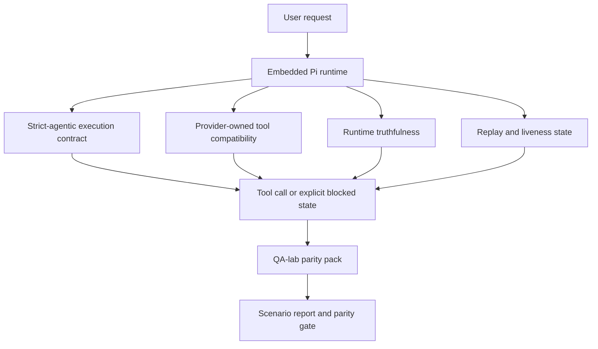
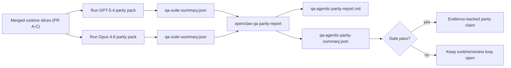
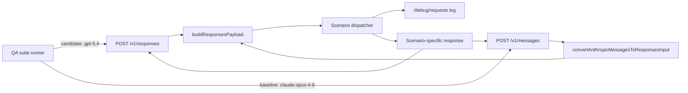
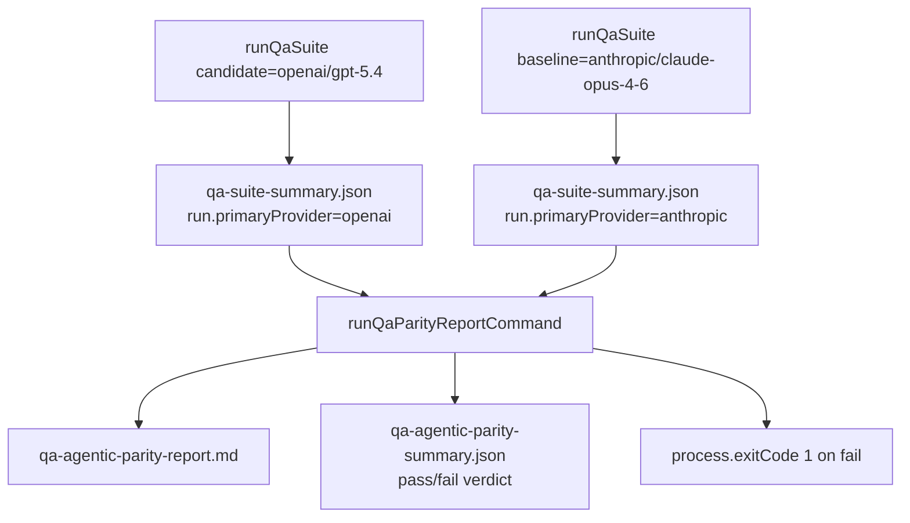
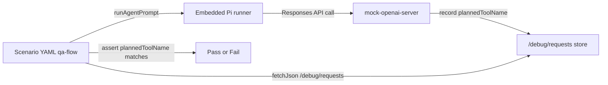

# GPT-5.4 / Codex Agentic Parity in OpenClaw

OpenClaw already worked well with tool-using frontier models, but GPT-5.4 and Codex-style models were still underperforming in a few practical ways:

- they could stop after planning instead of doing the work
- they could use strict OpenAI/Codex tool schemas incorrectly
- they could ask for `/elevated full` even when full access was impossible
- they could lose long-running task state during replay or compaction
- parity claims against Claude Opus 4.6 were based on anecdotes instead of repeatable scenarios

This parity program fixes those gaps in ten reviewable slices. PRs A through D landed first and established the runtime contract, parity harness, and first-wave scenario pack. PRs E, H, J, K, and L are follow-up slices that doubled the parity pack, tightened the runtime contract, added tool-call enforcement to the gate, expanded the mock server to cover both providers for offline parity runs, and self-described each run in its summary artifact.

## What changed

### PR A: strict-agentic execution

This slice adds the `strict-agentic` execution contract for embedded Pi GPT-5 runs.

When enabled, OpenClaw stops accepting plan-only turns as “good enough” completion. If the model only says what it intends to do and does not actually use tools or make progress, OpenClaw retries with an act-now steer and then fails closed with an explicit blocked state instead of silently ending the task.

This improves the GPT-5.4 experience most on:

- short “ok do it” follow-ups
- code tasks where the first step is obvious
- flows where `update_plan` should be progress tracking rather than filler text

### PR B: runtime truthfulness

This slice makes OpenClaw tell the truth about two things:

- why the provider/runtime call failed
- whether `/elevated full` is actually available

That means GPT-5.4 gets better runtime signals for missing scope, auth refresh failures, HTML 403 auth failures, proxy issues, DNS or timeout failures, and blocked full-access modes. The model is less likely to hallucinate the wrong remediation or keep asking for a permission mode the runtime cannot provide.

### PR C: execution correctness

This slice improves two kinds of correctness:

- provider-owned OpenAI/Codex tool-schema compatibility
- replay and long-task liveness surfacing

The tool-compat work reduces schema friction for strict OpenAI/Codex tool registration, especially around parameter-free tools and strict object-root expectations. The replay/liveness work makes long-running tasks more observable, so paused, blocked, and abandoned states are visible instead of disappearing into generic failure text.

### PR D: first-wave parity harness

This slice adds the first-wave QA-lab parity pack so GPT-5.4 and Opus 4.6 can be exercised through the same scenarios and compared using shared evidence.

The parity pack is the proof layer. It does not change runtime behavior by itself.

After you have two `qa-suite-summary.json` artifacts, generate the release-gate comparison with:

```bash
pnpm openclaw qa parity-report \
  --repo-root . \
  --candidate-summary .artifacts/qa-e2e/gpt54/qa-suite-summary.json \
  --baseline-summary .artifacts/qa-e2e/opus46/qa-suite-summary.json \
  --output-dir .artifacts/qa-e2e/parity
```

That command writes:

- a human-readable Markdown report
- a machine-readable JSON verdict
- an explicit `pass` / `fail` gate result

### PR E: second-wave parity scenarios

This slice doubles the parity pack from the first-wave five scenarios to ten. The new scenarios exercise delegation, fanout synthesis, memory recall after a context switch, thread-memory isolation, and a live capability flip across a config restart. They run through the same `openclaw qa parity-report` gate and the same `QA_AGENTIC_PARITY_SCENARIOS` registration so the verdict covers the full pack without a CLI flag change.

PR E also rewrites the parity report Markdown header to use the candidate and baseline labels passed to `buildQaAgenticParityComparison`, so reports generated for non-default model pairs no longer carry a hard-coded “GPT-5.4 / Opus 4.6” title.

Criterion 5 of the release gate (GPT-5.4 matches or beats Opus 4.6 on the agreed metrics) now requires green outcomes across all ten scenarios on both sides.

### PR F: post-parity main stabilization (subsumed by upstream main)

This slice was a stabilization PR that addressed three inherited red-CI failures on main during the parity program. All three failures were resolved upstream through independent commits while the parity loop was in progress, so the PR was closed as superseded after verification. No follow-up work is needed from this slice.

### PR H: strict-agentic auto-activation for GPT-5 + blocked-exit liveness

This slice takes the PR A `strict-agentic` contract from an opt-in default to an automatic default for GPT-5-family OpenAI and OpenAI-Codex runs. Unconfigured runs on those providers now auto-activate strict-agentic and emit an explicit `"blocked"` liveness state at the strict-agentic blocked exit, instead of silently reporting a generic completion. Runs that set `executionContract: "default"` still opt out, and explicit `executionContract: "strict-agentic"` is always honored.

This closes the remaining hole in criterion 1 (“GPT-5.4 no longer stalls after planning”): users no longer need to know about the contract for the runtime to enforce it.

### PR J: parity scenario tool-call enforcement

This slice adds tool-call assertions to the `source-docs-discovery-report` and `subagent-handoff` parity scenarios. Both scenarios previously asserted the textual shape of the agent's prose reply; the assertions now also read the mock server's `/debug/requests` log and require that the scenario actually invoked the expected tool (`read` for discovery, `sessions_spawn` for delegation) before the prose reply.

This closes the remaining hole in criterion 2 (“no fake progress or fake tool completion”): a model that hallucinates a report without reading files or delegates without actually spawning a subagent can no longer satisfy the scenario with prose alone.

### PR K: Anthropic `/v1/messages` mock route

This slice adds an Anthropic Messages API route to the qa-lab mock server so the parity baseline lane (`anthropic/claude-opus-4-6`) can run through the same scenario dispatcher without requiring real Anthropic API credentials. The route converts the Anthropic request shape into the shared `ResponsesInputItem[]` representation, dispatches through the same scenario logic the OpenAI `/v1/responses` route uses, and shapes the response back into an Anthropic Messages body.

The route rejects streaming requests with an explicit Anthropic-shaped 400 (the runner always uses non-streaming in mock mode) and treats an empty-string `model` as absent, defaulting to `claude-opus-4-6` so the echoed model label matches what parity consumers expect.

This closes the remaining hole in infrastructure for criterion 5: operators can now run the parity gate end-to-end offline against both providers.

### PR L: qa-suite-summary.json run metadata

This slice records `run.primaryProvider`, `run.primaryModel`, `run.providerMode`, and `run.scenarioIds` in each `qa-suite-summary.json` artifact. Parity consumers can now verify the provider, model, and mode of each input summary when reading the report, which means the parity report can distinguish two “qa-suite-summary.json” files by provenance instead of relying on filenames.

The writer-side parameter type now reuses the canonical `QaProviderMode` union instead of re-declaring the string-literal union inline, so a future addition to the mode list propagates automatically.

This closes the remaining self-description hole for criterion 5: the report no longer has to trust file paths to know which provider produced which summary.

## Why this improves GPT-5.4 in practice

Before this work, GPT-5.4 on OpenClaw could feel less agentic than Opus in real coding sessions because the runtime tolerated behaviors that are especially harmful for GPT-5-style models:

- commentary-only turns
- schema friction around tools
- vague permission feedback
- silent replay or compaction breakage

The goal is not to make GPT-5.4 imitate Opus. The goal is to give GPT-5.4 a runtime contract that rewards real progress, supplies cleaner tool and permission semantics, and turns failure modes into explicit machine- and human-readable states.

That changes the user experience from:

- “the model had a good plan but stopped”

to:

- “the model either acted, or OpenClaw surfaced the exact reason it could not”

## Before vs after for GPT-5.4 users

| Before this program                                                                            | After PR A-D                                                                             |
| ---------------------------------------------------------------------------------------------- | ---------------------------------------------------------------------------------------- |
| GPT-5.4 could stop after a reasonable plan without taking the next tool step                   | PR A turns “plan only” into “act now or surface a blocked state”                         |
| Strict tool schemas could reject parameter-free or OpenAI/Codex-shaped tools in confusing ways | PR C makes provider-owned tool registration and invocation more predictable              |
| `/elevated full` guidance could be vague or wrong in blocked runtimes                          | PR B gives GPT-5.4 and the user truthful runtime and permission hints                    |
| Replay or compaction failures could feel like the task silently disappeared                    | PR C surfaces paused, blocked, abandoned, and replay-invalid outcomes explicitly         |
| “GPT-5.4 feels worse than Opus” was mostly anecdotal                                           | PR D turns that into the same scenario pack, the same metrics, and a hard pass/fail gate |

## Architecture



## Release flow



## Dual-provider mock architecture

The qa-lab mock server now exposes both an OpenAI `/v1/responses` route and an Anthropic `/v1/messages` route. Both routes feed into the same scenario dispatcher, so each parity scenario has one source of truth and both providers exercise the same response plans.



## Parity run orchestration

The release gate consumes two `qa-suite-summary.json` artifacts (one per provider) and produces the Markdown report plus the machine-readable verdict. Each summary file now carries a self-describing `run` block, so the parity consumer can label the inputs without relying on filenames.



## Tool-call assertion seam

Several parity scenarios gate on the prose shape of the agent's reply. That is necessary but not sufficient, because a model can produce a plausible protocol report without ever reading the files or delegating to a subagent. The tool-call assertion seam closes that gap by requiring the scenario to actually invoke the expected tool before the prose is accepted.



## Scenario pack

The parity pack covers ten scenarios after the second-wave expansion:

### `approval-turn-tool-followthrough`

Checks that the model does not stop at “I’ll do that” after a short approval. It should take the first concrete action in the same turn.

### `model-switch-tool-continuity`

Checks that tool-using work remains coherent across model/runtime switching boundaries instead of resetting into commentary or losing execution context.

### `source-docs-discovery-report`

Checks that the model can read source and docs, synthesize findings, and continue the task agentically rather than producing a thin summary and stopping early. The scenario also requires a real `read` tool call to land before the prose reply is accepted.

### `image-understanding-attachment`

Checks that mixed-mode tasks involving attachments remain actionable and do not collapse into vague narration.

### `compaction-retry-mutating-tool`

Checks that a task with a real mutating write keeps replay-unsafety explicit instead of quietly looking replay-safe if the run compacts, retries, or loses reply state under pressure.

### `subagent-handoff`

Checks that a bounded delegation actually spawns a subagent via the `sessions_spawn` tool and folds the subagent's result back into the main flow, instead of producing a prose report that claims delegation occurred without a real subagent call.

### `subagent-fanout-synthesis`

Checks that a fanout across multiple subagents synthesizes results honestly and labels which sub-result contributed to which part of the final answer.

### `memory-recall`

Checks that a task can pull a prior detail back after an intervening context switch, instead of implicitly asking the user to restate it.

### `thread-memory-isolation`

Checks that memory recorded against one thread does not leak into an unrelated thread, so the runtime's isolation contract matches what the model behaves as if.

### `config-restart-capability-flip`

Checks that a live capability change survives a config restart on the agent and is visible to the next run without a stale feature flag cached in the agent's state.

## Scenario matrix

| Scenario                           | What it tests                           | Good GPT-5.4 behavior                                                          | Failure signal                                                                 |
| ---------------------------------- | --------------------------------------- | ------------------------------------------------------------------------------ | ------------------------------------------------------------------------------ |
| `approval-turn-tool-followthrough` | Short approval turns after a plan       | Starts the first concrete tool action immediately instead of restating intent  | plan-only follow-up, no tool activity, or blocked turn without a real blocker  |
| `model-switch-tool-continuity`     | Runtime/model switching under tool use  | Preserves task context and continues acting coherently                         | resets into commentary, loses tool context, or stops after switch              |
| `source-docs-discovery-report`     | Source reading + synthesis + tool call  | Reads source via a real `read` tool call and produces a useful report          | thin summary, no `read` tool call recorded, or incomplete-turn stop            |
| `image-understanding-attachment`   | Attachment-driven agentic work          | Interprets the attachment, connects it to tools, and continues the task        | vague narration, attachment ignored, or no concrete next action                |
| `compaction-retry-mutating-tool`   | Mutating work under compaction pressure | Performs a real write and keeps replay-unsafety explicit after the side effect | mutating write happens but replay safety is implied, missing, or contradictory |
| `subagent-handoff`                 | Bounded delegation to a subagent        | Spawns a real subagent via `sessions_spawn` and folds the result back          | prose report claims delegation but no `sessions_spawn` call recorded           |
| `subagent-fanout-synthesis`        | Multi-subagent fanout synthesis         | Spawns multiple subagents and attributes each sub-result honestly              | merges results without attribution or fabricates fanout evidence               |
| `memory-recall`                    | Recall after a context switch           | Pulls the prior detail back without asking the user to restate it              | implicitly restates the context by asking the user for the same detail         |
| `thread-memory-isolation`          | Cross-thread memory isolation           | Keeps memory scoped to the right thread and does not leak                      | a detail from thread A surfaces in thread B                                    |
| `config-restart-capability-flip`   | Live capability change across restart   | Next run sees the new capability instead of the cached feature flag            | stale capability survives the restart and leaks into the next run              |

## Running the parity gate end-to-end

The parity gate is a three-step flow. Each step is reproducible against the qa-lab mock server so an operator can run the whole thing offline before a release candidate reaches live providers.

1. Run the suite against the candidate provider/model:

   ```bash
   pnpm openclaw qa suite \
     --primary-model openai/gpt-5.4 \
     --parity-pack agentic \
     --output-dir .artifacts/qa-e2e/gpt54
   ```

2. Run the suite against the baseline provider/model:

   ```bash
   pnpm openclaw qa suite \
     --primary-model anthropic/claude-opus-4-6 \
     --parity-pack agentic \
     --output-dir .artifacts/qa-e2e/opus46
   ```

3. Generate the parity report and read the verdict:

   ```bash
   pnpm openclaw qa parity-report \
     --repo-root . \
     --candidate-summary .artifacts/qa-e2e/gpt54/qa-suite-summary.json \
     --baseline-summary .artifacts/qa-e2e/opus46/qa-suite-summary.json \
     --output-dir .artifacts/qa-e2e/parity
   ```

Each `qa-suite-summary.json` now carries a `run` block with `primaryProvider`, `primaryModel`, `providerMode`, and `scenarioIds`. The parity report consumes those fields to label the inputs in the Markdown report, so an operator can tell which side of the comparison came from which provider without opening the suite config. On a gate failure, `qa-agentic-parity-summary.json` records a machine-readable verdict and the parity-report command returns a nonzero exit code so CI can block the release.

## Release gate

GPT-5.4 can only be considered at parity or better when the merged runtime passes the full ten-scenario parity pack and the runtime-truthfulness regressions at the same time.

Required outcomes:

- no plan-only stall when the next tool action is clear
- no fake completion without real execution
- no incorrect `/elevated full` guidance
- no silent replay or compaction abandonment
- parity-pack metrics that are at least as strong as the agreed Opus 4.6 baseline across all ten scenarios

The gate compares:

- completion rate
- unintended-stop rate
- valid-tool-call rate
- fake-success count
- required-scenario outcomes (any required scenario that fails on either side fails the gate, even if the baseline also failed)
- tool-call assertions on the scenarios that require a real tool invocation (`read` for `source-docs-discovery-report`, `sessions_spawn` for `subagent-handoff`)

Parity evidence is intentionally split across two layers:

- PRs D and E prove same-scenario GPT-5.4 vs Opus 4.6 behavior through the ten-scenario QA-lab pack
- PR B deterministic suites prove auth, proxy, DNS, and `/elevated full` truthfulness outside the harness

## Goal-to-evidence matrix

| Completion gate item                                     | Owning PRs                | Evidence source                                                                                                  | Pass signal                                                                                                            |
| -------------------------------------------------------- | ------------------------- | ---------------------------------------------------------------------------------------------------------------- | ---------------------------------------------------------------------------------------------------------------------- |
| GPT-5.4 no longer stalls after planning                  | PR A + PR H               | PR A runtime suites, `approval-turn-tool-followthrough`, PR H auto-activation regression                         | unconfigured GPT-5 runs auto-activate strict-agentic and approval turns trigger real work or an explicit blocked state |
| GPT-5.4 no longer fakes progress or fake tool completion | PR A + PR D + PR J        | parity report scenario outcomes, fake-success count, `/debug/requests` tool-call assertions                      | no suspicious pass results and a real `read` / `sessions_spawn` call is recorded before prose is accepted              |
| GPT-5.4 no longer gives false `/elevated full` guidance  | PR B                      | deterministic truthfulness suites                                                                                | blocked reasons and full-access hints stay runtime-accurate                                                            |
| Replay/liveness failures stay explicit                   | PR C + PR H               | PR C lifecycle/replay suites plus PR H strict-agentic blocked-exit liveness regression                           | mutating work keeps replay-unsafety explicit and the strict-agentic blocked exit emits `"blocked"`                     |
| GPT-5.4 matches or beats Opus 4.6 on the agreed metrics  | PR D + PR E + PR K + PR L | `qa-agentic-parity-report.md`, `qa-agentic-parity-summary.json`, self-describing `run` block, dual-provider mock | full ten-scenario coverage on both providers with no regression on the agreed metrics, verifiable offline              |

## How to read the parity verdict

Use the verdict in `qa-agentic-parity-summary.json` as the final machine-readable decision for the ten-scenario parity pack.

- `pass` means GPT-5.4 covered the same scenarios as Opus 4.6 and did not regress on the agreed aggregate metrics.
- `fail` means at least one hard gate tripped: weaker completion, worse unintended stops, weaker valid tool use, any fake-success case, or mismatched scenario coverage.
- “shared/base CI issue” is not itself a parity result. If CI noise outside PR D blocks a run, the verdict should wait for a clean merged-runtime execution instead of being inferred from branch-era logs.
- Auth, proxy, DNS, and `/elevated full` truthfulness still come from PR B’s deterministic suites, so the final release claim needs both: a passing PR D parity verdict and green PR B truthfulness coverage.

## Strict-agentic defaults and overrides

After PR H landed, the strict-agentic contract is now the automatic default for GPT-5-family `openai` and `openai-codex` runs. Operators no longer need to configure `executionContract: "strict-agentic"` to get act-now enforcement on those providers — an unconfigured GPT-5 run automatically activates the contract and emits an explicit `"blocked"` liveness state at the strict-agentic blocked exit.

Override behavior:

- **Auto-activated (default for GPT-5 on `openai` / `openai-codex`)**: no configuration required. The runtime enforces act-or-block on plan-only turns and surfaces a `"blocked"` liveness state on the blocked exit.
- **Explicit opt-out**: set `executionContract: "default"` on the agent config to keep the pre-PR-H looser behavior. This is the escape hatch for prompt-testing workflows or third-party agents that rely on plan-only completion.
- **Explicit opt-in for other providers**: set `executionContract: "strict-agentic"` to run the contract on Anthropic or any other provider. The auto-activation rule only fires for GPT-5-family OpenAI / OpenAI-Codex runs; other providers still require the explicit config.

Keep the default auto-activation behavior when:

- you want the runtime to guarantee act-or-block on GPT-5 flows without per-agent configuration
- you are comparing GPT-5.4 against Opus 4.6 through the parity pack and want the contract enforced on the candidate side
- you prefer explicit blocked states over “helpful” recap-only replies

Opt out (`executionContract: "default"`) when:

- you are running prompt-engineering workflows that deliberately test plan-only turns
- you are testing a third-party skill that expects the pre-PR-H behavior
- you are using a non-GPT-5 model that should not be gated by the contract
