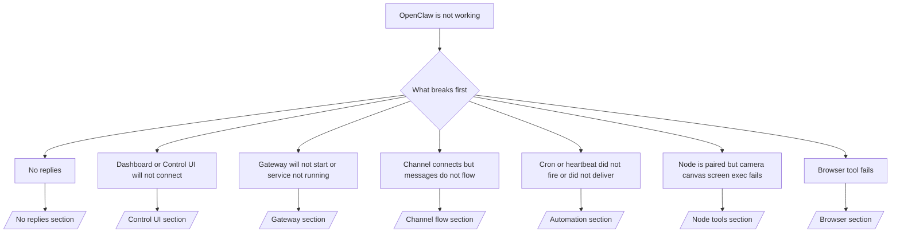

# 故障排除

如果您只有 2 分钟，请将此页面用作分类前门。

## 前 60 秒

按顺序运行此确切的阶梯：

```bash
openclaw status
openclaw status --all
openclaw gateway probe
openclaw gateway status
openclaw doctor
openclaw channels status --probe
openclaw logs --follow
```

一行中的良好输出：

- `openclaw status` → 显示配置的频道，没有明显的认证错误。
- `openclaw status --all` → 完整报告存在且可共享。
- `openclaw gateway probe` → 预期的网关目标可达（`Reachable: yes`）。`Capability: ...` 告诉您探针可以证明什么认证级别，`Read probe: limited - missing scope: operator.read` 是降级诊断，不是连接失败。
- `openclaw gateway status` → `Runtime: running`、`Connectivity probe: ok` 和合理的 `Capability: ...` 行。如果您也需要读范围 RPC 证明，请使用 `--require-rpc`。
- `openclaw doctor` → 没有阻塞配置/服务错误。
- `openclaw channels status --probe` → 可达的网关返回每个账户的实时传输状态以及 `works` 或 `audit ok` 等探测/审计结果；如果网关不可达，该命令回退到仅配置摘要。
- `openclaw logs --follow` → 稳定活动，没有重复的致命错误。

## Anthropic 长上下文 429

如果您看到：
`HTTP 429: rate_limit_error: Extra usage is required for long context requests`，
请前往 [/gateway/troubleshooting#anthropic-429-extra-usage-required-for-long-context](/gateway/troubleshooting#anthropic-429-extra-usage-required-for-long-context)。

## 本地兼容 OpenAI 的后端直接工作但在 OpenClaw 中失败

如果您的本地或自托管 `/v1` 后端回答小型直接 `v1/chat/completions` 探测，但在 `openclaw infer model run` 或正常代理轮次上失败：

1. 如果错误提到 `messages[].content` 期望字符串，设置 `models.providers.<provider>.models[].compat.requiresStringContent: true`。
2. 如果后端仍然仅在 OpenClaw 代理轮次上失败，设置 `models.providers.<provider>.models[].compat.supportsTools: false` 并重试。
3. 如果小型直接调用仍然有效，但较大的 OpenClaw 提示使后端崩溃，将剩余问题视为上游模型/服务器限制，并在深度运行手册中继续：
   [/gateway/troubleshooting#local-openai-compatible-backend-passes-direct-probes-but-agent-runs-fail](/gateway/troubleshooting#local-openai-compatible-backend-passes-direct-probes-but-agent-runs-fail)

## 插件安装因缺少 openclaw 扩展而失败

如果安装失败并显示 `package.json missing openclaw.extensions`，则插件包使用 OpenClaw 不再接受的旧形状。

在插件包中修复：

1. 将 `openclaw.extensions` 添加到 `package.json`。
2. 将条目指向构建的运行时文件（通常是 `./dist/index.js`）。
3. 重新发布插件并再次运行 `openclaw plugins install <package>`。

示例：

```json
{
  "name": "@openclaw/my-plugin",
  "version": "1.2.3",
  "openclaw": {
    "extensions": ["./dist/index.js"]
  }
}
```

参考：[插件架构](/plugins/architecture)

## 决策树



<AccordionGroup>
  <Accordion title="无回复">
    ```bash
    openclaw status
    openclaw gateway status
    openclaw channels status --probe
    openclaw pairing list --channel <channel> [--account <id>]
    openclaw logs --follow
    ```

    良好的输出看起来像：

    - `Runtime: running`
    - `Connectivity probe: ok`
    - `Capability: read-only`、`write-capable` 或 `admin-capable`
    - 您的频道显示传输已连接，并且在支持的情况下，`channels status --probe` 中显示 `works` 或 `audit ok`
    - 发送者显示已批准（或 DM 策略为开放/允许列表）

    常见日志签名：

    - `drop guild message (mention required` → Discord 中的提及门控阻止了消息。
    - `pairing request` → 发送者未批准，等待 DM 配对批准。
    - 频道日志中的 `blocked` / `allowlist` → 发送者、房间或群组被过滤。

    深度页面：

    - [/gateway/troubleshooting#no-replies](/gateway/troubleshooting#no-replies)
    - [/channels/troubleshooting](/channels/troubleshooting)
    - [/channels/pairing](/channels/pairing)

  </Accordion>

  <Accordion title="仪表板或控制 UI 无法连接">
    ```bash
    openclaw status
    openclaw gateway status
    openclaw logs --follow
    openclaw doctor
    openclaw channels status --probe
    ```

    良好的输出看起来像：

    - `openclaw gateway status` 中显示 `Dashboard: http://...`
    - `Connectivity probe: ok`
    - `Capability: read-only`、`write-capable` 或 `admin-capable`
    - 日志中没有认证循环

    常见日志签名：

    - `device identity required` → HTTP/非安全上下文无法完成设备认证。
    - `origin not allowed` → 浏览器 `Origin` 不允许用于控制 UI 网关目标。
    - `AUTH_TOKEN_MISMATCH` 带有重试提示（`canRetryWithDeviceToken=true`）→ 一个受信任的设备令牌重试可能会自动发生。
    - 该缓存令牌重试重用与配对设备令牌一起存储的缓存范围集。显式 `deviceToken` / 显式 `scopes` 调用者保留其请求的范围集。
    - 在异步 Tailscale Serve 控制 UI 路径上，同一 `{scope, ip}` 的失败尝试在限制器记录失败之前被序列化，因此第二次并发错误重试可能已经显示 `retry later`。
    - 来自本地浏览器来源的 `too many failed authentication attempts (retry later)` → 来自同一 `Origin` 的重复失败被暂时锁定；另一个本地来源使用单独的桶。
    - 重试后重复 `unauthorized` → 错误的令牌/密码、认证模式不匹配或过时的配对设备令牌。
    - `gateway connect failed:` → UI 目标错误的 URL/端口或不可达的网关。

    深度页面：

    - [/gateway/troubleshooting#dashboard-control-ui-connectivity](/gateway/troubleshooting#dashboard-control-ui-connectivity)
    - [/web/control-ui](/web/control-ui)
    - [/gateway/authentication](/gateway/authentication)

  </Accordion>

  <Accordion title="网关无法启动或服务已安装但未运行">
    ```bash
    openclaw status
    openclaw gateway status
    openclaw logs --follow
    openclaw doctor
    openclaw channels status --probe
    ```

    良好的输出看起来像：

    - `Service: ... (loaded)`
    - `Runtime: running`
    - `Connectivity probe: ok`
    - `Capability: read-only`、`write-capable` 或 `admin-capable`

    常见日志签名：

    - `Gateway start blocked: set gateway.mode=local` 或 `existing config is missing gateway.mode` → 网关模式为远程，或配置文件缺少本地模式戳记，应修复。
    - `refusing to bind gateway ... without auth` → 非环回绑定没有有效的网关认证路径（令牌/密码，或配置的受信任代理）。
    - `another gateway instance is already listening` 或 `EADDRINUSE` → 端口已被占用。

    深度页面：

    - [/gateway/troubleshooting#gateway-service-not-running](/gateway/troubleshooting#gateway-service-not-running)
    - [/gateway/background-process](/gateway/background-process)
    - [/gateway/configuration](/gateway/configuration)

  </Accordion>

  <Accordion title="频道连接但消息不流动">
    ```bash
    openclaw status
    openclaw gateway status
    openclaw logs --follow
    openclaw doctor
    openclaw channels status --probe
    ```

    良好的输出看起来像：

    - 频道传输已连接。
    - 配对/允许列表检查通过。
    - 在需要的地方检测到提及。

    常见日志签名：

    - `mention required` → 群组提及门控阻止处理。
    - `pairing` / `pending` → DM 发送者尚未批准。
    - `not_in_channel`、`missing_scope`、`Forbidden`、`401/403` → 频道权限令牌问题。

    深度页面：

    - [/gateway/troubleshooting#channel-connected-messages-not-flowing](/gateway/troubleshooting#channel-connected-messages-not-flowing)
    - [/channels/troubleshooting](/channels/troubleshooting)

  </Accordion>

  <Accordion title="Cron 或心跳未触发或未交付">
    ```bash
    openclaw status
    openclaw gateway status
    openclaw cron status
    openclaw cron list
    openclaw cron runs --id <jobId> --limit 20
    openclaw logs --follow
    ```

    良好的输出看起来像：

    - `cron.status` 显示已启用，有下一次唤醒。
    - `cron runs` 显示最近的 `ok` 条目。
    - 心跳已启用，不在活动时间之外。

    常见日志签名：

    - `cron: scheduler disabled; jobs will not run automatically` → cron 已禁用。
    - `heartbeat skipped` 带有 `reason=quiet-hours` → 在配置的活动时间之外。
    - `heartbeat skipped` 带有 `reason=empty-heartbeat-file` → `HEARTBEAT.md` 存在但只包含空白/仅标题脚手架。
    - `heartbeat skipped` 带有 `reason=no-tasks-due` → `HEARTBEAT.md` 任务模式激活但没有任务间隔到期。
    - `heartbeat skipped` 带有 `reason=alerts-disabled` → 所有心跳可见性都已禁用（`showOk`、`showAlerts` 和 `useIndicator` 都关闭）。
    - `requests-in-flight` → 主通道繁忙；心跳唤醒被延迟。
    - `unknown accountId` → 心跳交付目标账户不存在。

    深度页面：

    - [/gateway/troubleshooting#cron-and-heartbeat-delivery](/gateway/troubleshooting#cron-and-heartbeat-delivery)
    - [/automation/cron-jobs#troubleshooting](/automation/cron-jobs#troubleshooting)
    - [/gateway/heartbeat](/gateway/heartbeat)

    </Accordion>

    <Accordion title="节点已配对但工具失败（相机画布屏幕执行）">
      ```bash
      openclaw status
      openclaw gateway status
      openclaw nodes status
      openclaw nodes describe --node <idOrNameOrIp>
      openclaw logs --follow
      ```

      良好的输出看起来像：

      - 节点被列为已连接并配对为角色 `node`。
      - 您正在调用的命令存在能力。
      - 工具的权限状态已授予。

      常见日志签名：

      - `NODE_BACKGROUND_UNAVAILABLE` → 将节点应用程序置于前台。
      - `*_PERMISSION_REQUIRED` → OS 权限被拒绝/缺失。
      - `SYSTEM_RUN_DENIED: approval required` → 执行批准待处理。
      - `SYSTEM_RUN_DENIED: allowlist miss` → 命令不在执行允许列表上。

      深度页面：

      - [/gateway/troubleshooting#node-paired-tool-fails](/gateway/troubleshooting#node-paired-tool-fails)
      - [/nodes/troubleshooting](/nodes/troubleshooting)
      - [/tools/exec-approvals](/tools/exec-approvals)

    </Accordion>

    <Accordion title="执行突然要求批准">
      ```bash
      openclaw config get tools.exec.host
      openclaw config get tools.exec.security
      openclaw config get tools.exec.ask
      openclaw gateway restart
      ```

      发生了什么变化：

      - 如果 `tools.exec.host` 未设置，默认为 `auto`。
      - `host=auto` 在沙箱运行时活动时解析为 `sandbox`，否则解析为 `gateway`。
      - `host=auto` 仅用于路由；无提示的 "YOLO" 行为来自 `security=full` 加上 `ask=off`（在网关/节点上）。
      - 在 `gateway` 和 `node` 上，未设置的 `tools.exec.security` 默认为 `full`。
      - 未设置的 `tools.exec.ask` 默认为 `off`。
      - 结果：如果您看到批准，某些主机本地或每个会话策略收紧了执行，使其偏离当前默认值。

      恢复当前默认无批准行为：

      ```bash
      openclaw config set tools.exec.host gateway
      openclaw config set tools.exec.security full
      openclaw config set tools.exec.ask off
      openclaw gateway restart
      ```

      更安全的替代方案：

      - 如果您只想要稳定的主机路由，仅设置 `tools.exec.host=gateway`。
      - 如果您想要主机执行但仍希望在允许列表未命中时进行审查，使用 `security=allowlist` 和 `ask=on-miss`。
      - 如果您希望 `host=auto` 解析回 `sandbox`，启用沙箱模式。

      常见日志签名：

      - `Approval required.` → 命令等待 `/approve ...`。
      - `SYSTEM_RUN_DENIED: approval required` → 节点主机执行批准待处理。
      - `exec host=sandbox requires a sandbox runtime for this session` → 隐式/显式沙箱选择但沙箱模式关闭。

      深度页面：

      - [/tools/exec](/tools/exec)
      - [/tools/exec-approvals](/tools/exec-approvals)
      - [/gateway/security#what-the-audit-checks-high-level](/gateway/security#what-the-audit-checks-high-level)

    </Accordion>

    <Accordion title="浏览器工具失败">
      ```bash
      openclaw status
      openclaw gateway status
      openclaw browser status
      openclaw logs --follow
      openclaw doctor
      ```

      良好的输出看起来像：

      - 浏览器状态显示 `running: true` 和选定的浏览器/配置文件。
      - `openclaw` 启动，或 `user` 可以看到本地 Chrome 选项卡。

      常见日志签名：

      - `unknown command "browser"` 或 `unknown command 'browser'` → `plugins.allow` 已设置且不包括 `browser`。
      - `Failed to start Chrome CDP on port` → 本地浏览器启动失败。
      - `browser.executablePath not found` → 配置的二进制路径错误。
      - `browser.cdpUrl must be http(s) or ws(s)` → 配置的 CDP URL 使用不支持的方案。
      - `browser.cdpUrl has invalid port` → 配置的 CDP URL 端口错误或超出范围。
      - `No Chrome tabs found for profile="user"` → Chrome MCP 附加配置文件没有打开的本地 Chrome 选项卡。
      - `Remote CDP for profile "<name>" is not reachable` → 配置的远程 CDP 端点从此主机不可达。
      - `Browser attachOnly is enabled ... not reachable` 或 `Browser attachOnly is enabled and CDP websocket ... is not reachable` → 仅附加配置文件没有活动的 CDP 目标。
      - 仅附加或远程 CDP 配置文件上的过时视口/暗黑模式/区域设置/离线覆盖 → 运行 `openclaw browser stop --browser-profile <name>` 关闭活动控制会话并释放模拟状态，无需重启网关。

      深度页面：

      - [/gateway/troubleshooting#browser-tool-fails](/gateway/troubleshooting#browser-tool-fails)
      - [/tools/browser#missing-browser-command-or-tool](/tools/browser#missing-browser-command-or-tool)
      - [/tools/browser-linux-troubleshooting](/tools/browser-linux-troubleshooting)
      - [/tools/browser-wsl2-windows-remote-cdp-troubleshooting](/tools/browser-wsl2-windows-remote-cdp-troubleshooting)

    </Accordion>

  </AccordionGroup>

## 相关

- [常见问题](/help/faq) — 常见问题
- [网关故障排除](/gateway/troubleshooting) — 网关特定问题
- [Doctor](/gateway/doctor) — 自动健康检查和修复
- [频道故障排除](/channels/troubleshooting) — 频道连接问题
- [自动化故障排除](/automation/cron-jobs#troubleshooting) — cron 和心跳问题