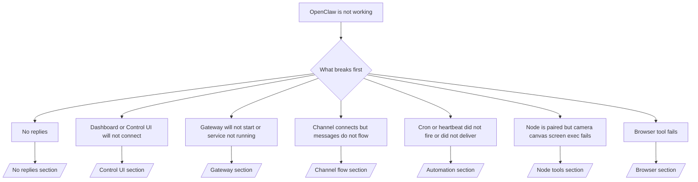

# समस्या-निवारण

यदि आपके पास केवल 2 मिनट हैं, तो इस पृष्ठ को ट्रायेज के प्रवेश द्वार के रूप में उपयोग करें।

## पहले 60 सेकंड

इस सटीक क्रम में यह सीढ़ी चलाएँ:

```bash
openclaw status
openclaw status --all
openclaw gateway probe
openclaw gateway status
openclaw doctor
openclaw channels status --probe
openclaw logs --follow
```

एक पंक्ति में अच्छा आउटपुट:

- `openclaw status` → विन्यस्त चैनल दिखते हैं और कोई स्पष्ट प्रमाणीकरण त्रुटि नहीं होती।
- `openclaw status --all` → पूर्ण रिपोर्ट मौजूद है और साझा की जा सकती है।
- `openclaw gateway probe` → अपेक्षित Gateway लक्ष्य पहुँच योग्य है।
- `openclaw gateway status` → `Runtime: running` और `RPC probe: ok`।
- `openclaw doctor` → कोई अवरोधक विन्यास/सेवा त्रुटियाँ नहीं।
- `openclaw channels status --probe` → चैनल `connected` या `ready` की रिपोर्ट करते हैं।
- `openclaw logs --follow` → स्थिर गतिविधि, कोई दोहराने वाली घातक त्रुटि नहीं।

## निर्णय वृक्ष



<AccordionGroup>
  <Accordion title="No replies">
    ```bash
    openclaw status
    openclaw gateway status
    openclaw channels status --probe
    openclaw pairing list <channel>
    openclaw logs --follow
    ```

    ```
    अच्छा आउटपुट ऐसा दिखता है:
    
    - `Runtime: running`
    - `RPC probe: ok`
    - आपका चैनल `channels status --probe` में connected/ready दिखाता है
    - प्रेषक अनुमोदित प्रतीत होता है (या DM नीति खुली/allowlist है)
    
    सामान्य लॉग हस्ताक्षर:
    
    - `drop guild message (mention required` → Discord में mention gating ने संदेश को अवरुद्ध किया।
    - `pairing request` → प्रेषक अप्रूव नहीं है और DM pairing अनुमोदन की प्रतीक्षा कर रहा है।
    - चैनल लॉग में `blocked` / `allowlist` → प्रेषक, रूम, या समूह फ़िल्टर किया गया है।
    
    गहन पृष्ठ:
    
    - [/gateway/troubleshooting#no-replies](/gateway/troubleshooting#no-replies)
    - [/channels/troubleshooting](/channels/troubleshooting)
    - [/channels/pairing](/channels/pairing)
    ```

  </Accordion>

  <Accordion title="Dashboard or Control UI will not connect">
    ```bash
    openclaw status
    openclaw gateway status
    openclaw logs --follow
    openclaw doctor
    openclaw channels status --probe
    ```

    ```
    अच्छा आउटपुट ऐसा दिखता है:
    
    - `Dashboard: http://...` `openclaw gateway status` में दिखाया जाता है
    - `RPC probe: ok`
    - लॉग में कोई auth loop नहीं
    
    सामान्य लॉग हस्ताक्षर:
    
    - `device identity required` → HTTP/गैर-सुरक्षित संदर्भ डिवाइस auth पूरा नहीं कर सकता।
    - `unauthorized` / reconnect loop → गलत टोकन/पासवर्ड या auth मोड में असंगति।
    - `gateway connect failed:` → UI गलत URL/पोर्ट को लक्षित कर रहा है या Gateway पहुँच योग्य नहीं है।
    
    गहन पृष्ठ:
    
    - [/gateway/troubleshooting#dashboard-control-ui-connectivity](/gateway/troubleshooting#dashboard-control-ui-connectivity)
    - [/web/control-ui](/web/control-ui)
    - [/gateway/authentication](/gateway/authentication)
    ```

  </Accordion>

  <Accordion title="Gateway will not start or service installed but not running">
    ```bash
    openclaw status
    openclaw gateway status
    openclaw logs --follow
    openclaw doctor
    openclaw channels status --probe
    ```

    ```
    अच्छा आउटपुट ऐसा दिखता है:
    
    - `Service: ... (loaded)`
    - `Runtime: running`
    - `RPC probe: ok`
    
    सामान्य लॉग हस्ताक्षर:
    
    - `Gateway start blocked: set gateway.mode=local` → Gateway मोड unset/remote है।
    - `refusing to bind gateway ... without auth` → टोकन/पासवर्ड के बिना non-loopback bind।
    - `another gateway instance is already listening` या `EADDRINUSE` → पोर्ट पहले से उपयोग में है।
    
    गहन पृष्ठ:
    
    - [/gateway/troubleshooting#gateway-service-not-running](/gateway/troubleshooting#gateway-service-not-running)
    - [/gateway/background-process](/gateway/background-process)
    - [/gateway/configuration](/gateway/configuration)
    ```

  </Accordion>

  <Accordion title="Channel connects but messages do not flow">
    ```bash
    openclaw status
    openclaw gateway status
    openclaw logs --follow
    openclaw doctor
    openclaw channels status --probe
    ```

    ```
    अच्छा आउटपुट ऐसा दिखता है:
    
    - चैनल ट्रांसपोर्ट connected है।
    - Pairing/allowlist जाँचें पास होती हैं।
    - जहाँ आवश्यक हो वहाँ mentions का पता लगाया जाता है।
    
    सामान्य लॉग हस्ताक्षर:
    
    - `mention required` → समूह mention gating ने प्रोसेसिंग को अवरुद्ध किया।
    - `pairing` / `pending` → DM प्रेषक अभी अनुमोदित नहीं है।
    - `not_in_channel`, `missing_scope`, `Forbidden`, `401/403` → चैनल अनुमति टोकन समस्या।
    
    गहन पृष्ठ:
    
    - [/gateway/troubleshooting#channel-connected-messages-not-flowing](/gateway/troubleshooting#channel-connected-messages-not-flowing)
    - [/channels/troubleshooting](/channels/troubleshooting)
    ```

  </Accordion>

  <Accordion title="Cron or heartbeat did not fire or did not deliver">
    ```bash
    openclaw status
    openclaw gateway status
    openclaw cron status
    openclaw cron list
    openclaw cron runs --id <jobId> --limit 20
    openclaw logs --follow
    ```

    ```
    अच्छा आउटपुट ऐसा दिखता है:
    
    - `cron.status` अगली wake के साथ enabled दिखाता है।
    - `cron runs` हाल के `ok` प्रविष्टियाँ दिखाता है।
    - Heartbeat enabled है और सक्रिय घंटों के बाहर नहीं है।
    
    सामान्य लॉग हस्ताक्षर:
    
    - `cron: scheduler disabled; jobs will not run automatically` → cron disabled है।
    - `heartbeat skipped` के साथ `reason=quiet-hours` → विन्यस्त सक्रिय घंटों के बाहर।
    - `requests-in-flight` → मुख्य लेन व्यस्त; heartbeat wake स्थगित किया गया।
    - `unknown accountId` → heartbeat डिलीवरी लक्ष्य खाता मौजूद नहीं है।
    
    गहन पृष्ठ:
    
    - [/gateway/troubleshooting#cron-and-heartbeat-delivery](/gateway/troubleshooting#cron-and-heartbeat-delivery)
    - [/automation/troubleshooting](/automation/troubleshooting)
    - [/gateway/heartbeat](/gateway/heartbeat)
    ```

  </Accordion>

  <Accordion title="Node is paired but tool fails camera canvas screen exec">
    ```bash
    openclaw status
    openclaw gateway status
    openclaw nodes status
    openclaw nodes describe --node <idOrNameOrIp>
    openclaw logs --follow
    ```

    ```
    अच्छा आउटपुट ऐसा दिखता है:
    
    - Node भूमिका `node` के लिए connected और paired के रूप में सूचीबद्ध है।
    - जिस कमांड को आप invoke कर रहे हैं उसके लिए क्षमता मौजूद है।
    - टूल के लिए अनुमति स्थिति granted है।
    
    सामान्य लॉग हस्ताक्षर:
    
    - `NODE_BACKGROUND_UNAVAILABLE` → node ऐप को foreground में लाएँ।
    - `*_PERMISSION_REQUIRED` → OS अनुमति अस्वीकृत/अनुपस्थित थी।
    - `SYSTEM_RUN_DENIED: approval required` → exec अनुमोदन लंबित है।
    - `SYSTEM_RUN_DENIED: allowlist miss` → कमांड exec allowlist में नहीं है।
    
    गहन पृष्ठ:
    
    - [/gateway/troubleshooting#node-paired-tool-fails](/gateway/troubleshooting#node-paired-tool-fails)
    - [/nodes/troubleshooting](/nodes/troubleshooting)
    - [/tools/exec-approvals](/tools/exec-approvals)
    ```

  </Accordion>

  <Accordion title="Browser tool fails">
    ```bash
    openclaw status
    openclaw gateway status
    openclaw browser status
    openclaw logs --follow
    openclaw doctor
    ```

    ```
    अच्छा आउटपुट ऐसा दिखता है:
    
    - Browser स्थिति `running: true` और चुना हुआ ब्राउज़र/प्रोफ़ाइल दिखाती है।
    - `openclaw` प्रोफ़ाइल शुरू होती है या `chrome` relay में संलग्न टैब होता है।
    
    सामान्य लॉग हस्ताक्षर:
    
    - `Failed to start Chrome CDP on port` → स्थानीय ब्राउज़र लॉन्च विफल।
    - `browser.executablePath not found` → विन्यस्त binary path गलत है।
    - `Chrome extension relay is running, but no tab is connected` → एक्सटेंशन संलग्न नहीं है।
    - `Browser attachOnly is enabled ... not reachable` → attach-only प्रोफ़ाइल में कोई live CDP target नहीं है।
    
    गहन पृष्ठ:
    
    - [/gateway/troubleshooting#browser-tool-fails](/gateway/troubleshooting#browser-tool-fails)
    - [/tools/browser-linux-troubleshooting](/tools/browser-linux-troubleshooting)
    - [/tools/chrome-extension](/tools/chrome-extension)
    ```

  </Accordion>
</AccordionGroup>
