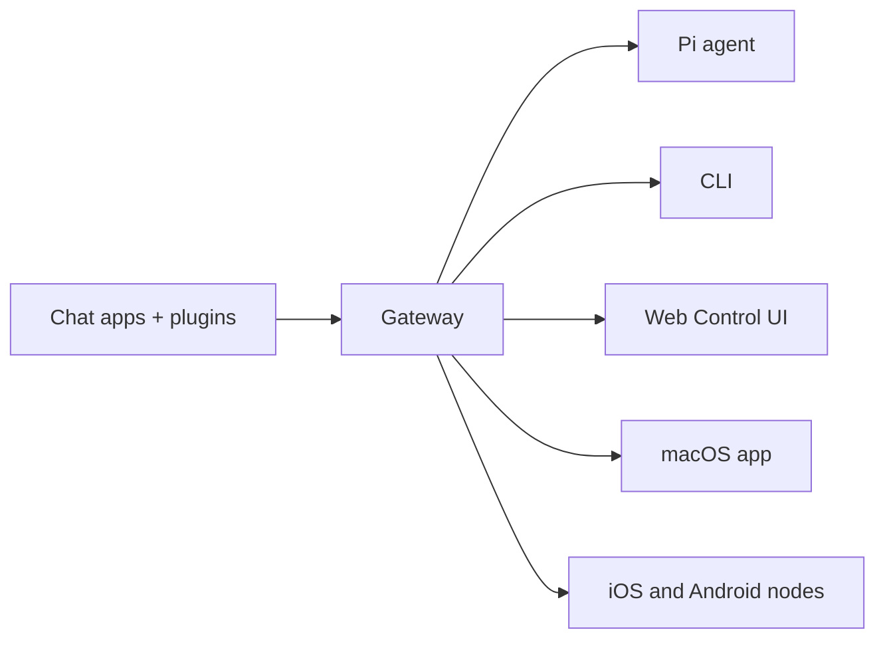

# OpenClaw 🦞

<p align="center">
    
    
</p>

> _"EXFOLIATE!
> 14. EXFOLIATE!"_ — शायद एक स्पेस लॉब्स्टर EXFOLIATE!"_ — शायद एक space lobster

<p align="center"><br />
  एक संदेश भेजें, अपनी जेब से ही एजेंट का जवाब पाएँ।Plugins Mattermost और अन्य जोड़ते हैं। OpenClaw एक **self-hosted gateway** है जो आपके पसंदीदा चैट ऐप्स — WhatsApp, Telegram, Discord, iMessage, और अन्य — को Pi जैसे AI कोडिंग एजेंट्स से जोड़ता है।
</p>

<Columns>
  <Card title="Get Started" href="/start/getting-started" icon="rocket">
    OpenClaw इंस्टॉल करें और मिनटों में Gateway चालू करें।
  </Card>
  <Card title="Run the Wizard" href="/start/wizard" icon="sparkles">
    `openclaw onboard` और पेयरिंग फ़्लोज़ के साथ निर्देशित सेटअप।
  </Card>
  <Card title="Open the Control UI" href="/web/control-ui" icon="layout-dashboard">
    चैट, विन्यास और सत्रों के लिए ब्राउज़र डैशबोर्ड लॉन्च करें।
  </Card>
</Columns>

## OpenClaw क्या है?

आप अपनी मशीन (या किसी सर्वर) पर एक सिंगल Gateway प्रोसेस चलाते हैं, और यह आपके मैसेजिंग ऐप्स और हमेशा उपलब्ध AI असिस्टेंट के बीच पुल बन जाता है। पूरा इंस्टॉल और dev सेटअप चाहिए?

**यह किसके लिए है?** डेवलपर्स और पावर यूज़र्स के लिए जो कहीं से भी संदेश भेजकर उपयोग करने योग्य व्यक्तिगत एआई सहायक चाहते हैं — अपने डेटा पर नियंत्रण छोड़े बिना या किसी होस्टेड सेवा पर निर्भर हुए बिना।

**इसे अलग क्या बनाता है?**

- **Self-hosted**: आपके हार्डवेयर पर चलता है, आपके नियम
- **Multi-channel**: एक Gateway एक साथ WhatsApp, Telegram, Discord, और अन्य को सेवा देता है
- **Agent-native**: टूल उपयोग, सत्र, मेमोरी, और मल्टी-एजेंट रूटिंग के साथ कोडिंग एजेंटों के लिए निर्मित
- **Open source**: MIT लाइसेंस, समुदाय-प्रेरित

**आपको क्या चाहिए?** Node 22+, एक एपीआई कुंजी (Anthropic अनुशंसित), और 5 मिनट।

## यह कैसे काम करता है



Gateway सत्रों, रूटिंग, और चैनल कनेक्शनों के लिए एकमात्र source of truth है।

## प्रमुख क्षमताएँ

<Columns>
  <Card title="Multi-channel gateway" icon="network">
    एक ही Gateway प्रक्रिया के साथ WhatsApp, Telegram, Discord, और iMessage।
  </Card>
  <Card title="Plugin channels" icon="plug">
    एक्सटेंशन पैकेजों के साथ Mattermost और अन्य जोड़ें।
  </Card>
  <Card title="Multi-agent routing" icon="route">
    प्रति एजेंट, वर्कस्पेस, या प्रेषक पृथक सत्र।
  </Card>
  <Card title="Media support" icon="image">
    छवियाँ, ऑडियो, और दस्तावेज़ भेजें और प्राप्त करें।
  </Card>
  <Card title="Web Control UI" icon="monitor">
    चैट, विन्यास, सत्रों, और नोड्स के लिए ब्राउज़र डैशबोर्ड।
  </Card>
  <Card title="Mobile nodes" icon="smartphone">
    Canvas समर्थन के साथ iOS और Android नोड्स को पेयर करें।
  </Card>
</Columns>

## त्वरित प्रारंभ

<Steps>
  <Step title="Install OpenClaw">
    ```bash
    npm install -g openclaw@latest
    ```
  </Step>
  <Step title="Onboard and install the service">
    ```bash
    openclaw onboard --install-daemon
    ```
  </Step>
  <Step title="Pair WhatsApp and start the Gateway">
    ```bash
    openclaw channels login
    openclaw gateway --port 18789
    ```
  </Step>
</Steps>

क्या आपको पूरा install और dev setup चाहिए? openclaw-ansible repo, Ansible डिप्लॉयमेंट के लिए source of truth है।

## डैशबोर्ड

Gateway शुरू होने के बाद ब्राउज़र Control UI खोलें।

- स्थानीय डिफ़ॉल्ट: [http://127.0.0.1:18789/](http://127.0.0.1:18789/)
- दूरस्थ एक्सेस: [Web surfaces](/web) और [Tailscale](/gateway/tailscale)

<p align="center">
  
</p>

## विन्यास (वैकल्पिक)

विन्यास `~/.openclaw/openclaw.json` पर रहता है।

- यदि आप **कुछ नहीं करते**, तो OpenClaw प्रति-प्रेषक सत्रों के साथ RPC मोड में बंडल किए गए Pi बाइनरी का उपयोग करता है।
- यदि आप इसे लॉक डाउन करना चाहते हैं, तो `channels.whatsapp.allowFrom` से शुरू करें और (समूहों के लिए) मेंशन नियम जोड़ें।

उदाहरण:

```json5
{
  channels: {
    whatsapp: {
      allowFrom: ["+15555550123"],
      groups: { "*": { requireMention: true } },
    },
  },
  messages: { groupChat: { mentionPatterns: ["@openclaw"] } },
}
```

## यहाँ से शुरू करें

<Columns>
  <Card title="Docs hubs" href="/start/hubs" icon="book-open">
    उपयोग-केस के अनुसार व्यवस्थित सभी डॉक्स और गाइड्स।
  </Card>
  <Card title="Configuration" href="/gateway/configuration" icon="settings">
    कोर Gateway सेटिंग्स, टोकन, और प्रदाता विन्यास।
  </Card>
  <Card title="Remote access" href="/gateway/remote" icon="globe">
    SSH और टेलनेट एक्सेस पैटर्न।
  </Card>
  <Card title="Channels" href="/channels/telegram" icon="message-square">
    WhatsApp, Telegram, Discord, और अन्य के लिए चैनल-विशिष्ट सेटअप।
  </Card>
  <Card title="Nodes" href="/nodes" icon="smartphone">
    पेयरिंग और Canvas के साथ iOS और Android नोड्स।
  </Card>
  <Card title="Help" href="/help" icon="life-buoy">
    सामान्य समाधान और समस्या-निवारण का प्रवेश बिंदु।
  </Card>
</Columns>

## और जानें

<Columns>
  <Card title="Full feature list" href="/concepts/features" icon="list">
    संपूर्ण चैनल, रूटिंग, और मीडिया क्षमताएँ।
  </Card>
  <Card title="Multi-agent routing" href="/concepts/multi-agent" icon="route">
    वर्कस्पेस आइसोलेशन और प्रति-एजेंट सत्र।
  </Card>
  <Card title="Security" href="/gateway/security" icon="shield">
    टोकन, allowlists, और सुरक्षा नियंत्रण।
  </Card>
  <Card title="Troubleshooting" href="/gateway/troubleshooting" icon="wrench">
    Gateway निदान और सामान्य त्रुटियाँ।
  </Card>
  <Card title="About and credits" href="/reference/credits" icon="info">
    परियोजना की उत्पत्ति, योगदानकर्ता, और लाइसेंस।
  </Card>
</Columns>
