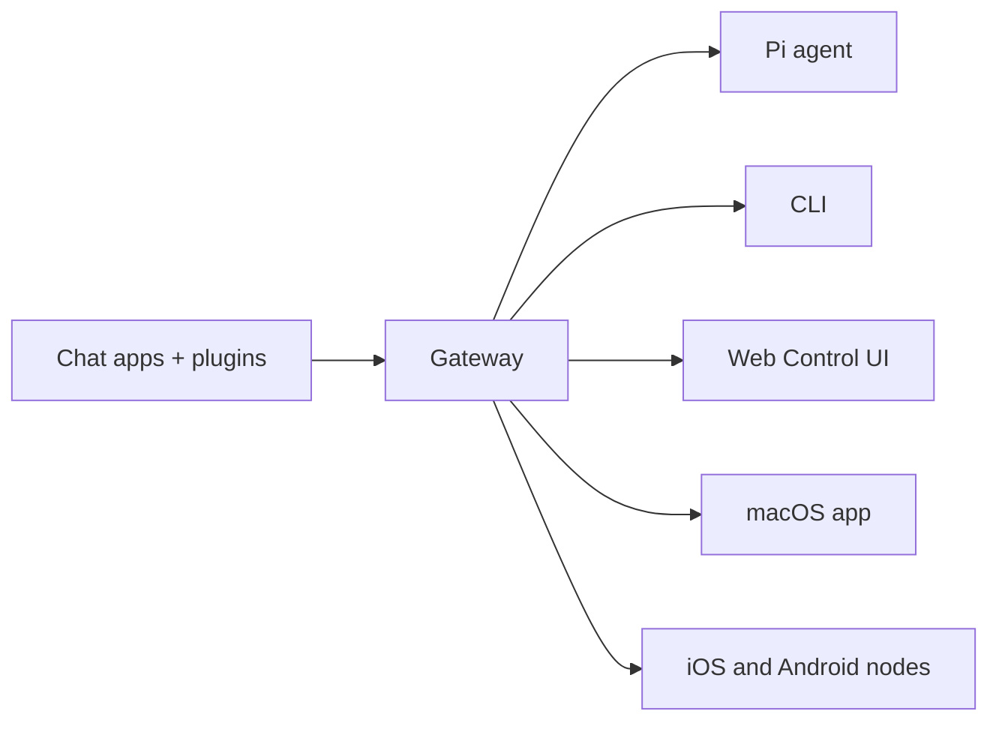

# OpenClaw 🦞

<p align="center">
    
    
</p>

> _"EXFOLIATE! EXFOLIATE!"_ — A space lobster, probably

<p align="center">
  <strong>Any OS gateway for AI agents across WhatsApp, Telegram, Discord, iMessage, and more.</strong><br />
  Send a message, get an agent response from your pocket. Plugins add Mattermost and more.
</p>

<Columns>
  <Card title="Get Started" href="/start/getting-started" icon="rocket">
    Install OpenClaw and bring up the Gateway in minutes.
  </Card>
  <Card title="Run the Wizard" href="/start/wizard" icon="sparkles">
    Guided setup with `openclaw onboard` and pairing flows.
  </Card>
  <Card title="Open the Control UI" href="/web/control-ui" icon="layout-dashboard">
    Launch the browser dashboard for chat, config, and sessions.
  </Card>
</Columns>

## What is OpenClaw?

OpenClaw is a **self-hosted gateway** that connects your favorite chat apps — WhatsApp, Telegram, Discord, iMessage, and more — to AI coding agents like Pi. You run a single Gateway process on your own machine (or a server), and it becomes the bridge between your messaging apps and an always-available AI assistant.

**Who is it for?** Developers and power users who want a personal AI assistant they can message from anywhere — without giving up control of their data or relying on a hosted service.

**What makes it different?**

- **Self-hosted**: runs on your hardware, your rules
- **Multi-channel**: one Gateway serves WhatsApp, Telegram, Discord, and more simultaneously
- **Agent-native**: built for coding agents with tool use, sessions, memory, and multi-agent routing
- **Open source**: MIT licensed, community-driven

**What do you need?** Node 22+, an API key (Anthropic recommended), and 5 minutes.

## How it works



The Gateway is the single source of truth for sessions, routing, and channel connections.

## Key capabilities

<Columns>
  <Card title="Multi-channel gateway" icon="network">
    WhatsApp, Telegram, Discord, and iMessage with a single Gateway process.
  </Card>
  <Card title="Plugin channels" icon="plug">
    Add Mattermost and more with extension packages.
  </Card>
  <Card title="Multi-agent routing" icon="route">
    Isolated sessions per agent, workspace, or sender.
  </Card>
  <Card title="Media support" icon="image">
    Send and receive images, audio, and documents.
  </Card>
  <Card title="Web Control UI" icon="monitor">
    Browser dashboard for chat, config, sessions, and nodes.
  </Card>
  <Card title="Mobile nodes" icon="smartphone">
    Pair iOS and Android nodes with Canvas support.
  </Card>
</Columns>

## Quick start

<Steps>
  <Step title="Install OpenClaw">
    ```bash
    npm install -g openclaw@latest
    ```
  </Step>
  <Step title="Onboard and install the service">
    ```bash
    openclaw onboard --install-daemon
    ```
  </Step>
  <Step title="Pair WhatsApp and start the Gateway">
    ```bash
    openclaw channels login
    openclaw gateway --port 18789
    ```
  </Step>
</Steps>

Need the full install and dev setup? See [Quick start](/start/quickstart).

## Dashboard

Open the browser Control UI after the Gateway starts.

- Local default: [http://127.0.0.1:18789/](http://127.0.0.1:18789/)
- Remote access: [Web surfaces](/web) and [Tailscale](/gateway/tailscale)

<p align="center">
  
</p>

<<<<<<< HEAD

## How it works

```
WhatsApp / Telegram / Discord / iMessage (+ plugins)
        │
        ▼
  ┌───────────────────────────┐
  │          Gateway          │  ws://127.0.0.1:18789 (loopback-only)
  │     (single source)       │
  │                           │  http://<gateway-host>:18793
  │                           │    /__openclaw__/canvas/ (Canvas host)
  └───────────┬───────────────┘
              │
              ├─ Pi agent (RPC)
              ├─ CLI (openclaw …)
              ├─ Chat UI (SwiftUI)
              ├─ macOS app (OpenClaw.app)
              ├─ iOS node via Gateway WS + pairing
              └─ Android node via Gateway WS + pairing
```

Most operations flow through the **Gateway** (`openclaw gateway`), a single long-running process that owns channel connections and the WebSocket control plane.

## Network model

- **One Gateway per host (recommended)**: it is the only process allowed to own the WhatsApp Web session. If you need a rescue bot or strict isolation, run multiple gateways with isolated profiles and ports; see [Multiple gateways](/gateway/multiple-gateways).
- **Loopback-first**: Gateway WS defaults to `ws://127.0.0.1:18789`.
  - The wizard now generates a gateway token by default (even for loopback).
  - For Tailnet access, run `openclaw gateway --bind tailnet --token ...` (token is required for non-loopback binds).
- **Nodes**: connect to the Gateway WebSocket (LAN/tailnet/SSH as needed); legacy TCP bridge is deprecated/removed.
- **Canvas host**: HTTP file server on `canvasHost.port` (default `18793`), serving `/__openclaw__/canvas/` for node WebViews; see [Gateway configuration](/gateway/configuration) (`canvasHost`).
- **Remote use**: SSH tunnel or tailnet/VPN; see [Remote access](/gateway/remote) and [Discovery](/gateway/discovery).

## Features (high level)

- 📱 **WhatsApp Integration** — Uses Baileys for WhatsApp Web protocol
- ✈️ **Telegram Bot** — DMs + groups via grammY
- 🎮 **Discord Bot** — DMs + guild channels via channels.discord.js
- 🧩 **Mattermost Bot (plugin)** — Bot token + WebSocket events
- 💬 **iMessage** — Local imsg CLI integration (macOS)
- 🤖 **Agent bridge** — Pi (RPC mode) with tool streaming
- ⏱️ **Streaming + chunking** — Block streaming + Telegram draft streaming details ([/concepts/streaming](/concepts/streaming))
- 🧠 **Multi-agent routing** — Route provider accounts/peers to isolated agents (workspace + per-agent sessions)
- 📖 **Mind Memory** — Local first-person autobiography (`STORY.md`) with subconscious resonance via Graphiti
- 🔐 **Subscription auth** — Anthropic (Claude Pro/Max) + OpenAI (ChatGPT/Codex) via OAuth
- 💬 **Sessions** — Direct chats collapse into shared `main` (default); groups are isolated
- 👥 **Group Chat Support** — Mention-based by default; owner can toggle `/activation always|mention`
- 📎 **Media Support** — Send and receive images, audio, documents
- 🎤 **Voice notes** — Optional transcription hook
- 🖥️ **WebChat + macOS app** — Local UI + menu bar companion for ops and voice wake
- 📱 **iOS node** — Pairs as a node and exposes a Canvas surface
- 📱 **Android node** — Pairs as a node and exposes Canvas + Chat + Camera

Note: legacy Claude/Codex/Gemini/Opencode paths have been removed; Pi is the only coding-agent path.

## Quick start

Runtime requirement: **Node ≥ 22**.

```bash
# Recommended: global install (npm/pnpm)
npm install -g openclaw@latest
# or: pnpm add -g openclaw@latest

# Onboard + install the service (launchd/systemd user service)
openclaw onboard --install-daemon

# Pair WhatsApp Web (shows QR)
openclaw channels login

# Gateway runs via the service after onboarding; manual run is still possible:
openclaw gateway --port 18789
```

Switching between npm and git installs later is easy: install the other flavor and run `openclaw doctor` to update the gateway service entrypoint.

From source (development):

```bash
git clone https://github.com/openclaw/openclaw.git
cd openclaw
pnpm install
pnpm ui:build # auto-installs UI deps on first run
pnpm build
openclaw onboard --install-daemon
```

If you don’t have a global install yet, run the onboarding step via `pnpm openclaw ...` from the repo.

Multi-instance quickstart (optional):

```bash
OPENCLAW_CONFIG_PATH=~/.openclaw/a.json \
OPENCLAW_STATE_DIR=~/.openclaw-a \
openclaw gateway --port 19001
```

Send a test message (requires a running Gateway):

```bash
openclaw message send --target +15555550123 --message "Hello from OpenClaw"
```

=======

> > > > > > > main

## Configuration (optional)

Config lives at `~/.openclaw/openclaw.json`.

- If you **do nothing**, OpenClaw uses the bundled Pi binary in RPC mode with per-sender sessions.
- If you want to lock it down, start with `channels.whatsapp.allowFrom` and (for groups) mention rules.

Example:

```json5
{
  channels: {
    whatsapp: {
      allowFrom: ["+15555550123"],
      groups: { "*": { requireMention: true } },
    },
  },
  messages: { groupChat: { mentionPatterns: ["@openclaw"] } },
}
```

## Start here

<Columns>
  <Card title="Docs hubs" href="/start/hubs" icon="book-open">
    All docs and guides, organized by use case.
  </Card>
  <Card title="Configuration" href="/gateway/configuration" icon="settings">
    Core Gateway settings, tokens, and provider config.
  </Card>
  <Card title="Remote access" href="/gateway/remote" icon="globe">
    SSH and tailnet access patterns.
  </Card>
  <Card title="Channels" href="/channels/telegram" icon="message-square">
    Channel-specific setup for WhatsApp, Telegram, Discord, and more.
  </Card>
  <Card title="Nodes" href="/nodes" icon="smartphone">
    iOS and Android nodes with pairing and Canvas.
  </Card>
  <Card title="Help" href="/help" icon="life-buoy">
    Common fixes and troubleshooting entry point.
  </Card>
</Columns>

---

## Narrative & Subconscious Memory (The "Mind" Layer)

Beyond static workspace files, Moltbot features a higher-order memory system for continuity and identity:

- **Subconscious Resonance**: Uses **Graphiti** to find "Flashbacks" from the entire episodic history before every turn.
- **Mind Memory (`STORY.md`)**: A consolidated first-person autobiography that defines the agent's soul and relationship arc.

For technical details on these systems, see the **[Memory Architecture](/mind/memory-architecture)** deep dive.

---

## Learn more

<Columns>
  <Card title="Full feature list" href="/concepts/features" icon="list">
    Complete channel, routing, and media capabilities.
  </Card>
  <Card title="Multi-agent routing" href="/concepts/multi-agent" icon="route">
    Workspace isolation and per-agent sessions.
  </Card>
  <Card title="Security" href="/gateway/security" icon="shield">
    Tokens, allowlists, and safety controls.
  </Card>
  <Card title="Troubleshooting" href="/gateway/troubleshooting" icon="wrench">
    Gateway diagnostics and common errors.
  </Card>
  <Card title="About and credits" href="/reference/credits" icon="info">
    Project origins, contributors, and license.
  </Card>
</Columns>
