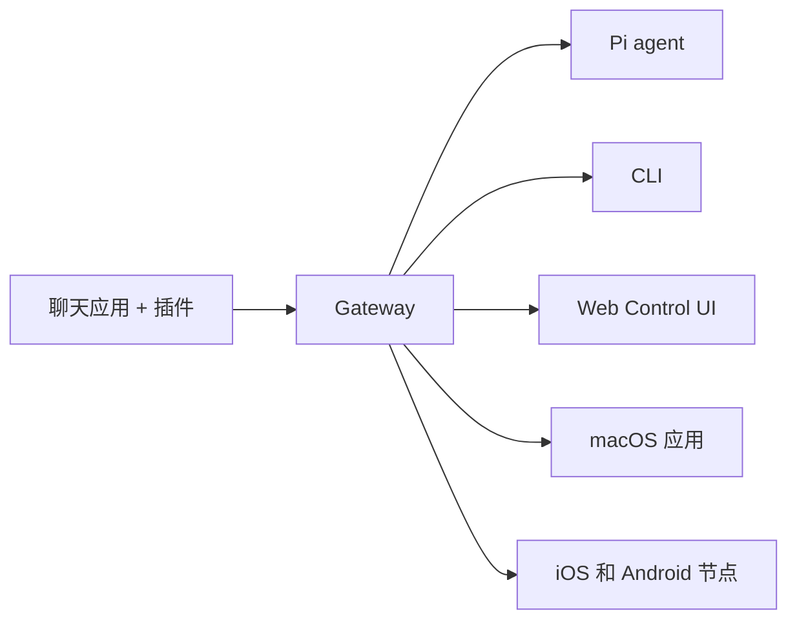

# OpenClaw 🦞

<p align="center">
    
    
</p>

> _"EXFOLIATE! EXFOLIATE!"_ — 一只太空龙虾，大概吧

<p align="center">
  <strong>跨平台 AI Agent 网关，支持 Discord、Google Chat、iMessage、Matrix、Microsoft Teams、Signal、Slack、Telegram、WhatsApp、Zalo 等渠道。</strong><br />
  发送消息，获得来自口袋中的 Agent 响应。通过内置渠道、捆绑渠道插件、WebChat 和移动节点运行一个 Gateway。
</p>

<Columns>
  <Card title="快速开始" href="/start/getting-started" icon="rocket">
    安装 OpenClaw 并在几分钟内启动 Gateway。
  </Card>
  <Card title="运行 onboarding" href="/start/wizard" icon="sparkles">
    通过 `openclaw onboard` 和配对流程进行引导式设置。
  </Card>
  <Card title="打开 Control UI" href="/web/control-ui" icon="layout-dashboard">
    启动浏览器仪表板进行聊天、配置和会话管理。
  </Card>
</Columns>

## 什么是 OpenClaw？

OpenClaw 是一个**自托管网关**，用于连接您喜爱的聊天应用和渠道界面——内置渠道以及捆绑或外部渠道插件，如 Discord、Google Chat、iMessage、Matrix、Microsoft Teams、Signal、Slack、Telegram、WhatsApp、Zalo 等——与 AI 编码 Agent（如 Pi）。您可以在自己的机器上（或服务器上）运行一个 Gateway 进程，它将成为消息应用和全天候可用的 AI 助手之间的桥梁。

**谁适合使用？** 想要拥有个人 AI 助手但又不想放弃数据控制权或依赖托管服务的开发者和高级用户。

**它有什么不同？**

- **自托管**：运行在您的硬件上，您的规则您做主
- **多渠道**：一个 Gateway 同时服务内置渠道以及捆绑或外部渠道插件
- **Agent 原生**：为具备工具使用、会话、记忆和多 Agent 路由的编码 Agent 而构建
- **开源**：MIT 许可，社区驱动

**您需要什么？** Node 24（推荐）或 Node 22 LTS（`22.14+`）以保证兼容性，一个来自您所选提供商的 API 密钥，以及 5 分钟时间。要获得最佳质量和安全性，请使用可用的最新一代最强模型。

## 工作原理


```mermaid
flowchart LR
  A["聊天应用 + 插件"] --> B["Gateway"]
  B --> C["Pi agent"]
  B --> D["CLI"]
  B --> E["Web Control UI"]
  B --> F["macOS 应用"]
  B --> G["iOS 和 Android 节点"]
```

Gateway 是会话、路由和渠道连接的单一事实来源。

## 核心功能

<Columns>
  <Card title="多渠道网关" icon="network" href="/channels">
    Discord、iMessage、Signal、Slack、Telegram、WhatsApp、WebChat 等，一个 Gateway 进程搞定。
  </Card>
  <Card title="插件渠道" icon="plug" href="/tools/plugin">
    捆绑插件在正式发布版中添加 Matrix、Nostr、Twitch、Zalo 等。
  </Card>
  <Card title="多 Agent 路由" icon="route" href="/concepts/multi-agent">
    每个 Agent、工作区或发送者的隔离会话。
  </Card>
  <Card title="媒体支持" icon="image" href="/nodes/images">
    发送和接收图片、音频和文档。
  </Card>
  <Card title="Web Control UI" icon="monitor" href="/web/control-ui">
    用于聊天、配置、会话和节点的浏览器仪表板。
  </Card>
  <Card title="移动节点" icon="smartphone" href="/nodes">
    配对 iOS 和 Android 节点，实现 Canvas、摄像头和语音工作流。
  </Card>
</Columns>

## 快速开始

<Steps>
  <Step title="安装 OpenClaw">
    ```bash
    npm install -g openclaw@latest
    ```
  </Step>
  <Step title="Onboard 并安装服务">
    ```bash
    openclaw onboard --install-daemon
    ```
  </Step>
  <Step title="开始聊天">
    在浏览器中打开 Control UI 并发送消息：

    ```bash
    openclaw dashboard
    ```

    或者连接一个渠道（[Telegram](/channels/telegram) 是最快的），然后从手机上聊天。

  </Step>
</Steps>

需要完整的安装和开发设置？参见[快速开始](/start/getting-started)。

## 控制面板

Gateway 启动后，在浏览器中打开 Control UI。

- 本地默认：[http://127.0.0.1:18789/](http://127.0.0.1:18789/)
- 远程访问：[Web 界面](/web) 和 [Tailscale](/gateway/tailscale)

<p align="center">
  
</p>

## 配置（可选）

配置位于 `~/.openclaw/openclaw.json`。

- 如果您**什么都不做**，OpenClaw 会使用捆绑的 Pi 二进制文件（RPC 模式）和每发送者会话。
- 如果您想锁定它，请从 `channels.whatsapp.allowFrom` 和（对于群组）提及规则开始。

示例：

```json5
{
  channels: {
    whatsapp: {
      allowFrom: ["+15555550123"],
      groups: { "*": { requireMention: true } },
    },
  },
  messages: { groupChat: { mentionPatterns: ["@openclaw"] } },
}
```

## 从这里开始

<Columns>
  <Card title="文档中心" href="/start/hubs" icon="book-open">
    所有文档和指南，按用例组织。
  </Card>
  <Card title="Configuration" href="/gateway/configuration" icon="settings">
    Core Gateway 设置、token 和 provider 配置。
  </Card>
  <Card title="远程访问" href="/gateway/remote" icon="globe">
    SSH 和 tailnet 访问模式。
  </Card>
  <Card title="Channels" href="/channels/telegram" icon="message-square">
    Feishu、Microsoft Teams、WhatsApp、Telegram、Discord 等渠道特定设置。
  </Card>
  <Card title="Nodes" href="/nodes" icon="smartphone">
    配对 iOS 和 Android 节点，包含 Canvas、摄像头和设备操作。
  </Card>
  <Card title="帮助" href="/help" icon="life-buoy">
    常见修复和故障排除入口。
  </Card>
</Columns>

## 了解更多

<Columns>
  <Card title="完整功能列表" href="/concepts/features" icon="list">
    完整的渠道、路由和媒体功能。
  </Card>
  <Card title="多 Agent 路由" href="/concepts/multi-agent" icon="route">
    工作区隔离和按 Agent 的会话。
  </Card>
  <Card title="安全" href="/gateway/security" icon="shield">
    Token、允许列表和安全控制。
  </Card>
  <Card title="故障排除" href="/gateway/troubleshooting" icon="wrench">
    Gateway 诊断和常见错误。
  </Card>
  <Card title="关于和致谢" href="/reference/credits" icon="info">
    项目起源、贡献者和许可证。
  </Card>
</Columns>
