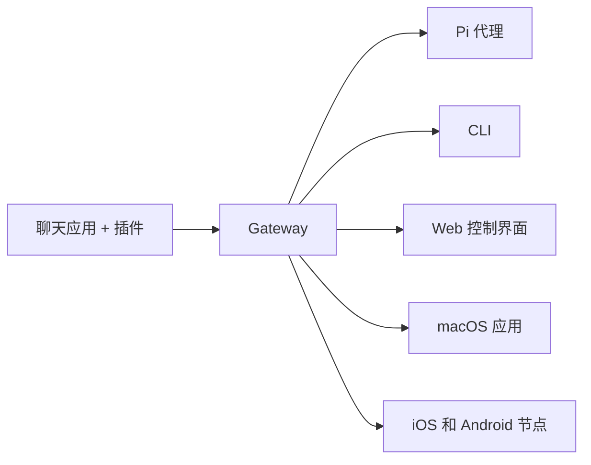

# OpenClaw 🦞

<p align="center">
    
    
</p>

> _"EXFOLIATE! EXFOLIATE!"_ — 一只太空龙虾，可能

<p align="center">
  <strong>适用于 Discord、Google Chat、iMessage、Matrix、Microsoft Teams、Signal、Slack、Telegram、WhatsApp、Zalo 等平台的 AI 代理的全平台网关。</strong><br />
  发送消息，从你的口袋中获得代理响应。在内置通道、捆绑通道插件、WebChat 和移动节点上运行一个 Gateway。
</p>

<Columns>
  <Card title="开始使用" href="/start/getting-started" icon="rocket">
    安装 OpenClaw 并在几分钟内启动 Gateway。
  </Card>
  <Card title="运行引导设置" href="/start/wizard" icon="sparkles">
    使用 `openclaw onboard` 和配对流程进行引导设置。
  </Card>
  <Card title="打开控制界面" href="/web/control-ui" icon="layout-dashboard">
    启动浏览器仪表板，用于聊天、配置和会话。
  </Card>
</Columns>

## 什么是 OpenClaw？

OpenClaw 是一个**自托管网关**，连接你喜爱的聊天应用和通道界面 —— 内置通道加上捆绑或外部通道插件，如 Discord、Google Chat、iMessage、Matrix、Microsoft Teams、Signal、Slack、Telegram、WhatsApp、Zalo 等 —— 到像 Pi 这样的 AI 编码代理。你在自己的机器（或服务器）上运行单个 Gateway 进程，它成为你的消息应用和始终可用的 AI 助手之间的桥梁。

**它适合谁？** 希望拥有个人 AI 助手的开发者和高级用户，他们可以从任何地方发送消息 —— 无需放弃对数据的控制或依赖托管服务。

**它有什么不同？**

- **自托管**：在你的硬件上运行，遵循你的规则
- **多通道**：一个 Gateway 同时服务于内置通道加上捆绑或外部通道插件
- **代理原生**：为具有工具使用、会话、内存和多代理路由的编码代理而构建
- **开源**：MIT 许可，社区驱动

**你需要什么？** Node 24（推荐），或 Node 22 LTS（`22.14+`）以确保兼容性，来自你选择的提供商的 API 密钥，以及 5 分钟时间。为获得最佳质量和安全性，请使用可用的最强大的最新一代模型。

## 它如何工作



Gateway 是会话、路由和通道连接的唯一真实来源。

## 核心功能

<Columns>
  <Card title="多通道网关" icon="network">
    Discord、iMessage、Signal、Slack、Telegram、WhatsApp、WebChat 等，使用单个 Gateway 进程。
  </Card>
  <Card title="插件通道" icon="plug">
    捆绑插件在正常当前版本中添加 Matrix、Nostr、Twitch、Zalo 等。
  </Card>
  <Card title="多代理路由" icon="route">
    每个代理、工作区或发送者的隔离会话。
  </Card>
  <Card title="媒体支持" icon="image">
    发送和接收图像、音频和文档。
  </Card>
  <Card title="Web 控制界面" icon="monitor">
    用于聊天、配置、会话和节点的浏览器仪表板。
  </Card>
  <Card title="移动节点" icon="smartphone">
    配对 iOS 和 Android 节点，用于 Canvas、相机和语音启用的工作流。
  </Card>
</Columns>

## 快速开始

<Steps>
  <Step title="安装 OpenClaw">
    ```bash
    npm install -g openclaw@latest
    ```
  </Step>
  <Step title="引导设置并安装服务">
    ```bash
    openclaw onboard --install-daemon
    ```
  </Step>
  <Step title="聊天">
    在浏览器中打开控制界面并发送消息：

    ```bash
    openclaw dashboard
    ```

    或连接通道（[Telegram](/channels/telegram) 最快）并从你的手机聊天。

  </Step>
</Steps>

需要完整的安装和开发设置？请参阅 [入门指南](/start/getting-started)。

## 仪表板

Gateway 启动后，打开浏览器控制界面。

- 本地默认：[http://127.0.0.1:18789/](http://127.0.0.1:18789/)
- 远程访问：[Web 界面](/web) 和 [Tailscale](/gateway/tailscale)

<p align="center">
  
</p>

## 配置（可选）

配置位于 `~/.openclaw/openclaw.json`。

- 如果你**什么都不做**，OpenClaw 将使用 RPC 模式下的捆绑 Pi 二进制文件，带有每个发送者的会话。
- 如果你想锁定它，从 `channels.whatsapp.allowFrom` 和（对于群组）提及规则开始。

示例：

```json5
{
  channels: {
    whatsapp: {
      allowFrom: ["+15555550123"],
      groups: { "*": { requireMention: true } },
    },
  },
  messages: { groupChat: { mentionPatterns: ["@openclaw"] } },
}
```

## 从这里开始

<Columns>
  <Card title="文档中心" href="/start/hubs" icon="book-open">
    所有文档和指南，按用例组织。
  </Card>
  <Card title="配置" href="/gateway/configuration" icon="settings">
    核心 Gateway 设置、令牌和提供商配置。
  </Card>
  <Card title="远程访问" href="/gateway/remote" icon="globe">
    SSH 和 tailnet 访问模式。
  </Card>
  <Card title="通道" href="/channels/telegram" icon="message-square">
    针对 Feishu、Microsoft Teams、WhatsApp、Telegram、Discord 等的通道特定设置。
  </Card>
  <Card title="节点" href="/nodes" icon="smartphone">
    带有配对、Canvas、相机和设备操作的 iOS 和 Android 节点。
  </Card>
  <Card title="帮助" href="/help" icon="life-buoy">
    常见修复和故障排除入口点。
  </Card>
</Columns>

## 了解更多

<Columns>
  <Card title="完整功能列表" href="/concepts/features" icon="list">
    完整的通道、路由和媒体功能。
  </Card>
  <Card title="多代理路由" href="/concepts/multi-agent" icon="route">
    工作区隔离和每个代理的会话。
  </Card>
  <Card title="安全性" href="/gateway/security" icon="shield">
    令牌、允许列表和安全控制。
  </Card>
  <Card title="故障排除" href="/gateway/troubleshooting" icon="wrench">
    Gateway 诊断和常见错误。
  </Card>
  <Card title="关于和 credits" href="/reference/credits" icon="info">
    项目起源、贡献者和许可证。
  </Card>
</Columns>