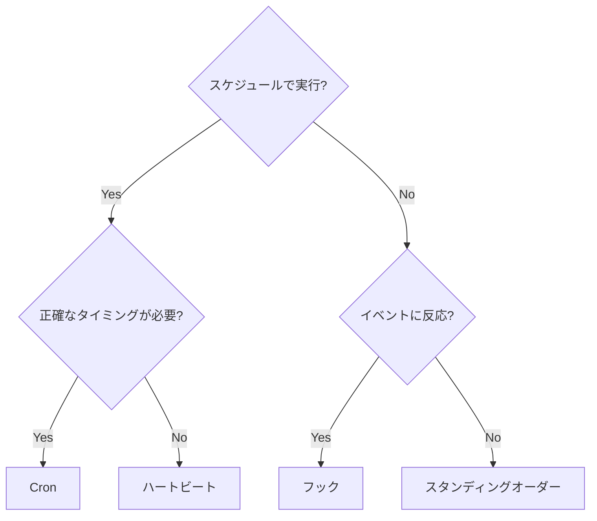

---
read_when:
    - OpenClawでの作業を自動化する方法を決める場合
    - ハートビート、cron、フック、Webhookのどれを使うか選ぶ場合
    - 適切な自動化のエントリーポイントを探している場合
summary: 'すべての自動化メカニズムの概要: ハートビート、cron、タスク、フック、Webhook など'
title: 自動化の概要
x-i18n:
    generated_at: "2026-04-02T07:30:13Z"
    model: claude-opus-4-6
    provider: anthropic
    source_hash: 8fe3b0feb3683aa2473bc0a9d2bacab486b681084c3a407aea8bd932dfe248a8
    source_path: automation/index.md
    workflow: 15
---

# 自動化

OpenClawはいくつかの自動化メカニズムを提供しており、それぞれ異なるユースケースに適しています。このページでは適切なメカニズムの選び方を説明します。

## クイック判断ガイド

## メカニズム一覧

| メカニズム                                      | 機能                                                     | 実行場所                  | タスクレコードの作成 |
| ---------------------------------------------- | -------------------------------------------------------- | ------------------------ | ------------------- |
| [ハートビート](/gateway/heartbeat)                | 定期的なメインセッションのターン — 複数のチェックをバッチ処理     | メインセッション             | なし                  |
| [Cron](/automation/cron-jobs)                  | 正確なタイミングでのスケジュールジョブ                       | メインまたは分離セッション | あり（全タイプ）     |
| [バックグラウンドタスク](/automation/tasks)          | 分離された作業（cron、ACP、サブエージェント、CLI）を追跡         | N/A（台帳）             | N/A                 |
| [フック](/automation/hooks)                     | エージェントのライフサイクルイベントによってトリガーされるイベント駆動スクリプト | フックランナー              | なし                  |
| [スタンディングオーダー](/automation/standing-orders) | システムプロンプトに注入される永続的な指示  | メインセッション             | なし                  |
| [Webhook](/automation/webhook)                | インバウンドHTTPイベントを受信してエージェントにルーティング       | Gateway ゲートウェイHTTP             | なし                  |

### 特化型自動化

| メカニズム                                      | 機能                                    |
| ---------------------------------------------- | ----------------------------------------------- |
| [Gmail PubSub](/automation/gmail-pubsub)       | Google PubSub経由のリアルタイムGmail通知 |
| [ポーリング](/automation/poll)                    | 定期的なデータソースチェック（RSS、APIなど）   |
| [認証モニタリング](/automation/auth-monitoring) | 資格情報の健全性と有効期限のアラート             |

## 連携の仕組み

最も効果的なセットアップは、複数のメカニズムを組み合わせたものです:

1. **ハートビート**は、30分ごとに1回のバッチ処理ターンでルーチン監視（受信トレイ、カレンダー、通知）を処理します。
2. **Cron**は、正確なスケジュール（日次レポート、週次レビュー）やワンショットリマインダーを処理します。
3. **フック**は、特定のイベント（ツール呼び出し、セッションリセット、コンパクション）にカスタムスクリプトで反応します。
4. **スタンディングオーダー**は、エージェントに永続的なコンテキストを与えます（「返信前に必ずプロジェクトボードを確認する」など）。
5. **バックグラウンドタスク**は、すべての分離された作業を自動的に追跡し、検査や監査を可能にします。

2つのスケジューリングメカニズムの詳細な比較については、[Cronとハートビートの比較](/automation/cron-vs-heartbeat)を参照してください。

## 古いClawFlowの参照

古いリリースノートやドキュメントでは`ClawFlow`や`openclaw flows`と記載されている場合がありますが、このリポジトリの現在のCLIサーフェスは`openclaw tasks`です。

サポートされているタスク台帳コマンドについては[バックグラウンドタスク](/automation/tasks)を、互換性に関する注意事項については[ClawFlow](/automation/clawflow)および[CLI: flows](/cli/flows)を参照してください。

## 関連

- [Cronとハートビートの比較](/automation/cron-vs-heartbeat) — 詳細な比較ガイド
- [ClawFlow](/automation/clawflow) — 古いドキュメントやリリースノートとの互換性に関する注意
- [トラブルシューティング](/automation/troubleshooting) — 自動化の問題のデバッグ
- [設定リファレンス](/gateway/configuration-reference) — すべての設定キー
