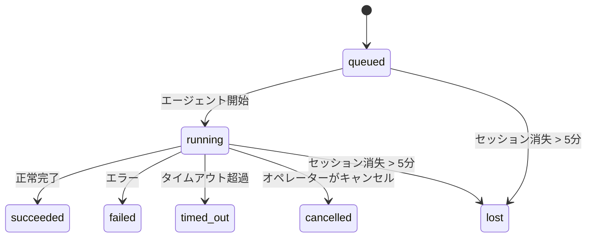

---
read_when:
    - 進行中または最近完了したバックグラウンド作業を検査する場合
    - 分離されたエージェント実行の配信失敗をデバッグする場合
    - バックグラウンド実行がセッション、cron、ハートビートとどのように関連するかを理解する場合
summary: ACPの実行、サブエージェント、分離されたcronジョブ、CLI操作のバックグラウンドタスク追跡
title: バックグラウンドタスク
x-i18n:
    generated_at: "2026-04-02T07:31:16Z"
    model: claude-opus-4-6
    provider: anthropic
    source_hash: 0e78165b53fa8bbe144095ee972132b9d8685bbe087e89e95465d7ae132179ac
    source_path: automation/tasks.md
    workflow: 15
---

# バックグラウンドタスク

> **Cron vs ハートビート vs タスク？** 適切なスケジューリングメカニズムの選び方は[Cronとハートビートの比較](/automation/cron-vs-heartbeat)を参照してください。このページはバックグラウンド作業の**追跡**について説明しており、スケジューリングについてではありません。

バックグラウンドタスクは、**メインの会話セッション外**で実行される作業を追跡します:
ACPの実行、サブエージェントの生成、分離されたcronジョブの実行、CLIから開始された操作などです。

タスクはセッション、cronジョブ、ハートビートを**置き換えるものではありません** — 分離された作業がいつ、何が起こり、成功したかどうかを記録する**アクティビティ台帳**です。

<Note>
すべてのエージェント実行がタスクを作成するわけではありません。ハートビートのターンや通常のインタラクティブチャットは作成しません。すべてのcron実行、ACPの生成、サブエージェントの生成、CLIエージェントコマンドは作成します。
</Note>

## 要約

- タスクは**レコード**であり、スケジューラーではありません — cronとハートビートが作業の実行タイミングを決定し、タスクは_何が起こったか_を追跡します。
- ACP、サブエージェント、すべてのcronジョブ、CLI操作がタスクを作成します。ハートビートのターンは作成しません。
- 各タスクは`queued → running → terminal`（succeeded、failed、timed_out、cancelled、またはlost）と遷移します。
- 完了通知はチャネルに直接配信されるか、次のハートビートのためにキューに入れられます。
- `openclaw tasks list`ですべてのタスクを表示。`openclaw tasks audit`で問題を発見します。
- ターミナルレコードは7日間保持され、その後自動的に削除されます。

## クイックスタート

```bash
# すべてのタスクを一覧表示（新しい順）
openclaw tasks list

# ランタイムまたはステータスでフィルター
openclaw tasks list --runtime acp
openclaw tasks list --status running

# 特定のタスクの詳細を表示（ID、実行ID、またはセッションキー）
openclaw tasks show <lookup>

# 実行中のタスクをキャンセル（子セッションを終了）
openclaw tasks cancel <lookup>

# タスクの通知ポリシーを変更
openclaw tasks notify <lookup> state_changes

# ヘルス監査を実行
openclaw tasks audit
```

## タスクを作成するもの

| ソース                 | ランタイムタイプ | タスクレコードが作成されるタイミング                          | デフォルト通知ポリシー |
| ---------------------- | ------------ | ------------------------------------------------------ | --------------------- |
| ACPバックグラウンド実行    | `acp`        | 子ACPセッションの生成時                           | `done_only`           |
| サブエージェントオーケストレーション | `subagent`   | `sessions_spawn`によるサブエージェントの生成時               | `done_only`           |
| Cronジョブ（全タイプ）  | `cron`       | すべてのcron実行（メインセッションおよび分離）       | `silent`              |
| CLI操作         | `cli`        | Gateway ゲートウェイ経由で実行される`openclaw agent`コマンド | `done_only`           |

メインセッションのcronタスクはデフォルトで`silent`通知ポリシーを使用します — 追跡用のレコードを作成しますが、通知は生成しません。分離されたcronタスクもデフォルトは`silent`ですが、独自のセッションで実行されるためより可視性が高くなります。

**タスクを作成しないもの:**

- ハートビートのターン — メインセッション。[ハートビート](/gateway/heartbeat)を参照
- 通常のインタラクティブチャットのターン
- `/command`への直接レスポンス

## タスクのライフサイクル



| ステータス      | 意味                                                              |
| ----------- | -------------------------------------------------------------------------- |
| `queued`    | 作成済み、エージェントの開始を待機中                                    |
| `running`   | エージェントのターンがアクティブに実行中                                           |
| `succeeded` | 正常に完了                                                     |
| `failed`    | エラーで完了                                                    |
| `timed_out` | 設定されたタイムアウトを超過                                            |
| `cancelled` | `openclaw tasks cancel`でオペレーターにより停止                        |
| `lost`      | バッキング子セッションが消失（5分間の猶予期間後に検出） |

遷移は自動的に発生します — 関連するエージェント実行が終了すると、タスクのステータスが一致するように更新されます。

## 配信と通知

タスクがターミナル状態に達すると、OpenClawが通知します。配信パスは2つあります:

**直接配信** — タスクにチャネルターゲット（`requesterOrigin`）がある場合、完了メッセージはそのチャネル（Telegram、Discord、Slackなど）に直接送信されます。

**セッションキュー配信** — 直接配信が失敗した場合、またはオリジンが設定されていない場合、更新はリクエスターのセッションにシステムイベントとしてキューに入れられ、次のハートビートで表示されます。

<Tip>
タスクの完了は即座にハートビートのウェイクをトリガーするため、結果をすぐに確認できます — 次のスケジュールされたハートビートティックを待つ必要はありません。
</Tip>

### 通知ポリシー

各タスクについてどの程度通知を受けるかを制御します:

| ポリシー                | 配信される内容                                                       |
| --------------------- | ----------------------------------------------------------------------- |
| `done_only`（デフォルト） | ターミナル状態のみ（succeeded、failedなど）— **これがデフォルトです** |
| `state_changes`       | すべての状態遷移と進捗更新                              |
| `silent`              | 何も配信しない                                                          |

タスクの実行中にポリシーを変更:

```bash
openclaw tasks notify <lookup> state_changes
```

## CLIリファレンス

### `tasks list`

```bash
openclaw tasks list [--runtime <acp|subagent|cron|cli>] [--status <status>] [--json]
```

出力列: Task ID、Kind、Status、Delivery、Run ID、Child Session、Summary。

### `tasks show`

```bash
openclaw tasks show <lookup>
```

ルックアップトークンはタスクID、実行ID、またはセッションキーを受け付けます。タイミング、配信状態、エラー、ターミナルサマリーを含む完全なレコードを表示します。

### `tasks cancel`

```bash
openclaw tasks cancel <lookup>
```

ACPおよびサブエージェントタスクの場合、子セッションを終了します。ステータスは`cancelled`に遷移し、配信通知が送信されます。

### `tasks notify`

```bash
openclaw tasks notify <lookup> <done_only|state_changes|silent>
```

### `tasks audit`

```bash
openclaw tasks audit [--json]
```

運用上の問題を検出します。検出結果は問題が見つかった場合`openclaw status`にも表示されます。

| 検出結果                   | 重大度 | トリガー                                               |
| ------------------------- | -------- | ----------------------------------------------------- |
| `stale_queued`            | warn     | 10分以上キューに滞留                       |
| `stale_running`           | error    | 30分以上実行中                      |
| `lost`                    | error    | バッキングセッションが消失                               |
| `delivery_failed`         | warn     | 配信が失敗し、通知ポリシーが`silent`でない     |
| `missing_cleanup`         | warn     | クリーンアップタイムスタンプのないターミナルタスク               |
| `inconsistent_timestamps` | warn     | タイムライン違反（例: 開始前に終了） |

## チャットタスクボード（`/tasks`）

任意のチャットセッションで`/tasks`を使用して、そのセッションにリンクされたバックグラウンドタスクを確認できます。ボードには
ランタイム、ステータス、タイミング、進捗またはエラーの詳細とともに、アクティブおよび最近完了したタスクが表示されます。

現在のセッションにリンクされたタスクが表示されない場合、`/tasks`はエージェントローカルのタスクカウントにフォールバックするため、
他のセッションの詳細を漏洩することなく概要を確認できます。

完全なオペレーター台帳にはCLIを使用してください: `openclaw tasks list`。

## ステータス統合（タスクプレッシャー）

`openclaw status`にはタスクの概要が一目で分かるように含まれています:

```
Tasks: 3 queued · 2 running · 1 issues
```

サマリーの内容:

- **active** — `queued` + `running`の数
- **failures** — `failed` + `timed_out` + `lost`の数
- **byRuntime** — `acp`、`subagent`、`cron`、`cli`ごとの内訳

`/status`と`session_status`ツールはどちらもクリーンアップ対応のタスクスナップショットを使用します: アクティブなタスクが
優先され、古い完了行は非表示になり、最近の失敗はアクティブな作業がない場合にのみ表示されます。これにより、ステータスカードは今重要なことに集中できます。

## ストレージとメンテナンス

### タスクの保存場所

タスクレコードは以下のSQLiteに永続化されます:

```
$OPENCLAW_STATE_DIR/tasks/runs.sqlite
```

レジストリはGateway ゲートウェイの起動時にメモリにロードされ、再起動時の耐久性のためにSQLiteに書き込みを同期します。

### 自動メンテナンス

スイーパーが**60秒**ごとに実行され、3つの処理を行います:

1. **調整** — アクティブなタスクのバッキングセッションがまだ存在するか確認します。子セッションが5分以上消失している場合、タスクは`lost`としてマークされます。
2. **クリーンアップスタンプ** — ターミナルタスクに`cleanupAfter`タイムスタンプ（endedAt + 7日）を設定します。
3. **プルーニング** — `cleanupAfter`の日付を過ぎたレコードを削除します。

**保持期間**: ターミナルタスクレコードは**7日間**保持され、その後自動的に削除されます。設定は不要です。

## タスクと他のシステムとの関係

### タスクと古いフロー参照

一部の古いOpenClawのリリースノートやドキュメントでは、タスク管理を`ClawFlow`と呼び、`openclaw flows`コマンドサーフェスとして記載していました。

現在のコードベースでは、サポートされているオペレーターサーフェスは`openclaw tasks`です。古い参照を現在のタスクコマンドにマッピングする互換性に関する注意事項については、[ClawFlow](/automation/clawflow)および[CLI: flows](/cli/flows)を参照してください。

### タスクとcron

cronジョブの**定義**は`~/.openclaw/cron/jobs.json`にあります。**すべての**cron実行がタスクレコードを作成します — メインセッションと分離の両方です。メインセッションのcronタスクはデフォルトで`silent`通知ポリシーを使用するため、通知を生成せずに追跡します。

[Cronジョブ](/automation/cron-jobs)を参照してください。

### タスクとハートビート

ハートビートの実行はメインセッションのターンです — タスクレコードは作成しません。タスクが完了すると、ハートビートのウェイクをトリガーして結果を素早く確認できるようにすることができます。

[ハートビート](/gateway/heartbeat)を参照してください。

### タスクとセッション

タスクは`childSessionKey`（作業が実行される場所）と`requesterSessionKey`（開始した人）を参照する場合があります。セッションは会話コンテキストであり、タスクはその上のアクティビティ追跡です。

### タスクとエージェント実行

タスクの`runId`は、作業を行うエージェント実行にリンクします。エージェントのライフサイクルイベント（開始、終了、エラー）はタスクのステータスを自動的に更新します — ライフサイクルを手動で管理する必要はありません。

## 関連

- [自動化の概要](/automation) — すべての自動化メカニズムを一目で確認
- [ClawFlow](/automation/clawflow) — 古いドキュメントやリリースノートとの互換性に関する注意
- [Cronジョブ](/automation/cron-jobs) — バックグラウンド作業のスケジューリング
- [Cronとハートビートの比較](/automation/cron-vs-heartbeat) — 適切なメカニズムの選択
- [ハートビート](/gateway/heartbeat) — 定期的なメインセッションのターン
- [CLI: flows](/cli/flows) — 誤ったコマンド名に関する互換性の注意
- [CLI: タスク](/cli/index#tasks) — CLIコマンドリファレンス
