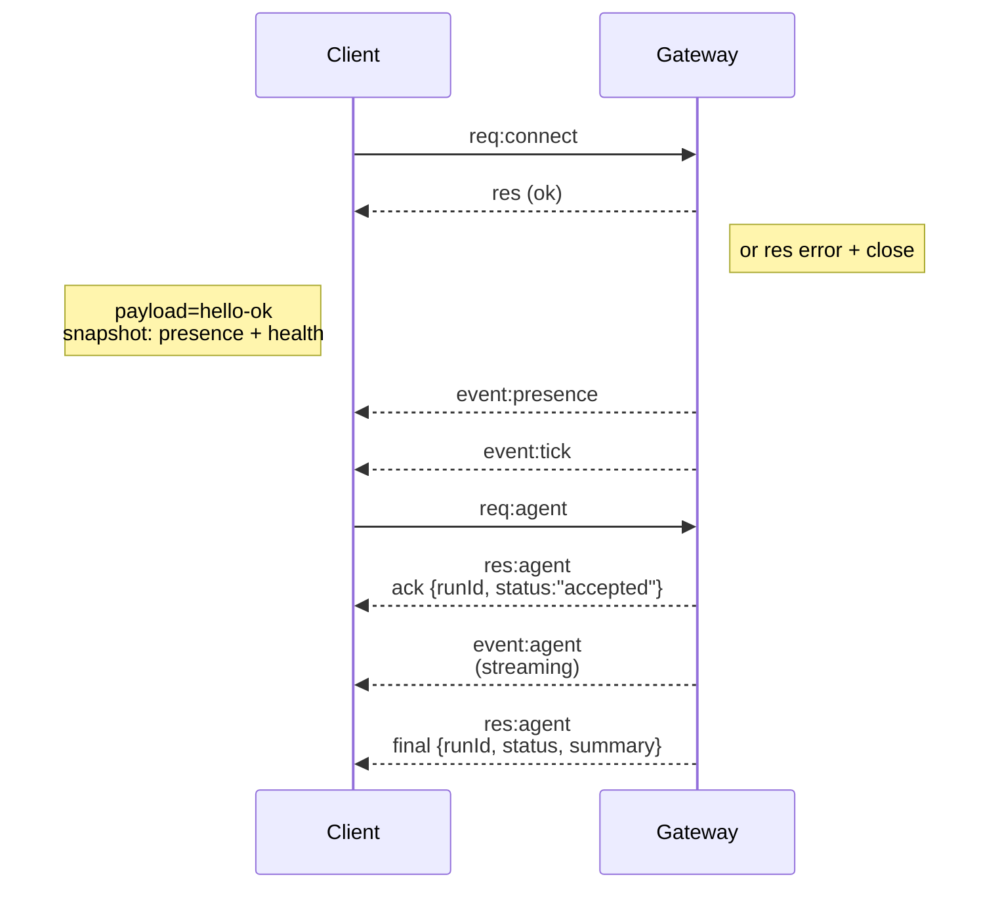

---
read_when:
    - Gateway ゲートウェイプロトコル、クライアント、またはトランスポートの開発時
summary: WebSocket Gateway ゲートウェイのアーキテクチャ、コンポーネント、およびクライアントフロー
title: Gateway ゲートウェイ アーキテクチャ
x-i18n:
    generated_at: "2026-04-02T07:36:43Z"
    model: claude-opus-4-6
    provider: anthropic
    source_hash: 621c709f7c93550f5159a6032f5d586d7c6a635f3ae98afa196f5bf5f738c215
    source_path: concepts/architecture.md
    workflow: 15
---

# Gateway ゲートウェイ アーキテクチャ

## 概要

- 単一の長寿命 **Gateway ゲートウェイ**がすべてのメッセージング面（Baileys 経由の WhatsApp、grammY 経由の Telegram、Slack、Discord、Signal、iMessage、WebChat）を管理します。
- コントロールプレーンクライアント（macOS アプリ、CLI、Web UI、自動化）は、設定されたバインドホスト（デフォルト `127.0.0.1:18789`）上の **WebSocket** で Gateway ゲートウェイに接続します。
- **ノード**（macOS/iOS/Android/ヘッドレス）も **WebSocket** で接続しますが、明示的な機能/コマンドとともに `role: node` を宣言します。
- ホストごとに 1 つの Gateway ゲートウェイ。WhatsApp セッションを開く唯一の場所です。
- **キャンバスホスト**は Gateway ゲートウェイ HTTP サーバーの以下のパスで提供されます：
  - `/__openclaw__/canvas/`（エージェントが編集可能な HTML/CSS/JS）
  - `/__openclaw__/a2ui/`（A2UI ホスト）
    Gateway ゲートウェイと同じポート（デフォルト `18789`）を使用します。

## コンポーネントとフロー

### Gateway ゲートウェイ（デーモン）

- プロバイダー接続を維持します。
- 型付き WS API（リクエスト、レスポンス、サーバープッシュイベント）を公開します。
- 受信フレームを JSON Schema に対して検証します。
- `agent`、`chat`、`presence`、`health`、`heartbeat`、`cron` などのイベントを発行します。

### クライアント（Mac アプリ / CLI / Web 管理画面）

- クライアントごとに 1 つの WS 接続。
- リクエストを送信（`health`、`status`、`send`、`agent`、`system-presence`）。
- イベントをサブスクライブ（`tick`、`agent`、`presence`、`shutdown`）。

### ノード（macOS / iOS / Android / ヘッドレス）

- `role: node` で**同じ WS サーバー**に接続します。
- `connect` でデバイス ID を提供し、ペアリングは**デバイスベース**（ロール `node`）で、承認はデバイスペアリングストアに保存されます。
- `canvas.*`、`camera.*`、`screen.record`、`location.get` などのコマンドを公開します。

プロトコルの詳細：

- [Gateway ゲートウェイプロトコル](/gateway/protocol)

### WebChat

- チャット履歴と送信に Gateway ゲートウェイ WS API を使用する静的 UI。
- リモートセットアップでは、他のクライアントと同じ SSH/Tailscale トンネルを経由して接続します。

## 接続ライフサイクル（単一クライアント）



## ワイヤプロトコル（概要）

- トランスポート：WebSocket、JSON ペイロードのテキストフレーム。
- 最初のフレームは `connect` で**なければなりません**。
- ハンドシェイク後：
  - リクエスト：`{type:"req", id, method, params}` → `{type:"res", id, ok, payload|error}`
  - イベント：`{type:"event", event, payload, seq?, stateVersion?}`
- `OPENCLAW_GATEWAY_TOKEN`（または `--token`）が設定されている場合、`connect.params.auth.token` が一致しないとソケットは切断されます。
- 冪等性キーは副作用のあるメソッド（`send`、`agent`）で安全にリトライするために必須です。サーバーは短寿命の重複排除キャッシュを保持します。
- ノードは `connect` に `role: "node"` と機能/コマンド/パーミッションを含める必要があります。

## ペアリング + ローカル信頼

- すべての WS クライアント（オペレーター + ノード）は `connect` 時に**デバイス ID** を含めます。
- 新しいデバイス ID にはペアリング承認が必要です。Gateway ゲートウェイは以降の接続用に**デバイストークン**を発行します。
- **ローカル**接続（ループバックまたは Gateway ゲートウェイホスト自身の Tailscale アドレス）は、同一ホストの UX をスムーズに保つために自動承認できます。
- すべての接続は `connect.challenge` ノンスに署名する必要があります。
- 署名ペイロード `v3` は `platform` + `deviceFamily` もバインドします。Gateway ゲートウェイは再接続時にペアリング済みメタデータを固定し、メタデータの変更には再ペアリングを要求します。
- **非ローカル**接続には依然として明示的な承認が必要です。
- Gateway ゲートウェイ認証（`gateway.auth.*`）は、ローカルかリモートかに関わらず**すべての**接続に適用されます。

詳細：[Gateway ゲートウェイプロトコル](/gateway/protocol)、[ペアリング](/channels/pairing)、
[セキュリティ](/gateway/security)。

## プロトコルの型定義とコード生成

- TypeBox スキーマがプロトコルを定義します。
- JSON Schema はこれらのスキーマから生成されます。
- Swift モデルは JSON Schema から生成されます。

## リモートアクセス

- 推奨：Tailscale または VPN。
- 代替手段：SSH トンネル

  ```bash
  ssh -N -L 18789:127.0.0.1:18789 user@host
  ```

- トンネル経由でも同じハンドシェイク + 認証トークンが適用されます。
- リモートセットアップでは、WS に対して TLS + オプションのピンニングを有効にできます。

## 運用スナップショット

- 起動：`openclaw gateway`（フォアグラウンド、stdout にログ出力）。
- ヘルスチェック：WS 経由の `health`（`hello-ok` にも含まれます）。
- 監視：自動再起動用に launchd/systemd。

## 不変条件

- ホストごとに正確に 1 つの Gateway ゲートウェイが単一の Baileys セッションを管理します。
- ハンドシェイクは必須です。非 JSON または非 `connect` の最初のフレームはハードクローズとなります。
- イベントはリプレイされません。クライアントはギャップ時にリフレッシュする必要があります。

## 関連

- [エージェントループ](/concepts/agent-loop) — エージェント実行サイクルの詳細
- [Gateway ゲートウェイプロトコル](/gateway/protocol) — WebSocket プロトコル契約
- [キュー](/concepts/queue) — コマンドキューと同時実行制御
- [セキュリティ](/gateway/security) — 信頼モデルと堅牢化
