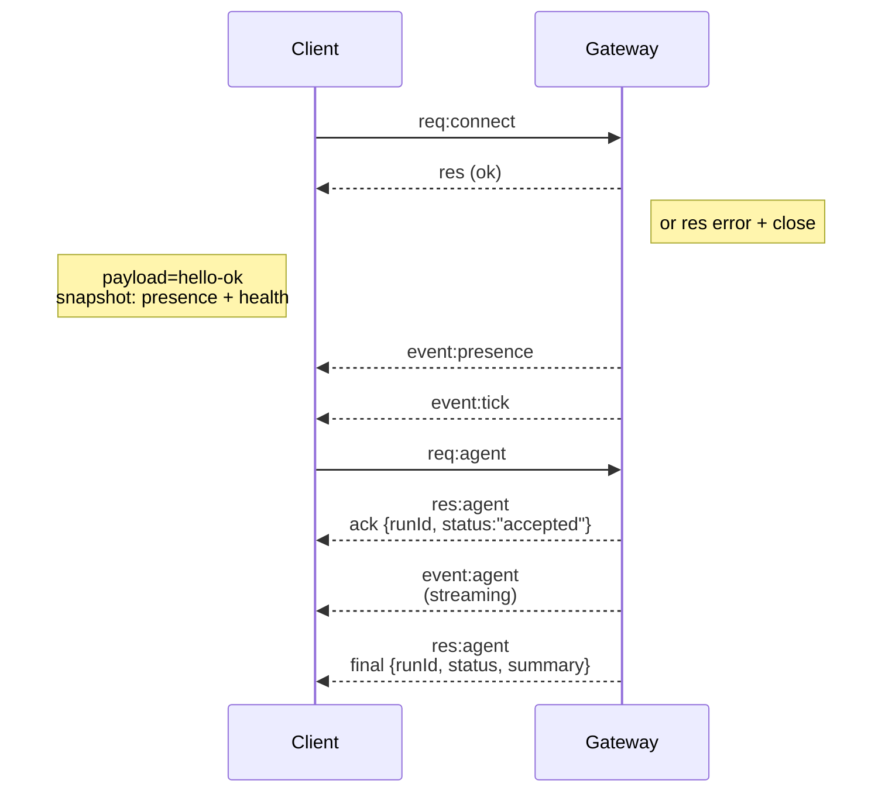

# Gatewayアーキテクチャ

最終更新日: 2026-01-22

## 概要

- 単一の長寿命**Gateway**がすべてのメッセージングサーフェス（Baileys経由のWhatsApp、grammY経由のTelegram、Slack、Discord、Signal、iMessage、WebChat）を所有します。
- コントロールプレーンクライアント（macOSアプリ、CLI、Web UI、オートメーション）は、設定されたバインドホスト（デフォルト`127.0.0.1:18789`）上の**WebSocket**でGatewayに接続します。
- **ノード**（macOS/iOS/Android/ヘッドレス）も**WebSocket**で接続しますが、明示的なキャパビリティ/コマンドを持つ`role: node`を宣言します。
- 1ホストにつき1つのGateway。WhatsAppセッションを開くのはGatewayだけです。
- **キャンバスホスト**はGateway HTTPサーバーの以下のパスで提供されます:
  - `/__openclaw__/canvas/`（エージェントが編集可能なHTML/CSS/JS）
  - `/__openclaw__/a2ui/`（A2UIホスト）
    Gatewayと同じポート（デフォルト`18789`）を使用します。

## コンポーネントとフロー

### Gateway（デーモン）

- プロバイダー接続を維持します。
- 型付きWS API（リクエスト、レスポンス、サーバープッシュイベント）を公開します。
- 受信フレームをJSON Schemaに対して検証します。
- `agent`、`chat`、`presence`、`health`、`heartbeat`、`cron`などのイベントを発行します。

### クライアント（macアプリ / CLI / Webアドミン）

- クライアントごとに1つのWS接続。
- リクエストを送信します（`health`、`status`、`send`、`agent`、`system-presence`）。
- イベントを購読します（`tick`、`agent`、`presence`、`shutdown`）。

### ノード（macOS / iOS / Android / ヘッドレス）

- `role: node`で**同じWSサーバー**に接続します。
- `connect`でデバイスIDを提供します。ペアリングは**デバイスベース**（ロール`node`）で、承認はデバイスペアリングストアに保存されます。
- `canvas.*`、`camera.*`、`screen.record`、`location.get`などのコマンドを公開します。

プロトコルの詳細:

- [Gatewayプロトコル](/gateway/protocol)

### WebChat

- Gateway WS APIを使用してチャット履歴と送信を行う静的UIです。
- リモートセットアップでは、他のクライアントと同じSSH/Tailscaleトンネルを経由して接続します。

## 接続ライフサイクル（単一クライアント）



## ワイヤプロトコル（概要）

- トランスポート: WebSocket、JSONペイロードを含むテキストフレーム。
- 最初のフレームは`connect`で**なければなりません**。
- ハンドシェイク後:
  - リクエスト: `{type:"req", id, method, params}` → `{type:"res", id, ok, payload|error}`
  - イベント: `{type:"event", event, payload, seq?, stateVersion?}`
- `OPENCLAW_GATEWAY_TOKEN`（または`--token`）が設定されている場合、`connect.params.auth.token`が一致しなければソケットは閉じられます。
- 冪等キーは副作用のあるメソッド（`send`、`agent`）に必要で、安全にリトライできます。サーバーは短寿命の重複排除キャッシュを保持します。
- ノードは`connect`で`role: "node"`とキャパビリティ/コマンド/パーミッションを含める必要があります。

## ペアリングとローカル信頼

- すべてのWSクライアント（オペレーター + ノード）は`connect`時に**デバイスID**を含めます。
- 新しいデバイスIDにはペアリング承認が必要です。Gatewayは後続の接続用に**デバイストークン**を発行します。
- **ローカル**接続（ループバックまたはGatewayホスト自身のTailnetアドレス）は、同一ホストのUXをスムーズにするために自動承認できます。
- すべての接続は`connect.challenge`ノンスに署名する必要があります。
- 署名ペイロード`v3`は`platform` + `deviceFamily`もバインドします。Gatewayは再接続時にペアリング済みメタデータを固定し、メタデータの変更には再ペアリングを要求します。
- **非ローカル**接続には明示的な承認が必要です。
- Gateway認証（`gateway.auth.*`）はローカル・リモートを問わず**すべての**接続に適用されます。

詳細: [Gatewayプロトコル](/gateway/protocol)、[ペアリング](/channels/pairing)、
[セキュリティ](/gateway/security)。

## プロトコルの型定義とコード生成

- TypeBoxスキーマがプロトコルを定義します。
- それらのスキーマからJSON Schemaが生成されます。
- JSON SchemaからSwiftモデルが生成されます。

## リモートアクセス

- 推奨: TailscaleまたはVPN。
- 代替: SSHトンネル

  ```bash
  ssh -N -L 18789:127.0.0.1:18789 user@host
  ```

- トンネル上でも同じハンドシェイク + 認証トークンが適用されます。
- リモートセットアップではWSのTLS + オプションのピン留めを有効にできます。

## 運用スナップショット

- 開始: `openclaw gateway`（フォアグラウンド、stdoutにログ出力）。
- ヘルスチェック: WS経由の`health`（`hello-ok`にも含まれます）。
- 監視: 自動再起動にはlaunchd/systemd。

## 不変条件

- 1つのGatewayが1ホストにつき単一のBaileysセッションを制御します。
- ハンドシェイクは必須です。非JSONまたは非connectの最初のフレームは即座に切断されます。
- イベントはリプレイされません。クライアントはギャップがある場合にリフレッシュする必要があります。
