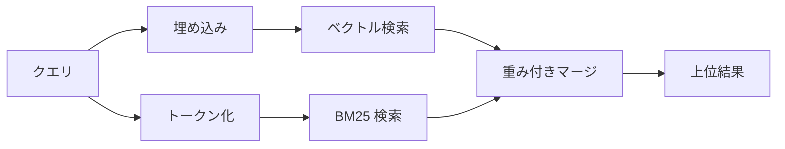

---
read_when:
    - memory_search の仕組みを理解したいとき
    - 埋め込みプロバイダーを選択したいとき
    - 検索品質を調整したいとき
summary: メモリ検索が埋め込みとハイブリッド検索を使って関連するノートを見つける仕組み
title: メモリ検索
x-i18n:
    generated_at: "2026-04-02T07:37:44Z"
    model: claude-opus-4-6
    provider: anthropic
    source_hash: 87b1cb3469c7805f95bca5e77a02919d1e06d626ad3633bbc5465f6ab9db12a2
    source_path: concepts/memory-search.md
    workflow: 15
---

# メモリ検索

`memory_search` は、元のテキストと異なる表現でも、メモリファイルから関連するノートを見つけます。メモリを小さなチャンクにインデックス化し、埋め込み、キーワード、またはその両方を使って検索します。

## クイックスタート

OpenAI、Gemini、Voyage、または Mistral の API キーが設定されている場合、メモリ検索は自動的に動作します。プロバイダーを明示的に設定するには:

```json5
{
  agents: {
    defaults: {
      memorySearch: {
        provider: "openai", // または "gemini"、"local"、"ollama" など
      },
    },
  },
}
```

API キーなしでローカル埋め込みを使用するには、`provider: "local"` を使用します（node-llama-cpp が必要です）。

## サポートされるプロバイダー

| プロバイダー | ID        | API キーが必要 | 備考                          |
| ------------ | --------- | -------------- | ----------------------------- |
| OpenAI       | `openai`  | はい           | 自動検出、高速                |
| Gemini       | `gemini`  | はい           | 画像/音声インデックスに対応   |
| Voyage       | `voyage`  | はい           | 自動検出                      |
| Mistral      | `mistral` | はい           | 自動検出                      |
| Ollama       | `ollama`  | いいえ         | ローカル、明示的な設定が必要  |
| Local        | `local`   | いいえ         | GGUF モデル、約0.6 GB のダウンロード |

## 検索の仕組み

OpenClaw は2つの検索パスを並行して実行し、結果をマージします:



- **ベクトル検索**は意味的に類似したノートを見つけます（「gateway host」が「OpenClaw を実行しているマシン」にマッチします）。
- **BM25 キーワード検索**は完全一致を見つけます（ID、エラー文字列、設定キー）。

片方のパスのみ利用可能な場合（埋め込みなしまたは FTS なし）、もう一方が単独で実行されます。

## 検索品質の向上

ノート履歴が大量にある場合、2つのオプション機能が役立ちます:

### 時間減衰

古いノートのランキング重みが徐々に低下し、最近の情報が優先的に表示されます。デフォルトの半減期30日では、先月のノートは元の重みの50%でスコアリングされます。`MEMORY.md` のような常時有効なファイルは減衰されません。

<Tip>
エージェントに数か月分の日次ノートがあり、古い情報が最近のコンテキストより上位にランクされ続ける場合は、時間減衰を有効にしてください。
</Tip>

### MMR（多様性）

冗長な結果を削減します。5つのノートがすべて同じルーター設定に言及している場合、MMR は繰り返しではなく異なるトピックをカバーする上位結果を確保します。

<Tip>
`memory_search` が異なる日次ノートからほぼ重複したスニペットを返し続ける場合は、MMR を有効にしてください。
</Tip>

### 両方を有効にする

```json5
{
  agents: {
    defaults: {
      memorySearch: {
        query: {
          hybrid: {
            mmr: { enabled: true },
            temporalDecay: { enabled: true },
          },
        },
      },
    },
  },
}
```

## マルチモーダルメモリ

Gemini Embedding 2 を使用すると、Markdown と並んで画像や音声ファイルもインデックス化できます。検索クエリはテキストのままですが、視覚的および音声的なコンテンツにマッチします。セットアップについては[メモリ設定リファレンス](/reference/memory-config)を参照してください。

## セッションメモリ検索

オプションでセッションのトランスクリプトをインデックス化し、`memory_search` で以前の会話を呼び出すことができます。これは `memorySearch.experimental.sessionMemory` によるオプトインです。詳細は[設定リファレンス](/reference/memory-config)を参照してください。

## トラブルシューティング

**結果が表示されない場合:** `openclaw memory status` を実行してインデックスを確認してください。空の場合は `openclaw memory index --force` を実行してください。

**キーワードマッチのみの場合:** 埋め込みプロバイダーが設定されていない可能性があります。`openclaw memory status --deep` を確認してください。

**CJK テキストが見つからない場合:** `openclaw memory index --force` で FTS インデックスを再構築してください。

## 参考資料

- [メモリ](/concepts/memory) -- ファイルレイアウト、バックエンド、ツール
- [メモリ設定リファレンス](/reference/memory-config) -- すべての設定項目
