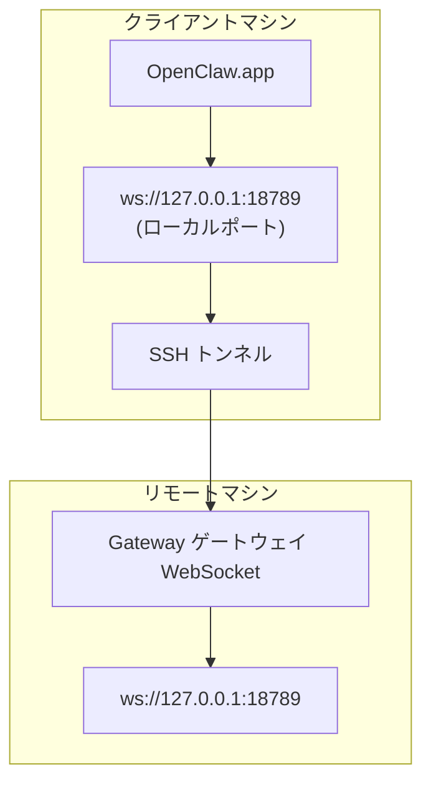

> このコンテンツは [リモートアクセス](/gateway/remote#macos-persistent-ssh-tunnel-via-launchagent) にマージされました。現在のガイドはそちらのページを参照してください。

# リモート Gateway ゲートウェイで OpenClaw.app を実行する

OpenClaw.app は SSH トンネリングを使用してリモート Gateway ゲートウェイに接続します。このガイドでは設定方法を説明します。

## 概要



## クイックセットアップ

### ステップ 1: SSH 設定を追加する

`~/.ssh/config` を編集して以下を追加します：

```ssh
Host remote-gateway
    HostName <REMOTE_IP>          # 例: 172.27.187.184
    User <REMOTE_USER>            # 例: jefferson
    LocalForward 18789 127.0.0.1:18789
    IdentityFile ~/.ssh/id_rsa
```

`<REMOTE_IP>` と `<REMOTE_USER>` をご自分の値に置き換えてください。

### ステップ 2: SSH キーをコピーする

公開鍵をリモートマシンにコピーします（パスワードは一度入力するだけ）：

```bash
ssh-copy-id -i ~/.ssh/id_rsa <REMOTE_USER>@<REMOTE_IP>
```

### ステップ 3: Gateway ゲートウェイトークンを設定する

```bash
launchctl setenv OPENCLAW_GATEWAY_TOKEN "<your-token>"
```

### ステップ 4: SSH トンネルを起動する

```bash
ssh -N remote-gateway &
```

### ステップ 5: OpenClaw.app を再起動する

```bash
# OpenClaw.app を終了し（⌘Q）、再度開く：
open /path/to/OpenClaw.app
```

アプリは SSH トンネル経由でリモート Gateway ゲートウェイに接続します。

---

## ログイン時にトンネルを自動起動する

ログイン時に SSH トンネルを自動起動するには、Launch Agent を作成します。

### PLIST ファイルを作成する

`~/Library/LaunchAgents/ai.openclaw.ssh-tunnel.plist` として保存します：

```xml
<?xml version="1.0" encoding="UTF-8"?>
<!DOCTYPE plist PUBLIC "-//Apple//DTD PLIST 1.0//EN" "http://www.apple.com/DTDs/PropertyList-1.0.dtd">
<plist version="1.0">
<dict>
    <key>Label</key>
    <string>ai.openclaw.ssh-tunnel</string>
    <key>ProgramArguments</key>
    <array>
        <string>/usr/bin/ssh</string>
        <string>-N</string>
        <string>remote-gateway</string>
    </array>
    <key>KeepAlive</key>
    <true/>
    <key>RunAtLoad</key>
    <true/>
</dict>
</plist>
```

### Launch Agent をロードする

```bash
launchctl bootstrap gui/$UID ~/Library/LaunchAgents/ai.openclaw.ssh-tunnel.plist
```

トンネルは以下のようになります：

- ログイン時に自動起動
- クラッシュ時に再起動
- バックグラウンドで継続実行

レガシーノート: 存在する場合は `com.openclaw.ssh-tunnel` LaunchAgent を削除してください。

---

## トラブルシューティング

**トンネルが実行中か確認：**

```bash
ps aux | grep "ssh -N remote-gateway" | grep -v grep
lsof -i :18789
```

**トンネルを再起動：**

```bash
launchctl kickstart -k gui/$UID/ai.openclaw.ssh-tunnel
```

**トンネルを停止：**

```bash
launchctl bootout gui/$UID/ai.openclaw.ssh-tunnel
```

---

## 仕組み

| コンポーネント                       | 機能                                                         |
| ------------------------------------ | ------------------------------------------------------------ |
| `LocalForward 18789 127.0.0.1:18789` | ローカルポート 18789 をリモートポート 18789 に転送           |
| `ssh -N`                             | リモートコマンドを実行しない SSH（ポート転送のみ）           |
| `KeepAlive`                          | クラッシュ時にトンネルを自動再起動                           |
| `RunAtLoad`                          | エージェントのロード時にトンネルを起動                       |

OpenClaw.app はクライアントマシン上の `ws://127.0.0.1:18789` に接続します。SSH トンネルはその接続を、Gateway ゲートウェイが実行されているリモートマシンのポート 18789 に転送します。
