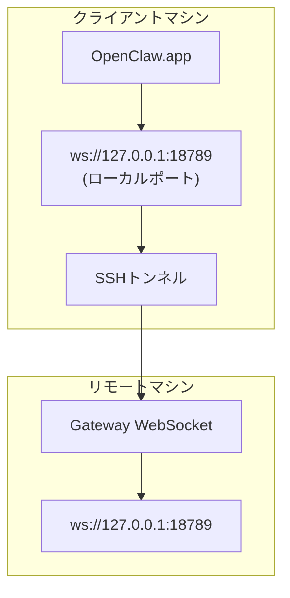

# リモートGatewayでのOpenClaw.appの実行

OpenClaw.appはSSHトンネリングを使用してリモートGatewayに接続します。このガイドではセットアップ方法を説明します。

## 概要



## クイックセットアップ

### ステップ1：SSH設定を追加

`~/.ssh/config`を編集して以下を追加します：

```ssh
Host remote-gateway
    HostName <REMOTE_IP>          # 例：172.27.187.184
    User <REMOTE_USER>            # 例：jefferson
    LocalForward 18789 127.0.0.1:18789
    IdentityFile ~/.ssh/id_rsa
```

`<REMOTE_IP>`と`<REMOTE_USER>`をあなたの値に置き換えてください。

### ステップ2：SSH鍵をコピー

公開鍵をリモートマシンにコピーします（パスワードを1回入力）：

```bash
ssh-copy-id -i ~/.ssh/id_rsa <REMOTE_USER>@<REMOTE_IP>
```

### ステップ3：Gatewayトークンを設定

```bash
launchctl setenv OPENCLAW_GATEWAY_TOKEN "<your-token>"
```

### ステップ4：SSHトンネルを開始

```bash
ssh -N remote-gateway &
```

### ステップ5：OpenClaw.appを再起動

```bash
# OpenClaw.appを終了（⌘Q）し、再度開きます：
open /path/to/OpenClaw.app
```

アプリはSSHトンネルを経由してリモートGatewayに接続します。

---

## ログイン時のトンネル自動起動

ログイン時にSSHトンネルが自動的に開始されるようにLaunch Agentを作成します。

### PLISTファイルの作成

`~/Library/LaunchAgents/ai.openclaw.ssh-tunnel.plist`として保存します：

```xml
<?xml version="1.0" encoding="UTF-8"?>
<!DOCTYPE plist PUBLIC "-//Apple//DTD PLIST 1.0//EN" "http://www.apple.com/DTDs/PropertyList-1.0.dtd">
<plist version="1.0">
<dict>
    <key>Label</key>
    <string>ai.openclaw.ssh-tunnel</string>
    <key>ProgramArguments</key>
    <array>
        <string>/usr/bin/ssh</string>
        <string>-N</string>
        <string>remote-gateway</string>
    </array>
    <key>KeepAlive</key>
    <true/>
    <key>RunAtLoad</key>
    <true/>
</dict>
</plist>
```

### Launch Agentのロード

```bash
launchctl bootstrap gui/$UID ~/Library/LaunchAgents/ai.openclaw.ssh-tunnel.plist
```

トンネルは以下のように動作します：

- ログイン時に自動的に開始
- クラッシュした場合は再起動
- バックグラウンドで実行を継続

レガシーに関する注意：残っている`com.openclaw.ssh-tunnel` LaunchAgentがあれば削除してください。

---

## トラブルシューティング

**トンネルが実行中か確認：**

```bash
ps aux | grep "ssh -N remote-gateway" | grep -v grep
lsof -i :18789
```

**トンネルを再起動：**

```bash
launchctl kickstart -k gui/$UID/ai.openclaw.ssh-tunnel
```

**トンネルを停止：**

```bash
launchctl bootout gui/$UID/ai.openclaw.ssh-tunnel
```

---

## 仕組み

| コンポーネント                            | 機能                                                 |
| ------------------------------------ | ------------------------------------------------------------ |
| `LocalForward 18789 127.0.0.1:18789` | ローカルポート18789をリモートポート18789に転送               |
| `ssh -N`                             | リモートコマンドを実行せずにSSH接続（ポートフォワーディングのみ） |
| `KeepAlive`                          | トンネルがクラッシュした場合に自動的に再起動                  |
| `RunAtLoad`                          | エージェントがロードされたときにトンネルを開始                |

OpenClaw.appはクライアントマシンの`ws://127.0.0.1:18789`に接続します。SSHトンネルはその接続をGatewayが実行されているリモートマシンのポート18789に転送します。
