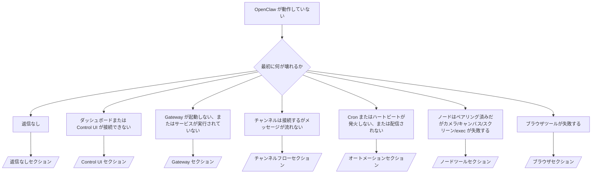

# トラブルシューティング

2 分しかない場合は、このページをトリアージの入口として使用してください。

## 最初の 60 秒

以下の手順をこの順番で実行してください:

```bash
openclaw status
openclaw status --all
openclaw gateway probe
openclaw gateway status
openclaw doctor
openclaw channels status --probe
openclaw logs --follow
```

1 行での正常な出力:

- `openclaw status` → 設定されたチャンネルが表示され、明らかな認証エラーがない。
- `openclaw status --all` → 完全なレポートが存在し、共有可能。
- `openclaw gateway probe` → 期待される Gateway のターゲットに到達可能。
- `openclaw gateway status` → `Runtime: running` かつ `RPC probe: ok`。
- `openclaw doctor` → ブロッキングとなる設定/サービスエラーなし。
- `openclaw channels status --probe` → チャンネルが `connected` または `ready` と報告。
- `openclaw logs --follow` → 安定したアクティビティ、繰り返す致命的エラーなし。

## デシジョンツリー



<AccordionGroup>
  <Accordion title="返信なし">
    ```bash
    openclaw status
    openclaw gateway status
    openclaw channels status --probe
    openclaw pairing list --channel <channel> [--account <id>]
    openclaw logs --follow
    ```

    正常な出力の例:

    - `Runtime: running`
    - `RPC probe: ok`
    - チャンネルが `channels status --probe` で connected/ready と表示される
    - 送信者が承認済み（または DM ポリシーがオープン/許可リスト）

    よくあるログのシグネチャ:

    - `drop guild message (mention required` → Discord でメンションゲーティングがメッセージをブロックしました。
    - `pairing request` → 送信者は未承認で DM ペアリングの承認待ちです。
    - `blocked` / `allowlist` （チャンネルログ内）→ 送信者、ルーム、またはグループがフィルタリングされています。

    詳細ページ:

    - [/gateway/troubleshooting#no-replies](/gateway/troubleshooting#no-replies)
    - [/channels/troubleshooting](/channels/troubleshooting)
    - [/channels/pairing](/channels/pairing)

  </Accordion>

  <Accordion title="ダッシュボードまたは Control UI が接続できない">
    ```bash
    openclaw status
    openclaw gateway status
    openclaw logs --follow
    openclaw doctor
    openclaw channels status --probe
    ```

    正常な出力の例:

    - `Dashboard: http://...` が `openclaw gateway status` に表示される
    - `RPC probe: ok`
    - ログに認証ループがない

    よくあるログのシグネチャ:

    - `device identity required` → HTTP/非セキュアコンテキストでデバイス認証を完了できません。
    - `unauthorized` / 再接続ループ → 誤ったトークン/パスワードまたは認証モードの不一致。
    - `gateway connect failed:` → UI が誤った URL/ポートまたは到達不可能な Gateway をターゲットにしています。

    詳細ページ:

    - [/gateway/troubleshooting#dashboard-control-ui-connectivity](/gateway/troubleshooting#dashboard-control-ui-connectivity)
    - [/web/control-ui](/web/control-ui)
    - [/gateway/authentication](/gateway/authentication)

  </Accordion>

  <Accordion title="Gateway が起動しない、またはサービスはインストールされているが実行されていない">
    ```bash
    openclaw status
    openclaw gateway status
    openclaw logs --follow
    openclaw doctor
    openclaw channels status --probe
    ```

    正常な出力の例:

    - `Service: ... (loaded)`
    - `Runtime: running`
    - `RPC probe: ok`

    よくあるログのシグネチャ:

    - `Gateway start blocked: set gateway.mode=local` → Gateway モードが未設定/リモートです。
    - `refusing to bind gateway ... without auth` → トークン/パスワードなしで非ループバックバインドが試みられました。
    - `another gateway instance is already listening` または `EADDRINUSE` → ポートがすでに使用されています。

    詳細ページ:

    - [/gateway/troubleshooting#gateway-service-not-running](/gateway/troubleshooting#gateway-service-not-running)
    - [/gateway/background-process](/gateway/background-process)
    - [/gateway/configuration](/gateway/configuration)

  </Accordion>

  <Accordion title="チャンネルは接続するがメッセージが流れない">
    ```bash
    openclaw status
    openclaw gateway status
    openclaw logs --follow
    openclaw doctor
    openclaw channels status --probe
    ```

    正常な出力の例:

    - チャンネルトランスポートが接続されている。
    - ペアリング/許可リストのチェックが通過している。
    - 必要な場所でメンションが検出されている。

    よくあるログのシグネチャ:

    - `mention required` → グループメンションゲーティングが処理をブロックしました。
    - `pairing` / `pending` → DM 送信者がまだ承認されていません。
    - `not_in_channel`、`missing_scope`、`Forbidden`、`401/403` → チャンネルパーミッショントークンの問題。

    詳細ページ:

    - [/gateway/troubleshooting#channel-connected-messages-not-flowing](/gateway/troubleshooting#channel-connected-messages-not-flowing)
    - [/channels/troubleshooting](/channels/troubleshooting)

  </Accordion>

  <Accordion title="Cron またはハートビートが発火しない、または配信されない">
    ```bash
    openclaw status
    openclaw gateway status
    openclaw cron status
    openclaw cron list
    openclaw cron runs --id <jobId> --limit 20
    openclaw logs --follow
    ```

    正常な出力の例:

    - `cron.status` が有効で次のウェイクが表示される。
    - `cron runs` に最近の `ok` エントリが表示される。
    - ハートビートが有効でアクティブ時間外ではない。

    よくあるログのシグネチャ:

    - `cron: scheduler disabled; jobs will not run automatically` → cron が無効です。
    - `heartbeat skipped` with `reason=quiet-hours` → 設定されたアクティブ時間外です。
    - `requests-in-flight` → メインレーンがビジー。ハートビートの起動が延期されました。
    - `unknown accountId` → ハートビートの配信先アカウントが存在しません。

    詳細ページ:

    - [/gateway/troubleshooting#cron-and-heartbeat-delivery](/gateway/troubleshooting#cron-and-heartbeat-delivery)
    - [/automation/troubleshooting](/automation/troubleshooting)
    - [/gateway/heartbeat](/gateway/heartbeat)

  </Accordion>

  <Accordion title="ノードはペアリング済みだがカメラ/キャンバス/スクリーン/exec が失敗する">
    ```bash
    openclaw status
    openclaw gateway status
    openclaw nodes status
    openclaw nodes describe --node <idOrNameOrIp>
    openclaw logs --follow
    ```

    正常な出力の例:

    - ノードが `node` ロールとして接続・ペアリングされているとリストされている。
    - 呼び出しているコマンドのケイパビリティが存在する。
    - ツールに対してパーミッション状態が付与されている。

    よくあるログのシグネチャ:

    - `NODE_BACKGROUND_UNAVAILABLE` → ノードアプリをフォアグラウンドに移してください。
    - `*_PERMISSION_REQUIRED` → OS パーミッションが拒否/不足しています。
    - `SYSTEM_RUN_DENIED: approval required` → exec の承認が保留中です。
    - `SYSTEM_RUN_DENIED: allowlist miss` → コマンドが exec 許可リストにありません。

    詳細ページ:

    - [/gateway/troubleshooting#node-paired-tool-fails](/gateway/troubleshooting#node-paired-tool-fails)
    - [/nodes/troubleshooting](/nodes/troubleshooting)
    - [/tools/exec-approvals](/tools/exec-approvals)

  </Accordion>

  <Accordion title="ブラウザツールが失敗する">
    ```bash
    openclaw status
    openclaw gateway status
    openclaw browser status
    openclaw logs --follow
    openclaw doctor
    ```

    正常な出力の例:

    - ブラウザステータスが `running: true` と選択されたブラウザ/プロファイルを表示する。
    - `openclaw` プロファイルが起動するか、`chrome` リレーにアタッチされたタブがある。

    よくあるログのシグネチャ:

    - `Failed to start Chrome CDP on port` → ローカルブラウザの起動に失敗しました。
    - `browser.executablePath not found` → 設定されたバイナリパスが間違っています。
    - `Chrome extension relay is running, but no tab is connected` → 拡張機能がアタッチされていません。
    - `Browser attachOnly is enabled ... not reachable` → アタッチのみプロファイルにライブ CDP ターゲットがありません。

    詳細ページ:

    - [/gateway/troubleshooting#browser-tool-fails](/gateway/troubleshooting#browser-tool-fails)
    - [/tools/browser-linux-troubleshooting](/tools/browser-linux-troubleshooting)
    - [/tools/chrome-extension](/tools/chrome-extension)

  </Accordion>
</AccordionGroup>
