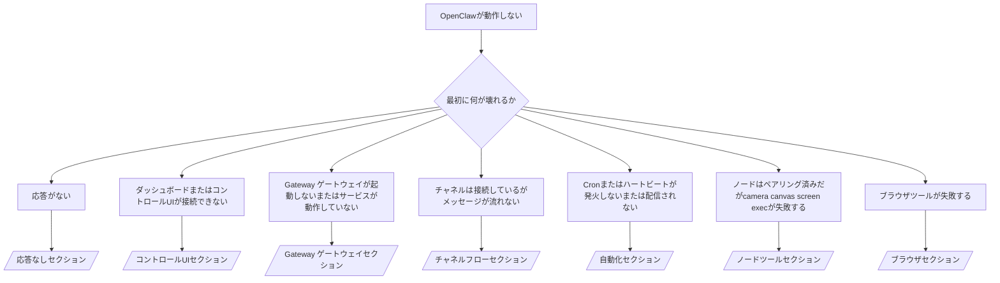

---
read_when:
    - OpenClawが動作せず、最短で修正方法を見つけたい場合
    - 詳細なランブックに入る前にトリアージフローが必要な場合
summary: OpenClawの症状別トラブルシューティングハブ
title: 一般的なトラブルシューティング
x-i18n:
    generated_at: "2026-04-02T07:44:39Z"
    model: claude-opus-4-6
    provider: anthropic
    source_hash: 69c2dedd2a328aec2fb916bfff2f8b7978c8c56ff36a5079ef7cbe95839b5e80
    source_path: help/troubleshooting.md
    workflow: 15
---

# トラブルシューティング

2分しかない場合は、このページをトリアージの入口として使用してください。

## 最初の60秒

以下のコマンドを順番に実行してください：

```bash
openclaw status
openclaw status --all
openclaw gateway probe
openclaw gateway status
openclaw doctor
openclaw channels status --probe
openclaw logs --follow
```

正常な出力の概要：

- `openclaw status` → 設定済みのチャネルが表示され、明らかな認証エラーがない。
- `openclaw status --all` → 完全なレポートが表示され、共有可能。
- `openclaw gateway probe` → 期待されるGateway ゲートウェイターゲットに到達可能（`Reachable: yes`）。`RPC: limited - missing scope: operator.read`は診断機能の低下であり、接続障害ではない。
- `openclaw gateway status` → `Runtime: running`かつ`RPC probe: ok`。
- `openclaw doctor` → ブロッキングとなる設定/サービスエラーがない。
- `openclaw channels status --probe` → チャネルが`connected`または`ready`と報告。
- `openclaw logs --follow` → 安定したアクティビティがあり、致命的なエラーが繰り返されていない。

## Anthropicロングコンテキスト429

以下のエラーが表示された場合：
`HTTP 429: rate_limit_error: Extra usage is required for long context requests`、
[/gateway/troubleshooting#anthropic-429-extra-usage-required-for-long-context](/gateway/troubleshooting#anthropic-429-extra-usage-required-for-long-context)を参照してください。

## プラグインインストールがopenclaw extensionsの欠落で失敗する

インストールが`package.json missing openclaw.extensions`で失敗する場合、そのプラグインパッケージは
OpenClawが受け付けなくなった古い形式を使用しています。

プラグインパッケージでの修正方法：

1. `package.json`に`openclaw.extensions`を追加する。
2. エントリをビルド済みランタイムファイル（通常は`./dist/index.js`）に向ける。
3. プラグインを再公開し、`openclaw plugins install <package>`を再実行する。

例：

```json
{
  "name": "@openclaw/my-plugin",
  "version": "1.2.3",
  "openclaw": {
    "extensions": ["./dist/index.js"]
  }
}
```

リファレンス：[プラグインアーキテクチャ](/plugins/architecture)

## デシジョンツリー



<AccordionGroup>
  <Accordion title="応答がない">
    ```bash
    openclaw status
    openclaw gateway status
    openclaw channels status --probe
    openclaw pairing list --channel <channel> [--account <id>]
    openclaw logs --follow
    ```

    正常な出力の例：

    - `Runtime: running`
    - `RPC probe: ok`
    - `channels status --probe`でチャネルがconnected/readyと表示される
    - 送信者がapprovedと表示される（またはダイレクトメッセージポリシーがopen/allowlist）

    よくあるログシグネチャ：

    - `drop guild message (mention required` → Discordでメンションゲーティングによりメッセージがブロックされた。
    - `pairing request` → 送信者が未承認でダイレクトメッセージペアリング承認を待っている。
    - チャネルログに`blocked` / `allowlist` → 送信者、ルーム、またはグループがフィルタリングされている。

    詳細ページ：

    - [/gateway/troubleshooting#no-replies](/gateway/troubleshooting#no-replies)
    - [/channels/troubleshooting](/channels/troubleshooting)
    - [/channels/pairing](/channels/pairing)

  </Accordion>

  <Accordion title="ダッシュボードまたはコントロールUIが接続できない">
    ```bash
    openclaw status
    openclaw gateway status
    openclaw logs --follow
    openclaw doctor
    openclaw channels status --probe
    ```

    正常な出力の例：

    - `openclaw gateway status`に`Dashboard: http://...`が表示される
    - `RPC probe: ok`
    - ログに認証ループがない

    よくあるログシグネチャ：

    - `device identity required` → HTTP/非セキュアコンテキストではデバイス認証を完了できない。
    - `AUTH_TOKEN_MISMATCH`とリトライヒント（`canRetryWithDeviceToken=true`）→ 信頼済みデバイストークンのリトライが1回自動的に行われる場合がある。
    - そのリトライ後も繰り返される`unauthorized` → トークン/パスワードの誤り、認証モードの不一致、または古いペアリング済みデバイストークン。
    - `gateway connect failed:` → UIが誤ったURL/ポートを指しているか、Gateway ゲートウェイに到達できない。

    詳細ページ：

    - [/gateway/troubleshooting#dashboard-control-ui-connectivity](/gateway/troubleshooting#dashboard-control-ui-connectivity)
    - [/web/control-ui](/web/control-ui)
    - [/gateway/authentication](/gateway/authentication)

  </Accordion>

  <Accordion title="Gateway ゲートウェイが起動しないまたはサービスがインストール済みだが動作していない">
    ```bash
    openclaw status
    openclaw gateway status
    openclaw logs --follow
    openclaw doctor
    openclaw channels status --probe
    ```

    正常な出力の例：

    - `Service: ... (loaded)`
    - `Runtime: running`
    - `RPC probe: ok`

    よくあるログシグネチャ：

    - `Gateway start blocked: set gateway.mode=local` → Gateway ゲートウェイモードが未設定/リモート。
    - `refusing to bind gateway ... without auth` → トークン/パスワードなしで非ループバックバインド。
    - `another gateway instance is already listening`または`EADDRINUSE` → ポートが既に使用中。

    詳細ページ：

    - [/gateway/troubleshooting#gateway-service-not-running](/gateway/troubleshooting#gateway-service-not-running)
    - [/gateway/background-process](/gateway/background-process)
    - [/gateway/configuration](/gateway/configuration)

  </Accordion>

  <Accordion title="チャネルは接続しているがメッセージが流れない">
    ```bash
    openclaw status
    openclaw gateway status
    openclaw logs --follow
    openclaw doctor
    openclaw channels status --probe
    ```

    正常な出力の例：

    - チャネルトランスポートが接続済み。
    - ペアリング/許可リストのチェックが通過している。
    - 必要な箇所でメンションが検出されている。

    よくあるログシグネチャ：

    - `mention required` → グループメンションゲーティングにより処理がブロックされた。
    - `pairing` / `pending` → ダイレクトメッセージの送信者がまだ承認されていない。
    - `not_in_channel`、`missing_scope`、`Forbidden`、`401/403` → チャネル権限トークンの問題。

    詳細ページ：

    - [/gateway/troubleshooting#channel-connected-messages-not-flowing](/gateway/troubleshooting#channel-connected-messages-not-flowing)
    - [/channels/troubleshooting](/channels/troubleshooting)

  </Accordion>

  <Accordion title="Cronまたはハートビートが発火しないまたは配信されない">
    ```bash
    openclaw status
    openclaw gateway status
    openclaw cron status
    openclaw cron list
    openclaw cron runs --id <jobId> --limit 20
    openclaw logs --follow
    ```

    正常な出力の例：

    - `cron.status`がenabledで次回起動時刻が表示される。
    - `cron runs`に最近の`ok`エントリが表示される。
    - ハートビートが有効で、アクティブ時間外ではない。

    よくあるログシグネチャ：

    - `cron: scheduler disabled; jobs will not run automatically` → cronが無効。
    - `heartbeat skipped`に`reason=quiet-hours` → 設定されたアクティブ時間外。
    - `requests-in-flight` → メインレーンがビジー状態。ハートビートの起動が延期された。
    - `unknown accountId` → ハートビート配信先のアカウントが存在しない。

    詳細ページ：

    - [/gateway/troubleshooting#cron-and-heartbeat-delivery](/gateway/troubleshooting#cron-and-heartbeat-delivery)
    - [/automation/troubleshooting](/automation/troubleshooting)
    - [/gateway/heartbeat](/gateway/heartbeat)

  </Accordion>

  <Accordion title="ノードはペアリング済みだがツールのcamera canvas screen execが失敗する">
    ```bash
    openclaw status
    openclaw gateway status
    openclaw nodes status
    openclaw nodes describe --node <idOrNameOrIp>
    openclaw logs --follow
    ```

    正常な出力の例：

    - ノードがconnectedかつロール`node`でペアリング済みとして表示される。
    - 呼び出そうとしているコマンドのケイパビリティが存在する。
    - ツールの権限状態がgrantedになっている。

    よくあるログシグネチャ：

    - `NODE_BACKGROUND_UNAVAILABLE` → ノードアプリをフォアグラウンドにする。
    - `*_PERMISSION_REQUIRED` → OS権限が拒否/不足している。
    - `SYSTEM_RUN_DENIED: approval required` → exec承認が保留中。
    - `SYSTEM_RUN_DENIED: allowlist miss` → コマンドがexec許可リストにない。

    詳細ページ：

    - [/gateway/troubleshooting#node-paired-tool-fails](/gateway/troubleshooting#node-paired-tool-fails)
    - [/nodes/troubleshooting](/nodes/troubleshooting)
    - [/tools/exec-approvals](/tools/exec-approvals)

  </Accordion>

  <Accordion title="Execが突然承認を求めるようになった">
    ```bash
    openclaw config get tools.exec.host
    openclaw config get tools.exec.security
    openclaw config get tools.exec.ask
    openclaw gateway restart
    ```

    何が変わったか：

    - `tools.exec.host`が未設定の場合、デフォルトは`auto`。
    - `host=auto`はサンドボックスランタイムがアクティブな場合は`sandbox`に、それ以外は`gateway`に解決される。
    - `gateway`および`node`では、未設定の`tools.exec.security`はデフォルトで`allowlist`。
    - 未設定の`tools.exec.ask`はデフォルトで`on-miss`。
    - 結果：通常のホストコマンドが即座に実行される代わりに`Approval required`で一時停止する場合がある。

    以前のGateway ゲートウェイでの承認なし動作を復元する：

    ```bash
    openclaw config set tools.exec.host gateway
    openclaw config set tools.exec.security full
    openclaw config set tools.exec.ask off
    openclaw gateway restart
    ```

    より安全な代替案：

    - ホストルーティングを安定させつつ承認も残したい場合は、`tools.exec.host=gateway`のみを設定する。
    - ホストexecを維持しつつ許可リストのミス時にレビューしたい場合は、`security=allowlist`と`ask=on-miss`を維持する。
    - `host=auto`を`sandbox`に解決させたい場合は、サンドボックスモードを有効にする。

    よくあるログシグネチャ：

    - `Approval required.` → コマンドが`/approve ...`を待っている。
    - `SYSTEM_RUN_DENIED: approval required` → ノードホストのexec承認が保留中。
    - `exec host=sandbox requires a sandbox runtime for this session` → 暗黙的/明示的なサンドボックス選択だがサンドボックスモードがオフ。

    詳細ページ：

    - [/tools/exec](/tools/exec)
    - [/tools/exec-approvals](/tools/exec-approvals)
    - [/gateway/security#runtime-expectation-drift](/gateway/security#runtime-expectation-drift)

  </Accordion>

  <Accordion title="ブラウザツールが失敗する">
    ```bash
    openclaw status
    openclaw gateway status
    openclaw browser status
    openclaw logs --follow
    openclaw doctor
    ```

    正常な出力の例：

    - ブラウザステータスが`running: true`と選択されたブラウザ/プロファイルを表示している。
    - `openclaw`が起動している、または`user`がローカルChromeタブを確認できる。

    よくあるログシグネチャ：

    - `unknown command "browser"`または`unknown command 'browser'` → `plugins.allow`が設定されており`browser`が含まれていない。
    - `Failed to start Chrome CDP on port` → ローカルブラウザの起動に失敗した。
    - `browser.executablePath not found` → 設定されたバイナリパスが誤っている。
    - `No Chrome tabs found for profile="user"` → Chrome MCPアタッチプロファイルにローカルChromeタブが開かれていない。
    - `Browser attachOnly is enabled ... not reachable` → attach-onlyプロファイルにライブCDPターゲットがない。

    詳細ページ：

    - [/gateway/troubleshooting#browser-tool-fails](/gateway/troubleshooting#browser-tool-fails)
    - [/tools/browser#missing-browser-command-or-tool](/tools/browser#missing-browser-command-or-tool)
    - [/tools/browser-linux-troubleshooting](/tools/browser-linux-troubleshooting)
    - [/tools/browser-wsl2-windows-remote-cdp-troubleshooting](/tools/browser-wsl2-windows-remote-cdp-troubleshooting)

  </Accordion>
</AccordionGroup>

## 関連

- [よくある質問](/help/faq) — よくある質問
- [Gateway ゲートウェイのトラブルシューティング](/gateway/troubleshooting) — Gateway ゲートウェイ固有の問題
- [Doctor](/gateway/doctor) — 自動ヘルスチェックと修復
- [チャネルのトラブルシューティング](/channels/troubleshooting) — チャネル接続の問題
- [自動化のトラブルシューティング](/automation/troubleshooting) — cronとハートビートの問題
