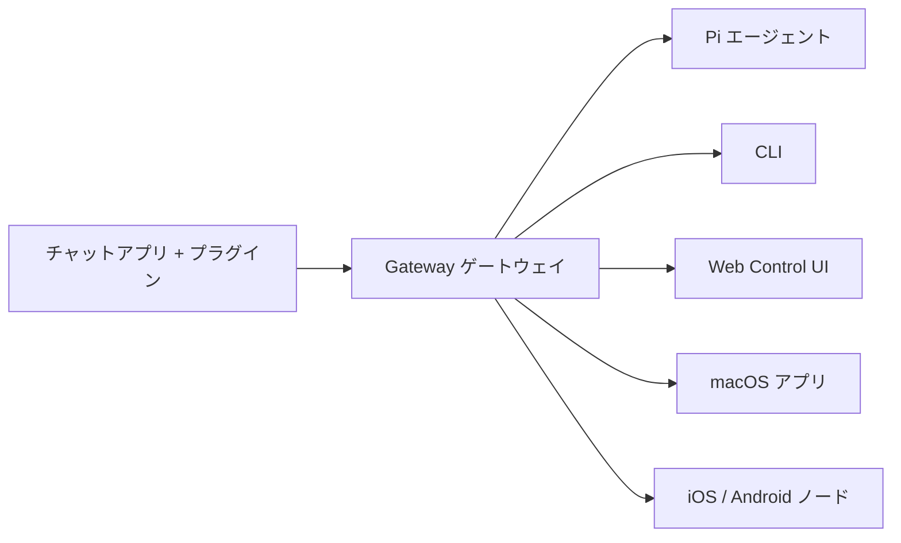

---
read_when:
    - 初めての方に OpenClaw を紹介する場合
summary: OpenClaw はあらゆる OS で動作する AI エージェント向けマルチチャネル Gateway ゲートウェイです。
title: OpenClaw
x-i18n:
    generated_at: "2026-04-02T07:44:12Z"
    model: claude-opus-4-6
    provider: anthropic
    source_hash: 02879bfee2e8cf145b3477476493d5da6fa798460e47340ea2de745f1871f3b0
    source_path: index.md
    workflow: 15
---

# OpenClaw 🦞

<p align="center">
    
    
</p>

> _「EXFOLIATE! EXFOLIATE!」_ — たぶん宇宙ロブスター

<p align="center">
  <strong>WhatsApp、Telegram、Discord、iMessage などの AI エージェント向けあらゆる OS 対応 Gateway ゲートウェイ。</strong><br />
  メッセージを送るだけで、ポケットからエージェントの応答が届きます。プラグインで Mattermost なども追加可能です。
</p>

<Columns>
  <Card title="はじめに" href="/start/getting-started" icon="rocket">
    OpenClaw をインストールし、数分で Gateway ゲートウェイを起動します。
  </Card>
  <Card title="オンボーディングを実行" href="/start/wizard" icon="sparkles">
    `openclaw onboard` とペアリングフローによるガイド付きセットアップ。
  </Card>
  <Card title="Control UI を開く" href="/web/control-ui" icon="layout-dashboard">
    チャット、設定、セッションのためのブラウザダッシュボードを起動します。
  </Card>
</Columns>

## OpenClaw とは？

OpenClaw は、お気に入りのチャットアプリ（WhatsApp、Telegram、Discord、iMessage など）を Pi のような AI コーディングエージェントに接続する**セルフホスト型 Gateway ゲートウェイ**です。自分のマシン（またはサーバー）で単一の Gateway ゲートウェイプロセスを実行するだけで、メッセージングアプリと常時利用可能な AI アシスタントの橋渡しとなります。

**誰のためのものですか？** どこからでもメッセージを送れるパーソナル AI アシスタントが欲しい、しかしデータの制御を手放したりホスティングサービスに依存したりしたくない開発者やパワーユーザー向けです。

**何が違うのですか？**

- **セルフホスト型**: 自分のハードウェアで、自分のルールで実行
- **マルチチャネル**: 1 つの Gateway ゲートウェイで WhatsApp、Telegram、Discord などを同時に提供
- **エージェントネイティブ**: ツール使用、セッション、メモリ、マルチエージェントルーティングを備えたコーディングエージェント向けに構築
- **オープンソース**: MIT ライセンス、コミュニティ主導

**何が必要ですか？** Node 24（推奨）、または互換性のために Node 22 LTS（`22.14+`）、選択したプロバイダーの API キー、そして 5 分です。最高の品質とセキュリティのために、利用可能な最新世代の最も強力なモデルを使用してください。

## 仕組み



Gateway ゲートウェイは、セッション、ルーティング、チャネル接続の単一の情報源です。

## 主な機能

<Columns>
  <Card title="マルチチャネル Gateway ゲートウェイ" icon="network">
    単一の Gateway ゲートウェイプロセスで WhatsApp、Telegram、Discord、iMessage に対応。
  </Card>
  <Card title="プラグインチャネル" icon="plug">
    拡張パッケージで Mattermost などを追加。
  </Card>
  <Card title="マルチエージェントルーティング" icon="route">
    エージェント、ワークスペース、送信者ごとに分離されたセッション。
  </Card>
  <Card title="メディアサポート" icon="image">
    画像、音声、ドキュメントの送受信。
  </Card>
  <Card title="Web Control UI" icon="monitor">
    チャット、設定、セッション、ノード用のブラウザダッシュボード。
  </Card>
  <Card title="モバイルノード" icon="smartphone">
    iOS / Android ノードをペアリングして Canvas、カメラ、音声対応ワークフローに対応。
  </Card>
</Columns>

## クイックスタート

<Steps>
  <Step title="OpenClaw をインストール">
    ```bash
    npm install -g openclaw@latest
    ```
  </Step>
  <Step title="オンボーディングとサービスのインストール">
    ```bash
    openclaw onboard --install-daemon
    ```
  </Step>
  <Step title="チャット">
    ブラウザで Control UI を開き、メッセージを送信します：

    ```bash
    openclaw dashboard
    ```

    またはチャネルを接続して（[Telegram](/channels/telegram) が最速です）スマートフォンからチャットしましょう。

  </Step>
</Steps>

完全なインストールと開発セットアップが必要ですか？[はじめに](/start/getting-started)をご覧ください。

## ダッシュボード

Gateway ゲートウェイの起動後、ブラウザで Control UI を開きます。

- ローカルデフォルト: [http://127.0.0.1:18789/](http://127.0.0.1:18789/)
- リモートアクセス: [Web サーフェス](/web) と [Tailscale](/gateway/tailscale)

<p align="center">
  
</p>

## 設定（任意）

設定は `~/.openclaw/openclaw.json` にあります。

- **何もしない場合**、OpenClaw はバンドルされた Pi バイナリを RPC モードで使用し、送信者ごとのセッションで動作します。
- ロックダウンしたい場合は、`channels.whatsapp.allowFrom` と（グループの場合）メンション規則から始めてください。

例：

```json5
{
  channels: {
    whatsapp: {
      allowFrom: ["+15555550123"],
      groups: { "*": { requireMention: true } },
    },
  },
  messages: { groupChat: { mentionPatterns: ["@openclaw"] } },
}
```

## ここから始める

<Columns>
  <Card title="ドキュメントハブ" href="/start/hubs" icon="book-open">
    ユースケース別に整理されたすべてのドキュメントとガイド。
  </Card>
  <Card title="設定" href="/gateway/configuration" icon="settings">
    コア Gateway ゲートウェイ設定、トークン、プロバイダー設定。
  </Card>
  <Card title="リモートアクセス" href="/gateway/remote" icon="globe">
    SSH と tailnet のアクセスパターン。
  </Card>
  <Card title="チャネル" href="/channels/telegram" icon="message-square">
    WhatsApp、Telegram、Discord などのチャネル固有のセットアップ。
  </Card>
  <Card title="ノード" href="/nodes" icon="smartphone">
    ペアリング、Canvas、カメラ、デバイスアクションを備えた iOS / Android ノード。
  </Card>
  <Card title="ヘルプ" href="/help" icon="life-buoy">
    よくある修正方法とトラブルシューティングの入り口。
  </Card>
</Columns>

## もっと詳しく

<Columns>
  <Card title="機能の完全なリスト" href="/concepts/features" icon="list">
    チャネル、ルーティング、メディアの全機能。
  </Card>
  <Card title="マルチエージェントルーティング" href="/concepts/multi-agent" icon="route">
    ワークスペース分離とエージェントごとのセッション。
  </Card>
  <Card title="セキュリティ" href="/gateway/security" icon="shield">
    トークン、許可リスト、安全制御。
  </Card>
  <Card title="トラブルシューティング" href="/gateway/troubleshooting" icon="wrench">
    Gateway ゲートウェイの診断とよくあるエラー。
  </Card>
  <Card title="プロジェクトについてとクレジット" href="/reference/credits" icon="info">
    プロジェクトの起源、貢献者、ライセンス。
  </Card>
</Columns>
