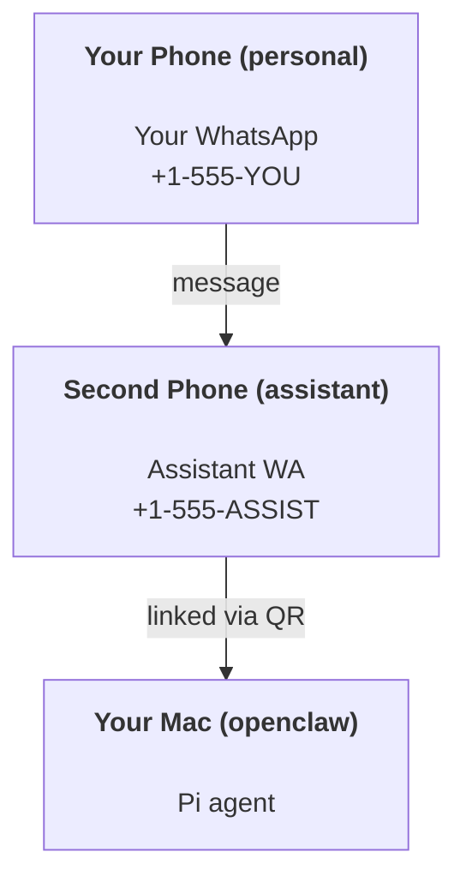

# OpenClawでパーソナルアシスタントを構築する

OpenClawは**Pi**エージェント用のWhatsApp + Telegram + Discord + iMessage Gatewayです。プラグインでMattermostも追加できます。このガイドは「パーソナルアシスタント」セットアップ：常時稼働のエージェントとして動作する、専用のWhatsApp番号の設定についてです。

## 安全第一

エージェントに以下のことができるポジションを与えることになります：

- マシン上でコマンドを実行する（Piツールの設定に依存）
- ワークスペース内のファイルの読み書き
- WhatsApp/Telegram/Discord/Mattermost（プラグイン）経由でメッセージを送信する

控えめに始めましょう：

- 必ず `channels.whatsapp.allowFrom` を設定してください（個人のMacで全世界に公開した状態で実行しないでください）。
- アシスタント用に専用のWhatsApp番号を使用してください。
- ハートビートはデフォルトで30分ごとに実行されます。セットアップを信頼できるようになるまで `agents.defaults.heartbeat.every: "0m"` を設定して無効にしてください。

## 前提条件

- OpenClawがインストールされ、オンボーディングが完了していること -- まだの方は[はじめに](/start/getting-started)をご覧ください
- アシスタント用の2つ目の電話番号（SIM/eSIM/プリペイド）

## 2台電話セットアップ（推奨）

以下のようなセットアップが望ましいです：



個人のWhatsAppをOpenClawにリンクすると、あなたへのすべてのメッセージが「エージェントの入力」になります。それはめったに望ましくありません。

## 5分クイックスタート

1. WhatsApp Web をペアリング（QRが表示されます。アシスタント用電話でスキャンしてください）：

```bash
openclaw channels login
```

2. Gatewayを起動（実行し続けてください）：

```bash
openclaw gateway --port 18789
```

3. `~/.openclaw/openclaw.json` に最小限の設定を記述：

```json5
{
  channels: { whatsapp: { allowFrom: ["+15555550123"] } },
}
```

許可リストに登録された電話からアシスタント番号にメッセージを送信してください。

オンボーディングが完了すると、ダッシュボードが自動的に開き、クリーンな（トークンなしの）リンクが表示されます。認証を求められた場合は、`gateway.auth.token` のトークンをControl UIの設定に貼り付けてください。後で再度開くには：`openclaw dashboard`。

## エージェントにワークスペースを与える（AGENTS）

OpenClawはワークスペースディレクトリから操作指示と「メモリー」を読み込みます。

デフォルトでは、OpenClawは `~/.openclaw/workspace` をエージェントワークスペースとして使用し、セットアップ/初回エージェント実行時に自動的に作成します（スターター `AGENTS.md`、`SOUL.md`、`TOOLS.md`、`IDENTITY.md`、`USER.md`、`HEARTBEAT.md` を含みます）。`BOOTSTRAP.md` はワークスペースが新規の場合のみ作成されます（削除後に再度作成されることはありません）。`MEMORY.md` はオプションです（自動作成されません）。存在する場合、通常のセッションで読み込まれます。サブエージェントセッションでは `AGENTS.md` と `TOOLS.md` のみが注入されます。

ヒント: このフォルダをOpenClawの「メモリー」として扱い、gitリポジトリ（できればプライベート）にして、`AGENTS.md` + メモリーファイルをバックアップしましょう。gitがインストールされている場合、新規ワークスペースは自動的に初期化されます。

```bash
openclaw setup
```

ワークスペースの完全なレイアウトとバックアップガイド: [エージェントワークスペース](/concepts/agent-workspace)
メモリーワークフロー: [メモリー](/concepts/memory)

オプション: `agents.defaults.workspace` で別のワークスペースを選択できます（`~` をサポート）。

```json5
{
  agent: {
    workspace: "~/.openclaw/workspace",
  },
}
```

既にリポジトリから独自のワークスペースファイルを配布している場合は、ブートストラップファイルの作成を完全に無効にできます：

```json5
{
  agent: {
    skipBootstrap: true,
  },
}
```

## 「アシスタント」に変える設定

OpenClawは良いアシスタントセットアップをデフォルトで提供しますが、通常以下をチューニングしたくなります：

- `SOUL.md` のペルソナ/指示
- シンキングのデフォルト（必要に応じて）
- ハートビート（信頼できるようになったら）

例：

```json5
{
  logging: { level: "info" },
  agent: {
    model: "anthropic/claude-opus-4-6",
    workspace: "~/.openclaw/workspace",
    thinkingDefault: "high",
    timeoutSeconds: 1800,
    // 0から始めて、後で有効にしてください。
    heartbeat: { every: "0m" },
  },
  channels: {
    whatsapp: {
      allowFrom: ["+15555550123"],
      groups: {
        "*": { requireMention: true },
      },
    },
  },
  routing: {
    groupChat: {
      mentionPatterns: ["@openclaw", "openclaw"],
    },
  },
  session: {
    scope: "per-sender",
    resetTriggers: ["/new", "/reset"],
    reset: {
      mode: "daily",
      atHour: 4,
      idleMinutes: 10080,
    },
  },
}
```

## セッションとメモリー

- セッションファイル: `~/.openclaw/agents/<agentId>/sessions/{{SessionId}}.jsonl`
- セッションメタデータ（トークン使用量、最終ルートなど）: `~/.openclaw/agents/<agentId>/sessions/sessions.json`（レガシー: `~/.openclaw/sessions/sessions.json`）
- `/new` または `/reset` でそのチャットの新しいセッションを開始します（`resetTriggers` で設定可能）。単独で送信すると、エージェントはリセットを確認する短い挨拶で応答します。
- `/compact [instructions]` はセッションコンテキストをコンパクト化し、残りのコンテキスト予算を報告します。

## ハートビート（プロアクティブモード）

デフォルトでは、OpenClawは30分ごとに以下のプロンプトでハートビートを実行します：
`Read HEARTBEAT.md if it exists (workspace context). Follow it strictly. Do not infer or repeat old tasks from prior chats. If nothing needs attention, reply HEARTBEAT_OK.`
`agents.defaults.heartbeat.every: "0m"` を設定して無効にできます。

- `HEARTBEAT.md` が存在するが実質的に空（空行とMarkdownヘッダー `# Heading` のみ）の場合、OpenClawはAPI呼び出しを節約するためにハートビート実行をスキップします。
- ファイルが存在しない場合、ハートビートは引き続き実行され、モデルが何をするか決定します。
- エージェントが `HEARTBEAT_OK` と応答した場合（オプションで短いパディング付き。`agents.defaults.heartbeat.ackMaxChars` を参照）、OpenClawはそのハートビートのアウトバウンド配信を抑制します。
- デフォルトでは、DM形式の `user:<id>` ターゲットへのハートビート配信は許可されています。`agents.defaults.heartbeat.directPolicy: "block"` を設定すると、ハートビート実行を維持しながらダイレクトターゲット配信を抑制できます。
- ハートビートはフルエージェントターンを実行します。間隔が短いほど多くのトークンを消費します。

```json5
{
  agent: {
    heartbeat: { every: "30m" },
  },
}
```

## メディアの入出力

受信添付ファイル（画像/オーディオ/ドキュメント）はテンプレートを通じてコマンドに渡すことができます：

- `{{MediaPath}}`（ローカル一時ファイルパス）
- `{{MediaUrl}}`（疑似URL）
- `{{Transcript}}`（オーディオ文字起こしが有効な場合）

エージェントからの送信添付ファイル：独立した行に `MEDIA:<path-or-url>` を含めてください（スペースなし）。例：

```
Here's the screenshot.
MEDIA:https://example.com/screenshot.png
```

OpenClawはこれらを抽出し、テキストと一緒にメディアとして送信します。

## 運用チェックリスト

```bash
openclaw status          # ローカルステータス（クレデンシャル、セッション、キューイベント）
openclaw status --all    # 完全な診断（読み取り専用、ペースト可能）
openclaw status --deep   # Gatewayヘルスプローブを追加（Telegram + Discord）
openclaw health --json   # Gatewayヘルススナップショット（WS）
```

ログは `/tmp/openclaw/` に保存されます（デフォルト: `openclaw-YYYY-MM-DD.log`）。

## 次のステップ

- WebChat: [WebChat](/web/webchat)
- Gateway運用: [Gatewayランブック](/gateway)
- Cronとウェイクアップ: [Cronジョブ](/automation/cron-jobs)
- macOSメニューバーコンパニオン: [OpenClaw macOSアプリ](/platforms/macos)
- iOSノードアプリ: [iOSアプリ](/platforms/ios)
- Androidノードアプリ: [Androidアプリ](/platforms/android)
- Windowsステータス: [Windows（WSL2）](/platforms/windows)
- Linuxステータス: [Linuxアプリ](/platforms/linux)
- セキュリティ: [セキュリティ](/gateway/security)
