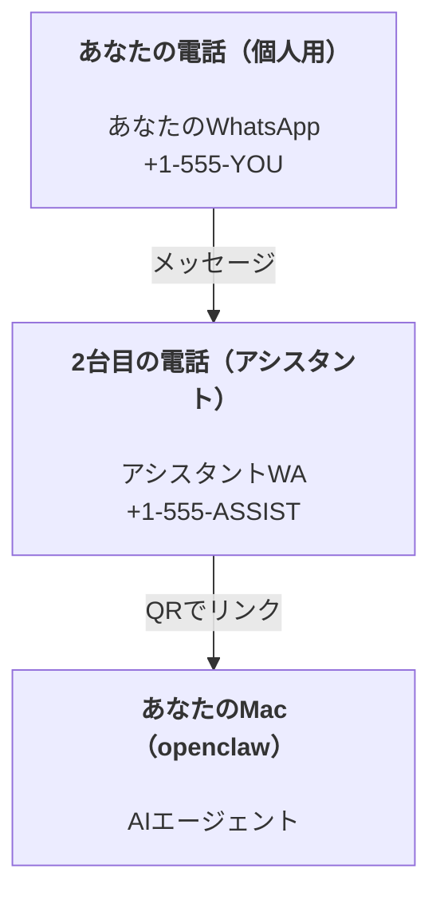

---
read_when:
    - 新しいアシスタントインスタンスのオンボーディング
    - 安全性・権限に関する影響の確認
summary: OpenClawをパーソナルアシスタントとして運用するためのエンドツーエンドガイド（安全上の注意を含む）
title: パーソナルアシスタントのセットアップ
x-i18n:
    generated_at: "2026-04-02T08:39:00Z"
    model: claude-opus-4-6
    provider: anthropic
    source_hash: a2a9722c85432faa67b07495425b3bd675cc770a6b92835865233f8be1763528
    source_path: start/openclaw.md
    workflow: 15
---

# OpenClawでパーソナルアシスタントを構築する

OpenClawは、WhatsApp、Telegram、Discord、iMessageなどをAIエージェントに接続するセルフホスト型Gateway ゲートウェイです。このガイドでは「パーソナルアシスタント」セットアップについて説明します：常時稼働のAIアシスタントとして機能する専用のWhatsApp番号を使う構成です。

## ⚠️ 安全第一

エージェントに以下の操作を許可する立場に置くことになります：

- マシン上でコマンドを実行する（ツールポリシーに依存）
- ワークスペース内のファイルを読み書きする
- WhatsApp/Telegram/Discord/Mattermost（プラグイン）経由でメッセージを送信する

まずは保守的に始めましょう：

- 必ず `channels.whatsapp.allowFrom` を設定してください（個人のMacでワールドオープンのまま運用しないでください）。
- アシスタント用に専用のWhatsApp番号を使用してください。
- ハートビートはデフォルトで30分ごとに実行されます。セットアップを信頼できるまでは `agents.defaults.heartbeat.every: "0m"` を設定して無効にしてください。

## 前提条件

- OpenClawがインストール済みでオンボーディング完了済みであること — まだの場合は[はじめに](/start/getting-started)を参照してください
- アシスタント用の2つ目の電話番号（SIM/eSIM/プリペイド）

## 2台の電話セットアップ（推奨）

目指す構成はこちらです：



個人のWhatsAppをOpenClawにリンクすると、あなた宛のすべてのメッセージが「エージェントへの入力」になります。それは通常望ましくありません。

## 5分クイックスタート

1. WhatsApp Webをペアリング（QRが表示されるので、アシスタント用の電話でスキャン）：

```bash
openclaw channels login
```

2. Gateway ゲートウェイを起動（実行したままにしておく）：

```bash
openclaw gateway --port 18789
```

3. `~/.openclaw/openclaw.json` に最小限の設定を記述：

```json5
{
  channels: { whatsapp: { allowFrom: ["+15555550123"] } },
}
```

許可リストに登録した電話からアシスタント番号にメッセージを送信してください。

オンボーディングが完了すると、ダッシュボードが自動的に開き、クリーンな（トークン化されていない）リンクが表示されます。認証を求められた場合は、`gateway.auth.token` のトークンをControl UIの設定に貼り付けてください。後で再度開くには：`openclaw dashboard`。

## エージェントにワークスペースを与える（AGENTS）

OpenClawはワークスペースディレクトリから操作指示と「メモリ」を読み取ります。

デフォルトでは、OpenClawはエージェントワークスペースとして `~/.openclaw/workspace` を使用し、セットアップ時または最初のエージェント実行時に自動的に作成します（スターターファイル `AGENTS.md`、`SOUL.md`、`TOOLS.md`、`IDENTITY.md`、`USER.md`、`HEARTBEAT.md` も含む）。`BOOTSTRAP.md` はワークスペースが新規の場合のみ作成されます（削除後に再作成されることはありません）。`MEMORY.md` はオプションです（自動作成されません）。存在する場合、通常のセッションで読み込まれます。サブエージェントセッションでは `AGENTS.md` と `TOOLS.md` のみが注入されます。

ヒント：このフォルダをOpenClawの「メモリ」として扱い、gitリポジトリ（できればプライベート）にして `AGENTS.md` とメモリファイルをバックアップしましょう。gitがインストールされている場合、新規ワークスペースは自動的に初期化されます。

```bash
openclaw setup
```

ワークスペースの完全なレイアウトとバックアップガイド：[エージェントワークスペース](/concepts/agent-workspace)
メモリワークフロー：[メモリ](/concepts/memory)

オプション：`agents.defaults.workspace` で別のワークスペースを選択できます（`~` をサポート）。

```json5
{
  agent: {
    workspace: "~/.openclaw/workspace",
  },
}
```

すでに独自のワークスペースファイルをリポジトリから配布している場合、ブートストラップファイルの作成を完全に無効化できます：

```json5
{
  agent: {
    skipBootstrap: true,
  },
}
```

## 「アシスタント」にするための設定

OpenClawはデフォルトで優れたアシスタントセットアップになっていますが、通常は以下を調整したくなるでしょう：

- `SOUL.md` のペルソナ/指示
- thinking のデフォルト（必要に応じて）
- ハートビート（信頼できるようになったら）

例：

```json5
{
  logging: { level: "info" },
  agent: {
    model: "anthropic/claude-opus-4-6",
    workspace: "~/.openclaw/workspace",
    thinkingDefault: "high",
    timeoutSeconds: 1800,
    // 最初は0に設定。後で有効にする。
    heartbeat: { every: "0m" },
  },
  channels: {
    whatsapp: {
      allowFrom: ["+15555550123"],
      groups: {
        "*": { requireMention: true },
      },
    },
  },
  routing: {
    groupChat: {
      mentionPatterns: ["@openclaw", "openclaw"],
    },
  },
  session: {
    scope: "per-sender",
    resetTriggers: ["/new", "/reset"],
    reset: {
      mode: "daily",
      atHour: 4,
      idleMinutes: 10080,
    },
  },
}
```

## セッションとメモリ

- セッションファイル：`~/.openclaw/agents/<agentId>/sessions/{{SessionId}}.jsonl`
- セッションメタデータ（トークン使用量、最終ルートなど）：`~/.openclaw/agents/<agentId>/sessions/sessions.json`（レガシー：`~/.openclaw/sessions/sessions.json`）
- `/new` または `/reset` でそのチャットの新しいセッションを開始します（`resetTriggers` で設定可能）。単独で送信した場合、エージェントはリセットを確認する短い挨拶を返します。
- `/compact [instructions]` はセッションコンテキストを圧縮し、残りのコンテキスト予算を報告します。

## ハートビート（プロアクティブモード）

デフォルトでは、OpenClawは30分ごとに以下のプロンプトでハートビートを実行します：
`Read HEARTBEAT.md if it exists (workspace context). Follow it strictly. Do not infer or repeat old tasks from prior chats. If nothing needs attention, reply HEARTBEAT_OK.`
無効にするには `agents.defaults.heartbeat.every: "0m"` を設定してください。

- `HEARTBEAT.md` が存在するが実質的に空の場合（空行とMarkdownヘッダー `# Heading` のみ）、OpenClawはAPI呼び出しを節約するためにハートビート実行をスキップします。
- ファイルが存在しない場合、ハートビートは引き続き実行され、モデルが何をするか判断します。
- エージェントが `HEARTBEAT_OK`（オプションで短いパディング付き。`agents.defaults.heartbeat.ackMaxChars` を参照）と応答した場合、OpenClawはそのハートビートの送信配信を抑制します。
- デフォルトでは、ダイレクトメッセージ形式の `user:<id>` ターゲットへのハートビート配信は許可されています。ハートビート実行を維持しつつダイレクトターゲット配信を抑制するには `agents.defaults.heartbeat.directPolicy: "block"` を設定してください。
- ハートビートは完全なエージェントターンを実行します — 短い間隔ではより多くのトークンを消費します。

```json5
{
  agent: {
    heartbeat: { every: "30m" },
  },
}
```

## メディアの入出力

受信添付ファイル（画像/音声/ドキュメント）はテンプレートを使用してコマンドに渡すことができます：

- `{{MediaPath}}`（ローカル一時ファイルパス）
- `{{MediaUrl}}`（擬似URL）
- `{{Transcript}}`（音声文字起こしが有効な場合）

エージェントからの送信添付ファイル：`MEDIA:<パスまたはURL>` を独立した行に記述します（スペースなし）。例：

```
Here's the screenshot.
MEDIA:https://example.com/screenshot.png
```

OpenClawはこれらを抽出し、テキストとともにメディアとして送信します。

ローカルパスの動作はエージェントと同じファイル読み取り信頼モデルに従います：

- `tools.fs.workspaceOnly` が `true` の場合、送信 `MEDIA:` ローカルパスはOpenClawの一時ルート、メディアキャッシュ、エージェントワークスペースパス、サンドボックス化で生成されたファイルに制限されます。
- `tools.fs.workspaceOnly` が `false` の場合、送信 `MEDIA:` はエージェントが既に読み取りを許可されているホストローカルファイルを使用できます。
- ホストローカル送信は、メディアおよび安全なドキュメントタイプ（画像、音声、動画、PDF、Officeドキュメント）のみを許可します。プレーンテキストや秘密情報を含むファイルは送信可能なメディアとして扱われません。

つまり、ワークスペース外で生成された画像/ファイルは、fsポリシーがそれらの読み取りを既に許可している場合に送信可能になります。任意のホストテキスト添付ファイルの流出を再び許可することなく実現できます。

## 運用チェックリスト

```bash
openclaw status          # ローカルステータス（認証情報、セッション、キューイベント）
openclaw status --all    # 完全な診断（読み取り専用、コピー＆ペースト可能）
openclaw status --deep   # Gateway ゲートウェイのヘルスプローブを追加（Telegram + Discord）
openclaw health --json   # Gateway ゲートウェイのヘルススナップショット（WS）
```

ログは `/tmp/openclaw/` に保存されます（デフォルト：`openclaw-YYYY-MM-DD.log`）。

## 次のステップ

- WebChat：[WebChat](/web/webchat)
- Gateway ゲートウェイ運用：[Gateway ゲートウェイ ランブック](/gateway)
- Cronとウェイクアップ：[Cronジョブ](/automation/cron-jobs)
- macOSメニューバーコンパニオン：[OpenClaw macOSアプリ](/platforms/macos)
- iOSノードアプリ：[iOSアプリ](/platforms/ios)
- Androidノードアプリ：[Androidアプリ](/platforms/android)
- Windowsステータス：[Windows (WSL2)](/platforms/windows)
- Linuxステータス：[Linuxアプリ](/platforms/linux)
- セキュリティ：[セキュリティ](/gateway/security)
