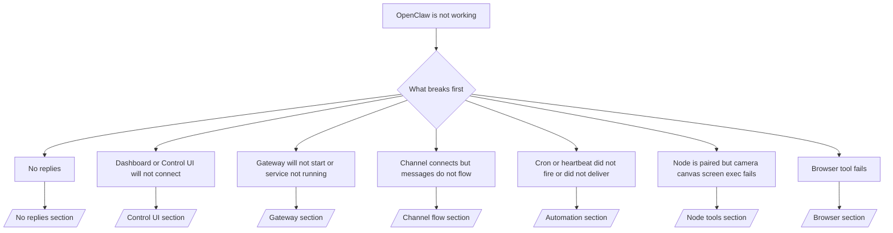

# トラブルシューティング

2 分しかない場合は、このページをトリアージの入口として使用してください。

## 最初の 60 秒

この正確なはしごを順に実行します:

```bash
openclaw status
openclaw status --all
openclaw gateway probe
openclaw gateway status
openclaw doctor
openclaw channels status --probe
openclaw logs --follow
```

良好な出力は 1 行で次の状態になります。

- `openclaw status` → 設定済みのチャンネルが表示され、明らかな認証エラーがありません。
- `openclaw status --all` → 完全なレポートが存在し、共有可能です。
- `openclaw gateway probe` → 期待されるゲートウェイ ターゲットに到達可能です。
- `openclaw gateway status` → `Runtime: running` および `RPC probe: ok`。
- `openclaw doctor` → ブロックする設定／サービス エラーがありません。
- `openclaw channels status --probe` → チャンネルが `connected` または `ready` を報告しています。
- `openclaw logs --follow` → 安定したアクティビティがあり、致命的エラーの繰り返しがありません。

## 判断ツリー



<AccordionGroup>
  <Accordion title="No replies">
    ```bash
    openclaw status
    openclaw gateway status
    openclaw channels status --probe
    openclaw pairing list <channel>
    openclaw logs --follow
    ```

    ```
    良好な出力の例:
    
    - `Runtime: running`
    - `RPC probe: ok`
    - チャンネルが `channels status --probe` で connected/ready と表示されている
    - 送信者が承認済みである（または DM ポリシーが open/allowlist）
    
    よくあるログ シグネチャ:
    
    - `drop guild message (mention required` → Discord でメンション ゲーティングによりメッセージがブロックされました。
    - `pairing request` → 送信者が未承認で、DM ペアリング承認待ちです。
    - チャンネル ログ内の `blocked` / `allowlist` → 送信者、ルーム、またはグループがフィルタリングされています。
    
    詳細ページ:
    
    - [/gateway/troubleshooting#no-replies](/gateway/troubleshooting#no-replies)
    - [/channels/troubleshooting](/channels/troubleshooting)
    - [/channels/pairing](/channels/pairing)
    ```

  </Accordion>

  <Accordion title="Dashboard or Control UI will not connect">
    ```bash
    openclaw status
    openclaw gateway status
    openclaw logs --follow
    openclaw doctor
    openclaw channels status --probe
    ```

    ```
    良好な出力の例:
    
    - `Dashboard: http://...` が `openclaw gateway status` に表示されている
    - `RPC probe: ok`
    - ログに認証ループがない
    
    よくあるログ シグネチャ:
    
    - `device identity required` → HTTP／非セキュア コンテキストではデバイス認証を完了できません。
    - `unauthorized` / 再接続ループ → トークン／パスワードが誤っている、または認証モードが不一致です。
    - `gateway connect failed:` → UI が誤った URL／ポートを指している、または到達不能なゲートウェイです。
    
    詳細ページ:
    
    - [/gateway/troubleshooting#dashboard-control-ui-connectivity](/gateway/troubleshooting#dashboard-control-ui-connectivity)
    - [/web/control-ui](/web/control-ui)
    - [/gateway/authentication](/gateway/authentication)
    ```

  </Accordion>

  <Accordion title="Gateway will not start or service installed but not running">
    ```bash
    openclaw status
    openclaw gateway status
    openclaw logs --follow
    openclaw doctor
    openclaw channels status --probe
    ```

    ```
    良好な出力の例:
    
    - `Service: ... (loaded)`
    - `Runtime: running`
    - `RPC probe: ok`
    
    よくあるログ シグネチャ:
    
    - `Gateway start blocked: set gateway.mode=local` → ゲートウェイ モードが未設定／remote です。
    - `refusing to bind gateway ... without auth` → トークン／パスワードなしで non-loopback にバインドしています。
    - `another gateway instance is already listening` または `EADDRINUSE` → ポートが既に使用されています。
    
    詳細ページ:
    
    - [/gateway/troubleshooting#gateway-service-not-running](/gateway/troubleshooting#gateway-service-not-running)
    - [/gateway/background-process](/gateway/background-process)
    - [/gateway/configuration](/gateway/configuration)
    ```

  </Accordion>

  <Accordion title="Channel connects but messages do not flow">
    ```bash
    openclaw status
    openclaw gateway status
    openclaw logs --follow
    openclaw doctor
    openclaw channels status --probe
    ```

    ```
    良好な出力の例:
    
    - チャンネル トランスポートが接続済み。
    - ペアリング／許可リストのチェックに合格。
    - 必要な場合にメンションが検出されている。
    
    よくあるログ シグネチャ:
    
    - `mention required` → グループ メンション ゲーティングにより処理がブロックされました。
    - `pairing` / `pending` → DM の送信者がまだ承認されていません。
    - `not_in_channel`、`missing_scope`、`Forbidden`、`401/403` → チャンネル権限トークンの問題。
    
    詳細ページ:
    
    - [/gateway/troubleshooting#channel-connected-messages-not-flowing](/gateway/troubleshooting#channel-connected-messages-not-flowing)
    - [/channels/troubleshooting](/channels/troubleshooting)
    ```

  </Accordion>

  <Accordion title="Cron or heartbeat did not fire or did not deliver">
    ```bash
    openclaw status
    openclaw gateway status
    openclaw cron status
    openclaw cron list
    openclaw cron runs --id <jobId> --limit 20
    openclaw logs --follow
    ```

    ```
    良好な出力の例:
    
    - `cron.status` に有効化され、次回起動が表示されている。
    - `cron runs` に最近の `ok` エントリが表示されている。
    - ハートビートが有効で、アクティブ時間外ではない。
    
    よくあるログ シグネチャ:
    
    - `cron: scheduler disabled; jobs will not run automatically` → cron が無効です。
    - `heartbeat skipped` と `reason=quiet-hours` → 設定されたアクティブ時間外です。
    - `requests-in-flight` → メイン レーンがビジーのため、ハートビートの起床が延期されました。
    - `unknown accountId` → ハートビート配信先のアカウントが存在しません。
    
    詳細ページ:
    
    - [/gateway/troubleshooting#cron-and-heartbeat-delivery](/gateway/troubleshooting#cron-and-heartbeat-delivery)
    - [/automation/troubleshooting](/automation/troubleshooting)
    - [/gateway/heartbeat](/gateway/heartbeat)
    ```

  </Accordion>

  <Accordion title="Node is paired but tool fails camera canvas screen exec">
    ```bash
    openclaw status
    openclaw gateway status
    openclaw nodes status
    openclaw nodes describe --node <idOrNameOrIp>
    openclaw logs --follow
    ```

    ```
    良好な出力の例:
    
    - ノードが接続済みとして一覧に表示され、役割 `node` に対してペアリングされています。
    - 呼び出しているコマンドに対する機能が存在します。
    - ツールに対する権限状態が付与されています。
    
    よくあるログ シグネチャ:
    
    - `NODE_BACKGROUND_UNAVAILABLE` → ノード アプリをフォアグラウンドにしてください。
    - `*_PERMISSION_REQUIRED` → OS の権限が拒否された／不足しています。
    - `SYSTEM_RUN_DENIED: approval required` → 実行承認が保留中です。
    - `SYSTEM_RUN_DENIED: allowlist miss` → コマンドが実行許可リストにありません。
    
    詳細ページ:
    
    - [/gateway/troubleshooting#node-paired-tool-fails](/gateway/troubleshooting#node-paired-tool-fails)
    - [/nodes/troubleshooting](/nodes/troubleshooting)
    - [/tools/exec-approvals](/tools/exec-approvals)
    ```

  </Accordion>

  <Accordion title="Browser tool fails">
    ```bash
    openclaw status
    openclaw gateway status
    openclaw browser status
    openclaw logs --follow
    openclaw doctor
    ```

    ```
    良好な出力の例:
    
    - ブラウザの状態に `running: true` と選択したブラウザ／プロファイルが表示されている。
    - `openclaw` プロファイルが起動する、または `chrome` リレーにタブが接続されている。
    
    よくあるログ シグネチャ:
    
    - `Failed to start Chrome CDP on port` → ローカル ブラウザの起動に失敗しました。
    - `browser.executablePath not found` → 設定されたバイナリ パスが誤っています。
    - `Chrome extension relay is running, but no tab is connected` → 拡張機能が接続されていません。
    - `Browser attachOnly is enabled ... not reachable` → attach-only プロファイルに有効な CDP ターゲットがありません。
    
    詳細ページ:
    
    - [/gateway/troubleshooting#browser-tool-fails](/gateway/troubleshooting#browser-tool-fails)
    - [/tools/browser-linux-troubleshooting](/tools/browser-linux-troubleshooting)
    - [/tools/chrome-extension](/tools/chrome-extension)
    ```

  </Accordion>
</AccordionGroup>
