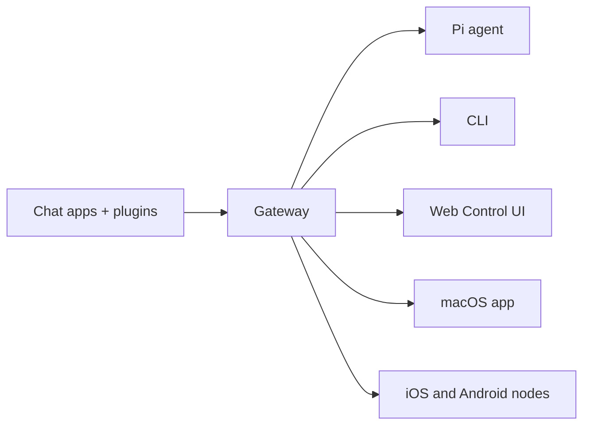

# OpenClaw 🦞

<p align="center">
    
    
</p>

> _「EXFOLIATE! EXFOLIATE!」_ — たぶん宇宙ロブスター

<p align="center"><strong>WhatsApp、Telegram、Discord、iMessage などに対応した、AI エージェント向けの Any OS ゲートウェイ。</strong><br />
  メッセージを送信すると、ポケットからエージェントの応答が返ってきます。プラグインで Mattermost なども追加できます。
<br />
  メッセージを送信し、あなたのポケットからエージェントの応答を取得します。 プラグインはMattermostなどを追加します。
</p>

<Columns>
  <Card title="Get Started" href="/start/getting-started" icon="rocket">
    OpenClaw をインストールし、数分で Gateway（ゲートウェイ）を起動します。
  </Card>
  <Card title="Run the Wizard" href="/start/wizard" icon="sparkles">
    `openclaw onboard` とペアリングフローによるガイド付きセットアップ。
  </Card>
  <Card title="Open the Control UI" href="/web/control-ui" icon="layout-dashboard">
    チャット、設定、セッションのためのブラウザ ダッシュボードを起動します。
  </Card>
</Columns>

## What is OpenClaw?

OpenClaw は **セルフホスト型ゲートウェイ** で、WhatsApp、Telegram、Discord、iMessage などの好みのチャットアプリを、Pi のような AI コーディング エージェントに接続します。自身のマシン（またはサーバー）上で単一の Gateway プロセスを実行するだけで、メッセージング アプリと常時利用可能な AI アシスタントをつなぐ橋渡しになります。 独自のマシン(またはサーバー)で単一のゲートウェイプロセスを実行します。 そして、メッセージングアプリと常に利用可能なAIアシスタントの間の橋渡しになります。

**誰向けですか？**  
どこからでもメッセージでやり取りできる個人用 AI アシスタントを求めつつ、データの管理権限を手放したり、ホステッド サービスに依存したりしたくない開発者やパワーユーザー向けです。

**何が違いますか？**

- **Self-hosted**: 自分のハードウェア、自分のルールで実行
- **Multi-channel**: 1 つの Gateway で WhatsApp、Telegram、Discord などを同時に提供
- **Agent-native**: ツール利用、セッション、メモリ、マルチエージェント ルーティングを備えたコーディング エージェント向け設計
- **Open source**: MIT ライセンス、コミュニティ主導

**何が必要ですか？** Node 22+、API キー（Anthropic 推奨）、そして 5 分です。

## How it works



Gateway は、セッション、ルーティング、チャンネル接続における単一の信頼できる情報源です。

## Key capabilities

<Columns>
  <Card title="Multi-channel gateway" icon="network">
    単一の Gateway プロセスで WhatsApp、Telegram、Discord、iMessage を提供します。
  </Card>
  <Card title="Plugin channels" icon="plug">
    拡張パッケージで Mattermost などを追加できます。
  </Card>
  <Card title="Multi-agent routing" icon="route">
    エージェント、ワークスペース、送信者ごとに分離されたセッション。
  </Card>
  <Card title="Media support" icon="image">
    画像、音声、ドキュメントの送受信に対応。
  </Card>
  <Card title="Web Control UI" icon="monitor">
    チャット、設定、セッション、ノードのためのブラウザ ダッシュボード。
  </Card>
  <Card title="Mobile nodes" icon="smartphone">
    Canvas 対応の iOS および Android ノードをペアリング。
  </Card>
</Columns>

## クイックスタート

<Steps>
  <Step title="Install OpenClaw">
    ```bash
    npm install -g openclaw@latest
    ```
  </Step>
  <Step title="Onboard and install the service">
    ```bash
    openclaw onboard --install-daemon
    ```
  </Step>
  <Step title="Pair WhatsApp and start the Gateway">
    ```bash
    openclaw channels login
    openclaw gateway --port 18789
    ```
  </Step>
</Steps>

完全なインストール手順と開発者向けセットアップが必要ですか？ [クイックスタート](/start/quickstart) を参照してください。 [Quick start](/start/quickstart) を参照してください。

## ダッシュボード

Gateway の起動後に、ブラウザの Control UI を開きます。

- ローカル既定: [http://127.0.0.1:18789/](http://127.0.0.1:18789/)
- リモート アクセス: [Web surfaces](/web) および [Tailscale](/gateway/tailscale)

<p align="center">
  
</p>

## 設定（任意）

設定ファイルは `~/.openclaw/openclaw.json` にあります。

- **何もしない場合**、OpenClaw は RPC モードで同梱の Pi バイナリを使用し、送信者ごとのセッションを作成します。
- 制限を強化したい場合は、`channels.whatsapp.allowFrom` から始め、（グループ向けには）メンション ルールを設定してください。

例:

```json5
{
  channels: {
    whatsapp: {
      allowFrom: ["+15555550123"],
      groups: { "*": { requireMention: true } },
    },
  },
  messages: { groupChat: { mentionPatterns: ["@openclaw"] } },
}
```

## Start here

<Columns>
  <Card title="Docs hubs" href="/start/hubs" icon="book-open">
    すべてのドキュメントとガイドを、ユースケース別に整理しています。
  </Card>
  <Card title="Configuration" href="/gateway/configuration" icon="settings">
    中核となる Gateway 設定、トークン、プロバイダー設定。
  </Card>
  <Card title="Remote access" href="/gateway/remote" icon="globe">
    SSH および tailnet によるアクセス パターン。
  </Card>
  <Card title="Channels" href="/channels/telegram" icon="message-square">
    WhatsApp、Telegram、Discord などのチャンネル別セットアップ。
  </Card>
  <Card title="Nodes" href="/nodes" icon="smartphone">
    ペアリングと Canvas に対応した iOS および Android ノード。
  </Card>
  <Card title="Help" href="/help" icon="life-buoy">
    一般的な対処法とトラブルシューティングの入口。
  </Card>
</Columns>

## Learn more

<Columns>
  <Card title="Full feature list" href="/concepts/features" icon="list">
    チャンネル、ルーティング、メディア機能の完全な一覧。
  </Card>
  <Card title="Multi-agent routing" href="/concepts/multi-agent" icon="route">
    ワークスペースの分離とエージェントごとのセッション。
  </Card>
  <Card title="Security" href="/gateway/security" icon="shield">
    トークン、許可リスト、安全制御。
  </Card>
  <Card title="Troubleshooting" href="/gateway/troubleshooting" icon="wrench">
    Gateway の診断と一般的なエラー。
  </Card>
  <Card title="About and credits" href="/reference/credits" icon="info">
    プロジェクトの起源、貢献者、ライセンス。
  </Card>
</Columns>
