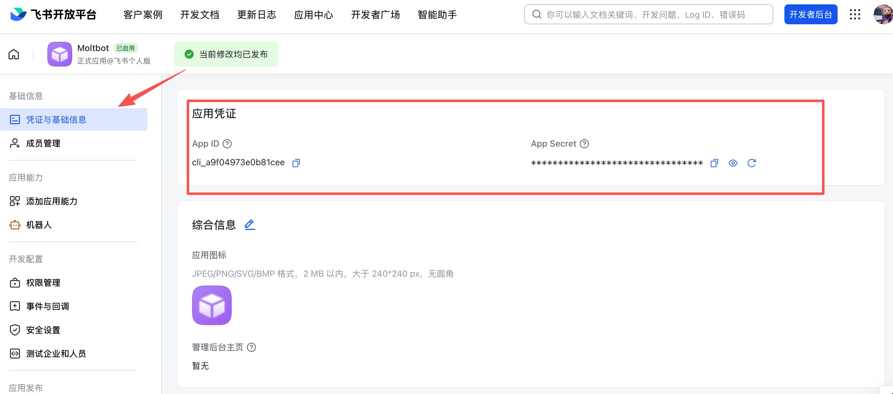

# Feishu 봇

Feishu (Lark)는 회사에서 메시징 및 협업에 사용하는 팀 채팅 플랫폼입니다. 이 플러그인은 OpenClaw를 Feishu/Lark 봇에 공개 웹훅 URL을 노출하지 않고 메시지를 수신할 수 있도록 플랫폼의 WebSocket 이벤트 구독을 사용하여 연결합니다.

---

## 플러그인 필요

Feishu 플러그인 설치:

```bash
openclaw plugins install @openclaw/feishu
```

로컬 체크아웃 (git repo에서 실행 중):

```bash
openclaw plugins install ./extensions/feishu
```

---

## 빠른 시작

Feishu 채널을 추가하는 두 가지 방법이 있습니다:

### 방법 1: 온보딩 마법사 (권장)

OpenClaw를 방금 설치했다면 마법사를 실행합니다:

```bash
openclaw onboard
```

마법사는 당신을 다음과 같이 안내합니다:

1. Feishu 앱 만들기 및 자격증명 수집
2. OpenClaw에서 앱 자격증명 설정
3. 게이트웨이 시작

✅ **설정 후** 게이트웨이 상태 확인:

- `openclaw gateway status`
- `openclaw logs --follow`

### 방법 2: CLI 설정

이미 초기 설치를 완료했다면 CLI를 통해 채널을 추가합니다:

```bash
openclaw channels add
```

**Feishu**를 선택한 후 App ID 및 App Secret을 입력합니다.

✅ **설정 후** 게이트웨이 관리:

- `openclaw gateway status`
- `openclaw gateway restart`
- `openclaw logs --follow`

---

## 단계 1: Feishu 앱 만들기

### 1. Feishu Open Platform 열기

[Feishu Open Platform](https://open.feishu.cn/app)에 방문하여 로그인합니다.

Lark (글로벌) 테넌트는 [https://open.larksuite.com/app](https://open.larksuite.com/app)를 사용해야 하고 Feishu 설정에서 `domain: "lark"`를 설정해야 합니다.

### 2. 앱 만들기

1. **엔터프라이즈 앱 만들기** 클릭
2. 앱 이름 + 설명 입력
3. 앱 아이콘 선택


### 3. 자격증명 복사

**자격증명 & 기본 정보**에서 다음을 복사합니다:

- **App ID** (형식: `cli_xxx`)
- **App Secret**

❗ **중요:** App Secret은 비공개로 유지합니다.



### 4. 권한 설정

**권한**에서 **일괄 가져오기**를 클릭하고 다음을 붙여넣기:

```json
{
  "scopes": {
    "tenant": [
      "aily:file:read",
      "aily:file:write",
      "application:application.app_message_stats.overview:readonly",
      "application:application:self_manage",
      "application:bot.menu:write",
      "cardkit:card:read",
      "cardkit:card:write",
      "contact:user.employee_id:readonly",
      "corehr:file:download",
      "event:ip_list",
      "im:chat.access_event.bot_p2p_chat:read",
      "im:chat.members:bot_access",
      "im:message",
      "im:message.group_at_msg:readonly",
      "im:message.p2p_msg:readonly",
      "im:message:readonly",
      "im:message:send_as_bot",
      "im:resource"
    ],
    "user": ["aily:file:read", "aily:file:write", "im:chat.access_event.bot_p2p_chat:read"]
  }
}
```


### 5. 봇 기능 활성화

**앱 기능** > **봇**에서:

1. 봇 기능 활성화
2. 봇 이름 설정


### 6. 이벤트 구독 설정

⚠️ **중요:** 이벤트 구독을 설정하기 전에 다음을 확인합니다:

1. 이미 Feishu에 대해 `openclaw channels add`를 실행했습니다
2. 게이트웨이가 실행 중입니다 (`openclaw gateway status`)

**이벤트 구독**에서:

1. **긴 연결을 사용하여 이벤트 수신** (WebSocket) 선택
2. 이벤트 추가: `im.message.receive_v1`

⚠️ 게이트웨이가 실행되고 있지 않으면 긴 연결 설정이 저장되지 않을 수 있습니다.


### 7. 앱 게시

1. **버전 관리 & 릴리스**에서 버전 만들기
2. 검토를 위해 제출하고 게시
3. 관리자 승인을 기다립니다 (엔터프라이즈 앱은 보통 자동 승인)

---

## 단계 2: OpenClaw 설정

### 마법사로 설정 (권장)

```bash
openclaw channels add
```

**Feishu**를 선택하고 App ID + App Secret을 붙여넣기.

### 설정 파일을 통해 설정

`~/.openclaw/openclaw.json` 편집:

```json5
{
  channels: {
    feishu: {
      enabled: true,
      dmPolicy: "pairing",
      accounts: {
        main: {
          appId: "cli_xxx",
          appSecret: "xxx",
          botName: "내 AI 어시스턴트",
        },
      },
    },
  },
}
```

`connectionMode: "webhook"`을 사용하면 `verificationToken`을 설정합니다. Feishu 웹훅 서버는 기본적으로 `127.0.0.1`에 바인딩됩니다; 의도적으로 다른 바인드 주소가 필요한 경우에만 `webhookHost`를 설정합니다.

### 환경 변수를 통해 설정

```bash
export FEISHU_APP_ID="cli_xxx"
export FEISHU_APP_SECRET="xxx"
```

### Lark (글로벌) 도메인

테넌트가 Lark (국제)에 있으면 도메인을 `lark` (또는 전체 도메인 문자열)로 설정합니다. `channels.feishu.domain` 또는 계정별 (`channels.feishu.accounts.<id>.domain`)에서 설정할 수 있습니다.

```json5
{
  channels: {
    feishu: {
      domain: "lark",
      accounts: {
        main: {
          appId: "cli_xxx",
          appSecret: "xxx",
        },
      },
    },
  },
}
```

### 할당량 최적화 플래그

두 가지 선택적 플래그로 Feishu API 사용을 줄일 수 있습니다:

- `typingIndicator` (기본값 `true`): `false`일 때 입력 반응 호출을 건너뜁니다.
- `resolveSenderNames` (기본값 `true`): `false`일 때 발신자 프로필 조회 호출을 건너뜁니다.

최상위 또는 계정별로 설정:

```json5
{
  channels: {
    feishu: {
      typingIndicator: false,
      resolveSenderNames: false,
      accounts: {
        main: {
          appId: "cli_xxx",
          appSecret: "xxx",
          typingIndicator: true,
          resolveSenderNames: false,
        },
      },
    },
  },
}
```

---

## 단계 3: 시작 + 테스트

### 1. 게이트웨이 시작

```bash
openclaw gateway
```

### 2. 테스트 메시지 보내기

Feishu에서 봇을 찾아 메시지를 보냅니다.

### 3. 페어링 승인

기본적으로 봇은 페어링 코드로 응답합니다. 승인:

```bash
openclaw pairing approve feishu <CODE>
```

승인 후 정상적으로 채팅할 수 있습니다.

---

## 개요

- **Feishu 봇 채널**: 게이트웨이에서 관리하는 Feishu 봇
- **결정적 라우팅**: 회신은 항상 Feishu로 돌아갑니다
- **세션 격리**: DM은 메인 세션을 공유합니다; 그룹은 격리됨
- **WebSocket 연결**: Feishu SDK를 통한 긴 연결, 공개 URL 필요 없음

---

## 접근 제어

### 직접 메시지

- **기본값**: `dmPolicy: "pairing"` (알 수 없는 사용자가 페어링 코드를 받음)
- **페어링 승인**:

  ```bash
  openclaw pairing list feishu
  openclaw pairing approve feishu <CODE>
  ```

- **허용 목록 모드**: `channels.feishu.allowFrom`을 허용된 Open ID로 설정

### 그룹 채팅

**1. 그룹 정책** (`channels.feishu.groupPolicy`):

- `"open"` = 그룹의 모든 사람을 허용 (기본값)
- `"allowlist"` = `groupAllowFrom`만 허용
- `"disabled"` = 그룹 메시지 비활성화

**2. 멘션 요구 사항** (`channels.feishu.groups.<chat_id>.requireMention`):

- `true` = @멘션 필요 (기본값)
- `false` = 멘션 없이 응답

---

## 그룹 설정 예시

### 모든 그룹 허용, @멘션 필요 (기본값)

```json5
{
  channels: {
    feishu: {
      groupPolicy: "open",
      // 기본값 requireMention: true
    },
  },
}
```

### 모든 그룹 허용, @멘션 필요 없음

```json5
{
  channels: {
    feishu: {
      groups: {
        oc_xxx: { requireMention: false },
      },
    },
  },
}
```

### 특정 그룹만 허용

```json5
{
  channels: {
    feishu: {
      groupPolicy: "allowlist",
      // Feishu 그룹 ID (chat_id) 형식: oc_xxx
      groupAllowFrom: ["oc_xxx", "oc_yyy"],
    },
  },
}
```

### 그룹에서 제어 명령어를 실행할 수 있는 특정 사용자 허용 (예: /reset, /new)

그룹 자체를 허용하는 것 외에 제어 명령어는 **발신자** open_id로 게이트됩니다.

```json5
{
  channels: {
    feishu: {
      groupPolicy: "allowlist",
      groupAllowFrom: ["oc_xxx"],
      groups: {
        oc_xxx: {
          // Feishu 사용자 ID (open_id) 형식: ou_xxx
          allowFrom: ["ou_user1", "ou_user2"],
        },
      },
    },
  },
}
```

---

## 그룹/사용자 ID 가져오기

### 그룹 ID (chat_id)

그룹 ID는 `oc_xxx` 형식입니다.

**방법 1 (권장)**

1. 게이트웨이를 시작하고 그룹에서 봇을 @멘션합니다
2. `openclaw logs --follow`를 실행하고 `chat_id` 찾기

**방법 2**

Feishu API 디버거를 사용하여 그룹 채팅을 나열합니다.

### 사용자 ID (open_id)

사용자 ID는 `ou_xxx` 형식입니다.

**방법 1 (권장)**

1. 게이트웨이를 시작하고 봇에 DM을 보냅니다
2. `openclaw logs --follow`를 실행하고 `open_id` 찾기

**방법 2**

페어링 요청에서 사용자 Open ID 확인:

```bash
openclaw pairing list feishu
```

---

## 일반 명령어

| 명령어    | 설명           |
| --------- | -------------- |
| `/status` | 봇 상태 표시   |
| `/reset`  | 세션 재설정    |
| `/model`  | 모델 표시/전환 |

> 참고: Feishu는 아직 네이티브 명령어 메뉴를 지원하지 않으므로 명령어는 텍스트로 보내야 합니다.

## 게이트웨이 관리 명령어

| 명령어                     | 설명                        |
| -------------------------- | --------------------------- |
| `openclaw gateway status`  | 게이트웨이 상태 표시        |
| `openclaw gateway install` | 게이트웨이 서비스 설치/시작 |
| `openclaw gateway stop`    | 게이트웨이 서비스 중지      |
| `openclaw gateway restart` | 게이트웨이 서비스 재시작    |
| `openclaw logs --follow`   | 게이트웨이 로그 추적        |

---

## 문제 해결

### 봇이 그룹 채팅에서 응답하지 않음

1. 봇이 그룹에 추가되었는지 확인
2. 봇을 @멘션하는지 확인 (기본 동작)
3. `groupPolicy`가 `"disabled"`로 설정되지 않았는지 확인
4. 로그 확인: `openclaw logs --follow`

### 봇이 메시지를 받지 못함

1. 앱이 게시되고 승인되었는지 확인
2. 이벤트 구독에 `im.message.receive_v1`이 포함되었는지 확인
3. **긴 연결**이 활성화되었는지 확인
4. 앱 권한이 완료되었는지 확인
5. 게이트웨이가 실행 중인지 확인: `openclaw gateway status`
6. 로그 확인: `openclaw logs --follow`

### App Secret 누수

1. Feishu Open Platform에서 App Secret 재설정
2. 설정에서 App Secret 업데이트
3. 게이트웨이 재시작

### 메시지 전송 실패

1. 앱에 `im:message:send_as_bot` 권한이 있는지 확인
2. 앱이 게시되었는지 확인
3. 자세한 오류는 로그를 확인

---

## 고급 설정

### 다중 계정

```json5
{
  channels: {
    feishu: {
      accounts: {
        main: {
          appId: "cli_xxx",
          appSecret: "xxx",
          botName: "기본 봇",
        },
        backup: {
          appId: "cli_yyy",
          appSecret: "yyy",
          botName: "백업 봇",
          enabled: false,
        },
      },
    },
  },
}
```

### 메시지 한계

- `textChunkLimit`: 아웃바운드 텍스트 청크 크기 (기본값: 2000자)
- `mediaMaxMb`: 미디어 업로드/다운로드 한계 (기본값: 30MB)

### 스트리밍

Feishu는 대화형 카드를 통해 스트리밍 응답을 지원합니다. 활성화되면 봇은 생성할 때 카드를 업데이트합니다.

```json5
{
  channels: {
    feishu: {
      streaming: true, // 스트리밍 카드 출력 활성화 (기본값 true)
      blockStreaming: true, // 블록 레벨 스트리밍 활성화 (기본값 true)
    },
  },
}
```

`streaming: false`를 전체 회신이 전송되기 전에 대기하도록 설정합니다.

### 다중 에이전트 라우팅

`bindings`를 사용하여 Feishu DM 또는 그룹을 다른 에이전트로 라우팅합니다.

```json5
{
  agents: {
    list: [
      { id: "main" },
      {
        id: "clawd-fan",
        workspace: "/home/user/clawd-fan",
        agentDir: "/home/user/.openclaw/agents/clawd-fan/agent",
      },
      {
        id: "clawd-xi",
        workspace: "/home/user/clawd-xi",
        agentDir: "/home/user/.openclaw/agents/clawd-xi/agent",
      },
    ],
  },
  bindings: [
    {
      agentId: "main",
      match: {
        channel: "feishu",
        peer: { kind: "direct", id: "ou_xxx" },
      },
    },
    {
      agentId: "clawd-fan",
      match: {
        channel: "feishu",
        peer: { kind: "direct", id: "ou_yyy" },
      },
    },
    {
      agentId: "clawd-xi",
      match: {
        channel: "feishu",
        peer: { kind: "group", id: "oc_zzz" },
      },
    },
  ],
}
```

라우팅 필드:

- `match.channel`: `"feishu"`
- `match.peer.kind`: `"direct"` 또는 `"group"`
- `match.peer.id`: 사용자 Open ID (`ou_xxx`) 또는 그룹 ID (`oc_xxx`)

ID 조회 팁은 [그룹/사용자 ID 가져오기](#그룹사용자-id-가져오기)를 참조하세요.

---

## 설정 참조

전체 설정: [게이트웨이 설정](/gateway/configuration)

주요 옵션:

| 설정                                              | 설명                              | 기본값           |
| ------------------------------------------------- | --------------------------------- | ---------------- |
| `channels.feishu.enabled`                         | 채널 활성화/비활성화              | `true`           |
| `channels.feishu.domain`                          | API 도메인 (`feishu` 또는 `lark`) | `feishu`         |
| `channels.feishu.connectionMode`                  | 이벤트 전송 모드                  | `websocket`      |
| `channels.feishu.verificationToken`               | 웹훅 모드에 필수                  | -                |
| `channels.feishu.webhookPath`                     | 웹훅 경로                         | `/feishu/events` |
| `channels.feishu.webhookHost`                     | 웹훅 바인드 호스트                | `127.0.0.1`      |
| `channels.feishu.webhookPort`                     | 웹훅 바인드 포트                  | `3000`           |
| `channels.feishu.accounts.<id>.appId`             | App ID                            | -                |
| `channels.feishu.accounts.<id>.appSecret`         | App Secret                        | -                |
| `channels.feishu.accounts.<id>.domain`            | 계정별 API 도메인 재정의          | `feishu`         |
| `channels.feishu.dmPolicy`                        | DM 정책                           | `pairing`        |
| `channels.feishu.allowFrom`                       | DM 허용 목록 (open_id 목록)       | -                |
| `channels.feishu.groupPolicy`                     | 그룹 정책                         | `open`           |
| `channels.feishu.groupAllowFrom`                  | 그룹 허용 목록                    | -                |
| `channels.feishu.groups.<chat_id>.requireMention` | @멘션 필요                        | `true`           |
| `channels.feishu.groups.<chat_id>.enabled`        | 그룹 활성화                       | `true`           |
| `channels.feishu.textChunkLimit`                  | 메시지 청크 크기                  | `2000`           |
| `channels.feishu.mediaMaxMb`                      | 미디어 크기 한계                  | `30`             |
| `channels.feishu.streaming`                       | 스트리밍 카드 출력 활성화         | `true`           |
| `channels.feishu.blockStreaming`                  | 블록 스트리밍 활성화              | `true`           |

---

## dmPolicy 참조

| 값            | 동작                                                           |
| ------------- | -------------------------------------------------------------- |
| `"pairing"`   | **기본값.** 알 수 없는 사용자가 페어링 코드를 받으면 승인 필요 |
| `"allowlist"` | 오직 `allowFrom`의 사용자만 채팅 가능                          |
| `"open"`      | 모든 사용자 허용 (requires `"*"` in allowFrom)                 |
| `"disabled"`  | DM 비활성화                                                    |

---

## 지원되는 메시지 유형

### 수신

- ✅ 텍스트
- ✅ 리치 텍스트 (게시물)
- ✅ 이미지
- ✅ 파일
- ✅ 오디오
- ✅ 비디오
- ✅ 스티커

### 전송

- ✅ 텍스트
- ✅ 이미지
- ✅ 파일
- ✅ 오디오
- ⚠️ 리치 텍스트 (부분 지원)
