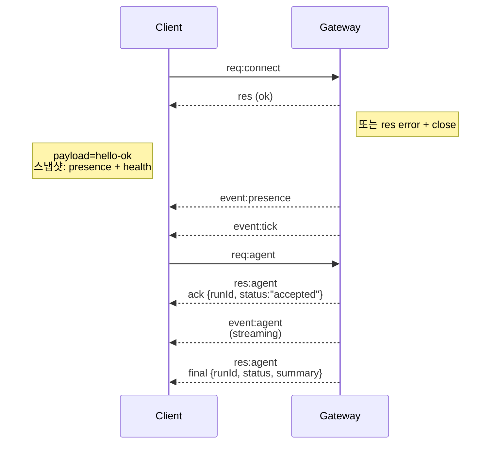

# 게이트웨이 아키텍처

마지막 업데이트: 2026-01-22

## 개요

- 하나의 장기 실행 **게이트웨이**가 모든 메시지 인터페이스 (WhatsApp via Baileys, Telegram via grammY, Slack, Discord, Signal, iMessage, WebChat)를 소유합니다.
- 제어 평면 클라이언트 (macOS 앱, CLI, 웹 UI, 자동화)는 구성된 바인드 호스트 (기본값 `127.0.0.1:18789`)의 **WebSocket**을 통해 게이트웨이에 연결합니다.
- **노드** (macOS/iOS/Android/헤드리스)도 **WebSocket**을 통해 연결하지만, 명시적인 캡처/명령어와 함께 `role: node`를 선언합니다.
- 호스트당 하나의 게이트웨이; WhatsApp 세션을 여는 유일한 장소입니다.
- **캔버스 호스트**는 게이트웨이 HTTP 서버에 의해 제공됩니다:
  - `/__openclaw__/canvas/` (에이전트 편집 가능한 HTML/CSS/JS)
  - `/__openclaw__/a2ui/` (A2UI 호스트)  
    이는 게이트웨이와 동일한 포트(기본값 `18789`)를 사용합니다.

## 구성 요소 및 흐름

### 게이트웨이(데몬)

- 프로바이더 연결을 유지합니다.
- 타입이 지정된 WS API (요청, 응답, 서버 푸시 이벤트)를 노출합니다.
- JSON 스키마에 대한 들어오는 프레임을 유효성 검사합니다.
- `agent`, `chat`, `presence`, `health`, `heartbeat`, `cron` 등의 이벤트를 발생시킵니다.

### 클라이언트 (mac 앱 / CLI / 웹 관리자)

- 클라이언트당 하나의 WS 연결이 있습니다.
- 요청 전송 (`health`, `status`, `send`, `agent`, `system-presence`).
- 이벤트 구독 (`tick`, `agent`, `presence`, `shutdown`).

### 노드 (macOS / iOS / Android / 헤드리스)

- `role: node`와 함께 **같은 WS 서버**에 연결합니다.
- `connect`에서 장치 식별을 제공합니다; 페어링은 **장치 기반** (role `node`)이며 승인은 장치 페어링 저장소에 존재합니다.
- `canvas.*`, `camera.*`, `screen.record`, `location.get` 같은 명령어를 노출합니다.

프로토콜 세부사항:

- [게이트웨이 프로토콜](/ko-KR/gateway/protocol)

### WebChat

- 게이트웨이 WS API를 사용하여 채팅 기록을 가져오고 보냅니다.
- 원격 설정에서는 다른 클라이언트와 동일한 SSH/Tailscale 터널을 통해 연결됩니다.

## 연결 생명주기 (단일 클라이언트)



## 와이어 프로토콜 (요약)

- 전송: WebSocket, JSON 페이로드를 포함한 텍스트 프레임.
- 첫 프레임은 **반드시** `connect`여야 합니다.
- 핸드셰이크 후:
  - 요청: `{type:"req", id, method, params}` → `{type:"res", id, ok, payload|error}`
  - 이벤트: `{type:"event", event, payload, seq?, stateVersion?}`
- `OPENCLAW_GATEWAY_TOKEN` (또는 `--token`)이 설정된 경우, `connect.params.auth.token`이 일치해야 하며 그렇지 않으면 소켓이 닫힙니다.
- `send`, `agent` 같은 부작용 메서드를 안전하게 재시도하려면 멱등 키가 필요합니다; 서버는 단기 중복 제거 캐시를 유지합니다.
- 노드는 `connect`에 `role: "node"`와 함께 캡처/명령/권한을 포함해야 합니다.

## 페어링 + 로컬 신뢰

- 모든 WS 클라이언트 (운영자 + 노드)는 `connect`에 **장치 식별**을 포함합니다.
- 새로운 장치 ID는 페어링 승인이 필요합니다; 게이트웨이는 이후 연결을 위한 **장치 토큰**을 발급합니다.
- **로컬** 연결 (로컬 루프백 또는 게이트웨이 호스트의 자체 tailnet 주소)은 동일한 호스트 UX를 원활하게 유지하기 위해 자동 승인이 가능합니다.
- **비로컬** 연결은 `connect.challenge` 논스를 서명해야 하며 명시적인 승인이 필요합니다.
- 게이트웨이 인증 (`gateway.auth.*`)은 **모든** 연결에 적용됩니다, 로컬이든 원격이든 간에.

자세한 내용: [게이트웨이 프로토콜](/ko-KR/gateway/protocol), [페어링](/ko-KR/channels/pairing),
[보안](/ko-KR/gateway/security).

## 프로토콜 타이핑 및 코드 생성

- TypeBox 스키마가 프로토콜을 정의합니다.
- JSON 스키마는 이러한 스키마로부터 생성됩니다.
- Swift 모델은 JSON 스키마로부터 생성됩니다.

## 원격 접속

- 권장: Tailscale 또는 VPN.
- 대안: SSH 터널
  ```bash
  ssh -N -L 18789:127.0.0.1:18789 user@host
  ```

- 동일한 핸드셰이크 + 인증 토큰이 터널을 통해 적용됩니다.
- 원격 설정에서는 WS에 대해 TLS + 선택적 고정이 가능합니다.

## 운영 스냅샷

- 시작: `openclaw gateway` (포어그라운드, stdout에 로그 출력).
- 상태: WS를 통한 `health` (`hello-ok`에 포함됨).
- 감독: launchd/systemd를 통한 자동 재시작.

## 불변성

- 단 하나의 게이트웨이가 호스트당 하나의 Baileys 세션을 제어합니다.
- 핸드셰이크는 필수입니다; 비 JSON이나 비 `connect` 첫 프레임은 강제 종료됩니다.
- 이벤트는 재생되지 않습니다; 클라이언트는 간격에서 새로 고침해야 합니다.