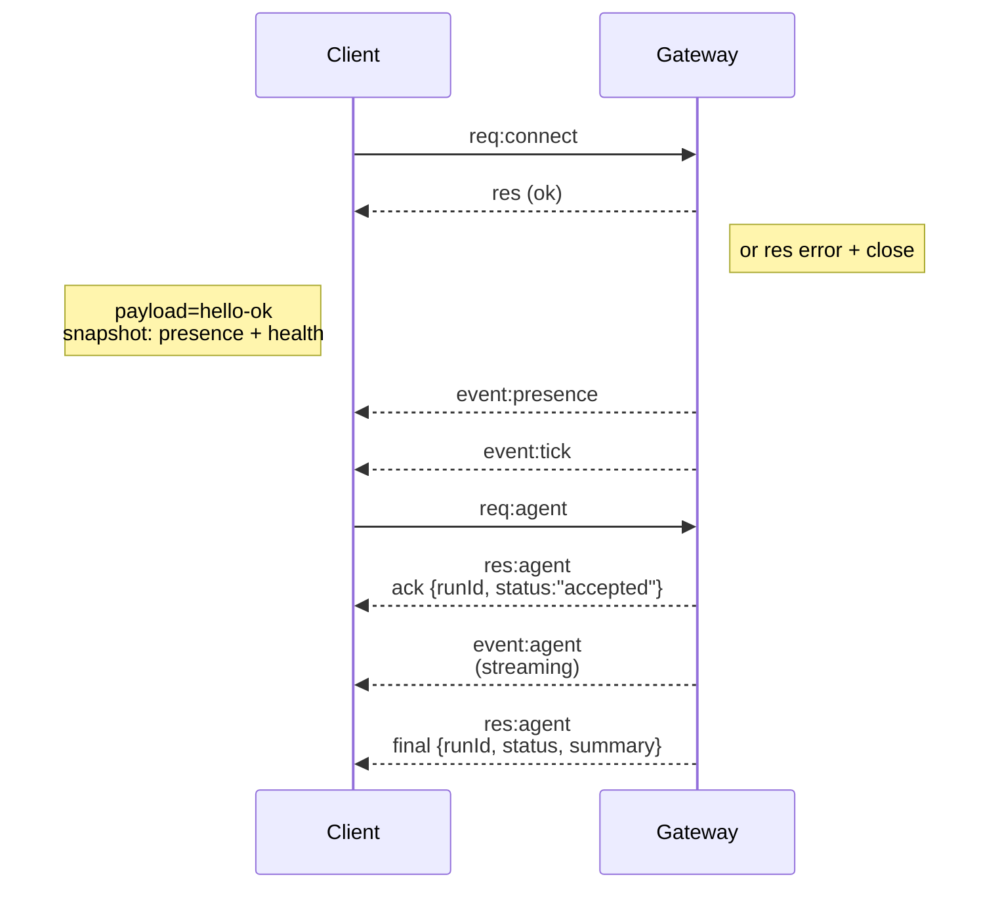

# Gateway architecture

최종 업데이트: 2026-01-22

## Overview

- 단일 long-lived **Gateway**가 모든 messaging surfaces (Baileys를 통한 WhatsApp, grammY를 통한 Telegram, Slack, Discord, Signal, iMessage, WebChat)를 소유합니다.
- Control-plane clients (macOS app, CLI, web UI, automations)는 configured bind host (default `127.0.0.1:18789`)에서 **WebSocket** 위로 Gateway에 연결합니다.
- **Nodes** (macOS/iOS/Android/headless)도 **WebSocket** 위로 연결하지만 explicit caps/commands로 `role: node`을 선언합니다.
- 하나의 Gateway per host; Baileys session per host를 opening하는 유일한 장소입니다.
- **canvas host**는 Gateway HTTP server 아래에서 served됩니다:
  - `/__openclaw__/canvas/` (agent-editable HTML/CSS/JS)
  - `/__openclaw__/a2ui/` (A2UI host)
    Gateway와 같은 port를 사용합니다 (default `18789`).

## Components and flows

### Gateway (daemon)

- provider connections을 유지합니다.
- typed WS API를 exposes합니다 (requests, responses, server-push events).
- inbound frames를 JSON Schema에 대해 validates합니다.
- `agent`, `chat`, `presence`, `health`, `heartbeat`, `cron` 같은 events를 emits합니다.

### Clients (mac app / CLI / web admin)

- Per client 하나의 WS connection.
- requests를 sends합니다 (`health`, `status`, `send`, `agent`, `system-presence`).
- events를 subscribes합니다 (`tick`, `agent`, `presence`, `shutdown`).

### Nodes (macOS / iOS / Android / headless)

- **same WS server**에 `role: node`로 연결합니다.
- `connect`; pairing에서 device identity를 provide합니다: **device-based** (role `node`) and approval은 device pairing store에 lives합니다.
- `canvas.*`, `camera.*`, `screen.record`, `location.get` 같은 commands를 expose합니다.

Protocol details:

- [Gateway protocol](/gateway/protocol)

### WebChat

- Gateway WS API를 chat history와 sends를 위해 사용하는 Static UI.
- remote setups에서, 다른 clients와 같은 SSH/Tailscale tunnel을 통해 연결합니다.

## Connection lifecycle (single client)


```mermaid
sequenceDiagram
    participant Client
    participant Gateway

    Client->>Gateway: req:connect
    Gateway-->>Client: res (ok)
    Note right of Gateway: or res error + close
    Note left of Client: payload=hello-ok<br>snapshot: presence + health

    Gateway-->>Client: event:presence
    Gateway-->>Client: event:tick

    Client->>Gateway: req:agent
    Gateway-->>Client: res:agent<br>ack {runId, status:"accepted"}
    Gateway-->>Client: event:agent<br>(streaming)
    Gateway-->>Client: res:agent<br>final {runId, status, summary}
```

## Wire protocol (summary)

- Transport: WebSocket, JSON payloads를 포함한 text frames.
- First frame **must** be `connect`.
- After handshake:
  - Requests: `{type:"req", id, method, params}` → `{type:"res", id, ok, payload|error}`
  - Events: `{type:"event", event, payload, seq?, stateVersion?}`
- `OPENCLAW_GATEWAY_TOKEN` (or `--token`)이 set되면 `connect.params.auth.token` match해야 하거나 socket closes합니다.
- Idempotency keys는 side-effecting methods (`send`, `agent`)에 필요합니다. safely retry하기 위해; server는 short-lived dedupe cache를 keeps합니다.
- Nodes는 `connect`에서 `role: "node"` plus caps/commands/permissions를 include해야 합니다.

## Pairing + local trust

- 모든 WS clients (operators + nodes)는 `connect`에 **device identity**를 include합니다.
- 새로운 device IDs는 pairing approval을 require합니다; Gateway는 subsequent connects를 위해 **device token**을 issues합니다.
- **Local** connects (loopback 또는 gateway host's own tailnet address)는 same-host UX smooth를 유지하기 위해 auto-approved될 수 있습니다.
- 모든 connects는 `connect.challenge` nonce에 sign해야 합니다.
- Signature payload `v3`는 또한 `platform` + `deviceFamily`을 binds합니다; gateway는 reconnect에서 paired metadata를 pins하고 metadata changes를 위해 repair pairing을 requires합니다.
- **Non-local** connects는 여전히 explicit approval을 require합니다.
- Gateway auth (`gateway.auth.*`)는 여전히 **모든** connections, local 또는 remote에 applies합니다.

Details: [Gateway protocol](/gateway/protocol), [Pairing](/channels/pairing),
[Security](/gateway/security).

## Protocol typing and codegen

- TypeBox schemas는 protocol을 define합니다.
- JSON Schema는 those schemas에서 generated됩니다.
- Swift models는 JSON Schema에서 generated됩니다.

## Remote access

- Preferred: Tailscale 또는 VPN.
- Alternative: SSH tunnel

  ```bash
  ssh -N -L 18789:127.0.0.1:18789 user@host
  ```

- Same handshake + auth token은 tunnel over 적용합니다.
- TLS + optional pinning은 remote setups에서 WS를 위해 enabled될 수 있습니다.

## Operations snapshot

- Start: `openclaw gateway` (foreground, logs to stdout).
- Health: `health` over WS (also included in `hello-ok`).
- Supervision: launchd/systemd for auto-restart.

## Invariants

- Exactly one Gateway는 single Baileys session per host를 controls합니다.
- Handshake는 mandatory입니다; non-JSON 또는 non-connect first frame는 hard close입니다.
- Events는 replayed되지 않습니다; clients는 gaps에서 refresh해야 합니다.
