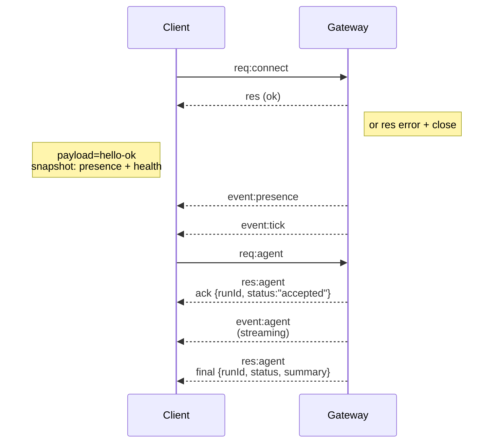

# Gateway 아키텍처

## 개요

- 하나의 장기 실행 **Gateway**가 모든 메시징 채널(Baileys를 통한 WhatsApp, grammY를 통한 Telegram, Slack, Discord, Signal, iMessage, WebChat)을 관리합니다.
- 컨트롤 플레인 클라이언트(macOS 앱, CLI, 웹 UI, 자동화)는 설정된 바인드 호스트(기본값 `127.0.0.1:18789`)에서 **WebSocket**을 통해 Gateway에 연결합니다.
- **노드**(macOS/iOS/Android/헤드리스)도 **WebSocket**으로 연결하지만, 명시적인 기능/명령과 함께 `role: node`를 선언합니다.
- 호스트당 하나의 Gateway가 존재하며, WhatsApp 세션을 여는 유일한 장소입니다.
- **canvas host**는 Gateway HTTP 서버에서 다음 경로로 제공됩니다:
  - `/__openclaw__/canvas/` (에이전트가 편집 가능한 HTML/CSS/JS)
  - `/__openclaw__/a2ui/` (A2UI 호스트)
    Gateway와 동일한 포트(기본값 `18789`)를 사용합니다.

## 구성 요소 및 흐름

### Gateway (데몬)

- 프로바이더 연결을 유지합니다.
- 타입이 지정된 WS API(요청, 응답, 서버 푸시 이벤트)를 노출합니다.
- 수신 프레임을 JSON Schema에 대해 검증합니다.
- `agent`, `chat`, `presence`, `health`, `heartbeat`, `cron`과 같은 이벤트를 발생시킵니다.

### 클라이언트 (mac app / CLI / web admin)

- 클라이언트당 하나의 WS 연결을 사용합니다.
- 요청을 전송합니다 (`health`, `status`, `send`, `agent`, `system-presence`).
- 이벤트를 구독합니다 (`tick`, `agent`, `presence`, `shutdown`).

### 노드 (macOS / iOS / Android / 헤드리스)

- `role: node`로 **동일한 WS 서버**에 연결합니다.
- `connect`에서 디바이스 ID를 제공합니다. 페어링은 **디바이스 기반**(역할 `node`)이며 승인은 디바이스 페어링 저장소에 있습니다.
- `canvas.*`, `camera.*`, `screen.record`, `location.get`과 같은 명령을 노출합니다.

프로토콜 세부 사항:

- [Gateway 프로토콜](/gateway/protocol)

### WebChat

- Gateway WS API를 사용하여 채팅 기록 및 전송을 처리하는 정적 UI입니다.
- 원격 설정에서는 다른 클라이언트와 동일한 SSH/Tailscale 터널을 통해 연결합니다.

## 연결 라이프사이클 (단일 클라이언트)


```mermaid
sequenceDiagram
    participant Client
    participant Gateway

    Client->>Gateway: req:connect
    Gateway-->>Client: res (ok)
    Note right of Gateway: or res error + close
    Note left of Client: payload=hello-ok<br>snapshot: presence + health

    Gateway-->>Client: event:presence
    Gateway-->>Client: event:tick

    Client->>Gateway: req:agent
    Gateway-->>Client: res:agent<br>ack {runId, status:"accepted"}
    Gateway-->>Client: event:agent<br>(streaming)
    Gateway-->>Client: res:agent<br>final {runId, status, summary}
```

## 와이어 프로토콜 (요약)

- 전송: WebSocket, JSON 페이로드의 텍스트 프레임.
- 첫 번째 프레임은 **반드시** `connect`여야 합니다.
- 핸드셰이크 후:
  - 요청: `{type:"req", id, method, params}` → `{type:"res", id, ok, payload|error}`
  - 이벤트: `{type:"event", event, payload, seq?, stateVersion?}`
- `OPENCLAW_GATEWAY_TOKEN` (또는 `--token`)이 설정된 경우, `connect.params.auth.token`이 일치해야 하며 그렇지 않으면 소켓이 닫힙니다.
- 부수 효과가 있는 메서드(`send`, `agent`)에는 안전한 재시도를 위해 멱등성 키가 필요합니다. 서버는 단기 중복 제거 캐시를 유지합니다.
- 노드는 `connect`에 `role: "node"`와 기능/명령/권한을 포함해야 합니다.

## 페어링 + 로컬 신뢰

- 모든 WS 클라이언트(운영자 + 노드)는 `connect`에 **디바이스 ID**를 포함합니다.
- 새로운 디바이스 ID는 페어링 승인이 필요하며, Gateway는 후속 연결을 위해 **디바이스 토큰**을 발급합니다.
- **로컬** 연결(루프백 또는 Gateway 호스트의 자체 tailnet 주소)은 동일 호스트 UX를 원활하게 유지하기 위해 자동 승인될 수 있습니다.
- 모든 연결은 `connect.challenge` 논스에 서명해야 합니다.
- 서명 페이로드 `v3`는 `platform` + `deviceFamily`도 바인딩합니다. Gateway는 재연결 시 페어링된 메타데이터를 고정하며 메타데이터 변경 시 재페어링을 요구합니다.
- **비로컬** 연결은 여전히 명시적 승인이 필요합니다.
- Gateway 인증(`gateway.auth.*`)은 로컬이든 원격이든 **모든** 연결에 적용됩니다.

세부 사항: [Gateway 프로토콜](/gateway/protocol), [페어링](/channels/pairing),
[보안](/gateway/security).

## 프로토콜 타이핑 및 코드 생성

- TypeBox 스키마가 프로토콜을 정의합니다.
- 해당 스키마에서 JSON Schema가 생성됩니다.
- JSON Schema에서 Swift 모델이 생성됩니다.

## 원격 접근

- 권장: Tailscale 또는 VPN.
- 대안: SSH 터널

  ```bash
  ssh -N -L 18789:127.0.0.1:18789 user@host
  ```

- 터널을 통해서도 동일한 핸드셰이크 + 인증 토큰이 적용됩니다.
- 원격 설정에서는 WS에 대해 TLS + 선택적 핀닝을 활성화할 수 있습니다.

## 운영 스냅샷

- 시작: `openclaw gateway` (포그라운드, stdout으로 로그 출력).
- 상태 확인: WS를 통한 `health` (`hello-ok`에도 포함됨).
- 감시: 자동 재시작을 위한 launchd/systemd.

## 불변 조건

- 정확히 하나의 Gateway가 호스트당 단일 Baileys 세션을 제어합니다.
- 핸드셰이크는 필수입니다. JSON이 아니거나 connect가 아닌 첫 프레임은 강제 종료됩니다.
- 이벤트는 재생되지 않습니다. 클라이언트는 갭 발생 시 새로고침해야 합니다.
