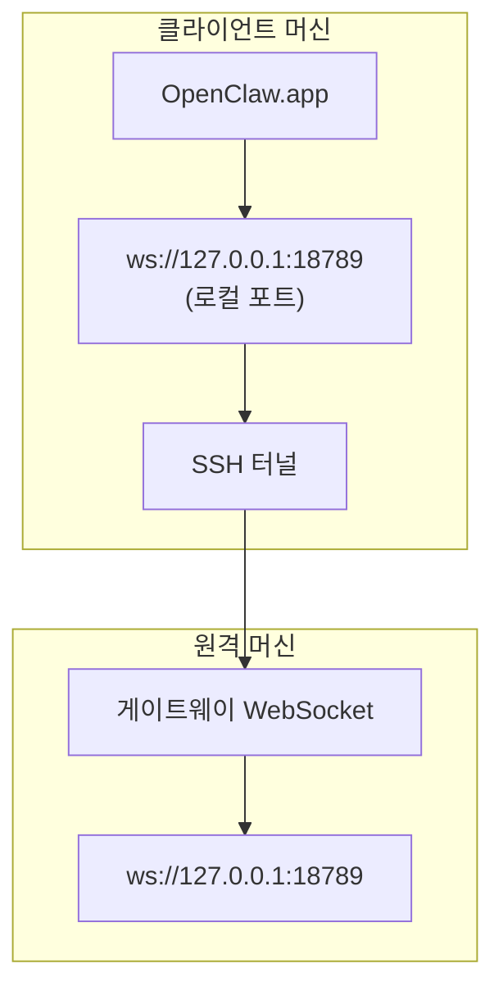

# 원격 게이트웨이와 함께 OpenClaw.app 실행하기

OpenClaw.app 은 SSH 터널링을 사용하여 원격 게이트웨이에 연결합니다. 이 가이드에서는 설정 방법을 보여줍니다.

## 개요



## 빠른 설정

### 1단계: SSH 구성 추가

`~/.ssh/config` 파일을 편집하고 다음 내용을 추가합니다:

```ssh
Host remote-gateway
    HostName <REMOTE_IP>          # 예: 172.27.187.184
    User <REMOTE_USER>            # 예: jefferson
    LocalForward 18789 127.0.0.1:18789
    IdentityFile ~/.ssh/id_rsa
```

`<REMOTE_IP>`와 `<REMOTE_USER>`는 자신의 값으로 대체하세요.

### 2단계: SSH 키 복사

공개 키를 원격 머신으로 복사하세요 (암호 한 번 입력):

```bash
ssh-copy-id -i ~/.ssh/id_rsa <REMOTE_USER>@<REMOTE_IP>
```

### 3단계: 게이트웨이 토큰 설정

```bash
launchctl setenv OPENCLAW_GATEWAY_TOKEN "<your-token>"
```

### 4단계: SSH 터널 시작

```bash
ssh -N remote-gateway &
```

### 5단계: OpenClaw.app 재시작

```bash
# OpenClaw.app 종료하기 (⌘Q), 그런 다음 다시 열기:
open /path/to/OpenClaw.app
```

이제 앱은 SSH 터널을 통해 원격 게이트웨이에 연결됩니다.

---

## 로그인 시 터널 자동 시작

로그인 할 때 SSH 터널이 자동으로 시작되도록 하려면, Launch 에이전트를 생성하세요.

### PLIST 파일 생성

아래 내용을 `~/Library/LaunchAgents/bot.molt.ssh-tunnel.plist` 로 저장하세요:

```xml
<?xml version="1.0" encoding="UTF-8"?>
<!DOCTYPE plist PUBLIC "-//Apple//DTD PLIST 1.0//EN" "http://www.apple.com/DTDs/PropertyList-1.0.dtd">
<plist version="1.0">
<dict>
    <key>Label</key>
    <string>bot.molt.ssh-tunnel</string>
    <key>ProgramArguments</key>
    <array>
        <string>/usr/bin/ssh</string>
        <string>-N</string>
        <string>remote-gateway</string>
    </array>
    <key>KeepAlive</key>
    <true/>
    <key>RunAtLoad</key>
    <true/>
</dict>
</plist>
```

### Launch 에이전트 로드하기

```bash
launchctl bootstrap gui/$UID ~/Library/LaunchAgents/bot.molt.ssh-tunnel.plist
```

이제 터널은:

- 로그인 시 자동으로 시작됩니다
- 크래시 시 다시 시작됩니다
- 백그라운드에서 계속 실행됩니다

레거시 주의 사항: 남아 있는 `com.openclaw.ssh-tunnel` LaunchAgent 가 있다면 제거하세요.

---

## 문제 해결

**터널이 실행 중인지 확인:**

```bash
ps aux | grep "ssh -N remote-gateway" | grep -v grep
lsof -i :18789
```

**터널 다시 시작:**

```bash
launchctl kickstart -k gui/$UID/bot.molt.ssh-tunnel
```

**터널 중지:**

```bash
launchctl bootout gui/$UID/bot.molt.ssh-tunnel
```

---

## 작동 방식

| 구성 요소                             | 역할                                                       |
| ----------------------------------- | ---------------------------------------------------------- |
| `LocalForward 18789 127.0.0.1:18789` | 로컬 포트 18789 를 원격 포트 18789 로 전달                    |
| `ssh -N`                             | 원격 명령을 실행하지 않고 SSH 를 통한 포트 포워딩만 수행       |
| `KeepAlive`                          | 터널이 크래시하면 자동으로 다시 시작                        |
| `RunAtLoad`                          | 에이전트가 로드될 때 터널 시작                              |

OpenClaw.app 은 클라이언트 머신의 `ws://127.0.0.1:18789` 에 연결합니다. SSH 터널은 그 연결을 Gateway 가 실행 중인 원격 머신의 포트 18789 로 전달합니다.